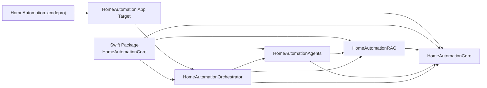
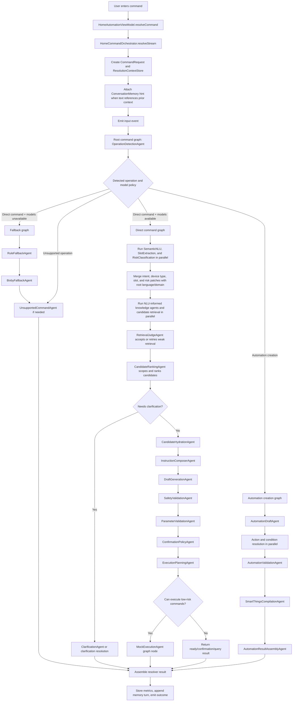
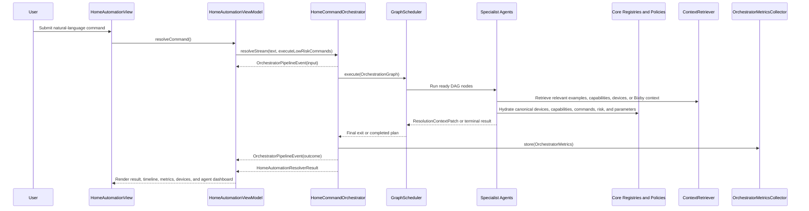
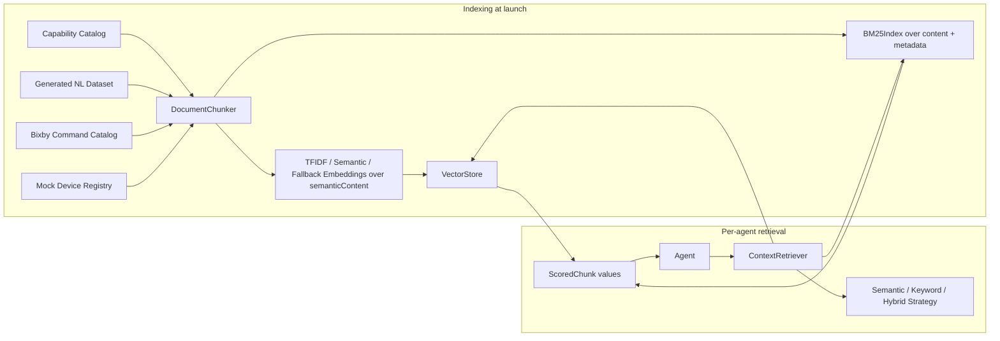
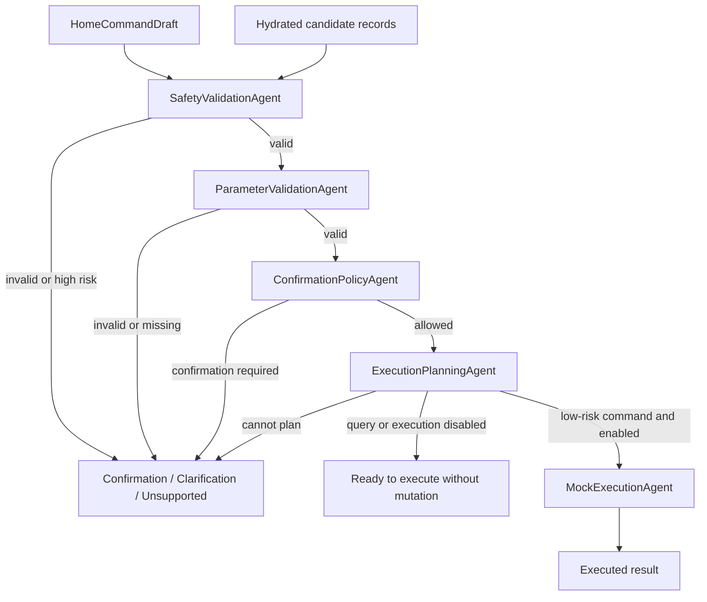

# Unified HomeAutomation Architecture

This document is the canonical architecture reference for `HomeAutomation`. It describes the current SwiftUI app, four-target Swift package, multi-agent orchestrator, hybrid RAG layer, deterministic fallback path, and low-level component responsibilities.

## 1. Executive Summary

`HomeAutomation` is a SwiftUI demo app that resolves natural-language smart-home commands into structured home-automation actions. The app is now orchestrator-first:

1. The SwiftUI app collects a command and streams orchestrator updates.
2. `HomeCommandOrchestrator` creates a `ResolutionContext`, plans work, schedules agents, records metrics, and returns a `HomeAutomationResolverResult`.
3. `HomeAutomationAgents` contains specialized agents for NLU, knowledge lookup, candidate selection, draft generation, safety validation, execution planning, fallback, and response formatting.
4. `HomeAutomationRAG` retrieves compact, relevant context from canonical catalogs, examples, Bixby commands, and device records using semantic, BM25, and hybrid retrieval.
5. `HomeAutomationCore` remains the source of truth for models, registries, catalogs, policies, generated resources, intent-capability mapping, and Foundation Models support.

The central safety rule is that model output and memory hints are advisory. Deterministic validation, parameter checks, confirmation policy, and execution planning must pass before a command can mutate the mock device registry.

## 2. Design Principles

1. Models suggest; agents specialize; orchestrator policy and deterministic safety agents decide.
2. Canonical catalogs stay authoritative for capabilities, supported commands, enum values, numeric ranges, Bixby mappings, and risk.
3. RAG selects relevant context; it does not replace source-of-truth registries.
4. Each agent is independently testable and observable.
5. Context flows through typed patches instead of shared mutable state.
6. Mandatory safety gates fail closed to confirmation, clarification, ready-without-mutation, or unsupported outcomes.
7. Conversation memory provides low-priority hints only and never grants execution authority.
8. Fallback behavior lives inside agent and core abstractions; there is no separate resolver package target in the current Swift package.

## 3. High-Level Architecture

Current architecture source of truth: orchestration is graph-only. `HomeCommandOrchestrator` runs `root-command-graph` first, then `GraphPlanner`, `OperationGraphCatalog`, and `GraphScheduler` own operation-specific execution.

```mermaid
flowchart TB
    User["User"]
    App["SwiftUI App Target<br/>HomeAutomation"]
    View["HomeAutomationView"]
    VM["HomeAutomationViewModel"]
    Orchestrator["HomeCommandOrchestrator"]

    subgraph OrchestratorLayer["HomeAutomationOrchestrator"]
        Planner["GraphPlanner"]
        Catalog["OperationGraphCatalog"]
        Scheduler["GraphScheduler"]
        Registry["AgentRegistry"]
        ContextStore["ResolutionContextStore"]
        EventBus["AgentEventBus"]
        Metrics["OrchestratorMetricsCollector"]
        Policy["OrchestratorPolicyEngine"]
        Breakers["CircuitBreakerRegistry"]
        Memory["ConversationMemory"]
    end

    subgraph AgentLayer["HomeAutomationAgents - Specialist Agents"]
        subgraph NLU["NLU Agents"]
            OperationDetectionAgent["OperationDetectionAgent: operation + language + domain"]
            SemanticNLUAgent["SemanticNLUAgent: intent + device type"]
            SlotExtractionAgent["SlotExtractionAgent"]
            RiskClassificationAgent["RiskClassificationAgent"]
        end
        subgraph Knowledge["Knowledge Agents"]
            CapabilityKnowledgeAgent["CapabilityKnowledgeAgent"]
            BixbyKnowledgeAgent["BixbyKnowledgeAgent"]
            CommandExampleAgent["CommandExampleAgent"]
            RetrievalJudgeAgent["RetrievalJudgeAgent"]
        end
        subgraph Candidates["Candidate Agents"]
            CandidateRetrievalAgent["CandidateRetrievalAgent"]
            CandidateRankingAgent["CandidateRankingAgent"]
            CandidateShardAgent["CandidateShardAgent"]
            CandidateHydrationAgent["CandidateHydrationAgent"]
        end
        subgraph Draft["Draft Agents"]
            InstructionComposerAgent["InstructionComposerAgent"]
            DraftGenerationAgent["DraftGenerationAgent"]
            DraftRepairAgent["DraftRepairAgent"]
        end
        subgraph Safety["Safety Agents"]
            SafetyValidationAgent["SafetyValidationAgent"]
            ParameterValidationAgent["ParameterValidationAgent"]
            ConfirmationPolicyAgent["ConfirmationPolicyAgent"]
        end
        subgraph Execution["Execution Agents"]
            ExecutionPlanningAgent["ExecutionPlanningAgent"]
            MockExecutionAgent["MockExecutionAgent"]
        end
        subgraph Fallback["Fallback Agents"]
            RuleFallbackAgent["RuleFallbackAgent"]
            BixbyFallbackAgent["BixbyFallbackAgent"]
            UnsupportedCommandAgent["UnsupportedCommandAgent"]
        end
        subgraph Response["Response Agents"]
            ClarificationAgent["ClarificationAgent"]
            ResultSummaryAgent["ResultSummaryAgent"]
        end
    end

    subgraph RAGLayer["HomeAutomationRAG"]
        Indexer["KnowledgeIndexer"]
        Retriever["ContextRetriever"]
        Store["VectorStore"]
        BM25["BM25Index"]
        Hybrid["HybridRetrievalStrategy"]
        Query["StructuredRetrievalQuery"]
        Embedder["EmbeddingProvider"]
        Chunker["DocumentChunker"]
    end

    subgraph CoreLayer["HomeAutomationCore"]
        Models["Domain Models"]
        DeviceRegistry["MockHomeDeviceRegistry"]
        CapabilityRegistry["HomeCapabilityRegistry"]
        KnowledgeBase["HomeAutomationKnowledgeBase"]
        BixbyCatalog["HomeBixbyCommandCatalog"]
        SafetyPolicy["HomeRiskPolicy + HomeParameterValidator"]
        FoundationModels["Foundation Models Session Support"]
    end

    User --> App --> View --> VM --> Orchestrator
    Orchestrator --> Planner
    Planner --> Catalog
    Orchestrator --> Scheduler
    Orchestrator --> ContextStore
    Orchestrator --> EventBus
    Orchestrator --> Metrics
    Orchestrator --> Policy
    Orchestrator --> Breakers
    Orchestrator --> Memory
    Scheduler --> Registry
    Registry --> AgentLayer
    CapabilityKnowledgeAgent --> RAGLayer
    BixbyKnowledgeAgent --> RAGLayer
    CommandExampleAgent --> RAGLayer
    RetrievalJudgeAgent --> RAGLayer
    CandidateRetrievalAgent --> RAGLayer
    NLU --> RAGLayer
    AgentLayer --> CoreLayer
    Indexer --> Chunker --> Embedder --> Store
    Indexer --> BM25
    Retriever --> Query
    Retriever --> Hybrid
    Hybrid --> Store
    Hybrid --> BM25
    Retriever --> Store
    CoreLayer --> Indexer
    SafetyValidationAgent --> SafetyPolicy
    ParameterValidationAgent --> SafetyPolicy
    ConfirmationPolicyAgent --> SafetyPolicy
    ExecutionPlanningAgent --> DeviceRegistry
    MockExecutionAgent --> DeviceRegistry
```



## 4. Package and Dependency Architecture



Dependency direction:

```text
HomeAutomationRAG -> HomeAutomationCore
HomeAutomationAgents -> HomeAutomationCore + HomeAutomationRAG
HomeAutomationOrchestrator -> HomeAutomationCore + HomeAutomationRAG + HomeAutomationAgents
HomeAutomation app target -> HomeAutomationCore + HomeAutomationOrchestrator
```

The current Swift package has four products: `HomeAutomationCore`, `HomeAutomationRAG`, `HomeAutomationAgents`, and `HomeAutomationOrchestrator`. Deterministic fallback and shared resolver result contracts remain, but they are implemented inside those targets.

## 5. Detailed Command Flow



## 6. Runtime Data Flow



## 7. Context Model

`ResolutionContext` is the central mutable-by-patch state object. Agents do not mutate it directly; they return `ResolutionContextPatch` values and `GraphScheduler` applies those patches through `ResolutionContextStore`.

New scoped exchanges should use `ContextArtifactKey<Value>` and typed artifact helpers instead of raw scoped string keys. The internal store remains type-erased for compatibility, but typed reads and manifest artifact contracts now expose wrong-type wiring before runtime where possible. Input builders should also prefer read-only context facets such as `NLUContextFacet`, `CandidateContextFacet`, `CapabilityContextFacet`, `AutomationContextFacet`, and `ExecutionContextFacet` so agents depend on only the state they need.

| Field | Purpose |
| --- | --- |
| `request` | Original command text and execution toggle. |
| `language`, `domain`, `intent`, `deviceType`, `slots`, `risk` | NLU outputs. Root routing produces language/domain; the direct graph produces intent/device type through `SemanticNLUAgent` plus slots and risk in parallel. |
| `resolutionState` | Bundled worker state for compatibility with existing resolver contracts. |
| `retrievedCandidates` | Device/routine candidates from registry and semantic retrieval. |
| `selectedCandidateIDs`, `aggregation` | Ranked candidate IDs and clarification metadata. |
| `hydratedCandidates` | Full candidate records used by draft, safety, and execution stages. |
| `knowledgeSnippets` | Canonical and RAG-selected context for prompts and fallback. |
| `retrievalReports` | Per-agent retrieval quality reports, including strategy, score stats, filters, retry count, and reformulated query. |
| `instructionPackage` | Foundation Models prompt, raw instruction text, instructions, tools, generation mode, and context-budget report. |
| `draft` | Model or fallback-produced command draft. |
| `executionPlan` | Deterministic execution plan. |
| `resolution` | Final or intermediate command resolution. |
| `errors` | Agent failures captured for observability. |
| `trace` | Per-agent timing and result trace. |
| `memoryHints` | Low-priority hints from previous turns. |

## 8. Agent Inventory

The implemented system has a consolidated active NLU stack.

| # | Agent | Group | Role |
| --- | --- | --- | --- |
| 1 | `OperationDetectionAgent` | OperationDetection | Root-routing model call that produces operation, language, and domain, using the semantic analyzer as advisory fallback. |
| 2 | `SemanticNLUAgent` | NLU | Active direct-command model call that fuses intent-family and device-type extraction. |
| 3 | `SlotExtractionAgent` | NLU | Extracts rooms, nicknames, values, units, modes, and durations. |
| 4 | `RiskClassificationAgent` | NLU | Produces an initial risk estimate and reason. |
| 5 | `CapabilityKnowledgeAgent` | Knowledge | Retrieves relevant capability facts, then hydrates source-of-truth definitions from `HomeCapabilityRegistry`. |
| 6 | `BixbyKnowledgeAgent` | Knowledge | Retrieves and hydrates relevant Bixby voice-command snippets. |
| 7 | `CommandExampleAgent` | Knowledge | Retrieves similar generated command examples for few-shot context. |
| 8 | `RetrievalJudgeAgent` | Knowledge | Reviews retrieval reports, fast-path accepts good retrieval, or performs one bounded reformulated retry for weak sources. |
| 9 | `CandidateRetrievalAgent` | Candidates | Retrieves device/routine candidates from `MockHomeDeviceRegistry`, enhanced with semantic device hints. |
| 10 | `CandidateRankingAgent` | Candidates | Scopes by strong room/device-type hints, ranks retrieved candidates, and decides whether clarification is needed. |
| 12 | `CandidateShardAgent` | Candidates | Supports shard-level candidate selection for large candidate sets. |
| 13 | `CandidateHydrationAgent` | Candidates | Hydrates selected candidate IDs into full `HomeCandidateRecord` values. |
| 14 | `InstructionComposerAgent` | Draft | Builds `HomeModelInstructionPackage` using canonical data plus selected RAG slices. |
| 15 | `DraftGenerationAgent` | Draft | Produces a `HomeCommandDraft` through the draft resolver. |
| 16 | `DraftRepairAgent` | Draft | Attempts draft repair or lower-confidence fallback draft selection. |
| 17 | `SafetyValidationAgent` | Safety | Validates target, capability, command, risk, and plan eligibility. Mandatory fail-closed gate. |
| 18 | `ParameterValidationAgent` | Safety | Checks enum values, ranges, and required parameters. Mandatory fail-closed gate. |
| 19 | `ConfirmationPolicyAgent` | Safety | Enforces high-risk and memory-derived-target confirmation. Mandatory fail-closed gate. |
| 20 | `ExecutionPlanningAgent` | Execution | Converts valid drafts into deterministic execution plans. Mandatory fail-closed gate. |
| 21 | `MockExecutionAgent` | Execution | Mutates `MockHomeDeviceRegistry` for allowed low-risk command steps only. Mandatory fail-closed gate. |
| 22 | `RuleFallbackAgent` | Fallback | Runs deterministic rule-based resolution when models are unavailable or fallback is selected. |
| 23 | `BixbyFallbackAgent` | Fallback | Maps Bixby-style voice intents or catalog utterances to drafts. |
| 24 | `UnsupportedCommandAgent` | Fallback | Produces a clear unsupported result when no route can resolve safely. |
| 25 | `ClarificationAgent` | Response | Converts ambiguity into a user-facing clarification result. |
| 26 | `ResultSummaryAgent` | Response | Formats final result summaries from `HomeCommandResolution`. |

## 9. Graph Execution Plan

`GraphPlanner` builds operation-specific DAGs. `HomeCommandOrchestrator` first executes the root routing graph, then executes the graph selected for the detected operation:

```text
Root routing:
OperationDetectionAgent

Fallback graph:
RuleFallbackAgent -> BixbyFallbackAgent -> UnsupportedCommandAgent

Direct command graph:
Parallel NLU group
-> Parallel knowledge/candidate retrieval group
-> RetrievalJudgeAgent
-> CandidateRankingAgent
-> CandidateHydrationAgent
-> InstructionComposerAgent
-> DraftGenerationAgent
-> SafetyValidationAgent
-> ParameterValidationAgent
-> ConfirmationPolicyAgent
-> ExecutionPlanningAgent
-> MockExecutionAgent when policy permits execution

Automation creation graph:
AutomationDraftAgent
-> AutomationConditionOperandResolutionAgent + AutomationActionResolutionAgent
-> AutomationValidationAgent
-> SmartThingsCompilationAgent
-> SmartThingsRuleCreationAgent
-> AutomationResultAssemblyAgent
```

Every command path is graph-owned. The direct command graph still reaches fallback or terminal results through graph nodes, agent outputs, policy checks, and deterministic safety behavior.

## 10. RAG Architecture



| Component | Role |
| --- | --- |
| `DocumentChunk` | Identifiable knowledge unit with full display `content`, clean embeddable `semanticContent`, source, and metadata. |
| `KnowledgeSource` | Source enum: capability, generated command dataset, Bixby command, or device. |
| `MetadataFilter` | Restricts retrieval by source, exact metadata tags, and multi-value metadata matches such as comma-separated `relatedDeviceTypes`. |
| `ScoredChunk` | Retrieval result with chunk plus similarity score. |
| `DocumentChunker` | Converts canonical catalogs, generated examples, Bixby commands, and device records into chunks. |
| `EmbeddingProviding` | Protocol for text embedding providers. |
| `CorpusAwareEmbeddingProviding` | Embedding protocol that can prepare itself from a known corpus. |
| `TFIDFEmbeddingProvider` | Deterministic local embedding implementation. |
| `SemanticEmbeddingProvider` | Production-grade semantic embedding wrapper that can drive retrieval ranking when configured. |
| `FallbackEmbeddingProvider` | Uses semantic embeddings when available and falls back to TF-IDF when semantic vectors are empty. |
| `VectorStore` | Actor-backed in-memory vector index with cosine similarity search, metadata filtering, and `minScore` gating. |
| `BM25Index` | Actor-backed sparse keyword index over full chunk content, semantic content, and metadata values. |
| `StructuredRetrievalQuery` | Query object carrying raw text, semantic text, keyword terms, filters, NLU hints, strategy, score floor, and top-K. |
| `NLURetrievalHints` | Device type, intent family, room, and capability hints passed from NLU into retrieval. |
| `RetrievalStrategy` | Strategy selector for semantic-only, keyword-only, hybrid, and agentic retrieval. |
| `HybridRetrievalStrategy` | Runs semantic and BM25 searches and fuses evidence with reciprocal-rank fusion. |
| `QueryReformulator` | Expands weak retrieval queries with deterministic NLU hints for the retrieval judge retry path. |
| `KnowledgeIndexer` | Builds the vector and BM25 indexes from canonical knowledge at app launch, and restores both when vector cache hits. |
| `ContextRetriever` | Public retrieval API used by agents for string and structured queries. |

## 11. Safety Architecture



Mandatory fail-closed agents:

| Agent | Fail-closed behavior |
| --- | --- |
| `SafetyValidationAgent` | Requires confirmation when a draft exists; otherwise unsupported. |
| `ParameterValidationAgent` | Returns clarification for invalid or missing values. |
| `ConfirmationPolicyAgent` | Requires confirmation when draft exists; otherwise asks for confirmation. |
| `ExecutionPlanningAgent` | Blocks execution and returns unsupported. |
| `MockExecutionAgent` | Returns `.readyToExecute` with the validated plan instead of mutating state. |

## 12. Conversation Memory

`ConversationMemory` stores recent turns as `ConversationTurn` values. `ConversationMemoryReferenceDetector` checks whether a new command likely refers to prior context, such as "make it warmer" or "turn it off".

Memory rules:

- Memory hints are written to `ResolutionContext.memoryHints`.
- Candidate retrieval and ranking may use them as low-priority hints.
- Candidate hydration, safety validation, parameter validation, confirmation policy, and execution planning always rerun.
- Security-sensitive and high-risk operations must not execute from pronouns or prior context without explicit target confirmation.

## 13. Circuit Breakers and Resilience

`CircuitBreakerRegistry` creates an `AgentCircuitBreaker` per agent. Each breaker moves through `closed`, `open`, and `halfOpen` states.

| Case | Behavior |
| --- | --- |
| Non-mandatory agent unavailable or open | Scheduler skips the agent and lets fallback or later stages continue. |
| Mandatory safety gate unavailable or open | Scheduler calls `OrchestratorPolicyEngine.failClosedResult`. |
| Agent success | Breaker records success. |
| Agent retryable or terminal failure | Breaker records failure. |

`AgentTraceEntry` records timing and result state for every attempted agent, and `OrchestratorMetrics` captures circuit states, evaluation fields, fallback usage, and final outcome.

## 14. Folder Structure

```text
HomeAutomation/
|-- README.md
|-- Architecture.md
|-- HomeAutomation.xcodeproj/
|-- HomeAutomationApp/
|   |-- HomeAutomationApp.swift
|   |-- HomeAutomationView.swift
|   `-- HomeAutomationViewModel.swift
|-- HomeAutomationCore/
|   |-- Package.swift
|   |-- Sources/
|   |   |-- HomeAutomationCore/
|   |   |   |-- Errors/
|   |   |   |-- HomeAutomation/
|   |   |   `-- Resources/
|   |   |-- HomeAutomationRAG/
|   |   |-- HomeAutomationAgents/
|   |   |   |-- Protocols/
|   |   |   |   |-- AgentCapability.swift
|   |   |   |   |-- AgentError.swift
|   |   |   |   |-- AgentOutput.swift
|   |   |   |   |-- HomeAgent.swift
|   |   |   |   `-- ResolutionContext.swift
|   |   |   |-- NLU/
|   |   |   |   |-- Semantic/
|   |   |   |   |   |-- SemanticNLUAgent.swift
|   |   |   |   |   `-- SemanticNLUWorkerSession.swift
|   |   |   |   |-- Language/
|   |   |   |   |-- Domain/
|   |   |   |   |-- IntentFamily/
|   |   |   |   |-- DeviceType/
|   |   |   |   |-- SlotExtraction/
|   |   |   |   `-- RiskClassification/
|   |   |   |-- Knowledge/
|   |   |   |   |-- KnowledgeInputs.swift
|   |   |   |   |-- CapabilityKnowledgeAgent.swift
|   |   |   |   |-- BixbyKnowledgeAgent.swift
|   |   |   |   |-- CommandExampleAgent.swift
|   |   |   |   `-- RetrievalJudgeAgent.swift
|   |   |   |-- Candidates/
|   |   |   |   |-- CandidateInputs.swift
|   |   |   |   |-- CandidateResolverSupport.swift
|   |   |   |   |-- CandidateRetrievalAgent.swift
|   |   |   |   |-- CandidateRankingAgent.swift
|   |   |   |   |-- CandidateShardAgent.swift
|   |   |   |   `-- CandidateHydrationAgent.swift
|   |   |   |-- Draft/
|   |   |   |   |-- AgentTools.swift
|   |   |   |   |-- DraftTypes.swift
|   |   |   |   |-- AgentInstructionSetFactory.swift
|   |   |   |   |-- AgentDraftResolver.swift
|   |   |   |   |-- InstructionComposerAgent.swift
|   |   |   |   |-- DraftGenerationAgent.swift
|   |   |   |   `-- DraftRepairAgent.swift
|   |   |   |-- Safety/
|   |   |   |   |-- SafetyInputs.swift
|   |   |   |   |-- AgentCommandValidator.swift
|   |   |   |   |-- SafetyValidationAgent.swift
|   |   |   |   |-- ParameterValidationAgent.swift
|   |   |   |   `-- ConfirmationPolicyAgent.swift
|   |   |   |-- Execution/
|   |   |   |   |-- ExecutionSupport.swift
|   |   |   |   |-- ExecutionPlanningAgent.swift
|   |   |   |   `-- MockExecutionAgent.swift
|   |   |   |-- Fallback/
|   |   |   |   |-- AgentTextParser.swift
|   |   |   |   |-- BixbyFallbackAgent.swift
|   |   |   |   |-- FallbackInputs.swift
|   |   |   |   |-- FallbackRuleTypes.swift
|   |   |   |   |-- AgentRuleBasedResolver.swift
|   |   |   |   |-- RuleFallbackAgent.swift
|   |   |   |   `-- UnsupportedCommandAgent.swift
|   |   |   |-- Response/
|   |   |   |   |-- ClarificationAgent.swift
|   |   |   |   `-- ResultSummaryAgent.swift
|   |   |   `-- RAG/
|   |   |       `-- AgentRAGSupport.swift
|   |   |-- HomeAutomationOrchestrator/
|   `-- Tests/
|       |-- HomeAutomationRAGTests/
|       |-- HomeAutomationAgentTests/
|       `-- HomeAutomationOrchestratorTests/
```

## 15. Low-Level Component Description: App Layer

| Component | File | Role |
| --- | --- | --- |
| `HomeAutomationApp` | `HomeAutomationApp.swift` | SwiftUI `App` entry point that presents `HomeAutomationView`. |
| `HomeAutomationView` | `HomeAutomationView.swift` | Main UI composition for input, samples, execution toggle, result output, pipeline timeline, metrics, agent dashboard, device cards, registry preview, and command history. |
| `DeviceTile` | `HomeAutomationView.swift` | Private device dashboard card. |
| `OutputPanel` | `HomeAutomationView.swift` | Private reusable monospaced output container. |
| `HomeAutomationViewModel` | `HomeAutomationViewModel.swift` | `@MainActor @Observable` coordinator. Owns UI state, initializes RAG-enabled orchestrator, streams updates, formats results, refreshes metrics, and tracks command history. |
| `HomePipelineEventStatus` | `HomeAutomationViewModel.swift` | UI status enum for timeline rows. |
| `HomePipelineEventItem` | `HomeAutomationViewModel.swift` | UI projection of an `OrchestratorPipelineEvent`. |
| `HomeDeviceDashboardItem` | `HomeAutomationViewModel.swift` | UI projection of a device record. |
| `HomeCommandHistoryItem` | `HomeAutomationViewModel.swift` | UI history entry for previous commands. |
| `AgentDashboardItem` | `HomeAutomationViewModel.swift` | UI projection of agent status, duration, and circuit state. |

## 16. Low-Level Component Description: Core Domain

| Component | Role |
| --- | --- |
| `FoundationLabCoreError` | Shared typed errors for invalid requests, provider failures, unavailable functionality, and unsupported cases. |
| `HomeCommandResolving` | Main resolver abstraction implemented by orchestrator-compatible and deterministic fallback paths. |
| `HomeCommandDraftResolving` | Draft-generation abstraction for Foundation Models and test doubles. |
| `HomeCandidateResolving` | Candidate selection abstraction. |
| `HomeWorkerSessionAnalyzing` | Worker-analysis abstraction for language/domain/intent/device/slot/risk extraction. |
| `HomeAutomationCommandDomain` | Domain classification output. |
| `HomeAutomationIntentFamily` | Broad intent family used for routing, prompts, candidates, and safety. |
| `HomeAutomationRiskLevel` | Shared low/medium/high/critical risk scale. |
| `HomeAutomationIntent` | Final normalized user intent. |
| `HomeLanguageDetectionResult` | Language worker output. |
| `HomeDomainClassificationResult` | Domain worker output. |
| `HomeIntentFamilyResult` | Intent-family worker output. |
| `HomeDeviceTypeResult` | Device-type worker output. |
| `HomeExtractedSlot` | Single extracted slot. |
| `HomeSlotExtractionResult` | Aggregated slot output. |
| `HomeRiskClassificationResult` | Risk worker output. |
| `HomeResolutionState` | Bundled worker state shared by candidates, draft, validation, and UI. |
| `HomeCandidateType` | Device, group, or routine candidate kind. |
| `HomeCandidateRecord` | Full device/routine record. |
| `HomeCompactCandidateView` | Compact projection for ranking. |
| `HomeCandidateShardSelection` | Candidate shard result. |
| `HomeCandidateAggregationResult` | Final candidate selection result and clarification metadata. |
| `HomeResolvedParameter` | Normalized command parameter. |
| `HomeCommandDraft` | Pre-validation command draft. |
| `HomeAutomationExecutionStep` | One read/query/command step. |
| `HomeAutomationExecutionPlan` | Ordered execution steps and confirmation flag. |
| `HomeCommandResolution` | Final result: ready, executed, confirmation, clarification, or unsupported. |
| `HomeFinalResolutionInput` | Compound input for draft resolution and validation. |
| `HomeAutomationResolverResult` | Top-level command-resolution output returned by the orchestrator and fallback agents. |
| `HomeGenerationMode` | Foundation Models generation mode. |
| `HomeModelInstructionPackage` | Prompt, raw instruction text, tools, adapter flag, generation mode, and optional context-budget report. |
| `HomeModelContextBudgetReport` | Token-budget estimate for instructions, prompt, tools, candidates, RAG sections, and selected compaction level. |
| `FoundationModelContextBudgeter` | Estimates Foundation Models input size and selects compact prompt variants before draft generation. |
| `FoundationModelFailureKind` | Structured Foundation Models failure category for context-window, guardrail, adapter, tool, and generation errors. |
| `IntentCapabilityMap` | Maps NLU intent families to likely capability IDs for retrieval hints and query expansion. |

## 17. Low-Level Component Description: Core Catalogs, Policies, Registry

| Component | Role |
| --- | --- |
| `HomeCapabilityDefinition` | In-memory capability definition with commands, attributes, ranges, enum values, and risk. |
| `HomeCapabilityRegistry` | Canonical capability lookup and command/mode/risk helper namespace. |
| `HomeAutomationKnowledgeBase` | Loads generated capability catalog and command dataset through `Bundle.module`. |
| `HomeGeneratedCommandDataset` | Decodes generated natural-language command examples. |
| `HomeGeneratedCommandExample` | One generated command example with expected output data. |
| `HomeGeneratedCommandParameter` | Generated parameter shape. |
| `HomeGeneratedCommandExpectation` | Expected domain/device/capability/command/confirmation metadata. |
| `HomeCatalogSourceNote` | Catalog source metadata. |
| `HomeCatalogCapability` | JSON capability record. |
| `HomeCatalogCapabilityPlatformMappings` | Platform mapping metadata for capabilities. |
| `HomeCatalogDeviceType` | JSON device type record. |
| `HomeCatalogDevicePlatformMappings` | Platform mapping metadata for device types. |
| `HomeRiskPolicy` | Deterministic confirmation and risk policy. |
| `HomeParameterValidator` | Deterministic parameter range and enum validator. |
| `MockHomeDeviceRegistry` | Actor-backed mock registry for device listing, candidate retrieval, and low-risk plan execution. |
| `HomeCandidateContextStore` | Thread-safe candidate cache and hydration support. |
| `shardHomeCandidates` | Utility for splitting large candidate sets into shards. |
| `HomeBixbyVoiceCommand` | Embedded Bixby voice command record. |
| `HomeBixbyCommandCatalog` | Bixby command catalog, lookup, metadata, and summaries. |
| `HomeBixbyLinkedVoiceIntentPair` | Link between local capability and Bixby source intent. |
| `HomeBixbyCommandMapper` | Converts Bixby voice intents into `HomeCommandDraft` values. |
| `FoundationHomeCommandDraftResolver` | Concrete Foundation Models draft resolver. |
| `HomeAdapterModelDiagnostic` | Adapter load diagnostic record with source, identifier, compatibility version, outcome, and failure kind. |
| `HomeAdapterModelDiagnosticsStore` | Thread-safe last-diagnostic store. |
| `HomeAdapterModelProvider` | Creates Foundation Models sessions with optional adapter configuration. |
| `HomeAdapterTrainingExample`, `HomeAdapterEvaluationCase`, `HomeAdapterEvaluationResult`, `HomeAdapterCompatibilityManifest` | Adapter dataset, holdout evaluation, and compatibility metadata. |
| `HomeAdapterTrainingExporter` | Deterministic JSONL/export and holdout validation support for future adapter training. |

## 18. Low-Level Component Description: Agent Protocols

| Component | Role |
| --- | --- |
| `AgentID` | Stable identity for each specialist agent. |
| `AgentCapability` | Capability enum used by registry and planner. |
| `HomeAgent` | Strongly typed agent protocol with associated input/output. |
| `AnyHomeAgent` | Type-erased agent protocol used by scheduler. |
| `AgentFailure` | Structured failure with agent ID, reason, and retryability. |
| `AgentTraceEntry` | Timing and result trace for one agent call. |
| `ResolutionContextPatch` | Patch returned by an agent. |
| `AnySendableValue` | Sendable value box used in context patches. |
| `ContextArtifactKey` | Typed scoped context key used for new artifact exchange between graph agents. |
| `AgentRunResult` | Agent result: success, clarification, unsupported, retryable failure, or terminal failure. |
| `ResolutionContext` | Shared orchestration context with read-only facet protocols for lower-coupling input construction. |
| `CommandRequest` | User text plus execution toggle. |
| `KnowledgeSnippet` | Agent-level knowledge snippet. |
| `MemoryHint` | Low-priority candidate hint from conversation memory. |

## 19. Low-Level Component Description: Agent Implementations

| Component | Role |
| --- | --- |
| `OperationDetectionWorkerSession` | Root-routing Foundation Models worker that emits operation, language, and domain together, with semantic analyzer fallback and automation-creation safety preference. |
| `SemanticNLUWorkerSession`, `SlotExtractionAgentWorkerSession`, `RiskClassificationAgentWorkerSession` | Active direct-command NLU worker sessions with deterministic fallback and model-call policy. |
| `NLUModelCallPolicy` | Model-call policy for model-first, deterministic hinting, and legacy threshold-gated NLU behavior. |
| `AgentRAGSupport` | Internal helper for retrieving RAG context for agents. |
| `KnowledgeRetrievalAgentOutput` | Knowledge snippets plus retrieval reports emitted by knowledge agents. |
| `CapabilityKnowledgeAgent` | Retrieves and hydrates capability knowledge using NLU hints, hybrid retrieval, and canonical registry hydration. |
| `BixbyKnowledgeAgent` | Retrieves and hydrates Bixby command knowledge using device names plus NLU hints. |
| `CommandExampleAgent` | Retrieves generated command examples with semantic-only retrieval and device-type filters. |
| `RetrievalJudgeAgent` | Reviews retrieval quality, accepts high-quality fast paths, and performs one reformulated retry for weak sources. |
| `QueryReformulator` | Builds deterministic reformulated queries from raw text plus NLU hints. |
| `CandidateRetrievalInput` | Input for candidate retrieval. |
| `CandidateRankingInput` | Input for candidate ranking. |
| `CandidateShardInput` | Input for shard-level candidate ranking. |
| `CandidateHydrationInput` | Input for candidate hydration. |
| `HomeCandidateResolverMetrics` | Stores candidate resolver metrics for tests and diagnostics. |
| `HomeCandidateResolverSupport` | Candidate ranking, strong room/device-type scoping, shard support, and aggregation. |
| `CandidateRetrievalAgent` | Retrieves candidates from registry and RAG hints. |
| `CandidateRankingAgent` | Selects final candidates or clarification. |
| `CandidateShardAgent` | Selects candidates from one shard. |
| `CandidateHydrationAgent` | Hydrates final candidate IDs. |
| `AgentToolProvider` | Builds the compact default Foundation Models tool set for draft generation. |
| `AgentFindDevicesTool` | Tool for device search. |
| `AgentInspectCandidateCommandTool` | Consolidated tool for capability lookup, supported commands, modes, numeric ranges, validation, and risk. |
| `AgentGetCapabilitiesTool` | Tool for capability lookup. |
| `AgentGetDeviceStateTool` | Tool for reading device state. |
| `AgentGetSupportedModesTool` | Tool for enum/mode lookup. |
| `AgentValidateCommandTool` | Tool for command support and risk validation. |
| `AgentHydrateCandidatesTool` | Tool for full candidate hydration. |
| `AgentInstructionSetFactory` | Builds prompt/instruction packages with canonical data, RAG-selected context, context-budgeting, and prompt compaction. |
| `AgentDraftAttemptReport` | One draft attempt report with structured Foundation Models error kind. |
| `AgentDraftResolutionReport` | Aggregated draft attempt report. |
| `AgentDraftResolutionOutput` | Draft plus report output. |
| `AgentDraftResolverMetrics` | Stores latest draft report. |
| `AgentDraftResolver` | Retry wrapper around draft generation. |
| `InstructionComposerAgent` | Produces `HomeModelInstructionPackage`. |
| `DraftGenerationAgent` | Produces initial `HomeCommandDraft`. |
| `DraftRepairAgent` | Produces repaired draft output. |
| `SafetyValidationInput` | Input for safety validation. |
| `ParameterValidationInput` | Input for parameter validation. |
| `ConfirmationPolicyInput` | Input for confirmation policy. |
| `AgentCommandValidator` | Deterministic draft validator. |
| `SafetyValidationAgent` | Validates draft safety and builds resolution. |
| `ParameterValidationAgent` | Validates parameters. |
| `ConfirmationPolicyAgent` | Applies confirmation policy. |
| `ExecutionPlanningInput` | Input for execution planning. |
| `AgentExecutionPlanner` | Converts drafts into execution plans. |
| `AgentPlanExecutor` | Executes low-risk plan steps against the mock registry. |
| `ExecutionPlanningAgent` | Produces execution plan. |
| `MockExecutionAgent` | Executes low-risk commands. |
| `RuleFallbackInput` | Input for deterministic fallback. |
| `AgentRuleBasedResolver` | Deterministic rule-based resolver. |
| `RuleFallbackAgent` | Wraps rule-based fallback. |
| `AgentBixbyDraftMatch` | Bixby fallback match. |
| `BixbyFallbackInput` | Input for Bixby fallback. |
| `AgentBixbyFallbackMapper` | Maps Bixby hints to drafts. |
| `BixbyFallbackAgent` | Runs Bixby fallback mapping. |
| `UnsupportedCommandAgent` | Returns unsupported resolution. |
| `AgentTextParser` | Deterministic multilingual text parser. |
| `ClarificationAgent` | Returns clarification resolution. |
| `ResultSummaryAgent` | Formats final summaries. |

## 20. Low-Level Component Description: Orchestrator

| Component | Role |
| --- | --- |
| `OrchestratorUpdate` | Stream update enum: event or final result. |
| `HomeCommandOrchestrator` | Main orchestrated resolver. |
| `GraphExecutionPlan` | Selected operation graph plus fallback metadata. |
| `OrchestrationGraph` | DAG of graph nodes, dependencies, guards, and execution policies. |
| `GraphPlanner` | Builds root routing, direct command, fallback, automation creation, and unsupported graphs. |
| `OperationGraphCatalog` | Maps operation kinds to graph providers. |
| `GraphScheduler` | Runs graph nodes as dependencies become ready, handles circuit checks, applies patches, emits events, records performance telemetry, evaluates constrained graph transitions, and fails closed. |
| `AgentRegistry` | Stores type-erased agents by identity/capability. |
| `ContextualHomeAgent` | Adapts a typed `HomeAgent` into `AnyHomeAgent` with context input and patch mapping. |
| `DefaultAgentRegistryFactory` | Wires default agent implementations and dependencies. |
| `ResolutionContextPatchKey` | String constants for patch updates. |
| `GraphTransitionPolicy` | Approves only known graph transitions such as clarification, unsupported, fallback, confirmation insertion, and bounded alternate capability retry. |
| `ResolutionContextStore` | Actor for snapshot/apply/append operations on context. |
| `OrchestratorPipelineEvent` | UI-visible pipeline event. |
| `AgentEventBus` | Async event publisher. |
| `OrchestratorPolicyEngine` | Runtime policy for models, retries, terminal exits, execution, and fail-closed safety. |
| `CircuitState` | Circuit breaker state enum. |
| `AgentCircuitBreaker` | Per-agent breaker. |
| `CircuitBreakerRegistry` | Registry of per-agent breakers. |
| `ConversationTurn` | Stored previous-turn summary. |
| `ConversationMemory` | Actor storing recent turns and last resolved device hints. |
| `ConversationMemoryReferenceDetector` | Detects commands that reference prior context. |
| `OrchestratorContextMetrics` | Metrics about context and RAG usage. |
| `OrchestratorSafetyMetrics` | Safety-specific metrics. |
| `OrchestratorCandidateMetrics` | Candidate and shard metrics. |
| `RetrievalQualityMetrics` | Retrieval strategy, score, low-source, judge, retry, and reformulated-query metrics. |
| `FoundationModelUsageMetrics` | Foundation Models availability, model-call, skipped-call, tool, budget, and failure metrics. |
| `OrchestratorMetrics` | Full metrics payload. |
| `OrchestratorMetricsCollector` | Stores and serializes latest metrics. |

## 21. Low-Level Component Description: Fallback and Compatibility Contracts

The current package does not ship a separate legacy resolver target. Compatibility is maintained through shared result contracts in `HomeAutomationCore` and model-free fallback agents in `HomeAutomationAgents`.

| Component | Role |
| --- | --- |
| `HomeAutomationResolverResult` | Stable top-level result shape consumed by the app and tests. |
| `HomeCommandResolving` | Resolver abstraction that lets orchestrated and deterministic paths expose the same call shape. |
| `AgentTextParser` | Deterministic parser used by NLU fallback, rule fallback, confidence estimation, and few-shot prompt cleanup. |
| `AgentRuleBasedResolver` | Model-free resolver used when Foundation Models are unavailable or fallback is selected. |
| `AgentBixbyFallbackMapper` | Model-free Bixby-style command mapper. |
| `RuleFallbackAgent`, `BixbyFallbackAgent`, `UnsupportedCommandAgent` | Fallback plan agents that produce safe ready, clarification, or unsupported results without model calls. |

## 22. Resource Model

| Resource | Purpose |
| --- | --- |
| `home_automation_capability_catalog.json` | Generated capability and device-type catalog loaded by `HomeAutomationKnowledgeBase`. |
| `home_automation_nl_command_dataset.json` | Generated natural-language examples used for RAG examples, adapter export, and tests. |
| Embedded Bixby catalog | Static command catalog in `HomeBixbyCommandCatalog`. |
| Mock device registry | Runtime device/routine records and current mock state. |

## 23. Observability

The runtime exposes several layers of observability:

- `OrchestratorPipelineEvent` streams live stage and agent updates to the UI.
- `AgentTraceEntry` records per-agent timing and result.
- `OrchestratorMetrics` records final outcome, fallback status, circuit states, safety fields, candidate fields, retrieval quality, Foundation Models usage, and evaluation fields.
- `HomeAutomationViewModel` renders timeline, JSON metrics, and agent dashboard data.
- Tests assert metrics and event behavior for fallback, RAG, memory, safety, and parallel shard scenarios.

## 24. Testing Architecture

| Test Target | Focus |
| --- | --- |
| `HomeAutomationRAGTests` | Semantic chunking, BM25, hybrid retrieval, vector search, metadata filtering, cache invalidation, indexer, retriever, and semantic fallback. |
| `HomeAutomationAgentTests` | Agent contracts, NLU agents, knowledge agents, retrieval judge, candidate agents, draft agents, safety agents, execution agents, fallback agents, and RAG integration. |
| `HomeAutomationOrchestratorTests` | Scheduler, registry, circuit breakers, conversation memory, orchestrator streams, metrics, retrieval quality, and fail-closed behavior. |

Useful verification commands:

```sh
cd HomeAutomationCore
swift test
cd ..
xcodebuild -scheme HomeAutomation -destination platform=macOS build
```

Current verified package state: `swift test` passes with 101 tests.

## 25. Architecture Invariants

1. Orchestrator code depends only on `HomeAutomationCore`, `HomeAutomationRAG`, and `HomeAutomationAgents`.
2. RAG may rank and retrieve, but final facts must be hydrated from canonical registries.
3. Retrieval reports should expose strategy, score, filter, retry, and reformulation information for metrics and judge decisions.
4. Safety, parameter, confirmation, execution-planning, and mock-execution gates must fail closed.
5. Memory hints must never bypass candidate hydration or safety validation.
6. High-risk and security-sensitive actions must require explicit confirmation.
7. Execution is allowed only for low-risk command steps when `executeLowRiskCommands` is true.
8. Query/read steps do not mutate registry state.
9. Every agent execution path should emit traceable events or metrics.
