# HomeAutomation — Agentic Architecture

> **Scope**: The complete agentic architecture as implemented through Phases A–G of the
> verifier-loop orchestration strategy ([task.md](task.md),
> [LoopOrchestrationImplementationPlan.md](LoopOrchestrationImplementationPlan.md)).
> **Status**: Implemented; verifier loop and Tier 1 are behind flags, default path is the legacy graph.
> **Last updated**: 2026-07-08
>
> Companion documents: [OrchestratorArchitecture.md](OrchestratorArchitecture.md) (legacy graph
> deep-dive), [LoopOrchestrationArchitecture.md](LoopOrchestrationArchitecture.md) (design
> rationale), [CoordinatorTypeInventory.md](CoordinatorTypeInventory.md) (full type index).

---

## 1. Executive Summary

The system converts natural-language home-automation requests ("turn on the kitchen lights",
"when the front door opens after 10pm, turn on the porch light") into validated, executable
device commands or SmartThings automation rules, using Apple's on-device Foundation Model (FM)
for language understanding.

The architecture evolved from a single strategy into **three co-existing execution paths**,
selected by runtime flags:

| Path | Flag | Strategy | FM calls (typical) |
|---|---|---|---|
| **Legacy graph** | default | Model-first DAG of ~18 specialized agents with deterministic fallbacks | 5–10 |
| **Graph + Automation Tier 1** | `useMiniPipeline` | Same DAG, but automation actions resolve through a deterministic-first mini-pipeline with τ-gated FM escalation | 0–1 per action |
| **Verifier loop** | `OrchestrationMode.verifierLoop` | Deterministic draft first, then a bounded FM *verify → repair* loop; escalates to the legacy graph when it cannot converge | 1–4 |

The core inversion behind the new strategy: instead of asking the FM to **generate** structure
(expensive, slow, hallucination-prone), deterministic rules generate a complete draft cheaply,
and the FM is demoted to **verifying** it — a smaller, constrained, schema-bounded task. FM
capacity becomes a *budgeted, gated resource* rather than the default tool for every step.

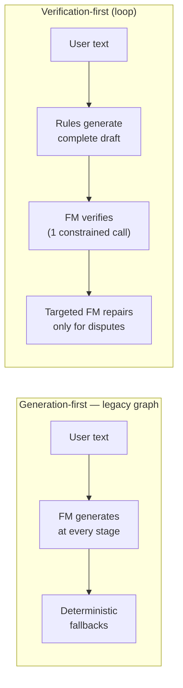

---

## 2. Module Layering

Six SwiftPM targets, layered strictly bottom-up (Swift 6.1 strict concurrency, iOS/macOS 26):

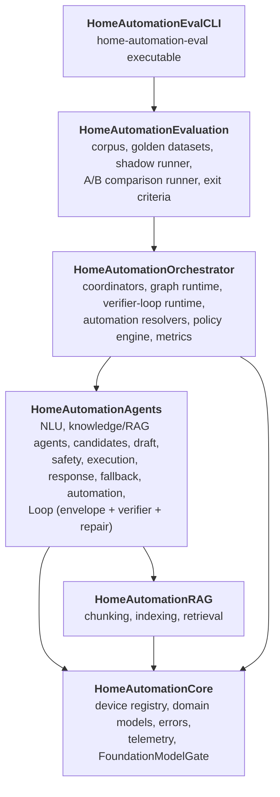

Key boundary rules (enforced by tests):

- **`CoordinatorTypeInventory.md` completeness** — a meta-test
  (`coordinatorTypeInventoryListsEverySourceDeclaration`) fails the build if any
  `class`/`struct`/`actor` in `Sources/**` is missing from the inventory.
- **Coordinator-bounded construction** — `productionDependencyConstructionIsCoordinatorBounded`
  forbids constructing guarded dependencies (e.g. `MockHomeDeviceRegistry()`) outside the
  coordinator composition root.

---

## 3. Composition Root — Coordinator Hierarchy

`HomeAutomationCoordinator` (aliased `HomeAutomationRootCoordinator`) is the single composition
root. It is instance-scoped (no singletons) and owns eight sub-coordinators, each responsible
for constructing one family of long-lived dependencies:

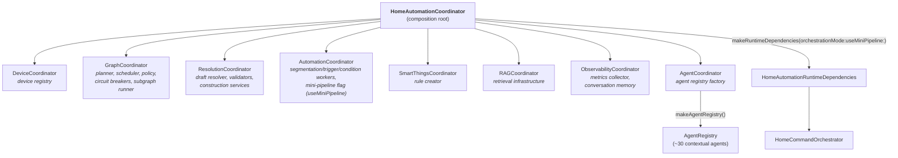

`HomeAutomationRuntimeDependencies` carries everything the orchestrator needs, including the
two rollout flags:

```swift
public struct HomeAutomationRuntimeDependencies: Sendable {
    // ... registry, planner, policy, scheduler, metrics, memory, breakers, devices ...
    public let orchestrationMode: OrchestrationMode    // .graph | .verifierLoop
    public let loopOrchestrator: VerifierLoopOrchestrator?
}
```

---

## 4. Request Lifecycle — Top-Level Dispatch

Every request enters through `HomeCommandOrchestrator.resolveStream(text:...)`, which yields an
`AsyncThrowingStream<OrchestratorUpdate, Error>` of pipeline events plus a final result. The
non-streaming `resolve(...)` wraps the same flow.

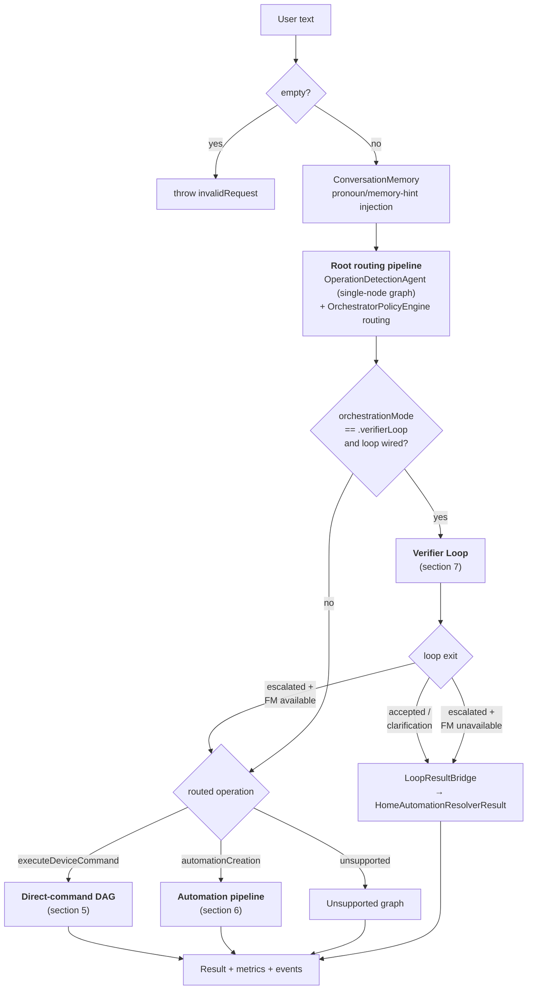

Escalation is **fail-closed**: if the loop escalates but `policy.shouldUseModels()` is false
(FM unavailable), the deterministic envelope is bridged directly instead of retrying the
FM-heavy graph path.

Possible resolutions (`HomeCommandResolution`): `.readyToExecute(plan)`,
`.requiresConfirmation(draft)`, `.needsClarification(question)`, `.unsupported(reason)`, plus
drafted/automation variants.

---

## 5. Execution Path 1 — Legacy Graph (DAG)

The production-default path. `GraphPlanner` + `OperationGraphCatalog` produce an
`OrchestrationGraph` per operation; `GraphValidator` checks cycles/reachability; `GraphScheduler`
executes nodes as their dependencies complete, with per-agent circuit breakers and typed
context patches committed to the `ResolutionContextStore` actor.

### 5.1 Direct-command DAG

Two parallel fan-out phases followed by a sequential resolution spine:

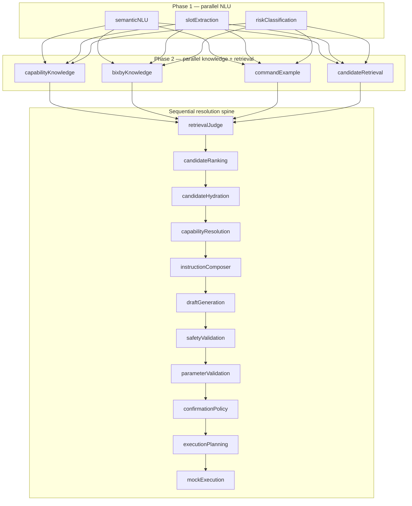

Every FM-backed node has a deterministic fallback; a separate **fallback graph**
(`ruleFallback → bixbyFallback → unsupportedCommand`) is planned when the primary graph
fails or the policy engine fails closed.

### 5.2 Graph runtime machinery

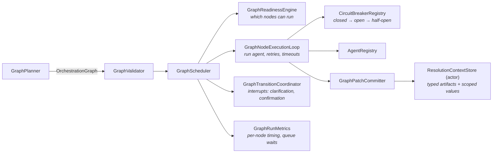

Agents communicate only through the context store (typed `ContextArtifactKeys` /
`ScopedContextKeys`), never directly — which is what makes nodes independently schedulable,
retryable, and replaceable.

---

## 6. Execution Path 2 — Automation Pipeline + Tier 1

### 6.1 Automation creation graph

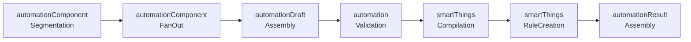

`AutomationComponentFanOutRunner` resolves the segmented components concurrently
(concurrency-capped, Phase A8):

- **trigger** → `AutomationTriggerResolutionWorkerSession`
- **conditions** → `AutomationConditionClauseResolutionWorkerSession` (per clause)
- **actions** → `AutomationActionResolver` (per action)

### 6.2 τ-gates — deterministic-accept thresholds

Each automation worker runs its deterministic parser first and only calls the FM when
confidence falls below a threshold τ:

| Worker | τ (default) | Deterministic source |
|---|---|---|
| Component segmentation | 0.88 (`AutomationRAGPolicy.deterministicConfidenceThreshold`) | `AutomationPatternParser` |
| Trigger resolution | 0.80 | pattern parser trigger extraction |
| Condition clause resolution | 0.80 | `AutomationConditionParser` |
| Action mini-pipeline | 0.78 (min over all envelope fields) | `DeterministicDraftPipeline` |

### 6.3 Tier 1 — `AutomationActionMiniPipeline`

With `useMiniPipeline` enabled on `AutomationCoordinator`, each automation *action* skips the
full direct-command subgraph (which costs 5–10 FM calls per action) and instead runs:

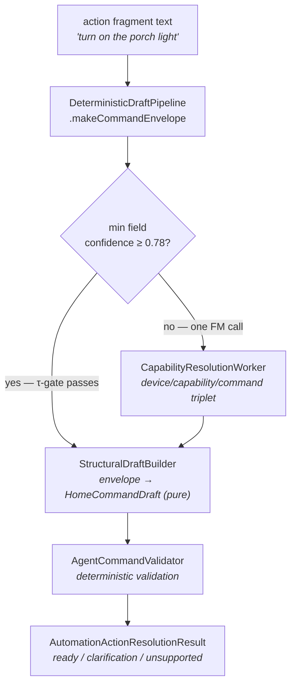

Net effect: a confident action resolves with **zero** FM calls; an uncertain one costs exactly
**one** targeted call. Rule-level risk is re-assessed deterministically across all resolved
actions via `AutomationRiskAssessor.assessFromActions` (risk can only be raised, never lowered).

---

## 7. Execution Path 3 — Verifier Loop

The centerpiece of the redesign. Instead of a DAG of generators, a bounded loop around a
deterministic draft:

### 7.1 The envelope — shared typed state

`DraftEnvelope` is the single unit of state that flows through the loop. Every field is
addressable by a `FieldID` (dotted path), carries provenance, and carries a confidence score:

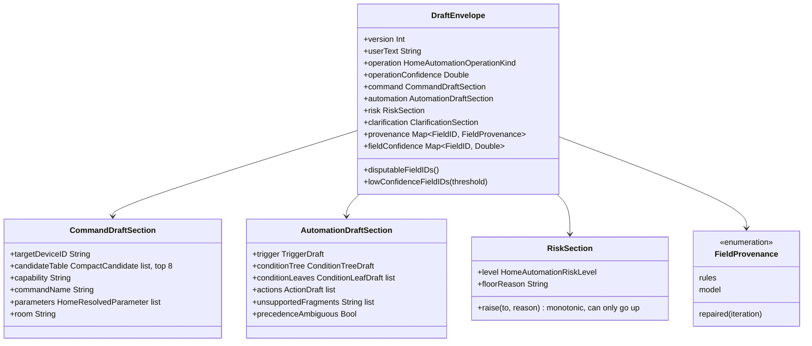

FieldID examples: `command.targetDeviceID`, `automation.actions[1].capability`,
`automation.conditionLeaves[0].operator`, `automation.trigger.time`, `risk.level`.

### 7.2 Stage 0 — `DeterministicDraftPipeline`

Builds a *complete* envelope with **zero FM calls**, reusing the battle-tested rule layer:
`HomeOperationDetectionService` (operation), `AgentRuleIntent` + `RuleCandidateScorer` (device
targeting with memory hints), `AgentTextParser` (risk/slots), `AutomationPatternParser`
(trigger/condition/action segmentation for automations). Each field gets a calibrated
confidence; ambiguous device matches pre-populate a `ClarificationSection` and depress
`targetDeviceID` confidence to 0.4.

### 7.3 The verifier — one constrained FM call

`DraftVerifierWorkerSession.verify(envelope:prompt:session:)` produces a `DraftVerdict`:

```
DraftVerdict { accepted, disputes: [≤6], needsClarification, riskUnderstated }
DraftDispute { fieldID, kind, evidence, suggestedValue? }
DisputeKind: wrongValue | missing | extraneous | wrongTarget |
             wrongOperation | valueOutOfRange | wrongGrouping
```

Hallucination containment is layered — three independent mechanisms:

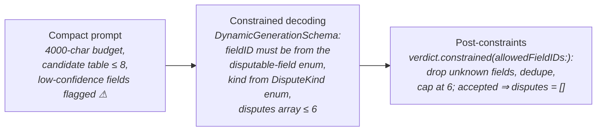

Availability handling: the FM call is wrapped in `withNLUModelSoftTimeout` (8s budget for the
verifier class) and the global `FoundationModelGate`; unavailability throws
`VerifierUnavailable`, which the loop converts to escalation — never a crash, never a stall.

On iterations ≥ 2 the verifier receives a **delta prompt** (`makeDeltaPrompt`) covering only
previously disputed and freshly repaired fields, not the whole envelope — cheaper and more
focused than re-verifying from scratch.

### 7.4 The repair layer — targeted specialists

`RepairPlanner` deterministically routes disputes to specialists by fieldID shape and dispute
kind, ordered by priority, capped at `maxRepairCallsPerIteration = 3` (risk raises are free —
they are deterministic):

| Dispute pattern | Specialist | Implementation |
|---|---|---|
| `operation` / kind `wrongOperation` | `operationDetection` | rule-based operation re-detect |
| kind `wrongGrouping`, `conditionTree.*` | `segmentation` | *(deferred — not yet wired)* |
| `risk.level` | `riskRaise` | `AutomationRiskAssessor` (deterministic) |
| `automation.trigger.*` | `trigger` | *(deferred — not yet wired)* |
| `automation.conditionLeaves[i].*` | `conditionClause` | *(deferred — not yet wired)* |
| `*.targetDeviceID`, `*.room` | `target` | `ActionTargetResolver` (rules + suggested-value hint) |
| `*.capability`, `*.commandName`, `*.parameters` | `capability` | *(returns nil today — latches, then escalates)* |
| everything else | `fragmentNLU` | `FragmentNLUWorkerSession` (FM, fragment-scoped) |

`EnvelopeMerger.apply(result:to:iteration:)` merges each `RepairResult` back into the envelope,
stamping provenance `.repaired(iteration: n)` and keeping risk monotonic.

**Field latching**: once a field has been repaired, it is latched; if the verifier disputes it
*again*, the dispute is deferred rather than re-repaired — preventing repair ping-pong. A plan
consisting only of deferred disputes triggers `repairLatch` escalation.

### 7.5 Loop state machine

Policy defaults: `maxIterations = 3`, `maxRepairCallsPerIteration = 3`,
`requireStrictProgress = true`, `escalation = .legacyGraph`.

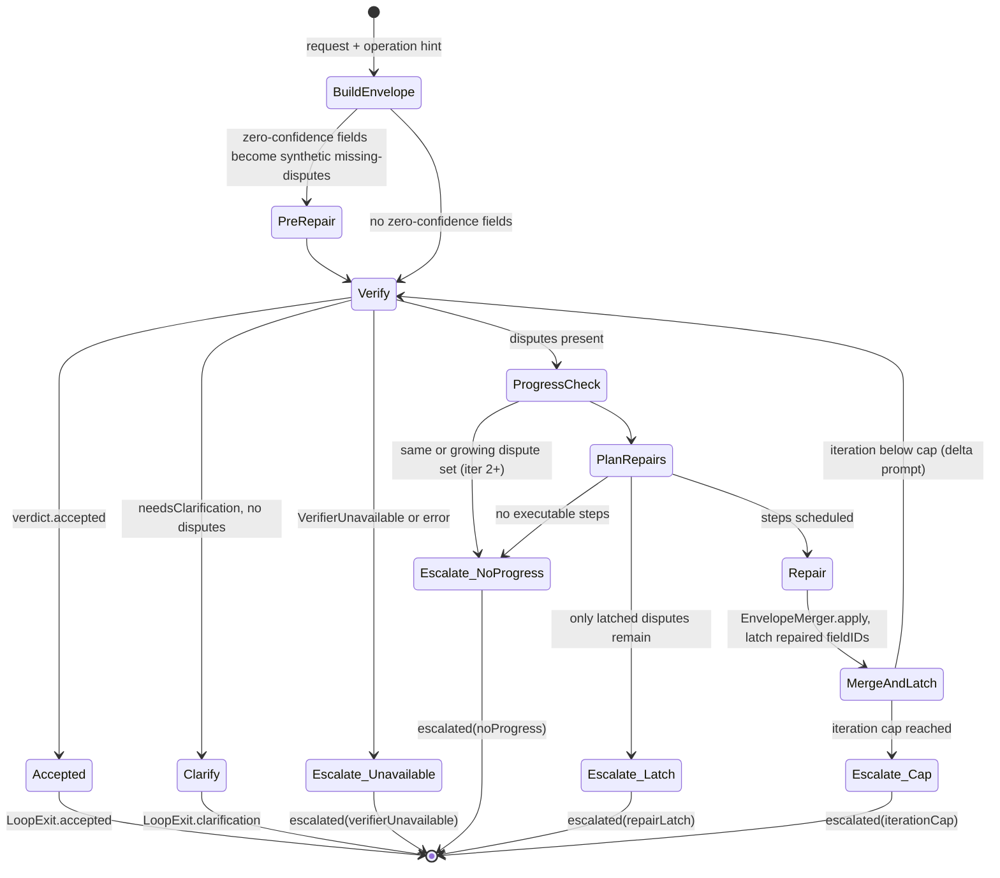

### 7.6 End-to-end sequence (happy path with one repair)

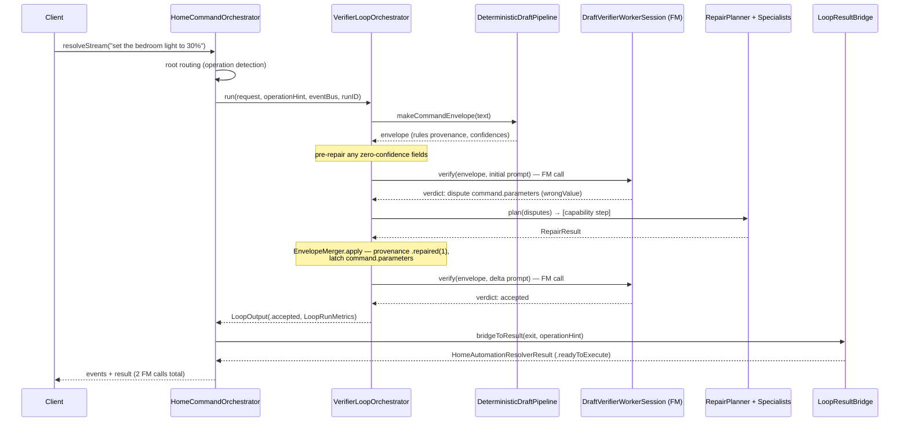

### 7.7 Bridging and escalation semantics

`LoopResultBridge.bridgeToResult` converts a `LoopExit` into the same
`HomeAutomationResolverResult` shape the graph produces, so callers are agnostic to the path:

- **accepted (direct command)** → `StructuralDraftBuilder` builds the `HomeCommandDraft`;
  confirmation-requiring drafts map to `.requiresConfirmation`, ambiguous ones to
  `.needsClarification`, the rest to `.readyToExecute(plan)`.
- **accepted (automation)** → `StructuralDraftBuilder.automationCreationPlan(from:)` maps the
  envelope to a `HomeAutomationCreationPlan` and compiles Rules API JSON via
  `SmartThingsRuleCompiler`; high/critical risk maps to `.automationRequiresConfirmation`, a
  clean compile to `.automationDrafted(plan)`, and an uncompilable envelope (e.g. a device
  trigger) to `.unsupported(reason)`.
- **clarification** → `.needsClarification(question)` with the envelope's candidate table
  surfaced as retrieved/hydrated candidates.
- **escalated** → when the FM is available, the orchestrator *falls through to the legacy
  graph* (the loop's work is not wasted — `LoopResultBridge.seedContext` seeds the envelope and
  a structural draft into the `ResolutionContextStore` so graph agents can start from it);
  when the FM is unavailable, the deterministic envelope is bridged directly (fail-closed).

---

## 8. Safety Model

Safety behavior is designed to be **identical across all three paths** (and gated on that in
the exit criteria):

1. **Risk is monotonic.** `RiskSection.raise(to:reason:)` refuses to lower the level. The
   verifier can flag `riskUnderstated`, and the `riskRaise` specialist re-assesses
   deterministically — the FM can *raise* risk, never lower it.
2. **Deterministic floor.** Initial risk comes from `AgentTextParser`'s deterministic
   classification, so an FM failure can't erase a security-device floor. Automation rules
   re-assess across all actions (`assessFromActions`) — locks/cameras/security floor at high.
3. **Confirmation gates are deterministic.** `requiresConfirmation` is decided by
   validators/policy (`AgentCommandValidator`, `ConfirmationPolicyAgent`), not free-form FM output.
4. **Fail-closed everywhere.** FM unavailable → deterministic path; loop can't converge →
   escalate; escalation with no FM → bridge the deterministic draft; empty/gibberish input →
   clarification or unsupported, never a fabricated command.
5. **High-risk automations from the loop path stop.** The bridge refuses to auto-create
   high/critical-risk automation rules.

---

## 9. Optimization Catalog

### 9.1 Phase A quick wins (all default-on)

| # | Optimization | Mechanism | Effect |
|---|---|---|---|
| A1/A2 | NLU soft-timeout parity + budget | `NLUSoftTimeoutBudget` (default 4s NLU-class; verifier 8s) wraps FM calls; on expiry the worker returns its deterministic fallback | Worst-case latency bounded; no stacking behind a slow model |
| A3 | Scoped NLU policy override | Context artifact lets the automation action subgraph threshold-gate slot extraction | Redundant FM slot calls skipped inside automations |
| A4 | RAG enrichment skip | Few-shot retrieval skipped for short/confident inputs (τ = 0.88) | Removes retrieval + prompt-inflation cost on easy inputs |
| A5 | `FoundationModelGate` | Global FIFO admission gate, `maxConcurrent = 2`, queue wait surfaced as `fmQueueWaitMs` telemetry | Makes FM queueing explicit and measurable instead of hiding it inside "model latency" |
| A6 | No mandated tool round-trip | Semantic NLU no longer forces a tool call per run | −1 FM round-trip on the hot path |
| A7 | `windowShade` verb gap | Deterministic verb mapping | Whole class of shade commands resolves with 0 FM calls |
| A8 | Fan-out concurrency cap | Automation component fan-out capped | Prevents FM gate flooding from big automations |

### 9.2 FM admission gate

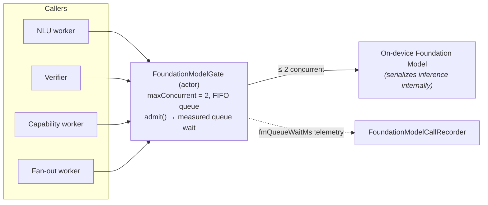

Invariants: every `admit()` pairs with exactly one `release()` (enforced by the recorder's
`defer`); gated operations must not recursively start gated operations; cancelled waiters are
over-admitted by one so the paired `release()` stays balanced. Because NLU soft timeouts wrap
the *gated* call, queue wait counts against the budget — under contention, workers degrade to
deterministic fallbacks quickly instead of stacking. This is intentional back-pressure.

### 9.3 Loop-specific optimizations

| Optimization | Mechanism |
|---|---|
| Zero-FM stage 0 | Complete deterministic draft before any model call |
| Pre-verify repair | Zero-confidence fields repaired *before* the first verifier call, so iteration 1 verifies a stronger draft |
| Prompt budget | 4000-char cap with deterministic truncation; candidate table capped at 8 |
| Delta prompts | Iterations ≥ 2 verify only disputed/repaired fields |
| Dispute cap | ≤ 6 disputes per verdict (schema-level and post-constraint) |
| Constrained decoding | FieldID and DisputeKind are closed enums in the generation schema — the model cannot dispute nonexistent fields |
| Field latching | Repaired fields never re-repaired; kills oscillation |
| Strict progress | Dispute set must strictly shrink or the loop escalates immediately |
| Iteration cap | Hard ceiling of 3 verifier calls per request |
| Session reuse | One verifier FM session across loop iterations (KV-cache friendly) |

### 9.4 FM call budgets by path (design targets)

| Scenario | Legacy graph | Tier 1 | Verifier loop |
|---|---|---|---|
| Confident direct command | 5–8 | 5–8 (unchanged) | **1** (verify only) |
| Ambiguous direct command | 8–10 | 8–10 | 2–4 |
| 3-action automation, confident | ~20+ | **3–5** | 1–3 |
| FM unavailable | 0 (fallback graph) | 0 | 0 (deterministic bridge) |

---

## 10. Observability & Evaluation

### 10.1 Telemetry

- **Event stream**: `AgentEventBus` publishes `OrchestratorPipelineEvent`s per stage — the loop
  adds `verifierLoop/envelope`, `verifierLoop/preRepair`, `verifierLoop/verify/N`,
  `verifierLoop/verdict/N`, `verifierLoop/repair/N` stages, so the UI can render loop progress
  live exactly like graph progress.
- **`LoopRunMetrics`** (on `OrchestratorMetrics.loop`): iterations, `acceptedOnIteration`,
  verifier/repair call counts, `disputedFieldIDsPerIteration` (the raw material for measuring
  convergence), `escalationReason`, `preVerifyRepairCount`.
- **FM telemetry**: `FoundationModelCallRecorder` + gate emit per-call latency and
  `fmQueueWaitMs`; `GraphRunMetrics` captures per-node timing and node queue durations.

### 10.2 Evaluation harnesses (CLI: `home-automation-eval`)

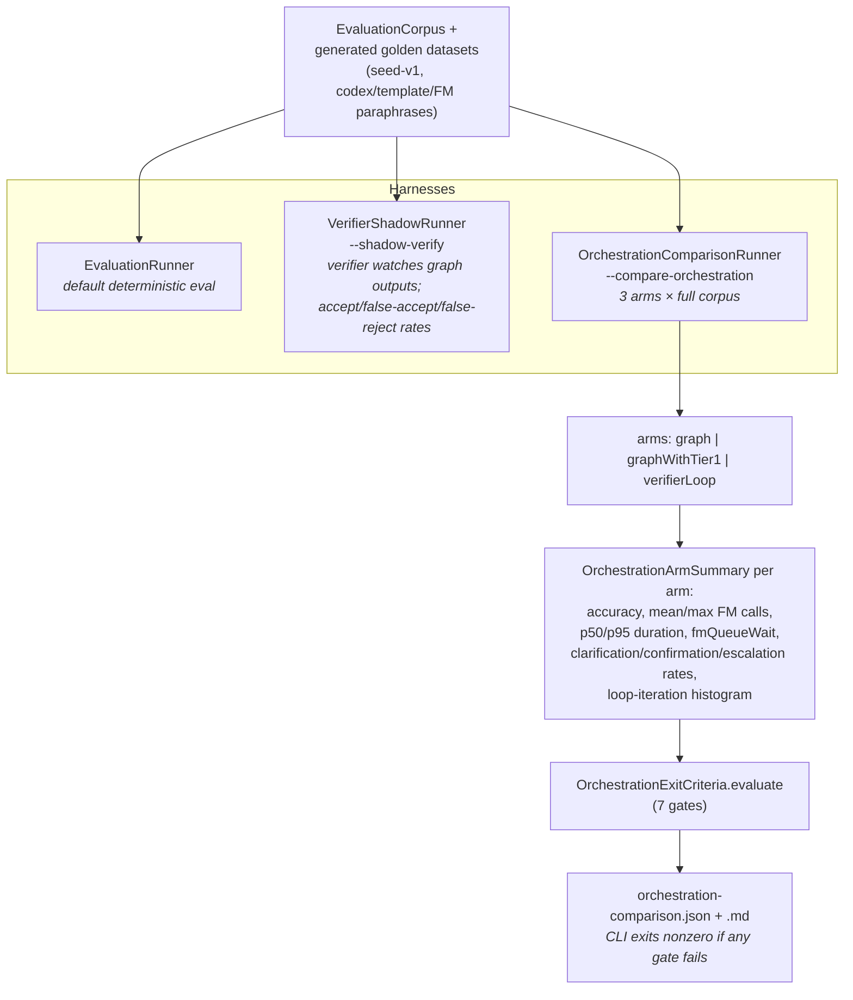

### 10.3 Exit criteria — the default-flip gates

| Gate | Threshold |
|---|---|
| End-to-end accuracy (Tier 1) | ≥ graph baseline |
| End-to-end accuracy (loop) | ≥ graph baseline |
| Mean FM calls, direct command (loop) | ≤ 4 |
| Mean FM calls, automation (Tier 1) | ≤ 6 |
| Mean FM calls, automation (loop) | ≤ 4 |
| p95 loop iterations | ≤ 2 |
| Clarification-rate delta vs. baseline | ≤ +3 pts |
| Safety-gate outcomes | confirmation rates identical to baseline |

---

## 11. Rollout Strategy

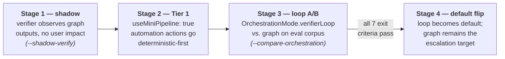

Both flags are independent and independently revertible; the legacy graph is never removed —
it is the escalation target, which is what makes the loop safe to ship incrementally.

---

## 12. Implementation Review (as of Phase G)

### Strengths

- **Bounded by construction.** Every loop mechanism that could run away has a hard cap:
  iterations (3), repairs per iteration (3), disputes per verdict (6), prompt size (4000),
  candidate table (8), FM concurrency (2). Worst-case cost is statically knowable.
- **Three-layer hallucination containment** on the verifier (compact prompt → constrained
  decoding with closed enums → post-constraints) is genuinely defense-in-depth; no single
  layer's failure lets the model dispute a nonexistent field.
- **Fail-closed symmetry.** Every FM-dependent branch has a deterministic exit, and risk is
  monotonic across all mutation sites.
- **Convergence is observable, not assumed.** `disputedFieldIDsPerIteration` + the iteration
  histogram in arm summaries make the "does verify→repair actually converge?" question
  answerable from data.
- **Strong regression rails**: the type-inventory meta-test, coordinator-bounded construction
  test, and 100+ phase tests keep the architecture honest.

### Known gaps and risks

| # | Severity | Finding |
|---|---|---|
| 1 | ~~High~~ **Fixed** | ~~`.verifierLoop` mode is not wired in production~~ — `makeRuntimeDependencies(orchestrationMode: .verifierLoop)` now constructs the loop via `makeVerifierLoopOrchestrator()`, and `HomeCommandOrchestrator` records `LoopRunMetrics` on run metrics. Covered by `RuntimeDependencyWiringTests`. |
| 2 | ~~High~~ **Fixed** | ~~`useMiniPipeline` parameter is a no-op in the runtime-deps overload~~ — the flag now threads through `AutomationCoordinator.withMiniPipeline(_:)` and `AgentCoordinator.makeAgentRegistry(automationCoordinator:)` into the built registry; `AutomationActionResolver.usesMiniPipeline` makes it observable in tests. |
| 3 | ~~Medium~~ **Fixed** | ~~The comparison runner is deterministic-only~~ — `OrchestrationComparisonRunner(requireLiveModel:)` + `--compare-orchestration --require-live-model true` run arms against the live FM; deterministic remains the CI-safe default. |
| 4 | ~~Medium~~ **Fixed** | ~~Accepted automation envelopes bridge to `.unsupported(...)` placeholders~~ — `StructuralDraftBuilder.automationCreationPlan(from:)` maps the envelope to a `HomeAutomationCreationPlan` and compiles Rules API JSON via `SmartThingsRuleCompiler`; the bridge returns `.automationDrafted` / `.automationRequiresConfirmation`. Schedule-triggered automations are end-to-end; device triggers still report an unsupported reason (needs H6's structured trigger condition). |
| 5 | ~~Low~~ **Fixed** | ~~The two loop FM-call exit gates read the same aggregate~~ — arm summaries now split by `OrchestrationSuiteCategory` (directCommand vs automation); each FM-call gate reads its own category with aggregate fallback. |
| 6 | ~~Low~~ **Fixed** | ~~Room-less devices always fail the τ-gate~~ — `command.room` is omitted from `fieldConfidence` when the device has no room, so τ-gates and zero-confidence pre-repair skip it. |
| 7 | Low (partial) | Capability repair is now wired to `CapabilityResolutionWorker` (deterministic fallback + optional FM). Trigger/condition/segmentation specialists still return nil (latch → escalate) — required before the loop path serves automations end-to-end (task H6, depends on H2). |

Remaining before a default flip: a live-model comparison run on real hardware, structured
device-trigger conditions in the envelope, and H6 (automation repair specialists) to close the
loop path for device-triggered and multi-condition automations.

---

## 13. Test Coverage Map

| Phase | Suite | Tests |
|---|---|---|
| A | Phase A Quick Win Tests | timeout parity, τ-gating, gate telemetry |
| B | Envelope + pipeline | 22 (10 envelope, 12 pipeline) |
| C | Verifier | 18 (verdict, prompt builder, worker session) |
| D | Repair | 35 (planner, fragment NLU, target resolver, draft builder, risk assessor, merger) |
| E | Loop orchestrator | 13 (accept, repair-accept, all four escalations, metrics, bridge) |
| F | Automation Tier 1 | 13 (mini-pipeline, τ-gates, risk, coordinator flag) |
| G | Evaluation | 13 (arm summaries, exit criteria, report round-trip) |
| — | Meta | type-inventory completeness, coordinator-bounded construction |

Full type-by-type ownership and classification: [CoordinatorTypeInventory.md](CoordinatorTypeInventory.md).
