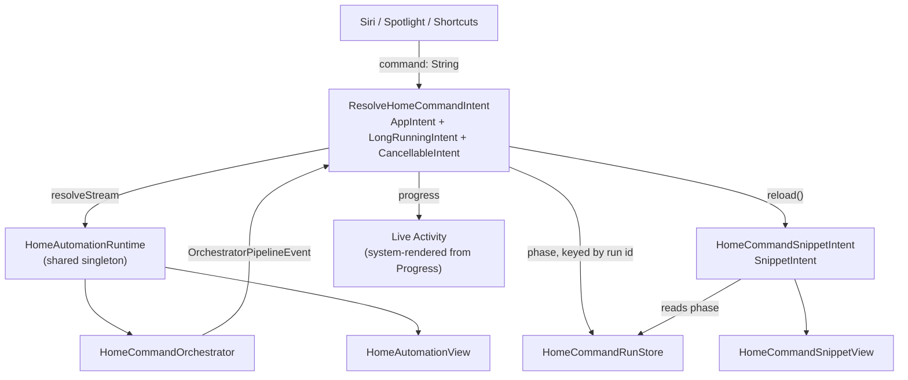

# App Intents

How `HomeAutomation` exposes its command pipeline to Siri, Spotlight, and Shortcuts — and a
reference for the App Intents framework itself, current as of iOS 27.

> **Source of truth.** Every availability annotation and signature in this document was read from
> the iOS 27.0 SDK's `AppIntents.swiftinterface`, not from documentation or memory:
>
> ```
> $(xcrun --sdk iphoneos --show-sdk-path)/System/Library/Frameworks/AppIntents.framework/Modules/AppIntents.swiftmodule/arm64e-apple-ios.swiftinterface
> ```
>
> Cross-checked against WWDC26 session 345, "Discover new capabilities in the App Intents framework".

---

## Part 1 — What this app ships

### The shape



### Why `LongRunningIntent`

App Intents get roughly 30 seconds. This pipeline does not fit in 30 seconds:

- Most graph agents carry 60-second timeouts (`AgentTimeoutRunner`).
- `VerifierLoopPolicy` permits 3 iterations × 3 repair calls.
- `FoundationModelGate.shared` throttles Foundation Models to `maxConcurrent: 2`, so calls queue.

`performBackgroundTask` extends the runtime and hands the system a `Progress` object, which it
renders as a Live Activity with a stop button — no ActivityKit target and no Info.plist key.

### Why everything runs in the app process

Both intents declare `allowedExecutionTargets = .main`. This is deliberate:

| If it ran in an extension | Consequence |
|---|---|
| `MockHomeDeviceRegistry` is an in-memory `actor` | The intent would mutate a *different* device world than the app displays |
| RAG index is a dense TF-IDF store over a 10k-example / 7 MB dataset | Built twice, in a process with a much tighter memory ceiling |
| `FoundationModelGate.shared` is process-local | App and extension would contend on separate gates |

`HomeAutomationRuntime` is the single owner of the registry, coordinator, and orchestrator, shared
by `HomeAutomationViewModel` and the intents. Combined with `supportedModes = .background`, the
intent runs inside the app process without foregrounding it.

### Which arm the intent runs

Intents resolve on a **pinned** configuration, not whatever the app's pickers were last left on:

```swift
static let intentChoice: OrchestratorChoice = .adaptiveStatic   // Adaptive Static
static let intentCompiler: GraphCompilerChoice = .disabled      // Compiler Off
```

An intent invoked from Siri or Shortcuts has to behave the same way every time, so
`HomeAutomationRuntime.intentOrchestrator()` builds and caches its own orchestrator rather than
reading `runtime.orchestrator`. It is minted from the *same* coordinator, so the RAG index and
device registry are still shared — only the agent registry and loop orchestrator differ. The cache
is dropped when the RAG upgrade replaces the coordinator, so the next run picks up the index.

`.adaptiveStatic` resolves to `orchestrationMode: .adaptivePortfolio`,
`portfolioRolloutMode: .activeStatic`, and `PortfolioEligibilityPolicy(conditionalTier1Enabled: true)`
— identical to what the UI passes when you select "Adaptive Static", so the two paths behave the
same. The adaptive-portfolio arm's verifier-loop orchestrator is built from coordinator-owned
dependencies only, so it works even if an intent fires before the RAG index finishes building.

To change the arm, edit those two constants.

### Why the snippet needs a run store

A `SnippetIntent`'s `perform()` is a **separate invocation** from the intent that returned it, and
runs again on every `reload()`. It cannot see the parent intent's locals — only its own
`@Parameter` values. So `ResolveHomeCommandIntent` writes phases into `HomeCommandRunStore` under a
`UUID`, and passes only that id to the snippet. This is sound precisely because both intents pin to
`.main` and therefore share one process.

### Progress reporting — the propagation channel

`LongRunningIntent` refines `ProgressReportingIntent` (iOS 17), which adds exactly one member:

```swift
extension ProgressReportingIntent { public var progress: Foundation.Progress { get } }
```

That single object *is* the live-update channel. The system creates an `NSProgress`, passes it into
the intent's perform call — visible in the framework as
`AppContext.perform(_:options:reportingProgress: NSProgress?, delegate:)` — and then watches it.
Apple documents exactly how Live Activities renders it:

| `Progress` property | Surfaces as |
|---|---|
| `localizedDescription` | Task **title** |
| `localizedAdditionalDescription` | Task **subtitle** |
| `completedUnitCount` / `totalUnitCount` | The **progress bar** |

Two consequences the API shape makes easy to get wrong:

- **`progress` is getter-only, with no storage on the intent.** It is a computed property on a
  protocol extension. Outside an execution context it hands back a fresh throwaway `Progress` on
  every access. Capturing it once into a helper therefore depends on undocumented behaviour —
  `report(_:)` re-reads `progress` at each write instead, which is what Apple's own sample does.
- **Not updating it is fatal, not untidy.** `performBackgroundTask`'s documentation: "If you don't
  update this property regularly, the system can cancel the background runtime extension and end
  your task prematurely."

`StageProgressTracker` therefore has two jobs: report accurately when work advances, and report at
all when it doesn't. It holds no `Progress` reference — it is a pure state machine that returns a
`ProgressReport`, and the intent writes that into `progress`.

**A work unit is not a stage.** One graph node can host several agents, the automation path fans out
per action and per condition clause, and the verifier loop re-invokes the same agent up to three
times with repairs. Keying progress on `event.stage` alone collapses all three. Units are keyed on
every identity the event carries:

```swift
[stage, agentID, graphNodeID, componentID, actionID, conditionID, agentInvocationID, agentRunID]
```

So a **new agent starting** is a new unit, and the same agent moving `running → completed` is a state
change on an existing one. Both move the bar, and the label follows the agent — that is the thing a
watcher sees change in the Live Activity.

**The denominator is discovered lazily**, which creates a trap: a naive finished ÷ discovered ratio
reads 100% the instant the first unit completes, because nothing else has been discovered to weigh
it against. The denominator is therefore padded for unseen work (`× 1.25`) and floored at a nominal
run size (14 units). Both only shape the curve; only `finish()` reaches 100%.

**Silence is the real risk.** A single agent can hold for 60 seconds emitting nothing, so
event-driven updates alone leave a window where the task looks dead. A 2-second `heartbeat()` timer
nudges the bar during those stretches, bounded to half a unit past the honest value so it signals
liveness without inventing completion.

Values are clamped monotonically throughout, so newly discovered work never rewinds the bar.

### What the snippet deliberately does *not* do

There is no "Confirm & run" button. `.requiresConfirmation` is terminal by design —
`OrchestratorPolicyEngine` routes to it precisely to stop execution, and nothing in the codebase
converts a confirmed `HomeCommandDraft` into an executable `HomeAutomationExecutionPlan`. Adding
that button would mean hand-building a plan and calling `executeLowRiskPlan` directly, bypassing the
safety gate the case exists to enforce. Instead the snippet offers `OpenHomeAutomationIntent`, which
brings the app forward where the existing confirmation UI governs.

### Files

| File | Role |
|---|---|
| `HomeAutomationApp/Intents/ResolveHomeCommandIntent.swift` | The long-running intent |
| `HomeAutomationApp/Intents/StageProgressTracker.swift` | Pipeline events → `Progress` |
| `HomeAutomationApp/Intents/HomeCommandSnippetIntent.swift` | Live snippet |
| `HomeAutomationApp/Intents/HomeCommandSnippetView.swift` | Snippet body |
| `HomeAutomationApp/Intents/HomeCommandRunStore.swift` | Parent → snippet handoff |
| `HomeAutomationApp/Intents/HomeAutomationRuntime.swift` | Shared registry/coordinator/orchestrator |
| `HomeAutomationApp/Intents/OpenHomeAutomationIntent.swift` | Snippet → app |
| `HomeAutomationApp/Intents/HomeAutomationShortcuts.swift` | `AppShortcutsProvider` |

### Platform requirement

`LongRunningIntent` is iOS 27.0, so the app and package both target 27.0.

**Consequence worth knowing:** iOS 27 obsoletes `SystemLanguageModel.Adapter` and
`SystemLanguageModel(adapter:)` outright, with no replacement API. Custom LoRA adapters can no
longer be loaded. `HomeAdapterModelProvider.makeAdapterModel()` now reports
`loadOutcome: "unsupportedOS"` and falls back to the base system model rather than throwing, so a
configured adapter is ignored rather than fatal. The `HomeAdapterModelDiagnostic` records why.

---

## Part 2 — Framework reference

### 2.1 The core protocol

```swift
@_alwaysEmitConformanceMetadata
public protocol AppIntent : PersistentlyIdentifiable, _SupportsAppDependencies, Sendable {
    static var title: LocalizedStringResource { get }
    static var description: IntentDescription? { get }
    static var openAppWhenRun: Bool { get }                            // deprecated iOS 26
    @available(iOS 26.0, *) static var supportedModes: IntentModes { get }
    static var authenticationPolicy: IntentAuthenticationPolicy { get }
    @available(iOS 17.0, *) static var isDiscoverable: Bool { get }
    @available(iOS 27.0, *) static var allowedExecutionTargets: IntentExecutionTargets { get }
    associatedtype SummaryContent : ParameterSummary
    static var parameterSummary: Self.SummaryContent { get }
    func perform() async throws -> Self.PerformResult
    init()
}
```

`perform()` returns an opaque composition of **result traits**, each refining `IntentResult`:

| Trait | Since | Meaning |
|---|---|---|
| `ReturnsValue<Value>` | 16.0 | Typed value for the next Shortcuts action |
| `ProvidesDialog` | 16.0 | Siri speaks / displays a line |
| `ShowsSnippetView` | 16.0 | Static SwiftUI view |
| `ShowsSnippetIntent` | **26.0** | Live, re-renderable snippet |
| `OpensIntent` | 16.0 | Chains to another intent (deprecated 18.2) |

They compose. This app returns
`some IntentResult & ReturnsValue<String> & ProvidesDialog & ShowsSnippetIntent`.

### 2.2 Intent families

**Behavioural add-ons** — mix into your own intent:

| Protocol | Since | Gives you |
|---|---|---|
| `ProgressReportingIntent` | 17.0 | `var progress: Foundation.Progress` |
| `LongRunningIntent` | **27.0** | `performBackgroundTask` — escapes the 30s cap |
| `CancellableIntent` | **26.4** | `withIntentCancellationHandler`, `IntentCancellationReason` |
| `UndoableIntent` | 26.0 | `@MainActor var undoManager: UndoManager?` |
| `ForegroundContinuableIntent` | 16.0 | Bail to the app mid-`perform()` |
| `PredictableIntent` | 16.0 | Siri/Spotlight prediction |
| `DeprecatedAppIntent` | 17.0 | Marks an intent superseded |
| `CustomIntentMigratedAppIntent` | 16.0 | Migration off SiriKit `.intentdefinition` |

**Surface-specific** — conform to be adopted by a system surface:

| Protocol | Since | Surface |
|---|---|---|
| `WidgetConfigurationIntent` | 17.0 | Widget configuration |
| `ControlConfigurationIntent` | 18.0 | Control Center / Lock Screen / Action button |
| `LiveActivityIntent`, `LiveActivityStartingIntent` | 17.0 | ActivityKit |
| `AudioPlaybackIntent`, `AudioRecordingIntent`, `AudioStartingIntent` | 17–18 | Background audio |
| `CameraCaptureIntent` | 18.0 | Camera Control |
| `SetFocusFilterIntent` | 16.0 | Focus filters |
| `ShowInAppSearchResultsIntent` | 17.2 | Spotlight / Siri search |
| `PushToTalkTransmissionIntent` | 17.4 | Push to Talk |
| `SnippetIntent` | **26.0** | Interactive snippet body |
| `TargetContentProvidingIntent`, `VisualIntelligenceIntent` | 26.0 | Visual Intelligence |

**Semantic / system intents** (`SystemIntent` descendants) — `OpenIntent`, `DeleteIntent`,
`SetValueIntent`, `PlayVideoIntent`, `StartWorkoutIntent`, `PauseWorkoutIntent`,
`ResumeWorkoutIntent`, `StartDiveIntent`, `RunSystemShortcutIntent` (**27.0**). Conforming tells the
system *what your intent means*, not merely that it exists.

**Assistant schemas** (`@AssistantIntent(schema:)`, 18.0+) — pre-defined shapes across ~20 domains
(`MailIntent`, `PhotosIntent`, `BrowserIntent`, `ClockIntent`, `SpreadsheetIntent`,
`WhiteboardIntent`, `JournalIntent`, `PresentationIntent`, `ReaderIntent`, `FilesIntent`,
`BooksIntent`, `MapsIntent`, `CameraIntent`, `AppStoreIntent`, …). Conforming lets Apple
Intelligence reason about the intent without bespoke training. **Home automation is not a schema
domain**, which is why this app uses a plain `AppIntent`.

### 2.3 Entities, enums, queries

| Protocol | Since | Notes |
|---|---|---|
| `AppEntity` | 16.0 | The core noun: `id`, `displayRepresentation`, `defaultQuery` |
| `TransientAppEntity` | 16.0 | No stable identity, not queryable |
| `UniqueAppEntity` | 18.0 | Exactly one instance |
| `IndexedEntity` | 18.0 | Auto-donated to Spotlight via `CSSearchableItemAttributeSet` |
| `FileEntity` | 18.0 | File-backed |
| `URLRepresentableEntity` | 18.0 | Round-trips through a URL |
| `AppEntityAnnotatable` | 18.2 | Ties an on-screen view to an entity id |
| `SyncableEntity` | **27.0** | Stable ids across devices; `SyncableEntityIdentifier<Local, Stable>` |
| `OwnershipProvidingEntity` | **27.0** | `var ownership: EntityOwnership` — `.unknown`/`.shared`/`.public` |

Query ladder: `EntityQuery` (16.0) → `EntityStringQuery` (free text) → `EnumerableEntityQuery`
(17.0, "everything") → `EntityPropertyQuery` (filter/sort; powers Shortcuts' "Find X") →
`IndexedEntityQuery` (**27.0**, Spotlight-backed) → `UniqueAppEntityQuery` (18.0). Separately,
`IntentValueQuery` (26.0) feeds Visual Intelligence.

`AppEnum` (16.0) is the closed-vocabulary type: a `String`/`Int`-raw-valued enum with
`caseDisplayRepresentations`.

### 2.4 Parameters and properties

- `@Parameter` — intent input. iOS 27 adds native `Duration` and `PersonNameComponents`.
- `@Property` — queryable entity field.
- `@ComputedProperty` / `@DeferredProperty` (26.0) — computed on read or fetched lazily, optionally
  mapped to a Spotlight `indexingKey`.
- `@Dependency` — injects app singletons into `perform()`.
- `@UnionValue` (**27.0**) — one parameter accepting several entity types, with generated pickers.
- `EntityCollection<Entity>` (**27.0**) — passes *identifiers* rather than hydrated entities.
- `ParameterSummary` with `When` / `Switch` / `Case` — the Shortcuts card layout DSL.

### 2.5 New in iOS 27

| Symbol | What it does |
|---|---|
| `LongRunningIntent` | `performBackgroundTask` — the 30s escape hatch |
| `LongRunningTaskOptions` | `.requiresGPU` for background GPU work |
| `IntentExecutionTargets` | `.default` / `.main` / `.appIntentsExtension` / `.widgetKitExtension` |
| `IntentResponseStream<Value>` | Streaming intent responses |
| `SyncableEntity`, `SyncableEntityIdentifier` | Cross-device stable entity ids |
| `EntityCollection<Entity>` | Identifier-only bulk entity parameters |
| `EntityOwnership`, `OwnershipProvidingEntity` | Shared/public content marking |
| `RelevantEntities`, `AppEntityContext`, `AudioContext` | Push contextually relevant entities |
| `AppUnionValue`, `@UnionValue` | Multi-type parameters |
| `IndexedEntityQuery` | Spotlight-index-backed queries |
| `CustomAppIntentErrorConvertible` | Map your errors into `AppIntentError` |
| `RunSystemShortcutIntent`, `SystemShortcut` | Invoke built-in system shortcuts |
| `ValueRepresentation` | Export entities as system types, e.g. `PlaceDescriptor` |

WWDC26 also formally **deprecated SiriKit**. App Intents is now the only route from Siri into a
third-party app.

### 2.6 `LongRunningIntent`

```swift
@available(iOS 27.0, *)
public protocol LongRunningIntent : ProgressReportingIntent {}

@available(iOS 27.0, *)
extension LongRunningIntent {
    @discardableResult
    public func performBackgroundTask<T>(
        options: LongRunningTaskOptions = [],
        operation: @escaping () async throws -> T
    ) async throws -> T

    @discardableResult
    public func performBackgroundTask<T>(
        options: LongRunningTaskOptions = [],
        operation: @escaping () async throws -> T,
        onCancel: @escaping @Sendable (IntentCancellationReason) -> Void
    ) async throws -> T where Self : CancellableIntent
}
```

- The protocol has **no requirements** — it is a marker that unlocks `performBackgroundTask`.
- It refines `ProgressReportingIntent`, so `self.progress` exists. That inheritance is the whole
  bargain: the extended runtime is granted *on condition* that you keep feeding `progress`.
  **Reporting is mandatory**; a stalled task can lose its extension mid-flight.
- The system renders `progress` as a Live Activity with a stop button, free — title, subtitle and
  bar read straight off `localizedDescription`, `localizedAdditionalDescription`, and the two unit
  counts.
- The framework owns the background-task lifecycle — no `UIBackgroundTaskIdentifier`.
- `onCancel:` requires `CancellableIntent` (iOS **26.4** — a lower floor than 27.0).
- `IntentCancellationReason` distinguishes `.timeout` from `.userCancelled`.

### 2.7 Snippets

```swift
// static — iOS 16+, one-shot, cannot update
static func result<Content: View>(value:dialog:view:) -> …

// interactive — iOS 26+
@available(iOS 26.0, *)
public protocol SnippetIntent : AppIntent where Self.PerformResult : ShowsSnippetView {}
extension SnippetIntent { public static func reload() }

static func result(dialog: IntentDialog,
                   snippetIntent: some SnippetIntent = EmptySnippetIntent()) -> Self
```

`reload()` is **static** — it re-renders every live snippet of that type, not one instance. Because
the snippet intent is invoked separately from its parent, its state must come from its parameters or
from somewhere shared; see `HomeCommandRunStore` above.

---

## Verifying changes

```bash
cd HomeAutomationCore && swift build
```

```bash
xcodebuild -project HomeAutomation.xcodeproj -scheme HomeAutomation -destination 'platform=iOS Simulator,name=iPhone 17 Pro,OS=27.0' build
```

Confirm metadata extraction — if this is missing, the intent will never reach Shortcuts:

```bash
find ~/Library/Developer/Xcode/DerivedData -name "Metadata.appintents" -maxdepth 6
```

Inspect what was actually registered (`systemProtocols` should list `LongRunning`, `Cancellable`,
`ProgressReporting` for the resolve intent, and `Snippet` for the snippet intent):

```bash
python3 -c "import json;d=json.load(open('<App>.app/Metadata.appintents/extract.actionsdata'));print(json.dumps(d['actions'],indent=1))"
```

Then install on an iOS 27 simulator and open Shortcuts — the app should appear under **Apps** with
one discoverable shortcut.
