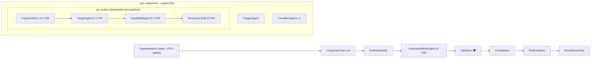

# Automation Creation Pipeline — Investigation & Automation-Native Redesign

> **Status**: Proposal (design document)
> **Date**: 2026-07-07
> **Scope**: Why automation creation is slow (especially SemanticNLU / SlotExtraction on
> simple actions like "Turn on \<device\>"), and how to redesign the automation
> sub-agents natively instead of reusing the execute-device pipeline.
> **Companion doc**: `LoopOrchestrationArchitecture.md` (verifier-loop target state)
> **Implementation plan**: `LoopOrchestrationImplementationPlan.md` (task-level plan for coding agents; quick wins Q-1…Q-6 = tasks A1–A8, Tier 1 = Phase F)

---

## Part 1 — Investigation: what actually happens today

### 1.1 Full trace: "Every day at 7 AM turn on the AC"

| # | Stage | What runs | FM calls | Notes |
|---|---|---|---|---|
| 1 | Root routing | `OperationDetectionAgent` | 1 (+ analyzer tool round-trip) | classifies `automationCreation` |
| 2 | `automationComponentSegmentation` | FM with `AutomationPatternParserHintTool` deterministic hint | 1 | deterministic `AutomationPatternParser.fallbackPlan` already produced the same plan |
| 3 | `automationComponentFanOut` | trigger + conditions + actions **all concurrently** | see below | `AutomationComponentFanOutRunner` |
| 3a | Trigger "every day at 7 AM" | `AutomationTriggerResolutionWorkerSession` | 1 | deterministic `scheduleTrigger()` already parsed it at 0.84 confidence |
| 3b | Action "turn on the AC" | **entire direct-command subgraph** (`AutomationActionResolver` → `GraphPlanner.directCommandGraph()`, 18 nodes) | ~6 | detailed in §1.2 |
| 4 | `automationDraftAssembly` | deterministic merge | 0 | |
| 5 | `automationValidation` 🛡 | deterministic | 0 | |
| 6 | `smartThingsCompilation` → `smartThingsRuleCreation` → `automationResultAssembly` | deterministic + network | 0 | |

**Total: ~9–10 FM calls** for a one-trigger/one-action automation, ~6 of them
spent inside the action subgraph re-deriving things the pipeline already knew.

### 1.2 Anatomy of the per-action subgraph

`AutomationActionResolver.resolve("Turn on the AC")` creates a fresh context
store, seeds it with `AgentTextParser.deterministicState` (confidence **0.82**),
then runs the **full 18-node direct-command graph**:

| Direct-command node | Useful for an action fragment? | FM |
|---|---|---|
| `semanticNLU` | Redundant — seeding already computed intent+deviceType at 0.82 | 1 (+ `getAvailableDeviceTypes` tool round-trip) |
| `slotExtraction` | Redundant for "turn on X" (no values/modes); marginal for value actions | 1 |
| `riskClassification` | **Wrong layer** — automation actions are never executed at creation time (`executeLowRiskCommands=false`); risk belongs to the assembled rule | 1 |
| `capabilityKnowledge`, `bixbyKnowledge`, `commandExample` | Designed to ground open-ended *draft generation*; the action draft is schema-driven | 0 (4 vector searches) |
| `candidateRetrieval` | **Needed** — find the device | 0 |
| `retrievalJudge` | Judges knowledge retrieval that isn't needed | 0 |
| `candidateRanking` | **Needed** — disambiguate the device | 1 |
| `candidateHydration` | **Needed** | 0 |
| `capabilityResolution` | **Needed** — map "turn on" → `switch.on` | 1 (+ tool round-trips) |
| `instructionComposer` + `draftGeneration` | Redundant — after `capabilityResolution` the draft (`device + capability + command + params`) is fully determined; the FM draft call re-generates what is already known | 1–2 (largest prompt of the run, with tools) |
| `safetyValidation`, `parameterValidation` | Useful (deterministic) | 0 |
| `confirmationPolicy` | Wrong layer — confirmation applies once to rule creation, not per action | 0 |
| `executionPlanning`, `mockExecution` | Wrong layer — never executes; mock node is guard-skipped | 0 |

Only **4 of 18 nodes** (retrieval, ranking, hydration, capability resolution)
plus the deterministic validators do work the automation actually needs.

### 1.3 Why SemanticNLU and SlotExtraction feel so slow — root causes

**RC-1 — Policy always calls the model, even when rules already won.**
Default `NLUModelCallPolicy` is `.modelFirstWithHint`: the deterministic result
is computed, embedded in the prompt as a hint, and the FM is called *anyway*.
For "Turn on \<device name\>" the deterministic parse (0.82) is above every
threshold (0.78/0.78/0.85) — under the existing `.thresholdGated` mode these FM
calls would be **skipped entirely**. The seeding in
`AutomationActionResolver.seedDirectCommandRoutingContext` even proves the
confidence is known before the subgraph starts.

**RC-2 — On-device FM queue contention.**
The fan-out launches trigger + conditions + N actions concurrently; each action
immediately fires 3 concurrent NLU calls. Apple's on-device model serializes
inference, so for 1 trigger + 2 actions, **7 FM requests hit the queue at
once**. Observed NLU wall time ≈ its own inference + everything queued ahead of
it. The graph's parallelism *increases* each node's apparent latency.

**RC-3 — Prompt inflation on tiny inputs.**
`SemanticNLUAgent.run` / `SlotExtractionAgent.run` call
`AgentRAGSupport.nluInput`, which performs a vector retrieval (topK 3) and
prepends few-shot examples to every prompt; semantic NLU instructions also
embed intent-family + device-type context and a tool schema. A 4-word action
fragment ends up with a multi-hundred-token prefill; on-device latency is
prefill-dominated for short structured outputs.

**RC-4 — Tool round-trips double semantic NLU decode passes.**
`SemanticNLUWorkerSession` instructs the model to *first call*
`getAvailableDeviceTypes` — every call is at least two decode phases.

**RC-5 — Timeout budgets tuned for the worst case, paid by the simple case.**
- Slot extraction and risk classification wrap the model call in a **12 s soft
  timeout** (`modelSoftTimeoutNanoseconds = 12_000_000_000`). Under RC-2
  contention the timeout regularly loses the race: the user waits 12 s and the
  agent then ships the deterministic fallback it had at t=0.
- `SemanticNLUAgent.timeoutNanoseconds = 560 s` (9+ minutes) and it has **no
  soft timeout at all** — a contended/hung semantic NLU call blocks the whole
  phase for as long as the model takes.

**RC-6 — The action pays the "open-ended command" tax.**
Knowledge phase (4 vector searches), retrieval judge, instruction composer, and
a tool-equipped draft-generation FM call — all built to ground and generate
free-form drafts for arbitrary user commands — run for a fragment whose draft
is fully determined by the capability decision.

**RC-7 — The same deterministic parse is recomputed at least 4×.**
`AgentTextParser.deterministicState` runs in the seeding, then again inside the
semantic NLU, slot, and risk workers' fallbacks. Cheap in CPU, but it shows the
layering problem: deterministic NLU is treated as an *agent-private fallback*
instead of a *shared pipeline input*.

All of this is measurable today: `FoundationModelCallRecorder` records per-call
durations and `GraphRunMetrics.nodeDurations`/`nodeQueueDurations` record
per-node timing — the rollout plan (§5) uses them as the before/after evidence.

---

## Part 2 — Design principle: automations are not device commands

The direct-command pipeline answers: *"Given an arbitrary utterance, figure out
what the user wants, whether it's safe, and execute it now."* An automation
action fragment is a much narrower problem:

| Property | Direct command | Automation action fragment |
|---|---|---|
| Operation unknown? | Yes — must detect | No — it's an action by construction |
| Utterance shape | Open-ended, multilingual, coreferent ("turn it off") | Short imperative produced by segmentation |
| Conversation memory | Needed | Not applicable |
| Knowledge grounding for generation | Needed (draft FM writes free-form) | Not needed if the draft is built structurally |
| Risk & confirmation | Per command, gates execution | Belongs to the **assembled rule**, once |
| Execution | May execute now | Never executes at creation time |

The current reuse forces every fragment through the full answer to the harder
question. The redesign gives automation its own sub-agents that answer only the
narrow question: **which device, which capability/command, which parameters.**

---

## Part 3 — Redesign

Two tiers: Tier 1 is an incremental refactor inside the existing graph runtime
(independently shippable); Tier 2 is the automation side of the verifier-loop
architecture (`LoopOrchestrationArchitecture.md`), which Tier 1's components
slot into directly.

### 3.1 Tier 1 — Automation-native sub-agents (keep the graph runtime)

#### New agent inventory for automation creation

| Agent | Replaces | FM calls | Responsibility |
|---|---|---|---|
| `AutomationSegmentationAgent` (kept, re-gated) | same agent, always-FM | 0–1 | Run `AutomationPatternParser` first; call FM **only** when the parser fails or confidence < threshold (τ≈0.8). Today the FM re-derives the parser's own hint. |
| `AutomationTriggerAgent` (kept, re-gated) | same agent, always-FM | 0–1 | `scheduleTrigger()` already parses schedules at 0.84; FM only for device triggers or low-confidence schedules. |
| `AutomationConditionAgent` (kept, re-gated) | same agent, always-FM | 0–1 per condition | Same threshold gating. |
| **`ActionFragmentNLUAgent`** (new, merged) | `semanticNLU` + `slotExtraction` + `riskClassification` per action | **0–1 per action** | Single worker: deterministic state (already seeded) is the primary result; one *merged* FM call producing `{intentFamily, deviceTypes, slots}` in one schema, only when deterministic confidence < τ. No RAG few-shot for fragments (< ~8 tokens), no tool round-trip (device-type catalog inlined — it is small and static). No risk output at all. |
| **`ActionTargetAgent`** (new) | `candidateRetrieval` + `candidateRanking` + `candidateHydration` | 0–1 per action | Deterministic scoped scoring (existing `HomeCandidateResolverSupport` code); FM ranking call only when scoring is ambiguous (top-2 gap below margin) — same skip rule the rule-based resolver already uses. |
| `ActionCapabilityAgent` (kept: `CapabilityResolutionWorker`, re-gated) | `capabilityResolution` + `instructionComposer` + `draftGeneration` | 0–1 per action | `resolveDeterministically` first; FM with inspection tools only when the rules can't map verb → canonical command. Its output *is* the draft: **build `HomeCommandDraft` structurally** (device + capability + command + parameters) — delete the per-action draft-generation FM call. |
| **`AutomationRiskAgent`** (new, deterministic) | per-action `riskClassification` + per-action `confirmationPolicy` | 0 | Rule-level: `risk = max(deterministic risk of trigger/conditions/actions)`, raise-only floor; confirmation policy evaluated **once** for the rule creation. |
| `AutomationValidation` → `SmartThingsCompilation` → `RuleCreation` → `ResultAssembly` | unchanged | 0 | |

Deleted from the automation path entirely: per-action operation detection
(already seeded), knowledge trio + retrieval judge, instruction composer,
draft-generation FM, execution planning, mock execution, conversation memory.

#### New `automation-creation-graph` v2

#### Runtime policy changes (quick wins — shippable before any graph change)

| # | Change | Where | Effect |
|---|---|---|---|
| Q-1 | Switch action-subgraph NLU workers to `NLUModelCallPolicy(mode: .thresholdGated)` | worker construction in `DefaultAgentRegistryFactory` (needs a subgraph-scoped registry variant or a policy override on `CommandRequest`) | For "Turn on \<device\>" (det. confidence 0.82 ≥ 0.78) the 3 NLU FM calls are skipped — this alone removes the reported latency |
| Q-2 | `SemanticNLUAgent.timeoutNanoseconds` 560 s → 60 s; add the same `withNLUModelSoftTimeout` wrapper the other two NLU workers have | `SemanticNLUAgent` / `SemanticNLUWorkerSession` | Bounds the worst observed hang |
| Q-3 | Soft timeouts 12 s → ~4 s for NLU-class calls, and make them **contention-aware** (start the clock when the request is admitted to the FM, not when queued) | `NLUModelSoftTimeout` call sites | Stops paying 12 s to end up with the t=0 deterministic answer |
| Q-4 | Skip `AgentRAGSupport.nluInput` few-shot enrichment when the input is a short fragment or deterministic confidence ≥ τ | `SemanticNLUAgent.run`, `SlotExtractionAgent.run` | Removes a vector search + hundreds of prefill tokens per call |
| Q-5 | Add a global FM admission gate (small actor, concurrency 1–2) shared by all worker sessions | new `FoundationModelGate`, used inside `FoundationModelCallRecorder.record` | Makes queueing explicit and measurable (`fmQueueWaitMs` telemetry), prevents thundering-herd fan-outs, lets soft timeouts measure inference rather than queue |
| Q-6 | Inline the device-type catalog into semantic NLU instructions instead of the `getAvailableDeviceTypes` tool | `SemanticNLUWorkerSession` | Halves decode passes for that call |

Q-1–Q-4 are configuration/small-diff changes with existing test coverage
(`FMFirstMigrationTests`, `AgentContractTests` pin current behavior — they gate
the rollout).

### 3.2 Tier 2 — Automation envelope in the verifier loop (target state)

Tier 1's agents become the *repair specialists* of the loop described in
`LoopOrchestrationArchitecture.md` §3:

1. **Stage 0 (0 FM)** — `AutomationPatternParser` + `scheduleTrigger()` +
   deterministic condition parse + per-action rule-based drafts
   (`AgentRuleIntent` + `resolveDeterministically`) fill
   `DraftEnvelope.automation` with per-field confidence.
2. **Stage 1 (1 FM)** — the `DraftVerifierAgent` verifies the **whole
   automation envelope in one call**: segmentation coverage ("does the draft
   cover *every* clause of the user text?"), trigger correctness, each action's
   target/command. One verifier call replaces today's per-component FM habit.
3. **Stage 2 (0–3 FM per iteration)** — disputes dispatch to Tier 1 specialists
   per component (`automation.actions[1].target` → `ActionTargetAgent`, etc.).
4. Risk/validation/compilation tail unchanged, outside the loop.

### 3.3 Model-call & latency budget

| Scenario | Today | Tier 1 | Tier 2 (loop) |
|---|---|---|---|
| "Every day at 7 AM turn on the AC" (simple, rules correct) | ~9–10 FM | 1–2 FM (segmentation and trigger both τ-skipped; capability rules map `on`; maybe 1 ranking call) | **1 FM** (verifier accept) |
| 1 trigger + 2 actions + 1 condition, one ambiguous device | ~16–18 FM | ~4–6 FM | ~3–5 FM |
| Complex/paraphrased (rules weak everywhere) | ~16–18 FM | ~8–10 FM | ~8–10 FM (cap-bounded) |
| Wall-clock for the simple case | 6+ serialized FM inferences incl. two 12 s timeout races and the draft call | 1–2 short inferences | 1 short inference |

The latency win is super-linear in call count on this platform: removing calls
removes both their inference time *and* the queue wait they impose on every
other call (RC-2).

---

## Part 4 — What stays shared with execute-device

The redesign does not fork the world. Shared, unchanged:

- `AgentTextParser`, `HomeCandidateResolverSupport` scoring,
  `CapabilityResolutionWorker` + tools, `AgentCommandValidator`,
  parameter validation — same code, different composition.
- Context store / patches, event bus, circuit breakers, telemetry, metrics.
- The direct-command graph itself — untouched for real device commands.

Automation-specific composition (the thing being redesigned) lives in the fan-out
runner + a new `automation-action` mini-pipeline instead of
`GraphPlanner.directCommandGraph()`; `AutomationActionResolver` shrinks to a
thin adapter over the mini-pipeline.

---

## Part 5 — Rollout & validation

1. **Instrument first**: land Q-5's `fmQueueWaitMs` + existing
   `nodeDurations` dashboards; capture baseline traces for the golden
   automation dataset (`HomeAutomationEvaluation`).
2. **Quick wins Q-1–Q-6** behind flags; verify on
   `AutomationCreationFlowTests`, `Phase7FanOutTests`,
   `TelevisionCapabilityVariationTests`, and the evaluation corpus that
   accuracy is unchanged while `modelCallCount` and p95 latency drop.
3. **Tier 1 graph swap**: introduce `automation-action` mini-pipeline behind
   `OperationGraphCatalog` provider flag; A/B against the subgraph path.
4. **Tier 2**: fold the Tier 1 specialists into the verifier loop per
   `LoopOrchestrationArchitecture.md` Phase 3.

Exit criteria (golden automation dataset): resolution accuracy ≥ baseline;
mean FM calls per automation ≤ 6 (Tier 1) / ≤ 4 (Tier 2); p95 end-to-end
latency for single-action automations under the direct-command p95; zero
regressions in safety-gate outcomes (risk floor, confirmation).

---

## Part 6 — Worked stress example

> **Command**: *"Turn on the AC and turn off the blinds everyday at 7 PM if the
> light is on and the fan is off or the TV is off"*

This one command exercises every hard case at once: multi-action, schedule
trigger, a three-leaf compound condition with **genuinely ambiguous boolean
precedence**, one action the rules resolve perfectly, and one action the rules
**cannot** resolve. Everything below is traced through the actual code, not
hypothesized.

### 6.1 What the deterministic layer produces today (0 FM)

Traced through `AutomationPatternParser`:

1. `splitCondition` splits at `" if "` →
   action text `"Turn on the AC and turn off the blinds everyday at 7 PM"`,
   condition text `"the light is on and the fan is off or the TV is off"`.
2. `extractTime` → 19:00; `extractRepeatRule` → daily;
   `cleanedActionText` strips `everyday`/`at 7 pm` →
   `"turn on the AC and turn off the blinds"`.
3. `actionDescriptions` splits on `" and "` →
   `["Turn on the AC", "Turn off the blinds"]`. Overall parser confidence **0.90**.
4. `condition(from:)` checks `" or "` **before** `" and "`
   (`AutomationConditionParser.swift:112-121`), so the tree comes out as
   `OR( AND(light = on, fan = off), tv = off )` — i.e. AND binds tighter than
   OR, the conventional programming precedence. Each leaf resolves via the
   `valuePairs` table (`" is on"` / `" is off"`).
5. Trigger: `scheduleTrigger()` → daily @ 19:00, confidence **0.84**.
6. Per-action rule drafts:
   - **a1 "Turn on the AC"** — power-on intent → `switch.on`; the AC exposes
     `switch`; name+type match scores high. **Rules fully resolve this action.**
   - **a2 "Turn off the blinds"** — `tvRulePowerOffPhrases` matches "turn off"
     → capability preference is **only** `[switch.off]`
     (`FallbackRuleTypes.swift:156-165`). `living_room_blinds` exposes
     `[windowShade, windowShadeLevel, battery]` — no `switch` — so
     `makeDraftIntent` returns `nil` and the blinds are **excluded from scoring
     entirely**. The deterministic draft cannot bind this action. The correct
     answer is `windowShade.close`, which the verb table only reaches via
     "close/lower/shut" phrasing.

Two latent problems the deterministic layer *cannot* see about itself:

- **Precedence ambiguity.** English does not disambiguate
  `(light ∧ fan) ∨ tv` vs `light ∧ (fan ∨ tv)`. The parser silently commits to
  the first at confidence 0.90 — arguably over-confident.
- **The a2 capability hole** — rules report *no* draft rather than a wrong one
  (good), but nothing deterministic can fill it.

### 6.2 What today's pipeline spends on this command

| Stage | FM calls |
|---|---|
| Operation detection | 1 |
| Segmentation (FM re-derives the parser hint above) | 1 |
| Trigger resolution (deterministic 0.84 result re-asked anyway) | 1 |
| Condition clauses ×3 | 3 |
| Action a1 subgraph (NLU ×3, ranking, capability, draft) | ~6 |
| Action a2 subgraph | ~6 |
| **Total** | **~18–19** |

At fan-out start, **10 FM requests hit the serialized on-device model at
once** (trigger + 3 conditions + 2×3 NLU). The requests at the back of the
queue — typically a2's slot/risk calls — blow through their 12 s soft
timeouts and ship the deterministic fallback they had at t=0, adding ~12 s of
pure wait. Of the ~19 calls, the only *indispensable* model work in this whole
command is mapping "turn off the blinds" → `windowShade.close` and
double-checking the condition grouping — **2 calls of genuine value**.

Also note: **nothing in today's pipeline ever verifies the boolean grouping.**
Whatever tree the segmentation FM (or the parser hint) produces flows through
condition resolution, validation, and compilation unchecked. A mis-grouped
rule compiles fine and simply misfires at 7 PM on the wrong evenings.

### 6.3 The same command in the verifier loop (Tier 2)

**Stage 0 (0 FM)** — envelope: trigger (0.84), a1 draft (≥0.8),
**a2 capability confidence 0** (rules know they failed), conditionTree with
`precedenceAmbiguous = true` (mixed and/or with no grouping cues), leaves
`light/fan/tv` with per-leaf candidate tables ("the light" may be ambiguous if
several lights exist).

**Pre-verify repair (new rule this example forces)** — fields the rules *know*
they could not fill (confidence 0) dispatch **straight to repair before the
first verifier call**: `ActionCapabilityAgent` (existing
`CapabilityResolutionWorker` + inspection tools) resolves a2 →
`windowShade.close` (**FM #1**). Verifying a knowingly-incomplete envelope
would waste a round.

**Iteration 1** — verifier (**FM #2**) checks the completed envelope against
the user text: coverage of both actions, trigger, three leaves, and the
grouping (the prompt states the chosen reading explicitly). Say it disputes
`conditions.leaf[0].target` ("which light?") — dispatch
`ActionTargetAgent`: deterministic scoping if one light, one ranking call if
several (**FM #3**).

**Iteration 2** — delta re-verify (**FM #4**, same session, cached prefix) →
`accepted`.

**Post-loop (0 FM)** — `AutomationRiskAgent` (max of component risks — all
low), validation gate, SmartThings compilation of the nested tree (the
`conditionTree` already flows through `AutomationComponentPlan` to the
compiler), dry-run rule creation, and the confirmation card, which **renders
the parenthesized interpretation**:

> Every day at 7:00 PM, if **(the Light is on AND the Fan is off) OR the TV is
> off** → turn on the AC and close the Living Room Blinds.

**Total: 4 FM calls vs ~18–19 today** — short, serialized, contention-free
prompts, no timeout races. Tier 1 (graph runtime, no loop) lands at ~4–6 for
the same command: segmentation/trigger/a1 all τ-gated to zero, FM only for a2
capability, optional light disambiguation, and root operation detection.

### 6.4 Design amendments this example forces

| # | Amendment | Where it lands |
|---|---|---|
| A-1 | `conditionTree` is a first-class envelope field with node-addressable `FieldID`s (`automation.conditionTree.group[0]`) and a `precedenceAmbiguous` flag set when mixed `and`/`or` appear without grouping cues | `DraftEnvelope` spec |
| A-2 | New dispute kind `wrongGrouping`; the verifier prompt always states the chosen reading in words so the model verifies an *interpretation*, not a serialized tree | `DraftVerdict` spec |
| A-3 | **Confidence-0 fields skip verification and go straight to repair** (pre-verify repair pass) — rules that know they failed shouldn't cost a verifier round | Loop control, `LoopOrchestrationArchitecture.md` §3.5 |
| A-4 | Ambiguous-precedence policy: default to the parser's canonical reading (AND > OR), **always** render the parenthesized interpretation in the confirmation card, and only ask a clarification question when the verifier actively disputes the grouping — automations already terminate at a user-reviewed confirmation, so the reading is never silently committed | Escalation policy |
| A-5 | Per-leaf candidate tables in the verifier prompt for device-attribute conditions (3 leaves × top-3 candidates ≈ tens of tokens — fits the budget) | Verifier prompt builder |
| A-6 | Verb→capability coverage: add `windowShade`/`open`/`close` preferences to the power on/off rule intents for shade-class devices so Stage 0 closes this hole deterministically next time; the repair loop remains the safety net for the long tail | `FallbackRuleTypes` |

One adjacent known limitation, same family: `actionDescriptions` splits on
`" and "`, so a shared-verb phrase like *"turn on the AC and the fan"* would
mis-split into `["Turn on the AC", "The fan"]` — exactly the class of error
the verifier's segmentation-coverage check (`missing`/`extraneous` on
`automation.actions`) is designed to catch.

---

## Appendix — Observed configuration facts (evidence)

| Fact | Location |
|---|---|
| Per-action full direct-command subgraph | `AutomationActionResolver.executeDirectCommandPipeline` → `graphPlanner.plan(for:)` → `directCommandGraph()` (18 nodes) |
| Action seeding already computes deterministic state at 0.82 | `AutomationActionResolver.seedDirectCommandRoutingContext` |
| NLU always calls FM (hint mode) | `NLUModelCallPolicy.default = .modelFirstWithHint`; thresholds 0.78/0.78/0.85 |
| Slot/risk 12 s soft timeout | `SlotExtractionAgentWorkerSession` / `RiskClassificationAgentWorkerSession` (`modelSoftTimeoutNanoseconds = 12_000_000_000`) |
| SemanticNLU 560 s node timeout, no soft timeout | `SemanticNLUAgent.timeoutNanoseconds = 560_000_000_000` |
| RAG few-shot prepended to every NLU prompt | `AgentRAGSupport.nluInput` (topK 3 retrieval) |
| Semantic NLU tool round-trip mandated by instructions | `SemanticNLUWorkerSession` ("FIRST call the getAvailableDeviceTypes tool") |
| Deterministic segmentation plan exists and is passed to the FM as a hint | `AutomationPatternParserHintTool.fallbackPlan` |
| Deterministic schedule trigger at 0.84 confidence | `AutomationTriggerResolutionWorkerSession.deterministicOutput` |
| Unbounded action fan-out concurrency | `AutomationActionResolver.defaultMaxConcurrentActions = Int.max` |
