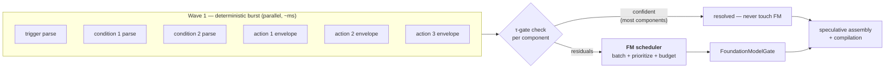

# Automation Creation — Parallelism Review & Latency-Reduction Strategy

> **Scope**: Re-review of the automation-creation pipeline (post Phases A–H) focused on where
> multi-action / multi-condition requests spend time, and a concrete strategy for orchestrating
> agents in parallel to reduce end-to-end latency.
> **Method**: Code-level review of `AutomationComponentFanOutRunner`, `AutomationActionResolver`,
> the τ-gated worker sessions, `FoundationModelGate`, and `VerifierLoopOrchestrator`, plus a
> latency model built on FM-call counts.
> **Companion docs**: [AgenticArchitecture.md](AgenticArchitecture.md) §6/§9,
> [AutomationCreationRedesign.md](AutomationCreationRedesign.md), [task.md](task.md).

---

## 1. The One Fact That Governs Everything

From [FoundationModelGate.swift](../HomeAutomationCore/Sources/HomeAutomationCore/Telemetry/FoundationModelGate.swift):

> *"The on-device Foundation Model **serializes inference internally**, so unbounded concurrent
> requests only hide queue wait inside apparent model latency."*

The FM is effectively a **single serialized resource** (the gate's `maxConcurrent = 2` overlaps
prefill/decode phases at best — it does not double throughput). Therefore:

- **Adding task-level concurrency to FM-bound agents cannot reduce latency.** Ten concurrent
  FM-calling tasks still execute ~serially; concurrency only relabels queue wait.
- End-to-end latency of an automation run is, to first order:

  ```
  T ≈ T_deterministic (ms, parallelizable) + N_fm × F + overheads
  ```

  where `N_fm` = number of FM calls on the run and `F` = one call's latency (prefill + decode,
  roughly 0.8–2.5 s on-device; NLU-class soft budget is 4 s).

So the strategy has exactly four levers, in order of power:

| Lever | Mechanism |
|---|---|
| **L1 — Fewer FM calls** | τ-gates, Tier 1, verification instead of generation |
| **L2 — Fewer, bigger FM calls** | batch K small component resolutions into 1 constrained call |
| **L3 — Shorter FM calls** | session/prefix reuse (stop re-prefilling instructions per call), tighter prompts |
| **L4 — Never let FM wait on non-FM work (and vice versa)** | two-wave scheduling, speculation, pipelining, SJF admission |

Everything below is these four levers applied to specific bottlenecks found in the code.

---

## 2. Where Time Goes Today — Pipeline Anatomy

The production automation graph is strictly staged:

```
segmentation  →  componentFanOut  →  draftAssembly → validation → compilation → ruleCreation → resultAssembly
   (≤1 FM)         (all FM here)        (0 FM)          (0 FM)        (0 FM)       (backend)       (0 FM)
```

Everything after fan-out is deterministic and takes milliseconds. **The run's latency is
segmentation + fan-out.**

### 2.1 What the fan-out actually does ([AutomationComponentFanOutRunner.swift](../HomeAutomationCore/Sources/HomeAutomationOrchestrator/Automation/AutomationComponentFanOutRunner.swift))

One `withTaskGroup` spawns **every component simultaneously** — trigger + all actions + all
conditions, no cap at this level:

- **Trigger** → `AutomationTriggerResolutionWorkerSession` — deterministic parse first, FM only
  if confidence < 0.8 (τ-gate). Schedule triggers ("every day at 7pm") almost always pass the
  gate → **0 FM**.
- **Condition (each)** → `AutomationConditionClauseResolutionWorkerSession` — τ-gate at 0.8 →
  **0–1 FM per clause**.
- **Action (each)** → `actionResolver.resolve(...)`:
  - *Without Tier 1 (today's default)*: a **full direct-command subgraph** per action —
    semantic NLU, slot extraction, risk, knowledge/RAG, ranking, capability resolution, draft
    generation, safety… ≈ **5–8 FM calls per action**.
  - *With Tier 1 (`useMiniPipeline`)*: deterministic envelope + at most one
    `CapabilityResolutionWorker` call → **0–1 FM per action**.

### 2.2 Concurrency defects and gaps found

| # | Finding | Where | Effect |
|---|---|---|---|
| P1 | **Sequential repairs in the verifier loop.** Pre-verify repairs and per-iteration repairs run in `for step in plan.steps { await … }` even though the planner guarantees disjoint fields per step. | `VerifierLoopOrchestrator.swift:72,224` | Up to 2 extra serialized FM calls per iteration (max 3 repair steps/iteration) |
| P2 | **The A8 action-concurrency cap is bypassed on the fan-out path.** `maxConcurrentActions = 2` lives in `resolveAll`, but the fan-out runner calls single-action `resolve()` per task — N actions launch N concurrent full subgraphs. CPU-side fan-out is unbounded; only the FM gate throttles. | `AutomationComponentFanOutRunner.swift:191` vs `AutomationActionResolver.swift:157` | Uncontrolled CPU/context pressure; worse, see P3 |
| P3 | **FIFO gate + interleaved multi-call pipelines = worst-case completion order.** N action subgraphs each needing ~6 sequential FM calls interleave round-robin at the gate, so *all* actions finish near the end (`maxCompletion ≈ total work` for every component). Short single-call components (conditions) queue behind long pipelines. | `FoundationModelGate` (FIFO) | Mean component latency is maximized; a 1-call condition can wait behind 12 action calls |
| P4 | **A fresh `LanguageModelSession` per FM call.** Segmentation, trigger, and condition workers each construct a new session inside `resolve()` — the instruction block is re-prefilled on every call. | e.g. `AutomationConditionClauseResolutionWorkerSession.swift:48` | Pays instruction-prefill cost × every call; no prefix cache reuse |
| P5 | **Segmentation is a serial head-of-line stage.** Fan-out cannot start until segmentation completes, even though the deterministic `AutomationPatternParser` already produced a component plan in milliseconds — the FM call (when τ < 0.88) only *confirms or adjusts* it. | graph edge `segmentation → componentFanOut` | +1 F of dead time before any component starts, in exactly the complex cases that also have the most components |
| P6 | **No clarification short-circuit.** If one component resolves to "needs clarification" (ambiguous device), the run's outcome is already decided — yet all other components keep burning FM calls before the user is asked. | fan-out runner (no cancellation) | Wasted FM work delays the clarification response |
| P7 | **K low-confidence conditions cost K FM calls.** Each clause is resolved in its own call with its own session, though clauses are tiny (one comparison each) and share the same instruction context. | condition worker per-component | K × F where ~1 × F would do |

---

## 3. Case Analysis

`F` ≈ one FM call (0.8–2.5 s). `ε` = deterministic work (1–30 ms, fully parallel, ignorable).
"Serialized FM" ≈ wall-clock lower bound given the gate's effective serialization.

### Case A — simple schedule automation
*"Turn on the bedroom lamp every day at 7 PM"* — 1 trigger + 1 action, everything confident.

| Path | FM calls | Serialized FM | Notes |
|---|---|---|---|
| Graph (today) | seg 0–1 + action 5–8 | **5–9 F ≈ 8–20 s** | The single action pays a full subgraph |
| Graph + Tier 1 | 0 | **≈ ε (sub-second)** | Everything τ-gates |
| Verifier loop | 1 (verify) | **≈ 1 F** | Envelope + 1 verify call |

### Case B — multi-action schedule
*"At 7 PM turn on the lamp, turn off the AC, and close the blinds"* — 1 trigger + 3 actions.

| Path | FM calls | Serialized FM |
|---|---|---|
| Graph (today) | 3 × (5–8) + seg ≈ **16–25** | **≈ 25–45 s** ← the complaint |
| Graph + Tier 1 | ≤ 3 (only τ-failing actions) | **0–3 F ≈ 0–7 s** |
| Verifier loop | 1 verify + ≤3 repairs (sequential today) | **1–4 F** |

### Case C — conditions + actions (the stress case)
*"Every day at 6 PM, if the living-room temperature is above 25 and humidity is above 60, turn
on the AC and the fan"* — trigger + 2 conditions + 2 actions.

| Path | FM calls | Serialized FM |
|---|---|---|
| Graph (today) | seg 1 + cond ≤2 + 2×(5–8) ≈ **13–19** | **≈ 20–40 s** |
| Graph + Tier 1 | seg ≤1 + cond ≤2 + act ≤2 = **≤5** | **≤ 5 F**, and P3 means the two 1-call conditions may still queue behind action calls |
| Loop (after H2) | 1 verify + ≤3 repairs | **1–4 F** |

### Case D — device trigger
*"When the front door opens after 10 PM, turn on the porch light"*. Same shape as C on the
graph path. The loop path now carries a structured device-trigger condition and can draft this
case as well, so future latency work should compare all three arms rather than treating graph
as the only full server. Graph-path latency work still matters because graph remains the
broadest coverage and escalation reference.

**Reading of the cases:** the dominant term is always `N_actions × subgraph_cost`. Tier 1
removes that term (L1) — it is the single biggest lever and it is already implemented and
behind a flag. Everything else in this document is about (a) the residual FM calls after Tier 1,
(b) scheduling those residuals well, and (c) the loop path's sequential repairs.

---

## 4. The Strategy — Orchestrating Agents in Parallel

Design principle: **split every component into a deterministic phase (parallelize freely) and an
FM phase (schedule scarce slots deliberately)** — instead of today's model where each component
is an opaque task that *might* call the FM at an unpredictable point.

### 4.1 Two-wave component scheduling (replaces the flat fan-out)



**Wave 1** runs every component's deterministic parser concurrently (pure CPU — the mini-pipeline
envelope, trigger/condition pattern parses). This takes milliseconds and yields, for each
component, either a confident result or a *residual* with a known prompt.

**Wave 2** hands the residual set to an FM scheduler that, unlike today's "whoever hits the gate
first," has **global knowledge**: how many residuals exist, their kinds, their prompt sizes, and
the run's remaining latency budget. That enables batching (4.2), prioritization (4.4), and
budget-aware degradation (accept the deterministic result with a clarification rather than queue
a 6th FM call).

This also fixes P2 structurally: Wave 1 is CPU-bounded by a task-group cap (e.g. 4–8);
Wave 2 is bounded by the gate. No component-count-dependent explosion.

### 4.2 Batch the small calls (L2) — biggest post-Tier-1 win

K low-confidence condition clauses are currently K sessions × K calls (P7). They share
instructions and each produce one small comparison. Resolve them in **one constrained call**:

- Prompt: the user text + the K clause fragments + candidate tables.
- Output: `DynamicGenerationSchema` array (max K elements) of per-clause results — exactly the
  pattern `DraftVerdictSchema` already uses for disputes (≤6, closed enums).
- Per-item confidence in the output; any item below τ falls back to its deterministic parse
  individually — batching does not weaken failure isolation.

Same treatment for *trigger + conditions* in one call when both are residual, and for multiple
Tier-1 action escalations (batch capability resolution across actions: the candidate tables are
small and disjoint).

Effect on Case C residuals: `seg 1 + cond 2 + act 2 = 5 calls → seg 1 + 1 batched(cond+cond) +
1 batched(act+act) = 3 calls`, i.e. **~40 % fewer FM calls at the same accuracy floor** (each
item still has its deterministic fallback).

### 4.3 Session reuse & pre-warming (L3)

Fix P4: give each worker kind a **long-lived session** (or a small pool sized to the gate) with
instructions prefilled once, and send per-component delta prompts — the verifier loop already
proves this pattern (`verifier.makeSession()` reused across iterations). Additionally,
**pre-warm** sessions during Wave 1: session creation and instruction prefill for the kinds that
have residuals can start while deterministic parsing is still running, so Wave 2's first token
isn't paying prefill.

Expected effect: removes the instruction-prefill fraction from every FM call — typically
20–40 % of short-call latency.

### 4.4 Shortest-job-first admission with a critical-path lane (fixes P3)

Extend `FoundationModelGate.admit()` with a priority band:

```swift
enum FMPriority { case interactive   // short single-shot: conditions, trigger, segmentation, verify
                  case pipeline }    // long multi-call subgraph work
```

- Two FIFO queues; `interactive` drains first (shortest-job-first minimizes mean completion and
  never meaningfully delays a long pipeline).
- Reserve one of the two slots for `interactive` whenever both queues are non-empty, so a 1-call
  condition can't sit behind 12 queued action-subgraph calls.
- Keep the existing invariants (paired release, cancellation over-admit).

This is a scheduling-only change — no agent behavior changes, immediately measurable via the
existing `fmQueueWaitMs` telemetry split by the new priority label.

### 4.5 Parallel repairs in the verifier loop (fixes P1)

`RepairPlanner` already guarantees steps target disjoint fields (grouped by specialist, latched
fields excluded). Execute each iteration's steps in a bounded task group instead of a `for`
loop, then merge results in deterministic (specialist-priority) order to keep `EnvelopeMerger`
application order stable:

```
before:  verify → repair₁ → repair₂ → repair₃ → verify   (4–5 F serialized)
after:   verify → [repair₁ ∥ repair₂ ∥ repair₃] → verify (≈ 3 F wall-clock)
```

Same change for the pre-verify zero-confidence repair pass. Risk raises are deterministic and
stay synchronous. Note the gate still serializes the FM-backed repairs — the win is bounded by
how many repairs are deterministic (target/risk/operation are; fragment-NLU/capability aren't) —
but merging concurrency + SJF means deterministic repairs no longer wait on FM ones at all.

### 4.6 Speculative segmentation overlap (fixes P5)

When the pattern parser's segmentation confidence is below τ (0.88) the FM confirmation call
blocks the entire fan-out today. Instead:

1. Start Wave 1 **immediately** on the deterministic component plan.
2. Run the segmentation FM call concurrently.
3. When it returns: diff the plans. Identical (the common case — the FM usually confirms) →
   Wave 1 results are already done; different → cancel/redo only the changed components.

Deterministic Wave 1 work is cheap to discard, so mis-speculation costs ~nothing; correct
speculation hides a full `F` at the head of every complex run.

### 4.7 Clarification short-circuit (fixes P6)

The fan-out task group should watch for any component resolving to `needsClarification` and
**cancel outstanding FM work immediately** (deterministic parses may finish — they're free).
The user is going to be asked a question regardless; every queued FM call after that point is
pure added latency to that question. On answer, only the clarified component re-resolves —
already-resolved components are reused from the context store.

### 4.8 Speculative assembly & compilation

Draft assembly, validation, and SmartThings compilation are deterministic and cheap (§2). Run
them **speculatively on Wave 1 results** the moment all components have deterministic outputs.
If Wave 2 changes nothing (all τ-gates passed or FM confirmed), the compiled Rules JSON is
already sitting there — the run ends at Wave 1 speed. If a component changes, recompile (ms).
This turns the tail of the pipeline into free work that overlaps the FM phase entirely.

---

## 5. Projected Impact (Case C: trigger + 2 conditions + 2 actions)

| Configuration | FM calls | Est. wall-clock |
|---|---|---|
| Graph today (no Tier 1) | 13–19 | 20–40 s |
| + Tier 1 default (L1, existing flag) | ≤ 5 | ≤ 8 s |
| + batching (4.2) | ≤ 3 | ≤ 5 s |
| + session reuse / pre-warm (4.3) | ≤ 3 (each ~30 % shorter) | ≤ 3.5 s |
| + speculative segmentation + speculative compile (4.6, 4.8) | ≤ 2 on critical path | **≤ 2.5 s** |
| Fully-confident inputs (all τ-gates pass) | 0 | **< 1 s** |
| Verifier loop w/ parallel repairs (4.5) | 1 verify + ∥ repairs | ~2–3 F worst, 1 F typical |

(Ranges assume F ≈ 1–2.5 s; validate against `fmQueueWaitMs` / `componentFanOutDurationMs`
telemetry before/after each phase.)

---

## 6. Phased Implementation Plan

| Phase | Items | Risk | Depends on |
|---|---|---|---|
| **I — scheduling only, no behavior change** | 4.4 SJF gate lanes · 4.5 parallel loop repairs · CPU cap on fan-out task group (fix P2) · per-kind `fmQueueWaitMs` telemetry | Low — outputs identical, order-independent merges | — |
| **II — two-wave fan-out** | 4.1 deterministic wave + FM scheduler · 4.7 clarification cancellation · Tier 1 as the fan-out's Wave-1 action path | Medium — new scheduler replaces flat task group; behavior gated by existing exit criteria (`--compare-orchestration`) | Phase I telemetry |
| **III — call reduction** | 4.2 batched condition/trigger/capability calls (constrained array schemas) · 4.3 session pools + pre-warming | Medium — new prompts/schemas need shadow evaluation (reuse `VerifierShadowRunner` pattern) | II |
| **IV — speculation** | 4.6 segmentation overlap · 4.8 speculative assembly/compile | Medium — needs plan-diff + cancellation correctness | II |

Rollout guard: every phase must hold the existing Phase G exit gates (accuracy ≥ baseline,
clarification delta ≤ 3 pts, safety-gate parity) on `--compare-orchestration`, now that the arms
genuinely differ. Phase I is safe to start immediately.

---

## 7. What *Not* To Do

- **Don't raise `FoundationModelGate.maxConcurrent`.** The model serializes internally; a higher
  cap converts visible queue wait into invisible inference slowdown and breaks the SJF lane math.
- **Don't parallelize the direct-command subgraph's internal nodes further** — its phases are
  already fanned out (§5.1 of AgenticArchitecture.md), and its cost problem is call *count*,
  which Tier 1 solves by replacing it.
- **Don't batch across unrelated runs** (multi-user batching) — session state and safety
  provenance are per-run; the complexity isn't worth it on-device.
