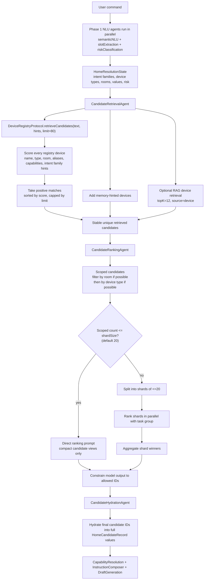
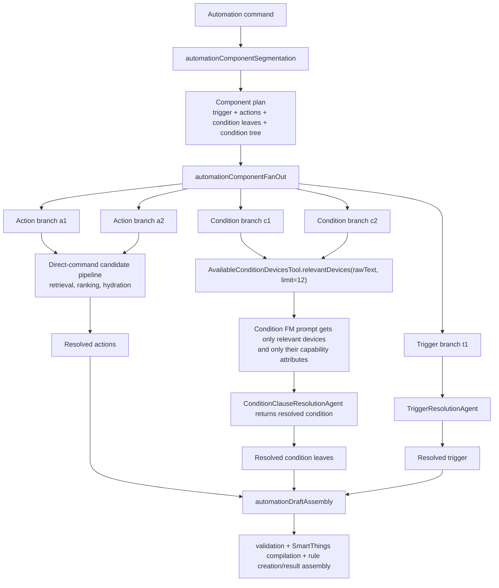

# Candidate Device Filtering And FoundationModel Context Control

This document explains how this project narrows device candidates before asking FoundationModels to reason about them. The goal is not to hide device choice from the model. The goal is to keep the model focused on a small, relevant candidate set so it can make a better decision without exceeding its context window.

The project uses the same principle in multiple places:

1. Build normalized `HomeCandidateRecord` values from a registry.
2. Use deterministic scoring, NLU hints, memory, and optional RAG to retrieve a candidate pool.
3. Send only compact candidate views to candidate-ranking model calls.
4. Hydrate only final selected candidate IDs into full records.
5. For large candidate pools, shard and rank in parallel.
6. For automation condition leaves, independently narrow available devices per condition clause before building the condition FoundationModel prompt.

## Key Files

- `HomeAutomationCore/Sources/HomeAutomationCore/HomeAutomation/DeviceRegistryProtocol.swift`
- `HomeAutomationCore/Sources/HomeAutomationCore/HomeAutomation/MockHomeDeviceRegistry.swift`
- `HomeAutomationCore/Sources/HomeAutomationCore/HomeAutomation/SmartThingsDeviceRegistry.swift`
- `HomeAutomationCore/Sources/HomeAutomationAgents/Candidates/Retrieval/CandidateRetrievalAgent.swift`
- `HomeAutomationCore/Sources/HomeAutomationAgents/Candidates/Support/CandidateFilter.swift`
- `HomeAutomationCore/Sources/HomeAutomationAgents/Candidates/Support/CandidateResolverSupport.swift`
- `HomeAutomationCore/Sources/HomeAutomationAgents/Candidates/Support/CandidatePromptBuilder.swift`
- `HomeAutomationCore/Sources/HomeAutomationAgents/Candidates/Hydration/CandidateHydrationAgent.swift`
- `HomeAutomationCore/Sources/HomeAutomationAgents/Automation/ConditionClauseResolution/Tools/AvailableConditionDevicesTool.swift`
- `HomeAutomationCore/Sources/HomeAutomationAgents/Automation/ConditionClauseResolution/AutomationConditionClauseResolutionPromptBuilder.swift`
- `HomeAutomationCore/Sources/HomeAutomationCore/HomeAutomation/FoundationModelContextBudgeter.swift`

## Data Model

Every candidate device becomes a `HomeCandidateRecord`.

Important fields:

- `id`: stable internal device ID.
- `displayName`: user-visible name.
- `deviceType`: canonical project type such as `light`, `lock`, `airConditioner`, `tv`.
- `room`: optional room name.
- `capabilities`: SmartThings or canonical capability IDs.
- `supportedCommands`: allowed commands per capability.
- `supportedModes`: known mode values.
- `currentState`: flattened attribute state.
- `metadata`: aliases, SmartThings IDs, inferred type evidence, etc.
- `riskLevel`: derived from capabilities.

For model candidate ranking, the system usually sends `HomeCompactCandidateView`, not the full record:

```text
id, label, room, deviceType, shortCapabilities
```

Full records are introduced later, after candidate ranking has selected final IDs.

## Flow Diagram: Direct Command Candidate Filtering



## Flow Diagram: Automation Creation Candidate Filtering

Automation creation has two candidate filtering shapes: action components reuse the direct-command pipeline, while condition components use condition-leaf-specific filtering.



For this input:

```text
Turn on bedroom AC and turn off the bedroom lamp every day at 7 AM
if front door is locked or living room light is off
```

The expected component-level candidate behavior is:

- `action:a1` runs the direct-command pipeline for `Turn on bedroom AC`.
- `action:a2` runs the direct-command pipeline for `Turn off the bedroom lamp`.
- `condition:c1` narrows devices for `front door is locked`, putting `front_door_lock` first.
- `condition:c2` narrows devices for `living room light is off`, keeping living-room switch-capable lights near the top.
- `trigger:t1` resolves the schedule and does not need device candidate filtering.

## Stage 1: Registry Normalization

The system depends on `DeviceRegistryProtocol`, not on a specific backing source.

The protocol exposes:

```swift
func allDevices() async -> [HomeCandidateRecord]
func retrieveCandidates(text: String, hints: HomeResolutionState, limit: Int) async -> [HomeCandidateRecord]
func executeLowRiskPlan(_ plan: HomeAutomationExecutionPlan) async throws -> HomeCandidateRecord
```

There are currently two registry implementations:

- `MockHomeDeviceRegistry`: in-memory catalog used by default.
- `SmartThingsDeviceRegistry`: REST-backed registry that maps SmartThings devices, rooms, capabilities, status, and metadata into `HomeCandidateRecord`.

`SmartThingsDeviceRegistry` also prevents raw SmartThings payloads from leaking directly into prompts. It maps external fields into compact internal fields:

- SmartThings components -> capability IDs.
- Room IDs -> room names.
- device status -> flat attribute dictionary.
- categories/device type/profile/presentation/name/capability signatures -> canonical `deviceType` through `HomeDeviceTypeInferencer`.
- capability risk -> `riskLevel`.

This is the first context-control boundary: external API payloads can be large and irregular, but the agents see normalized records.

## Stage 2: Initial Registry Retrieval

`CandidateRetrievalAgent` calls:

```swift
registry.retrieveCandidates(text: input.text, hints: input.state, limit: input.limit)
```

The default limit is `80`.

The registry scoring uses:

- command text normalized into token text;
- NLU rooms from `slots.rooms`;
- NLU device types from `deviceType.deviceTypes`;
- NLU device nicknames;
- intent families such as `power`, `brightness`, `temperature`, `lockUnlock`, `openClose`;
- device display name;
- room;
- device type;
- metadata aliases;
- capabilities.

Examples of score boosts:

- Query contains full device name.
- Query contains device type.
- Query contains room.
- Alias matches.
- NLU hinted type matches device type.
- NLU hinted room matches device room.
- Power intent boosts devices with `switch`.
- Brightness intent boosts devices with `switchLevel`.
- Temperature intent boosts thermostat/temperature/air-conditioner capabilities.
- Lock/unlock intent boosts devices with `lock`.
- Open/close intent boosts door/window/valve capabilities.

The registry returns sorted positive matches, capped by `limit`. If nothing scores above zero, it returns the first `limit` devices as a fallback so the downstream agent can ask clarification instead of failing due to an empty catalog.

## Stage 3: Memory And RAG Expansion

`CandidateRetrievalAgent` can merge in two additional sources:

- conversation memory hinted device IDs;
- optional RAG device chunks.

When a `ContextRetriever` is available, it builds a semantic query from:

- raw user text;
- slots rooms;
- device nicknames;
- device type hints;
- intent families;
- memory device IDs;
- memory capability hints.

It retrieves up to `12` chunks from the `device` source. Those chunk device IDs are mapped back to full records from `allDevices()`.

The final retrieved pool is:

```text
registry-scored candidates + RAG device candidates + memory candidates
```

Then `stableUnique(..., by: id)` removes duplicates without changing first-seen priority.

This is intentionally a recall step, not the final decision. It tries to keep likely candidates available without flooding the model.

## Stage 4: Candidate Scoping Before Model Ranking

`CandidateRankingAgent` delegates to `HomeCandidateResolverSupport`.

Before any FoundationModel ranking call, it applies `scopedCandidates`:

1. If NLU found rooms, keep candidates matching those rooms when at least one match exists.
2. If NLU found device types, keep candidates matching those types when at least one match exists.

The room match is forgiving:

- exact candidate `room` match;
- candidate label contains the room;
- candidate ID contains the room.

The key design point: room/type scoping only applies if it would not empty the candidate list. That keeps the system robust when NLU is imperfect.

Example:

```text
Turn off the bedroom lamp
```

Likely state:

- room: `bedroom`
- device type: `light`

So candidates are narrowed to bedroom items first, then light items. The model ranks a tiny list rather than the full home.

## Stage 5: Direct Ranking Or Parallel Sharded Ranking

`HomeCandidateResolverSupport` uses `shardSize = 20`.

If the scoped candidate count is `<= 20`, it uses one direct ranking prompt.

If the scoped candidate count is `> 20`, it:

1. splits candidates into shards of at most 20;
2. ranks each shard in parallel with `withThrowingTaskGroup`;
3. aggregates the shard winners.

This is one of the biggest context-window protections in the project. A home may have many devices, but each model call sees only one shard.

The shard model output is constrained:

- selected IDs must come from the shard;
- maximum selected IDs is 3;
- rejected IDs are also from the shard.

The aggregation step only sees shard selections, not every raw candidate record. If one shard has a clear high-confidence winner and beats the runner-up shard by enough margin, the code can return that clear winner without another model call.

## Stage 6: Deterministic Fallback And Model Constraining

The candidate ranker always computes deterministic aggregation first.

The deterministic fallback scores compact candidates using:

- exact label match;
- type match;
- room match;
- token overlap between command and label;
- intent-family capability boosts;
- memory device hints;
- memory capability hints.

If FoundationModels are unavailable or throw, deterministic aggregation is returned.

If FoundationModels respond, the result is still constrained:

- final candidate IDs are filtered to IDs that were actually provided;
- if the model invents IDs, the system falls back;
- if multiple candidates remain, clarification is required.

The model is allowed to decide among candidates, but it is not allowed to expand the candidate universe.

## Stage 7: Prompt Compaction For Candidate Ranking

`CandidateResolutionPromptBuilder` builds multiple prompt variants and chooses the first one that fits `FoundationModelContextBudgeter`.

Candidate ranking prompt variants:

1. `full`: full compact-candidate descriptions plus full hints.
2. `compactCandidates`: fewer candidate fields and shorter hints.
3. `minimal`: IDs, labels, type, and room only.

The budgeter defaults:

- `maxContextSize = 4096`
- `reservedTokenCount = 896`
- prompt budget is therefore roughly `3200` estimated input tokens.

The estimate includes:

- instruction text;
- prompt text;
- tool descriptors;
- estimated tool output characters.

The candidate ranker can therefore degrade the prompt before it hits the model. If all variants exceed the budget, the builder still returns the smallest fallback variant.

## Stage 8: Hydration After Selection

`CandidateHydrationAgent` runs after candidate ranking.

Input:

```swift
CandidateHydrationInput(candidateIDs: aggregation.finalCandidateIDs)
```

It loads all devices from the registry and returns only records whose IDs are selected.

This is another context-window boundary:

- ranking sees compact candidates;
- draft generation sees only selected hydrated records.

For a normal command like:

```text
Turn on bedroom AC
```

Draft generation typically sees one full record:

```text
bedroom_ac
```

It does not see every light, lock, sensor, outlet, TV, and appliance in the home.

## Stage 9: Instruction Composition And Final Draft Prompt Budgeting

After hydration, `InstructionComposerAgent` builds the prompt for `DraftGenerationAgent`.

This prompt includes:

- the user command;
- NLU worker outputs;
- final candidate IDs;
- the capability decision, if one exists;
- hydrated candidate records;
- selected RAG context;
- tools that can inspect or hydrate device data.

It also uses context-budget variants:

1. `full`
2. `dropExamples`
3. `dropBixby`
4. `dropCapabilities`
5. `compactCandidates`
6. `minimal`

These variants progressively remove or compact expensive sections:

- RAG examples;
- Bixby command context;
- capability knowledge;
- full hydrated candidate records;
- candidate fields.

The final model prompt is therefore the smallest sufficient package, not a dump of the whole system state.

## Tool Output Limits

The draft model can use tools, but tool output is also bounded.

`AgentFindDevicesTool`:

- searches all devices by query, room, and device type;
- returns at most 25 records;
- default limit is 12;
- output is formatted as compact JSON lines.

`AgentHydrateCandidatesTool`:

- hydrates only requested IDs;
- maximum guided candidate ID count is 25.

`AgentToolFormatting` caps formatted output at `4_000` characters.

`AgentToolProvider` estimates tool output size and feeds that estimate into `FoundationModelContextBudgeter`, so prompts reserve room for tool results before the model starts.

## Automation Condition Device Filtering

Automation conditions are different from action commands. A condition leaf is usually a short fragment:

```text
front door is locked
living room light is off
entry contact sensor is closed
```

The active automation creation graph segments the command first, then runs each component in parallel:

```text
automationComponentSegmentation
  -> automationComponentFanOut
       -> action branches use direct-command candidate filtering
       -> condition branches use condition-specific relevantDevices filtering
       -> trigger branch resolves schedule/device trigger
```

`AutomationComponentFanOutRunner` passes all registry devices into each condition branch. The condition branch does not put all of them into the model prompt. Instead:

```swift
AvailableConditionDevicesTool.relevantDevices(
    from: input.availableDevices,
    matching: input.component.rawText,
    limit: 12
)
```

The scoring for condition-relevant devices uses:

- normalized condition text;
- condition subject extracted by removing state suffixes such as `is locked`, `is off`, `is closed`;
- display name contains subject;
- subject token overlap with display name;
- device type;
- room;
- state/capability words:
  - `locked` / `unlocked` -> devices with `lock`;
  - `open` / `closed` -> contact/door/garage/window-shade devices;
  - `on` / `off` -> switch devices;
  - `motion` -> motion sensors;
  - `temperature` -> temperature measurement;
  - `contact` -> contact sensors.

The condition prompt then includes:

- full user command;
- one condition component ID and raw text;
- trigger policy;
- relevant available devices only;
- capability attributes only for those relevant devices;
- deterministic hint as fallback guidance.

This directly addresses the failure mode where a condition prompt used to include the entire device catalog and exceeded the FoundationModel context window.

## Example: Locked Door OR Light Off

Input:

```text
Turn on bedroom AC and turn off the bedroom lamp every day at 7 AM
if front door is locked or living room light is off
```

Segmentation produces:

```text
trigger:t1    every day at 7 AM
action:a1     Turn on bedroom AC
action:a2     Turn off the bedroom lamp
condition:c1  front door is locked
condition:c2  living room light is off
conditionTree or([leaf("c1"), leaf("c2")])
```

Candidate filtering by component:

| Component | Filtering path | Candidate effect |
| --- | --- | --- |
| `action:a1` | direct-command retrieval/ranking/hydration | selects `bedroom_ac` |
| `action:a2` | direct-command retrieval/ranking/hydration | selects `bedroom_lamp` |
| `condition:c1` | condition `relevantDevices` | ranks `front_door_lock` first, includes `lock` capability attributes |
| `condition:c2` | condition `relevantDevices` | ranks living-room switch-capable lights, includes `switch` capability attributes |
| `trigger:t1` | trigger resolution | resolves schedule `everyDay` at `07:00` |

The model never needs a prompt containing every device in the registry for `condition:c1`. It only needs enough relevant lock/door candidates to choose the correct operand.

## How Context Window Limits Are Bypassed

The project does not truly bypass the FoundationModel context window. It designs around it.

The main techniques are:

### 1. Normalize And Pre-filter Outside The Model

Registry data is transformed into compact `HomeCandidateRecord` values. Candidate retrieval is deterministic and cheap, so large raw catalogs are narrowed before model calls.

### 2. Send Compact Views Before Full Records

Candidate ranking receives `HomeCompactCandidateView` instead of full stateful records. Full records are only hydrated after IDs are selected.

### 3. Scope By Strong NLU Signals

Room and device type filters are applied before model ranking, but only when they retain at least one candidate. This removes noise without creating hard failures from imperfect NLU.

### 4. Shard Large Candidate Pools

Candidate ranking splits large candidate sets into shards of at most 20. Each shard gets its own model call, and shard calls run in parallel. The aggregator sees only selected IDs, not the whole catalog.

### 5. Use Budget-aware Prompt Variants

Prompt builders estimate tokens and progressively compact:

- candidate descriptions;
- NLU hints;
- RAG context;
- knowledge sections;
- tool output reservations.

### 6. Constrain Model Output

Dynamic schemas and post-processing ensure the model returns only IDs that were provided. Invented IDs are rejected or fallback logic is used.

### 7. Cap Tool Results

Tools return capped compact JSON lines. Tool output size is estimated and included in context budget calculations.

### 8. Resolve Automation Components Independently

Automation creation decomposes the command into trigger/action/condition components. Each condition leaf builds its own small prompt. Each action runs its own direct-command graph. This avoids one giant prompt containing all actions, all conditions, all devices, and all capabilities.

### 9. Keep Deterministic Fallbacks

When the model is unavailable or a prompt still fails, deterministic fallback keeps the pipeline from losing a component. For example, `front door is locked` can now resolve to:

```text
deviceID: front_door_lock
capability: lock
attribute: lock
value: locked
```

## Important Tradeoffs

The system is intentionally hybrid:

- Deterministic filters control prompt size and prevent runaway context.
- FoundationModels choose among relevant candidates where available.
- Fallbacks preserve behavior when FoundationModels are unavailable.

The main risk is over-filtering. The code mitigates this by:

- applying room/type scoping only when matches exist;
- merging memory and RAG candidates into retrieval output;
- using candidate shards instead of discarding large candidate pools;
- retaining deterministic fallback if the model fails;
- letting tools find/hydrate candidates during final draft generation.

The main performance benefit is that expensive model calls work on small, useful inputs. For automations, action and condition branches also run independently, so component-level candidate filtering happens concurrently.

