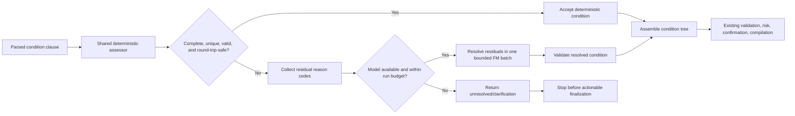

# Conditional Automation Creation Latency: Analysis and Implementation Plan

Status: proposed

Scope: automation creation with conditions across Graph, Graph + Tier-1, Verifier Loop, Adaptive Static, and Adaptive Shadow

Primary objective: reduce condition-related p50 and p95 latency without weakening condition semantics, validation, confirmation, or SmartThings compilation safety

## 1. Executive summary

The largest latency problem is not that conditions are inherently expensive. It is that the current implementation often converts one otherwise deterministic condition into an avoidable Foundation Model (FM) call, places that call on the automation fan-out critical path, and then routes every conditional Adaptive Static automation to the full Graph arm.

The most important confirmed defect is a confidence-gate contradiction:

- `AutomationConditionClauseResolutionWorkerSession` uses a production deterministic acceptance threshold of `0.80`.
- Its deterministic single-condition result is always assigned `0.72`.
- Therefore, when the model is available, one condition cannot pass the deterministic gate and normally invokes FM.
- `BatchedConditionClauseResolver`, used for two or more conditions, can assign `0.84` when a device is resolved.
- Consequently, one simple condition can require one FM call while two simple conditions require none.

This discontinuity affects all paths that reuse condition repair or resolution. It is especially visible in Graph + Tier-1, where simple actions are normally deterministic and the condition FM call becomes most of the critical path.

The fix must not be a blind confidence increase from `0.72` to `0.84`. Both single and batched deterministic paths can fall back to a generic readable capability, and a structurally populated condition is not necessarily semantically correct. The safe design is one shared, completeness-aware deterministic condition assessor that accepts only an unambiguous, catalog-valid, round-trip-safe condition. Everything else remains an FM residual or becomes an explicit clarification.

The recommended implementation order is:

1. Make the measurements trustworthy and cover all five strategies.
2. Replace the divergent single/batch confidence heuristics with one safe deterministic assessor.
3. Bound and schedule residual condition FM work so it cannot dominate the fan-out tail.
4. Remove the Adaptive Static condition routing cliff for a narrowly eligible cohort.
5. Reuse the shared condition representation in Verifier Loop and remove avoidable repair cycles.
6. Roll out by shadow cohort, then canary, with exact semantic and compilation parity gates.

## 2. Current execution paths by strategy

### 2.1 Graph

The Graph path performs root routing, segmentation, component fan-out, assembly, validation, compilation, and rule finalization. During fan-out it resolves the trigger, every action, and conditions, then waits for all component work before assembly.

Conditional latency is amplified by four details:

- A single condition normally invokes FM because its deterministic confidence cannot reach the production threshold.
- Graph actions may also invoke multi-step FM subgraphs.
- Conditions and action subgraphs share `FoundationModelGate`, whose production capacity is two.
- Fan-out queues the trigger and actions before conditions, so a condition can start late when the component cap is occupied.

The condition therefore contributes both its own service time and queue/tail time. Since assembly cannot proceed until every component completes, the slowest condition is on the critical path.

Expected outcome after this plan: complete deterministic conditions add no condition FM calls; residual conditions start early, are batched, have bounded queue/service time, and preserve current validation and compilation behavior.

### 2.2 Graph + Tier-1

Graph + Tier-1 uses the same automation graph and condition resolver as Graph. Tier-1 changes action resolution through `AutomationActionMiniPipeline`; it does not provide a separate condition implementation.

This makes the current regression more pronounced:

- A simple no-condition schedule can resolve its action without FM.
- Adding one complete condition introduces the condition FM call.
- That single call can become nearly the entire creation latency.

There is also hidden coupling in strategy selection: fan-out calls the action resolver without passing the strategy explicitly, and correct behavior depends on the separately constructed Tier-1 registry. The plan adds an end-to-end assertion that a Tier-1 conditional action did not run an action subgraph.

Expected outcome after this plan: this becomes the preferred execution arm for narrowly eligible, low/medium-risk conditional schedule automations.

### 2.3 Verifier Loop

Verifier Loop creates a deterministic draft envelope, repairs zero-confidence required fields, invokes a holistic verifier, repairs disputes, and re-verifies. It can then escalate to the legacy Graph path.

A conditional automation can currently have four cost shapes:

1. A fully represented condition: verifier call only.
2. An incomplete condition: condition repair, then verifier.
3. A disputed condition: repair and another verifier iteration.
4. A stalled or exhausted loop: all preceding calls, then the full Graph workload.

The loop's deterministic parser recognizes only a narrow group of state values. Numeric comparisons, ranges, changes, and several common sensor states can enter pre-verification repair even though the Graph condition parser has richer deterministic support. Other amplifiers are:

- Pre-repaired fields are not latched in a way that prevents an identical no-op repair.
- The final iteration may perform repairs even though no subsequent verification can accept them.
- Optional absent trigger fields can be treated like required zero-confidence fields.
- The verifier has a soft timeout, but condition repair does not have an equivalent local service bound.
- The configured escalation policy exists, but the coordinator effectively cascades several failures into Graph.
- The loop's `ConditionLeafDraft` cannot losslessly represent every supported structured condition form.

Expected outcome after this plan: simple, round-trip-safe conditions enter verification fully populated and need no pre-repair; complex conditions remain residual until the envelope schema can represent them losslessly; loop budgets prevent an expensive timeout-then-Graph cascade.

### 2.4 Adaptive Static

Adaptive Static prepares the operation deterministically and avoids the fixed strategy's normal FM root-routing path. However, it contains two independent condition cliffs:

- `PortfolioEligibilityPolicy.isSimpleConfidentAutomation` requires `conditionCount == 0` for Tier-1 eligibility.
- `StaticPortfolioRouter.selectArm` separately routes every `conditionCount > 0` automation to Graph.

Verifier Loop is also ineligible for automations, so any conditional automation can execute only Graph regardless of condition completeness or action simplicity.

This is more conservative than the underlying architecture requires. Graph and Graph + Tier-1 already share condition resolution; Tier-1 only changes action resolution. Once the common condition gate is safe, a narrowly constrained conditional schedule can use Tier-1 without bypassing condition validation.

Expected outcome after this plan: a feature-gated, complete one-condition schedule cohort can select and execute Graph + Tier-1. Complex, ambiguous, device-triggered, high-risk, memory-dependent, and external mutation cases remain on Graph.

### 2.5 Adaptive Shadow

Adaptive Shadow computes a portfolio decision but executes the default Graph arm. It is a decision-quality and rollout tool, not an immediate latency optimization.

Two implications matter:

- Common Graph/condition resolver improvements reduce its actual latency.
- New conditional Tier-1 eligibility changes the selected arm but not the executing arm in shadow mode.

The app's adaptive path also uses a prepared deterministic operation and bypasses normal root routing, so its Graph execution is not an identical fixed-Graph baseline. Telemetry and reports must record both the orchestration strategy and root-routing source, as well as selected and executing arms.

Expected outcome after this plan: shadow validates the new routing rule and semantic parity while continuing to execute Graph; active rollout is evaluated separately.

## 3. Root-cause analysis

### 3.1 Contradictory deterministic gates

Relevant code:

- `HomeAutomationCore/Sources/HomeAutomationAgents/Automation/ConditionClauseResolution/AutomationConditionClauseResolutionWorkerSession.swift`
- `HomeAutomationCore/Sources/HomeAutomationAgents/Automation/ConditionClauseResolution/BatchedConditionClauseResolver.swift`
- `HomeAutomationCore/Sources/HomeAutomationOrchestrator/Automation/AutomationComponentFanOutRunner.swift`
- `HomeAutomationCore/Tests/HomeAutomationOrchestratorTests/AutomationTier1Tests.swift`

The single worker's `0.72` deterministic result cannot cross its default `0.80` threshold. The existing Tier-1 test lowers the threshold to `0.70`, so it proves the configurable gate works but masks production behavior.

The batch worker uses a different confidence rule and a different implementation of device/capability/operand resolution. This creates a condition-count-dependent behavior change and makes future fixes prone to drift.

### 3.2 Completeness is not confidence

The current batch shortcut can treat a clause as high confidence when a device operand has an ID. That does not establish that:

- every device operand was resolved;
- the target match was unique;
- the capability follows explicitly from the user's condition;
- the device supports that capability;
- the attribute belongs to that capability;
- the operator and value are type-valid;
- the condition can round-trip through the selected draft representation;
- trigger policy and boolean-tree structure are preserved.

Generic fallback to the first readable capability is useful for proposing a candidate, but it is not a safe deterministic-accept rule on multifunction devices.

### 3.3 Fan-out and FM gate contention

`AutomationComponentFanOutRunner` joins all component tasks before assembly. It currently queues trigger, actions, then conditions. With the component cap reached, conditions can wait behind Graph action pipelines.

`FoundationModelCallRecorder.record` defaults calls to the interactive priority. Although the gate supports priority and admission context, nested Graph action calls are not consistently marked as pipeline work. Conditions and action subgraphs can therefore contend in effectively the same lane.

The action resolver's own lower action-concurrency intent is also bypassed when fan-out launches individual action resolutions independently. The implementation needs separate per-kind limits, not only one overall component limit.

### 3.4 Missing condition-local time bounds

The condition agent declares a timeout, but fan-out invokes the condition work directly and the local FM call has no service timeout. The outer graph node has a much larger timeout, so a queued or stalled condition can hold automation creation for an unacceptable duration.

The correct bound has two clocks:

- Admission/queue deadline: prevents indefinite waiting for an FM lease.
- Service timeout: starts only after admission, so queue time does not consume the model's inference allowance.

Timeout fallback must never turn an ambiguous deterministic candidate into an actionable automation. A complete validated candidate may be retained; otherwise the outcome must be unresolved/clarification.

### 3.5 Single/batch session and prompt drift

The single worker uses the coordinator's session factory path. The batch resolver creates a separate fresh session and has different prompt construction and telemetry. Its prompt can include the entire device registry and all capability attributes, while the single prompt restricts relevant devices.

Current prewarming is also not a durable pool: fresh sessions are created and discarded. Prewarming multiple session kinds during every automation fan-out may add work before execution without producing reusable transcripts. This must be measured and made lazy/idempotent rather than assumed beneficial.

### 3.6 Verifier representation and repair gaps

`DeterministicDraftPipeline` duplicates a weaker condition parser, while `StructuralDraftBuilder` reconstructs condition leaves as simple comparisons. The current draft envelope does not safely preserve every range, change, complex operand, or mixed tree form.

The first verifier improvement must therefore be deliberately limited to condition forms that the current envelope can round-trip. Full parity requires a schema extension such as an optional `structuredCondition: HomeAutomationCondition` on the condition draft, plus merger, prompt, versioning, and migration tests.

### 3.7 Adaptive policy cliff

The no-condition requirement is duplicated in policy and router logic. This makes the routing rule harder to evolve safely and forces Graph even when action and condition assessments are individually complete.

Eligibility should be based on an explicit `AutomationPortfolioEligibilityAssessment`, not raw `conditionCount` alone. The assessment should include the condition completeness result and a reason-coded rejection path.

### 3.8 Measurement blind spots

The existing comparison harness cannot currently support a latency release decision:

- It runs Graph, Graph + Tier-1, and Verifier Loop, but not the two adaptive strategies.
- Its live mode can silently continue when the system model is unavailable.
- Gate-concurrency and prewarm options are reported as labels but do not configure the production dependencies.
- It constructs a new coordinator per arm/run, unlike the retained coordinator used by the app.
- Existing stored reports contain zero FM calls and no representative conditional-automation coverage.
- Batched conditions do not emit the same completion spans as single conditions.
- Current correctness comparison does not validate exact condition semantics or compiled rule JSON.
- Some summary metrics mix leaf/tree counts or infer concurrency from unrelated graph values.
- Current orchestration totals do not consistently include routing/preparation, so they are not true request-to-outcome latency.

These gaps make it possible for a faster result that dropped or altered a condition to appear successful. Measurement repair is therefore Phase 0, not cleanup after optimization.

### 3.9 Optimizations already present

The implementation plan should build on current code rather than repeat older gap lists. The repository already contains:

- a six-component automation fan-out cap;
- batched condition resolution for two or more clauses;
- a shared FM gate with capacity two;
- a session factory/prewarm facade;
- the Tier-1 action mini-pipeline;
- speculative segmentation and compilation;
- clarification short-circuit and cancellation;
- parallel loop repairs and residual batching;
- condition, trigger, and segmentation prewarm hooks;
- an NLU soft timeout and a verifier soft timeout.

Several descriptions in `Docs/AutomationParallelismStrategy.md` predate these changes. The remaining work is to make the deterministic condition decision safe and consistent, improve scheduling and bounds, repair measurement, and widen routing only where proven safe.

## 4. Target architecture

Every strategy that needs condition resolution should consume the same deterministic assessment:



Proposed shared types:

```swift
enum AutomationConditionCompleteness: Sendable, Equatable {
    case complete
    case partial
    case ambiguous
    case unsupported
}

enum AutomationConditionResidualReason: Sendable, Equatable {
    case parseFailed
    case targetMissing
    case targetAmbiguous
    case capabilityNotExplicit
    case capabilityUnsupportedByDevice
    case attributeMissing
    case operatorInvalid
    case valueInvalid
    case treeAmbiguous
    case notRoundTripSafe
}

struct AutomationConditionDeterministicAssessment: Sendable {
    let condition: HomeAutomationCondition?
    let records: [AutomationConditionResolutionRecord]
    let completeness: AutomationConditionCompleteness
    let confidence: Double
    let residualReasons: [AutomationConditionResidualReason]
    let isSafeToAccept: Bool
}
```

`isSafeToAccept` must be derived from semantic checks, not from the confidence number alone. Confidence remains useful for telemetry and downstream draft fields; it is not the sole safety proof.

## 5. Implementation phases

### Phase 0 — Establish a trustworthy baseline

Goal: measure the actual condition overhead and attribute it to queueing, service, repair, routing, or action contention before changing behavior.

#### Production telemetry changes

1. Start a monotonic request clock before routing or adaptive preparation.
2. Report both:
   - `requestToOutcomeDurationMs`;
   - `operationExecutionDurationMs`.
3. Add condition dimensions:
   - leaf count, tree-node count, depth, boolean form, trigger kind;
   - deterministic completeness and confidence;
   - residual reason codes and residual count;
   - resolution mode: deterministic accepted, single FM, batched FM, unavailable fallback, timed-out fallback, clarification;
   - per-condition/batch start, finish, duration, and critical tail;
   - relevant-device count, prompt characters, and output characters.
4. Extend FM usage attribution with component ID, action ID, and condition ID from the task-local telemetry scope.
5. Record queue and service separately; do not sum concurrent service durations and call the result wall time.
6. Record strategy, root-routing source, selected arm, executing arm, router rule/reason, and preparation/router duration.
7. Emit equivalent completion/failure spans for single and batched conditions.
8. Correct summary-metric semantics before using them as gates:
   - calculate an observed DAG critical path rather than using the maximum single-node duration;
   - count only actual timeout trace outcomes as timeouts;
   - fix start-spread units so `...Ms` fields contain milliseconds;
   - keep condition leaves, boolean tree nodes, and device triggers as separate counts.

Primary files:

- `HomeAutomationCore/Sources/HomeAutomationCore/Telemetry/FoundationModelUsageLedger.swift`
- `HomeAutomationCore/Sources/HomeAutomationCore/Telemetry/FoundationModelCallRecorder.swift`
- `HomeAutomationCore/Sources/HomeAutomationOrchestrator/Automation/AutomationComponentFanOutRunner.swift`
- `HomeAutomationCore/Sources/HomeAutomationOrchestrator/HomeCommandOrchestrator.swift`
- `HomeAutomationCore/Sources/HomeAutomationOrchestrator/OrchestratorMetrics.swift`
- `HomeAutomationCore/Sources/HomeAutomationOrchestrator/OrchestratorMetricsV2.swift`

#### Evaluation harness changes

Evolve `OrchestrationComparisonRunner` from three arms into a five-strategy comparison:

- Graph;
- Graph + Tier-1;
- Verifier Loop;
- Adaptive Static (`adaptivePortfolio` + `activeStatic`);
- Adaptive Shadow (`adaptivePortfolio` + `shadowStatic`).

Keep `FoundationModelCallArm` for low-level executing-arm attribution; introduce a separate `OrchestrationStrategy` for the five user-visible configurations.

The runner must:

- require explicit live-model opt-in and `.available` status;
- fail the artifact if availability is lost or the ledger is nonterminal;
- configure, rather than merely label, gate capacity and prewarm lifecycle;
- support cold coordinators and production-like retained warm coordinators;
- time the entire call externally with a monotonic clock;
- capture raw JSONL per run plus JSON and Markdown summaries;
- compare only correct paired runs for latency, while reporting correctness failures separately.

Create a typed `conditional-latency-v1` corpus. Every conditioned case must have a paired no-condition command with identical fixture, trigger, actions, and wording except the condition suffix.

Required dimensions:

| Dimension | Initial values |
|---|---|
| Condition count | 0, 1, 2, 3 |
| Condition form | simple state, numeric comparison, between/range, changes |
| Resolution | unique, ambiguous, missing, unsupported |
| Tree | leaf, AND, OR, NOT, mixed precedence |
| Action count | 1, 2, 3 |
| Trigger | schedule, device |
| Risk | low, medium, high |
| Registry size | small, medium, large |

Correctness must check:

- action count and action targets;
- exact condition tree structure and ordering;
- device ID, capability, attribute, operator, value, and units;
- trigger policy;
- risk and confirmation decision;
- canonical compiled SmartThings rule JSON.

Run tiers:

- PR deterministic: all paths, one warm-up and three repetitions; correctness/path assertions only, no wall-clock gate.
- Live smoke: representative paired families, one warm-up and five measured repetitions.
- Release: at least eight paired families, warm and cold profiles, at least ten measured repetitions, randomized/Latin-square strategy order. Increase repetitions when deriving p95 release thresholds.

Exit gate: a checked-in live baseline that proves model availability, contains nonzero condition FM usage where expected, covers all five strategies, and passes exact condition/compiled-rule correctness.

### Phase 1 — Implement the shared deterministic condition fast path

Goal: remove the dominant avoidable FM call without accepting ambiguous or semantically weak conditions.

Create `AutomationConditionDeterministicResolver.swift` in the condition-resolution module. Move the duplicated single/batch deterministic logic into it.

The assessor accepts a clause only when all applicable checks pass:

1. The condition parses into a supported tree and clause form.
2. Every device operand resolves.
3. The selected target is unique and meets both an absolute score and a winner-margin requirement.
4. The capability is semantically explicit; generic first-readable-capability fallback is not accepted.
5. The device advertises the selected capability.
6. The catalog validates the capability/attribute pair.
7. Operator, value type, enum member, number, and unit are valid.
8. The result preserves schedule/device-trigger policy.
9. The result is round-trip-safe through the consuming draft representation.

Behavior:

- Complete result: deterministic accept, normally confidence `0.84` or higher, no FM.
- Partial/ambiguous/unsupported result: below gate, reason-coded FM residual.
- FM unavailable or timed out: retain only a complete validated deterministic result; otherwise return unresolved so validation requests clarification.
- Single and batched modes invoke exactly the same assessor for each clause.
- Batch FM receives only unresolved residuals; completed clauses are not sent again.

Update the existing threshold test so it uses the production default. Add tests for:

- one exact switch/contact/lock/motion condition skips FM at `0.80`;
- numeric value and unit validity;
- duplicate device names and tied scores invoke FM;
- multifunction-device generic capability fallback does not qualify;
- missing/unsupported capability or attribute invokes FM;
- all operands must be complete;
- single and batch make identical per-clause decisions;
- AND/OR/NOT structure and clause ordering are preserved;
- schedule and device-trigger policies are preserved;
- model-unavailable fallback never silently finalizes an ambiguous condition;
- compiled JSON is identical before and after the optimization for accepted cases.

Exit gate:

- Complete deterministic conditions have zero condition-specific FM calls.
- Ambiguous/incomplete conditions still resolve through FM or clarify.
- Exact condition tree and compiled rule parity is 100% on the deterministic corpus.

### Phase 2 — Bound residual FM latency and fix fan-out scheduling

Goal: prevent genuinely residual conditions from creating an unbounded tail.

#### Admission and service budgets

Extend `FoundationModelCallRecorder` or its dependency to accept:

- an admission deadline;
- a service timeout that begins after the gate lease is acquired;
- an explicit job kind and effective priority.

Use a typed timeout result. Ensure cancellation releases the lease and finishes the usage-ledger entry exactly once. Preserve `CancellationError`; do not transform parent cancellation into a normal fallback.

Calibrate the final values from Phase 0. An initial guarded condition service timeout around 8 seconds is reasonable for an experiment, but it must remain configuration-driven and must not become a release threshold without live distribution evidence.

#### Fan-out scheduling

Change component scheduling to:

1. Start trigger resolution.
2. Start the condition group early, with residuals batched.
3. Start action work under per-kind concurrency limits.
4. Keep the existing overall component cap.

Recommended initial caps:

- Graph action pipelines: two concurrent actions;
- Tier-1 deterministic action mini-pipelines: may use the wider overall cap;
- one condition batch per automation;
- overall component cap: retain six until benchmarks justify a change.

Use FM priorities as intended:

- conditions and verifier decisions: interactive;
- nested multi-call Graph action subgraphs: pipeline;
- derive the default recorder priority from `FMAdmissionContext` rather than hard-coding all calls as interactive.

Priority affects tail ordering; it does not create model throughput. Do not increase global gate concurrency as the primary fix.

#### Prompt/session cleanup

- Make single and batch use the same session-factory dependencies.
- Add a distinct condition-batch job/session kind.
- Build batch context from the union of per-clause relevant devices, with a hard prompt budget.
- Always retain each deterministic candidate and close ambiguity alternatives.
- Remove tool-selection telemetry for tools not actually attached.
- Make prewarm lazy/idempotent and invoke it only for residual session kinds.
- Record prewarm/reuse state so its value can be measured.

Required tests:

- delayed gate admission does not consume the post-admission service budget;
- admission timeout and service timeout are distinguished;
- cancellation before and after admission releases all resources;
- condition work starts before long action pipelines under a saturated component cap;
- no action exceeds the Graph action cap;
- early clarification cancels outstanding work safely;
- one and multiple residual conditions invoke at most one condition FM request;
- large registries stay within the condition prompt budget;
- result order and condition IDs remain stable after batching.

Exit gate:

- no orphan/nonterminal ledger calls or leaked gate leases;
- residual multi-condition cases use at most one batch FM call;
- condition queue and service tails are bounded by the configured run budget;
- no-condition p95 does not regress by more than 5% in isolated release runs.

### Phase 3 — Remove the Adaptive Static condition cliff

Goal: allow a safe conditional subset to use Graph + Tier-1.

Add `AutomationPortfolioEligibilityAssessment` and centralize the conditional routing rule. Preserve the current no-condition rule. Evaluate conditional Tier-1 before the generic complex-automation Graph fallback.

Initial eligible cohort:

- draft automation creation, not direct external mutation;
- schedule trigger;
- exactly one complete, shared-assessor condition leaf;
- no OR, NOT, mixed precedence, or grouping ambiguity;
- one to three Tier-1-resolvable actions;
- no unsupported fragments or memory references;
- fresh enough registry snapshot;
- low or medium risk;
- existing minimum-confidence and OOD checks pass;
- deterministic SmartThings compilation preflight succeeds.

Remain on Graph:

- device trigger;
- missing, ambiguous, unsupported, or non-round-trip-safe condition;
- grouped OR/NOT/mixed trees;
- high risk;
- stale registry;
- memory-dependent command;
- external create/mutation mode;
- action not fully Tier-1-resolvable.

Add:

- a backward-compatible `conditionalTier1Enabled` feature switch, default off;
- a distinct router rule ID and rejection reason;
- a policy/schema version bump when persisted feature/model compatibility requires it;
- selected-arm and executing-arm assertions;
- an end-to-end assertion that Tier-1 conditional actions have no action subgraph run.

Rollout:

1. Enable decision computation in Adaptive Shadow; continue executing Graph.
2. Compare Graph and Graph + Tier-1 offline for exact condition/action/compilation parity.
3. Enable Active Static for a small conditional-only canary with Graph holdback.
4. Expand gradually: 5%, 25%, 50%, 100%, with a hold at each stage long enough to collect p95 data.
5. Consider deterministic AND conditions only after the single-leaf cohort passes all gates.

Required tests:

- existing no-condition schedule still selects Tier-1;
- eligible one-condition schedule selects Tier-1 when the flag is on;
- the same request remains Graph when the flag is off;
- ambiguous, unsupported, grouped, device-triggered, memory, high-risk, OOD, stale-registry, and external-mutation requests select Graph;
- active execution uses the mini action pipeline;
- shadow records Tier-1 selected and Graph executing;
- actual app combination `adaptivePortfolio + shadowStatic` is covered;
- older learned-router artifacts fail compatibility safely and fall back to static routing.

Exit gate:

- 100% semantic/compiled-rule parity for the eligible cohort;
- Adaptive Static selects and executes Graph + Tier-1 for eligible requests;
- lower FM-call count and p50/p95 than its pre-change conditional Graph baseline;
- no increase in unsafe confirmation or finalization failures.

### Phase 4 — Improve Verifier Loop condition handling

Goal: avoid condition pre-repairs and prevent repair/verifier/escalation amplification.

#### 4A. Round-trip-safe reuse

- Replace the loop's narrow condition state parser with the shared deterministic assessor.
- Populate current `ConditionLeafDraft` fields only for forms that the envelope can represent losslessly.
- Add requiredness metadata so absent optional trigger fields do not enter pre-repair.
- Record pre-repair specialist count separately from actual fields changed.
- Do not repeat an identical no-op repair.
- Do not execute a repair on the final iteration when there is no subsequent verification.
- Ground low-confidence condition targets in the verifier prompt with compact device name/ID/room context.
- Enforce a real hard prompt budget, preserving user text, disputed fields, conditions, and safety context first.
- Accept and reuse the already prepared request/envelope where available.

#### 4B. Full structured-condition parity

Add an optional structured condition representation to `ConditionLeafDraft` (or an equivalent versioned envelope field), then update:

- `DraftEnvelope` versioning and decoding;
- `DeterministicDraftPipeline`;
- `StructuralDraftBuilder`;
- `EnvelopeMerger`;
- `VerifierPromptBuilder`;
- repair specialists and field IDs;
- exact tree/canonical condition tests.

Do not mark numeric range, changes, complex right operands, or mixed trees complete in Verifier Loop until this schema work is finished.

#### Loop budget and escalation

- Make `VerifierLoopPolicy.escalation` operational.
- Distinguish model unavailable, verifier timeout, semantic no-progress, repair exhaustion, and iteration cap.
- Add a run-level FM/time budget before launching legacy Graph after loop work.
- Add a preflight suitability gate so structurally unsupported or precedence-ambiguous automations go directly to Graph instead of paying verifier calls first.

Required tests:

- complete simple condition: zero pre-repairs and one verifier call;
- incomplete single condition: exactly one condition repair then verification;
- multiple incomplete leaves: one batched repair;
- disputed condition: one material repair then re-verification;
- final iteration performs no unverified repair;
- optional absent fields do not trigger pre-repair;
- condition prompts never exceed the hard budget;
- structured numeric/between/changes conditions round-trip exactly after schema 4B;
- timeout, clarify, and legacy-Graph escalation policies are distinct;
- verifier timeout cannot launch an unlimited second FM pipeline;
- passing a prepared envelope avoids rebuilding it.

Exit gate:

- simple complete conditions have the same pre-repair count as paired no-condition cases;
- no silent condition semantic loss across draft, merge, validation, and compilation;
- loop-to-Graph escalation rate does not increase;
- conditional Verifier Loop p95 improves without reducing verifier acceptance accuracy.

### Phase 5 — Consolidation and rollout completion

Goal: remove temporary compatibility paths and make the optimized behavior the default only after evidence supports it.

- Keep legacy confidence and adaptive policies behind independent rollback switches during rollout.
- Compare Phase 0 baseline to every phase using the same live corpus and environment.
- Remove duplicate deterministic condition code after all consumers use the shared assessor.
- Update `Docs/AutomationParallelismStrategy.md` because its current-state gap list predates several optimizations already present in code.
- Document final timeout, prompt, concurrency, and eligibility values with the baseline artifact that justified each value.
- Enable conditional Tier-1 by default only after the full release gates pass.

## 6. File-by-file work map

| Area | Primary files | Planned change |
|---|---|---|
| Single condition | `AutomationConditionClauseResolutionWorkerSession.swift` | Replace local heuristic with shared assessor; typed residual/timeout result |
| Batched conditions | `BatchedConditionClauseResolver.swift` | Use same assessor; batch residuals only; bounded prompt/session path |
| Shared condition logic | new `AutomationConditionDeterministicResolver.swift` | Completeness, ambiguity, reason codes, safe-accept decision |
| Fan-out | `AutomationComponentFanOutRunner.swift` | Early condition scheduling, per-kind caps, complete batch spans |
| FM admission | `FoundationModelGate.swift`, `FoundationModelCallRecorder.swift` | Admission deadline, post-admission service timeout, effective priority |
| Sessions | `FoundationModelSessionPool.swift`, session factory/coordinator files | Lazy/idempotent residual prewarm; unified single/batch dependencies |
| Graph/Tier-1 wiring | `AutomationActionResolver.swift`, `DefaultAgentRegistryFactory.swift`, `HomeCommandOrchestrator.swift` | Explicit strategy assertions and request-to-outcome timing |
| Adaptive eligibility | `PortfolioEligibilityPolicy.swift`, `StaticPortfolioRouter.swift` | Central conditional assessment and feature-gated Tier-1 rule |
| Adaptive reporting | `AdaptivePortfolioController.swift`, portfolio metrics/context | Selected/executing arm and root-routing source |
| Verifier draft | `DeterministicDraftPipeline.swift`, `DraftEnvelope.swift` | Shared condition parsing, requiredness, structured condition schema |
| Verifier loop | `VerifierLoopOrchestrator.swift`, `VerifierLoopPolicy.swift` | Repair suppression, run budget, operational escalation policy |
| Verifier rendering | `StructuralDraftBuilder.swift`, `EnvelopeMerger.swift`, `VerifierPromptBuilder.swift` | Lossless condition round-trip and hard prompt budget |
| Evaluation | `OrchestrationComparisonRunner.swift`, `EvaluationRunner.swift`, `EvalCLI.swift` | Five strategies, strict live mode, paired corpus, real lifecycle controls |
| Release gates | `OrchestrationExitCriteria.swift`, `AdaptiveReleaseGateReport.swift` | Conditional latency/correctness gates backed by a real report |

## 7. Success metrics and release gates

The first checked-in live baseline may refine numerical values once. After that, gate changes require a reviewed artifact and rationale.

### Correctness and safety

- 100% exact action, condition-tree, trigger-policy, risk, confirmation, and compiled-rule match on the deterministic corpus.
- No actionable automation without a completed finalization receipt.
- No risk downgrade or confirmation bypass relative to Graph.
- Live correctness lower confidence bound no worse than the Graph baseline by more than one percentage point.
- Clarification-rate increase no greater than three percentage points for residual cohorts; deterministic-complete cohort must not regress.

### FM-call behavior

- Deterministic-complete single/two-condition cases: zero condition-specific FM calls.
- Multiple residual conditions: at most one condition batch FM request.
- Tier-1 eligible conditional actions: no action subgraph FM run.
- Verifier simple complete condition: no condition pre-repair and the same verifier-call count as its paired no-condition case.
- Zero orphan, duplicate-terminal, or incomplete ledger records.

### Latency

Initial release targets:

- Deterministic-complete paired condition overhead: p50 at most 150 ms and p95 at most 500 ms in the isolated live suite.
- Conditioned p95 no more than `1.20x` its paired no-condition p95 for the deterministic-complete cohort.
- At least 50% reduction in paired p50 condition overhead versus the checked-in pre-change baseline.
- At least 30% p95 improvement across the representative conditional suite.
- Adaptive Static eligible cohort: target at least 50% p95 improvement versus its current Graph-only conditional baseline.
- No-condition p95 regression no greater than 5%; immediate rollback threshold at 10%.

### Attribution quality

- 100% of FM calls attributed to strategy, executing arm, job kind, and component/action/condition ID where applicable.
- Queue and service distributions reported independently.
- Telemetry overhead below 2% of request-to-outcome latency.
- No report is considered valid if model availability drops or terminal usage accounting is incomplete.

## 8. Rollback rules

Each behavior change must have an independent switch so the team can disable it without reverting unrelated telemetry.

Rollback a cohort when any of the following occurs:

- condition tree, target, operator, value, trigger policy, risk, confirmation, or compiled JSON diverges from the baseline;
- unsafe/actionable result without finalization receipt;
- clarification rate increases by more than three percentage points without an intentional policy change;
- no-condition p95 regresses by more than 10%;
- condition timeout or loop-to-Graph escalation rate materially increases;
- gate lease, cancellation, or usage-ledger terminal accounting fails;
- Adaptive selected/executing-arm telemetry is missing or inconsistent.

Rollback order:

1. Disable conditional Tier-1 eligibility.
2. Disable new scheduling/priority behavior while retaining safe deterministic assessment.
3. Disable service-timeout experiment if it causes excess clarification, while retaining telemetry.
4. Revert deterministic acceptance to legacy only if semantic parity fails.

Never disable validation, risk assessment, confirmation, compilation, or finalization receipt checks as a latency rollback.

## 9. Explicit non-solutions

The following changes should not be used as shortcuts:

- Lower the production threshold to `0.70` or assign every deterministic result `0.84`.
- Treat a resolved device ID as proof that the condition is complete.
- Accept generic first-readable-capability fallback on multifunction devices.
- Raise global FM concurrency to hide queue time before fixing avoidable calls and scheduling.
- Route all conditional automations to Tier-1.
- Remove verifier, validation, confirmation, compilation, or finalization gates.
- Use deterministic/model-unavailable evaluation artifacts as evidence of live FM latency.
- Compare aggregate arm percentiles without paired commands and exact semantic correctness.
- Optimize prompts or prewarming without measuring whether they reduce service time in a production-like lifecycle.

## 10. Recommended pull-request sequence

1. **PR 1 — Measurement foundation:** five-strategy paired runner, strict live mode, full E2E timing, condition/FM attribution, exact correctness.
2. **PR 2 — Shared deterministic assessor:** unify single/batch decisions and remove the one-condition confidence contradiction.
3. **PR 3 — Residual bounds and scheduling:** dual deadlines, cancellation correctness, early condition scheduling, per-kind caps/priorities.
4. **PR 4 — Prompt/session cleanup:** residual-only context, unified session factory, lazy/idempotent prewarm.
5. **PR 5 — Conditional Adaptive Shadow rule:** central eligibility assessment, feature flag, policy/version changes, actual app shadow integration tests.
6. **PR 6 — Conditional Active Static canary:** selected cohort only, Graph holdback, release report integration.
7. **PR 7 — Verifier simple-condition reuse:** shared assessor, requiredness, repair-loop fixes, operational escalation budget.
8. **PR 8 — Verifier structured-condition schema:** numeric/range/change/tree parity and full round-trip coverage.
9. **PR 9 — Default-on and cleanup:** only after release gates; remove duplicated legacy code and update architecture documentation.

This sequence keeps measurement separate from behavior, isolates rollback domains, and delivers the highest-value fix—the avoidable single-condition FM call—before broader routing or verifier changes.
