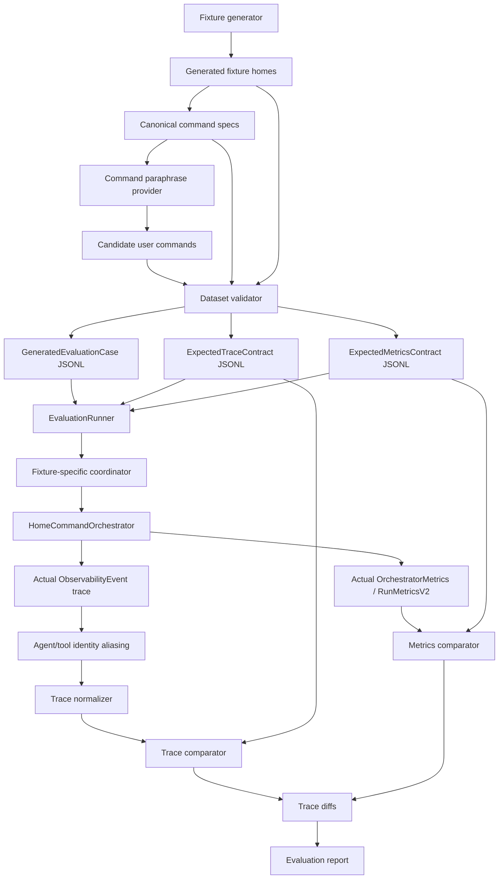

# Golden Evaluation Dataset Implementation Plan

## 1. Query And Goal

### User Query

The user wants to create a large evaluation dataset for the HomeAutomation project.

For each dataset fixture, the project should:

- Create a custom `MockHomeDeviceRegistry` with a different home and device setup.
- Generate 100 user commands for that fixture.
- Store the expected resolved output for each command.
- Store the expected per-agent JSONL-style evaluation log for each command.
- Run the real project against each command.
- Capture actual logs and metrics from the run.
- Compare expected output, expected agent trace, and expected metrics against actual output.
- Use the comparison to evaluate model, agent, candidate filtering, automation, and whole-system efficiency.

The full target dataset is:

- 100 fixture homes.
- 100 commands per fixture.
- 10,000 total evaluation cases.

The first implementation should be seed-first:

- 10 fixture homes.
- 100 commands per fixture.
- 1,000 total seed cases.
- Tooling designed to scale to 10,000 cases without redesign.

### What We Want To Achieve

We want a repeatable, versioned, and measurable evaluation system that answers:

- Did the command route to the correct operation?
- Did each agent run when expected?
- Did each agent produce the expected stable result?
- Did candidate retrieval include the correct device?
- Did candidate ranking select the correct device?
- Did draft generation resolve the expected target, capability, command, and parameters?
- Did automation segmentation produce the expected trigger, actions, and conditions?
- Did SmartThings compilation produce the expected rule shape?
- Did the system stay within model-call, latency, and context-window budgets?
- Did every required agent input/output log include traceable `agentID`, `agentSessionID`, and `agentRunID`?
- Did every tool call include `toolID`, `toolSessionID`, `toolCallID`, and the caller agent trace IDs?
- Can actual tool usage be attributed back to the agent/model invocation that requested it?
- Did regressions appear in a specific agent, fixture type, command type, or device category?

The result should be an evaluation layer that can support:

- Local debugging.
- CI deterministic regression checks.
- Live FoundationModel quality checks.
- Prompt tuning.
- Candidate filtering tuning.
- RAG retrieval tuning.
- Future model training or fine-tuning data generation.

### What We Do Not Want

We do not want byte-for-byte golden JSONL trace comparison.

Raw trace logs contain legitimate runtime variability:

- `traceID`
- `spanID`
- `parentSpanID`
- timestamps
- exact durations
- command-level `runID` values
- exact `agentSessionID`, `toolSessionID`, and `toolCallID` UUID values
- exact `agentRunID` values when a coordinator is reused across multiple cases
- parallel execution ordering
- model fallback path details
- live model phrasing
- raw prompt or raw output content

Instead, the expected "log" must be a normalized trace contract that verifies stable behavior and identity relationships:

- agent input/output events include `agentID`, `agentSessionID`, and `agentRunID`
- tool input/output events include `toolID`, `toolSessionID`, `toolCallID`, `agentID`, `agentSessionID`, and `agentRunID`
- tool input/output pairs share the same `toolCallID`
- tool caller identity matches the agent/model context that invoked the tool
- repeated agent runs are distinguishable by `agentInvocationID` and `agentRunID`

## 2. Core Strategy

### Strategy Summary

Use deterministic labels and normalized trace contracts.

The dataset generator may use LLMs heavily to create varied natural language command text, but it must not trust an LLM to create the final labels. Expected labels are owned by deterministic canonical command specs and validated against fixture devices.

The evaluation runner compares:

1. Expected resolved output vs actual resolved output.
2. Expected normalized trace contract vs actual normalized telemetry trace.
3. Expected metrics contract vs actual metrics.

### Why Normalized Trace Contracts

Exact JSONL trace matching is brittle. A small timing change, span ID change, or parallel scheduling change can fail a test even when behavior is correct.

Normalized trace contracts keep the stable parts:

- Event type.
- Span kind.
- Graph ID.
- Graph node ID.
- Stage.
- Agent ID.
- Agent invocation group.
- Agent session identity presence and normalized alias.
- Agent run ID presence and monotonicity within an agent session.
- Tool ID.
- Tool session identity presence and normalized alias.
- Tool call identity presence and input/output pairing.
- Tool caller agent identity propagation.
- Component kind.
- Component ID.
- Action ID.
- Condition ID.
- Status.
- Selected candidate IDs.
- Draft target device ID.
- Draft capability.
- Draft command.
- Model call count.
- Tool call count.
- Context-window failure markers.

They remove the unstable parts:

- Trace IDs.
- Span IDs.
- Parent span IDs.
- Timestamps.
- Exact durations.
- Raw prompts.
- Raw model outputs.
- Command-level run IDs.
- Exact UUID values for agent sessions, tool sessions, and tool calls.
- Exact agent run counter values when case execution reuses a long-lived coordinator.

Normalized trace contracts should compare identity relationships rather than raw UUID strings. For example, the first observed `agentSessionID` for `semanticNLU` can become `agent-session:semanticNLU:1`, and all later events in the same case must use the same alias if they came from the same agent instance.

### External Guidance

Use these references as background, not as hard implementation dependencies:

- OpenAI evaluation best practices: https://developers.openai.com/api/docs/guides/evaluation-best-practices
- OpenAI datasets guide: https://developers.openai.com/api/docs/guides/evaluation-getting-started
- OpenTelemetry trace concepts: https://opentelemetry.io/docs/concepts/signals/traces/
- OpenTelemetry semantic conventions: https://opentelemetry.io/docs/concepts/semantic-conventions/

## 3. End-To-End Data Flow



## 4. Dataset Storage

### Built-In Seed Dataset

Add package resources under `HomeAutomationEvaluation`:

```text
HomeAutomationCore/Sources/HomeAutomationEvaluation/Resources/EvaluationDatasets/
  seed-v1/
    manifest.json
    fixtures.jsonl
    cases.jsonl
    expected-traces.jsonl
    expected-metrics.jsonl
```

Update `HomeAutomationCore/Package.swift` so `HomeAutomationEvaluation` copies the dataset resource tree without flattening nested dataset directories:

```swift
.target(
    name: "HomeAutomationEvaluation",
    dependencies: [
        "HomeAutomationCore",
        "HomeAutomationRAG",
        "HomeAutomationAgents",
        "HomeAutomationOrchestrator"
    ],
    resources: [
        .copy("Resources/EvaluationDatasets")
    ]
)
```

### External Full Dataset

The 10,000-case dataset can be generated outside git:

```text
.build/generated-evals/full-v1/
  manifest.json
  fixtures.jsonl
  cases.jsonl
  expected-traces.jsonl
  expected-metrics.jsonl
```

The seed dataset should be committed. The full dataset can be regenerated or stored as CI/nightly artifacts until its quality is accepted.

### Manifest Shape

`manifest.json` should include:

```json
{
  "name": "seed-v1",
  "version": "1.0.0",
  "generatedAt": "2026-05-31T00:00:00Z",
  "generatorVersion": "golden-eval-generator-v1",
  "fixtureCount": 10,
  "caseCount": 1000,
  "commandsPerFixture": 100,
  "generationMode": "codex",
  "randomSeed": 20260531,
  "validationStatus": "passed"
}
```

## 5. Dataset Schema

Add new models in `HomeAutomationEvaluation`.

Recommended file:

```text
HomeAutomationCore/Sources/HomeAutomationEvaluation/GeneratedDatasetTypes.swift
```

### `EvaluationDatasetSpec`

Purpose: describes what to generate.

Fields:

- `datasetName: String`
- `version: String`
- `fixtureCount: Int`
- `commandsPerFixture: Int`
- `randomSeed: Int`
- `generationMode: EvaluationCommandGenerationMode`
- `suiteDistribution: [String: Int]`
- `tags: [String]`

### `GeneratedEvaluationFixture`

Purpose: stores one fixture home.

Fields:

- `id: String`
- `name: String`
- `category: String`
- `devices: [HomeCandidateRecord]`
- `notes: String?`

### `GeneratedEvaluationCase`

Purpose: one runnable command case.

Fields:

- `id: String`
- `fixtureID: String`
- `suite: String`
- `tags: [String]`
- `input: String`
- `canonicalCommandID: String`
- `expected: ExpectedResolvedOutput`
- `traceContractID: String`
- `metricsContractID: String`

### `ExpectedResolvedOutput`

Purpose: stable expected system output.

Fields:

- `operation: HomeAutomationOperationKind?`
- `domain: HomeAutomationCommandDomain?`
- `languageCode: String?`
- `allowedOutcome: EvaluationAllowedOutcome`
- `expectedDeviceIDs: [String]`
- `targetDeviceID: String?`
- `capability: String?`
- `command: String?`
- `parameters: [String: String]`
- `actionCount: Int?`
- `conditionCount: Int?`
- `conditionTreeKind: String?`
- `smartThingsJSONContains: [String]`

### `ExpectedTraceContract`

Purpose: expected normalized trace for a case.

Fields:

- `id: String`
- `caseID: String`
- `requiredGraphs: [String]`
- `graphPathAlternatives: [[String]]`
- `requiredAgents: [ExpectedAgentContract]`
- `agentPathAlternatives: [[ExpectedAgentContract]]`
- `requiredTools: [ExpectedToolContract]`
- `requiredComponents: [ExpectedAutomationComponentContract]`
- `allowedFailedAgents: [String]`
- `allowedSkippedAgents: [String]`
- `expectedSelectedDeviceIDs: [String]`
- `expectedCapability: String?`
- `expectedCommand: String?`
- `maxModelCallCount: Int?`
- `maxToolCallCount: Int?`
- `allowContextWindowFailures: Bool`
- `requireAgentTraceIdentity: Bool`
- `requireToolTraceIdentity: Bool`
- `requireToolCallerIdentityPropagation: Bool`

### `ExpectedAgentContract`

Purpose: per-agent expectation.

Fields:

- `agentID: String`
- `required: Bool`
- `expectedStatus: String?`
- `minimumCount: Int`
- `maximumCount: Int?`
- `expectedOutputMarkers: [String]`
- `expectedSelectedDeviceIDs: [String]`
- `allowedFallbackReasons: [String]`
- `maxModelCalls: Int?`
- `maxDurationMs: Double?`
- `requireInputOutputTraceIDs: Bool`
- `requireStableSessionWithinCase: Bool`
- `requirePositiveRunID: Bool`

### `ExpectedToolContract`

Purpose: per-tool expectation and caller trace relationship.

Fields:

- `toolID: String`
- `required: Bool`
- `expectedStatus: String?`
- `minimumCount: Int`
- `maximumCount: Int?`
- `expectedCallerAgentIDs: [String]`
- `requireInputOutputPair: Bool`
- `requireToolSessionID: Bool`
- `requireToolCallID: Bool`
- `requireCallerAgentTraceIDs: Bool`
- `maxDurationMs: Double?`

### `ExpectedAutomationComponentContract`

Purpose: component-level automation expectation.

Fields:

- `componentKind: String`
- `componentID: String`
- `expectedStatus: String`
- `expectedDeviceIDs: [String]`
- `expectedCapability: String?`
- `expectedCommand: String?`

### `ExpectedMetricsContract`

Purpose: metric budgets and quality expectations.

Fields:

- `id: String`
- `caseID: String`
- `maxDurationMs: Double?`
- `maxModelCallCount: Int?`
- `maxSkippedModelCallCount: Int?`
- `maxToolCallCount: Int?`
- `maxContextWindowFailures: Int`
- `minCandidateRecallAt1: Double?`
- `minCandidateRecallAt3: Double?`
- `minCandidateRecallAt5: Double?`
- `expectedRetrievedCandidateContains: [String]`
- `expectedHydratedCandidateContains: [String]`
- `expectedSelectedCandidateIDs: [String]`
- `expectedActionCount: Int?`
- `expectedConditionCount: Int?`

### `NormalizedTrace`

Purpose: stable representation of actual telemetry.

Fields:

- `caseID: String`
- `spans: [NormalizedTraceSpan]`
- `selectedDeviceIDs: [String]`
- `targetDeviceID: String?`
- `capability: String?`
- `command: String?`
- `modelCallCount: Int`
- `toolCallCount: Int`
- `contextWindowFailureCount: Int`
- `agentIdentityChecks: [String: NormalizedAgentIdentityCheck]`
- `toolIdentityChecks: [String: NormalizedToolIdentityCheck]`

### `NormalizedTraceSpan`

Purpose: stable span or event record.

Fields:

- `eventType: String`
- `spanKind: String`
- `graphID: String?`
- `stage: String?`
- `graphNodeID: String?`
- `agentID: String?`
- `agentInvocationGroup: String?`
- `agentSessionAlias: String?`
- `agentRunID: Int?`
- `componentKind: String?`
- `componentID: String?`
- `actionID: String?`
- `conditionID: String?`
- `toolID: String?`
- `toolSessionAlias: String?`
- `toolCallAlias: String?`
- `callerAgentID: String?`
- `callerAgentSessionAlias: String?`
- `callerAgentRunID: Int?`
- `status: String?`
- `payloadMarkers: [String: String]`

### `NormalizedAgentIdentityCheck`

Purpose: summary of trace identity quality for one agent session alias.

Fields:

- `agentID: String`
- `agentSessionAlias: String`
- `observedRunIDs: [Int]`
- `inputOutputPairs: Int`
- `missingInputTraceIDCount: Int`
- `missingOutputTraceIDCount: Int`
- `nonMonotonicRunIDCount: Int`

### `NormalizedToolIdentityCheck`

Purpose: summary of trace identity quality for one tool session or tool call alias.

Fields:

- `toolID: String`
- `toolSessionAlias: String?`
- `toolCallAlias: String`
- `callerAgentID: String?`
- `callerAgentSessionAlias: String?`
- `callerAgentRunID: Int?`
- `hasInputEvent: Bool`
- `hasOutputEvent: Bool`
- `missingToolSessionID: Bool`
- `missingCallerAgentTraceID: Bool`
- `callerIdentityMismatch: Bool`

### `TraceDiff`

Purpose: comparison output.

Fields:

- `caseID: String`
- `passed: Bool`
- `missingRequiredAgents: [String]`
- `missingRequiredGraphs: [String]`
- `missingRequiredComponents: [String]`
- `wrongAgentStatuses: [String]`
- `unexpectedFailedAgents: [String]`
- `wrongSelectedDeviceIDs: [String]`
- `wrongCapability: String?`
- `wrongCommand: String?`
- `missingAgentTraceIDs: [String]`
- `missingToolTraceIDs: [String]`
- `unpairedToolCalls: [String]`
- `callerIdentityMismatches: [String]`
- `nonMonotonicAgentRunIDs: [String]`
- `budgetFailures: [String]`
- `notes: [String]`

### `DatasetValidationIssue`

Purpose: dataset generation validation output.

Fields:

- `severity: String`
- `caseID: String?`
- `fixtureID: String?`
- `field: String`
- `message: String`

## 6. Fixture Home Generation

Recommended file:

```text
HomeAutomationCore/Sources/HomeAutomationEvaluation/EvaluationFixtureGenerator.swift
```

### Fixture Categories

Generate 10 seed fixture homes:

1. `simple-home`
   - One or two common devices per room.
   - Useful for happy-path direct commands.

2. `duplicate-lights`
   - Multiple lights in same and different rooms.
   - Tests ambiguity and candidate ranking.

3. `numbered-bulbs`
   - Must include `Bulb 1`, `Bulb2`, `Bulb 3`, `Lamp 01`, `Kitchen Light 2`.
   - Tests numeric name parsing and exact candidate distinction.

4. `climate-heavy`
   - Air conditioners, thermostat, heater, humidifier, dehumidifier, air purifier.
   - Tests temperature and mode commands.

5. `media-heavy`
   - TV, speaker, soundbar, receiver, streaming box, game console.
   - Tests media controls and device-type classification.

6. `security-safety`
   - Smart locks, contact sensors, garage door, cameras, smoke detector.
   - Tests high-risk and confirmation behavior.

7. `automation-heavy`
   - Mix of triggers, condition-capable sensors, and action devices.
   - Tests schedule and condition automation.

8. `ambiguous-room-names`
   - Similar device names across rooms.
   - Examples: `Office Lamp`, `Bedroom Lamp`, `Guest Room Lamp`.

9. `appliance-heavy`
   - Washer, dryer, oven, dishwasher, robot cleaner, kettle.
   - Tests appliance cycle and risk classification.

10. `mixed-catalog-custom`
   - Combination of `MockHomeDeviceRegistry.defaultDevices`, catalog devices, and custom generated devices.
   - Tests broad coverage.

### Fixture Validation

Before writing fixtures:

- Device IDs must be unique within a fixture.
- Display names must be non-empty.
- `deviceType` must be non-empty.
- Every capability must have either supported commands or be explicitly measurement-only.
- `supportedCommands` keys must refer to capabilities on the device.
- `currentState` keys should match capability attributes where practical.
- Metadata aliases should be comma-separated and stable.
- Numbered names must preserve their numeric token.

### Numbered Device Rules

The generator must include name variants that commonly break parsers:

- Space before number: `Bulb 1`
- No space before number: `Bulb2`
- Multi-digit/leading zero: `Lamp 01`
- Room plus number: `Kitchen Light 2`
- Spoken variants in generated commands:
  - `bulb one`
  - `bulb 1`
  - `bulb number 1`
  - `second bulb`
  - `kitchen light two`

## 7. Command Generation

Recommended files:

```text
HomeAutomationCore/Sources/HomeAutomationEvaluation/CommandGeneration/
  CommandParaphraseProvider.swift
  TemplateCommandParaphraseProvider.swift
  CodexCLICommandParaphraseProvider.swift
  FoundationModelCommandParaphraseProvider.swift
  CanonicalCommandSpec.swift
  EvaluationCommandGenerator.swift
```

### Principle

The LLM generates user phrasing. The deterministic generator owns labels.

This avoids label drift where an LLM creates a command and an expected output that do not actually match the fixture.

### Generation Flow

1. Build canonical command specs from fixture devices.
2. Determine expected output from the canonical spec.
3. Create an expected trace contract from command category and expected output.
4. Ask the paraphrase provider for diverse user command variants.
5. Validate each paraphrase against the canonical expected output.
6. Reject invalid paraphrases.
7. Write only validated cases.

### `CommandParaphraseProvider`

```swift
public protocol CommandParaphraseProvider: Sendable {
    func paraphrases(for spec: CanonicalCommandSpec, count: Int) async throws -> [String]
}
```

### Providers

`TemplateCommandParaphraseProvider`

- Used in tests and deterministic CI.
- Uses template banks.
- No FoundationModel dependency.

`CodexCLICommandParaphraseProvider`

- Default provider for dataset generation from the CLI.
- Uses the installed `codex` CLI through `codex exec`.
- Prompts Codex to return only a schema-constrained JSON object with a `commands` array.
- Uses deterministic validation to reject semantic drift before a case is written.
- Does not decide expected labels; it only creates natural-language command wording.
- Uses the Codex CLI's configured model by default. Set `HOME_AUTOMATION_EVAL_CODEX_MODEL` to choose a specific Codex model profile when needed.

`FoundationModelCommandParaphraseProvider`

- Optional provider for Apple FoundationModels experiments.
- Prompts a model to produce diverse commands.
- Must return a structured `commands` array only.
- Must retry or fail on invalid JSON.
- Must not decide expected labels.

Optional future provider:

- External API provider for off-device generation.

### Command Categories

The seed corpus should distribute commands across:

- Direct power commands.
- Brightness commands.
- Climate and temperature commands.
- Media commands.
- Lock/open/close commands.
- Status queries.
- Ambiguous commands.
- Numbered-device commands.
- Unsupported commands.
- Safety/confirmation commands.
- Schedule automations.
- Condition automations.
- Multi-action automations.
- `and` condition trees.
- `or` condition trees.
- Mixed action and condition commands.

### Canonical Command Spec

Add `CanonicalCommandSpec` with:

- `id`
- `fixtureID`
- `category`
- `targetDeviceID`
- `targetDeviceDisplayName`
- `room`
- `deviceType`
- `intentFamily`
- `capability`
- `command`
- `parameters`
- `automationTrigger`
- `automationActions`
- `automationConditions`
- `riskLevel`
- `expectedOutcome`

## 8. Expected Trace Contract Generation

Recommended file:

```text
HomeAutomationCore/Sources/HomeAutomationEvaluation/ExpectedTraceContractFactory.swift
```

### Direct Command Contract

For a successful direct command, require:

- `operationDetection`
- `semanticNLU`
- `slotExtraction`
- `riskClassification`
- `candidateRetrieval`
- `retrievalJudge`
- `candidateRanking`
- `candidateHydration`
- `capabilityResolution`
- `instructionComposer`
- `draftGeneration`

Depending on risk and command outcome, require or allow:

- `safetyValidation`
- `parameterValidation`
- `confirmationPolicy`
- `executionPlanning`
- `mockExecution`

The direct command contract should assert:

- Correct selected device ID.
- Correct draft target device ID.
- Correct capability.
- Correct command.
- Expected allowed outcome.
- Candidate recall budget.
- Model-call budget.
- Agent input/output trace IDs are present for every required agent.
- Tool calls, when present, carry the caller agent trace identity.
- Either the model/full graph path or the deterministic fallback graph path is acceptable when the expected resolved output is the same.
- In deterministic mode, `direct-command-fallback-graph` with `ruleFallback` can satisfy the direct command path contract.
- In live/model mode, `direct-command-graph` with the semantic/candidate/draft agents can satisfy the same direct command path contract.

### Automation Contract

For automation creation, require:

- `operationDetection`
- `automationComponentSegmentation`
- `automationComponentFanOut`
- Trigger component span, if schedule or event trigger exists.
- One action component span per expected action.
- One condition component span per expected condition leaf.
- `automationDraftAssembly`
- `automationValidation`
- `smartThingsCompilation`
- `automationResultAssembly`

Require `smartThingsRuleCreation` only when backend creation is enabled for the evaluation mode.

The automation contract should assert:

- Correct action count.
- Correct condition leaf count.
- Correct condition tree kind when specified.
- Correct action device IDs.
- Correct action capabilities and commands.
- Correct trigger kind.
- SmartThings JSON markers when compilation is expected.
- Component subgraph agents have distinct invocation groups and usable agent trace IDs.
- Repeated subgraph agents do not overwrite each other's normalized agent identity records.

### Optional And Skipped Agents

Contracts must support optional agents because deterministic fallback may bypass model-heavy paths.

Use:

- `required: true` for core path agents.
- `required: false` for optional repair/fallback/confirmation branches.
- `graphPathAlternatives` when either a live graph or deterministic fallback graph is valid.
- `agentPathAlternatives` when either a live agent chain or fallback agent chain is valid.
- `allowedSkippedAgents` for nodes that are expected to skip in low-risk or deterministic mode.
- `allowedFailedAgents` only for known recoverable branches.

### Agent And Tool Trace Identity Contract

Every generated trace contract should default to:

- `requireAgentTraceIdentity: true`
- `requireToolTraceIdentity: true`
- `requireToolCallerIdentityPropagation: true`

Agent identity expectations:

- `agent.input` and `agent.output` events must include `agentID`, `agentSessionID`, and `agentRunID`.
- `agentSessionID` must be normalized to a per-case alias, not compared as a raw UUID.
- `agentRunID` must be present and positive for real contextual agents.
- For a single agent invocation, input/output/patch/final events should agree on `agentSessionID` and `agentRunID`.
- Repeated runs of the same agent instance should produce increasing `agentRunID` values within the same process/session.
- `agentInvocationID` remains the graph-attempt identity and should be used to separate repeated agents in fan-out paths.

Tool identity expectations:

- `tool.input` and `tool.output` events must include `toolID`, `toolSessionID`, `toolCallID`, `agentID`, `agentSessionID`, and `agentRunID`.
- `toolID` is stable and can be compared literally.
- `toolSessionID` and `toolCallID` should be normalized to aliases.
- `tool.input` and `tool.output` for the same invocation must share the same `toolCallID` alias.
- Tool caller identity should match the agent/model context that invoked the tool.
- If the model omits optional trace arguments, telemetry fallback is allowed only if the final emitted event still contains all required IDs.

## 9. Actual Trace Capture

Recommended file:

```text
HomeAutomationCore/Sources/HomeAutomationEvaluation/EvaluationTraceCapture.swift
```

### In-Memory Sink

Use `InMemoryTelemetrySink` per case.

The evaluation runner should:

1. Create a fresh `InMemoryTelemetrySink`.
2. Create a telemetry instance or coordinator that routes events to that sink.
3. Run the orchestrator with fixture-specific registry.
4. Flush telemetry.
5. Read sink events.
6. Write actual trace JSONL to `actual-traces/<case-id>.jsonl` when enabled.

### Important Requirement

Do not depend only on daily log files in `Logs/`.

Daily logs are useful for human debugging, but evaluation comparison needs per-case isolation.

### Actual Trace Contents

The captured trace should include:

- run spans
- graph spans
- graph node spans
- agent attempt spans
- agent input/output events with `agentID`, `agentSessionID`, and `agentRunID`
- model call spans
- tool call spans
- tool input/output events with `toolID`, `toolSessionID`, `toolCallID`, and caller agent trace IDs
- automation component spans
- run metrics events

## 10. Trace Normalization

Recommended file:

```text
HomeAutomationCore/Sources/HomeAutomationEvaluation/TraceNormalization.swift
```

### Normalizer Input

Input:

- `[ObservabilityEvent]`
- `caseID`
- `HomeAutomationResolverResult`
- `OrchestratorMetrics?`

### Normalizer Output

Output:

- `NormalizedTrace`

### Remove

The normalizer removes:

- `traceID`
- `spanID`
- `parentSpanID`
- timestamps
- exact durations
- raw model prompts
- raw model outputs
- command-level `runID` values from comparison keys
- exact raw UUID values for `agentSessionID`, `toolSessionID`, and `toolCallID`
- exact `agentRunID` values when the test intentionally reuses a coordinator across unrelated cases

### Keep

The normalizer keeps:

- `eventType`
- `spanKind`
- `graphID`
- `stage`
- `graphNodeID`
- `agentID`
- `agentInvocationGroup`
- normalized `agentSessionAlias`
- `agentRunID` presence, positivity, and ordering checks
- `componentKind`
- `componentID`
- `actionID`
- `conditionID`
- `toolID`
- normalized `toolSessionAlias`
- normalized `toolCallAlias`
- tool input/output pairing
- caller `agentID`
- caller normalized `agentSessionAlias`
- caller `agentRunID`
- `status`
- selected candidate IDs
- target device ID
- capability
- command
- model call count
- tool call count
- context-window failure count

### Trace Identity Aliasing

The normalizer should convert raw identity UUIDs into deterministic per-case aliases.

Recommended aliasing:

- `agentSessionID` -> `agent-session:<agentID>:<ordinal>`
- `toolSessionID` -> `tool-session:<toolID>:<ordinal>`
- `toolCallID` -> `tool-call:<toolID>:<ordinal>`

The raw UUID values should remain available only in optional debug output, not in pass/fail comparison fields.

The normalizer should also build identity summaries:

- one `NormalizedAgentIdentityCheck` per observed agent session alias
- one `NormalizedToolIdentityCheck` per observed tool call alias

These summaries make it cheap to assert trace health without scanning raw JSONL in every comparator.

### Agent Invocation Grouping

Repeated agents can appear in action subgraphs and automation fan-out. Do not group only by `agentID`.

Normalize invocation identity to:

- `agentInvocationID` when present.
- Otherwise `stage + agentID + componentKind + componentID`.
- Otherwise `agentID`.

This keeps repeated `semanticNLU`, `candidateRanking`, and `draftGeneration` runs separate.

Do not use `agentRunID` as the primary invocation key. It is a per-agent-instance reuse counter, not a graph-attempt identifier. It should be used to validate reuse and correlate agent/tool logs, while `agentInvocationID` remains the graph-level attempt identity.

## 11. Trace And Metrics Comparison

Recommended files:

```text
HomeAutomationCore/Sources/HomeAutomationEvaluation/TraceContractComparator.swift
HomeAutomationCore/Sources/HomeAutomationEvaluation/MetricsContractComparator.swift
```

### Trace Comparator

Compare `ExpectedTraceContract` to `NormalizedTrace`.

Detect:

- Missing required spans.
- Missing required graph IDs.
- Missing required agent IDs.
- Missing required automation components.
- Wrong agent status.
- Unexpected failed agents.
- Wrong selected device.
- Wrong target device.
- Wrong capability.
- Wrong command.
- Model-call budget exceeded.
- Tool-call budget exceeded.
- Context-window failure budget exceeded.
- Missing `agentSessionID` or `agentRunID` on required agent input/output events.
- Missing `toolID`, `toolSessionID`, or `toolCallID` on required tool events.
- Unpaired tool input/output events.
- Tool caller identity missing or mismatched.
- Non-monotonic `agentRunID` sequence within a normalized agent session.

### Metrics Comparator

Compare `ExpectedMetricsContract` to `RunMetricsV2` and `OrchestratorMetrics`.

Detect:

- Duration budget exceeded.
- Model-call budget exceeded.
- Skipped model-call budget exceeded.
- Tool-call budget exceeded.
- Context-window failure budget exceeded.
- Expected selected candidate IDs missing.
- Expected retrieved candidate IDs missing.
- Expected hydrated candidate IDs missing.
- Wrong action count.
- Wrong condition count.
- Candidate recall failure.

### Diff Output

Write one JSON diff per failed case:

```text
trace-diffs/<case-id>.json
```

The diff should include:

- expected contract ID
- actual normalized trace summary
- missing required items
- wrong statuses
- wrong outputs
- missing agent or tool trace IDs
- unpaired tool calls
- caller identity mismatches
- budget failures
- notes

## 12. Dataset Validation

Recommended file:

```text
HomeAutomationCore/Sources/HomeAutomationEvaluation/DatasetValidator.swift
```

### Fixture Validation

Rules:

- Fixture IDs are unique.
- Device IDs are unique within fixture.
- Device display names are non-empty.
- Device types are non-empty.
- Capabilities are non-empty.
- Supported command capability keys exist on the device.

### Case Validation

Rules:

- Case IDs are unique.
- Every case references an existing fixture.
- Every case references an existing trace contract.
- Every case references an existing metrics contract.
- Every expected device ID exists in the fixture.
- Expected target device exists in the fixture.
- Expected capability exists on expected target device.
- Expected command is supported by expected capability.
- Expected automation action count matches the expected action list.
- Expected automation condition count matches the expected condition list.
- Every required agent contract has a non-empty `agentID`.
- Every required tool contract has a non-empty `toolID`.
- Cases that expect tool usage must require caller identity propagation.
- Cases that do not expose tools may set `requiredTools` empty, but should still keep `requireToolTraceIdentity` enabled for any unexpected tool events.

### Numbered Device Validation

Rules:

- Fixtures with numbered devices must include at least five numbered names.
- Generated commands must include numeric variants.
- Expected selected device must match exact numeric target.
- `bulb 1`, `bulb2`, and `bulb 3` must not collapse to the same device.

### Validation Report

Write:

```text
dataset-validation-report.md
```

Include:

- fixture count
- case count
- validation issue count
- issue table
- coverage by suite
- coverage by command category
- coverage by device type
- numbered-device coverage

## 13. Evaluation Runner Changes

Recommended updates:

```text
HomeAutomationCore/Sources/HomeAutomationEvaluation/EvaluationRunner.swift
HomeAutomationCore/Sources/HomeAutomationEvaluation/EvaluationCoordinator.swift
```

### New Runner Capabilities

Add support for:

- Built-in dataset loading by name.
- External dataset loading by path.
- Fixture-specific registry per case.
- Per-case in-memory trace capture.
- Trace comparison.
- Metrics comparison.
- Actual trace writing.
- Trace diff writing.
- Per-agent aggregate metrics.

### Result Type Extension

Either extend `EvaluationCaseResult` or add `GeneratedEvaluationCaseResult`.

Required result fields:

- `id`
- `fixtureID`
- `suite`
- `tags`
- `mode`
- `status`
- `passed`
- `durationMs`
- `traceID`
- `traceContractPassed`
- `metricsContractPassed`
- `assertionFailures`
- `traceFailures`
- `metricsFailures`
- `selectedDeviceIDs`
- `targetDeviceID`
- `capability`
- `command`
- `modelCallCount`
- `toolCallCount`
- `contextWindowFailureCount`
- `agentTraceIdentityPassed`
- `toolTraceIdentityPassed`
- `missingAgentTraceIDCount`
- `missingToolTraceIDCount`
- `unpairedToolCallCount`
- `callerIdentityMismatchCount`
- `metrics`

### Backward Compatibility

Current calls must continue to work:

```bash
swift run home-automation-eval --mode deterministic --suite all --output .build/evaluation
```

If no `--dataset` or `--dataset-path` is passed, use `EvaluationCorpus.defaultCases`.

## 14. CLI Changes

Recommended file:

```text
HomeAutomationCore/Sources/HomeAutomationEvalCLI/EvalCLI.swift
```

### New Options

Add:

```bash
--dataset seed-v1
--dataset-path <path>
--compare-traces true
--write-actual-traces true
--case-limit <n>
--fixture-limit <n>
--generate-dataset true
--generation-mode codex|template|foundation-model
--output <path>
```

### Seed Run

```bash
swift run home-automation-eval \
  --mode deterministic \
  --dataset seed-v1 \
  --compare-traces true \
  --write-actual-traces true \
  --output .build/evaluation-seed
```

### Dataset Generation Run

```bash
swift run home-automation-eval \
  --generate-dataset true \
  --generation-mode codex \
  --fixture-limit 10 \
  --case-limit 1000 \
  --output .build/generated-evals/seed-v1
```

Codex is the default generation mode when `--generate-dataset true` is passed and no `--generation-mode` is provided.
The actual LLM is the model configured by the user's Codex CLI installation; override it with `HOME_AUTOMATION_EVAL_CODEX_MODEL` or `HOME_AUTOMATION_EVAL_CODEX_PROFILE` when needed.

### Deterministic Template Generation Run

```bash
swift run home-automation-eval \
  --generate-dataset true \
  --generation-mode template \
  --fixture-limit 10 \
  --case-limit 1000 \
  --output .build/generated-evals/seed-v1
```

### Optional FoundationModel Generation Run

```bash
swift run home-automation-eval \
  --generate-dataset true \
  --generation-mode foundation-model \
  --fixture-limit 10 \
  --case-limit 1000 \
  --output .build/generated-evals/seed-v1-foundation-model
```

## 15. Reports And Metrics

### Output Files

The evaluation output directory should contain:

```text
evaluation-results.jsonl
evaluation-summary.json
evaluation-report.md
actual-traces/
trace-diffs/
agent-metrics.json
dataset-validation-report.md
```

### `evaluation-summary.json`

Include:

- total cases
- passed cases
- failed cases
- skipped cases
- pass rate
- pass rate by suite
- pass rate by fixture
- pass rate by tag
- selected device exact-match accuracy
- target device exact-match accuracy
- capability exact-match accuracy
- command exact-match accuracy
- candidate recall at 1
- candidate recall at 3
- candidate recall at 5
- draft exact-field accuracy
- automation action-count accuracy
- automation condition-count accuracy
- SmartThings compilation pass rate
- total model calls
- average model calls per case
- total tool calls
- average tool calls per case
- agent trace identity pass rate
- tool trace identity pass rate
- unpaired tool call count
- caller identity mismatch count
- context-window failure rate
- top failing agents
- top failing fixtures
- top failing command categories

### `agent-metrics.json`

For each agent:

- invocation count
- required count
- missing count
- completed count
- failed count
- skipped count
- average duration if available
- output accuracy when applicable
- selected-device accuracy when applicable
- capability accuracy when applicable
- command accuracy when applicable
- model-call count
- tool-call count
- missing trace identity count
- caller identity mismatch count
- fallback count
- context-window failure count

### `evaluation-report.md`

Include:

- Summary table.
- Suite table.
- Fixture table.
- Agent table.
- Top failing cases.
- Top failing agents.
- Budget violations.
- Trace diff links.
- Dataset validation summary.

## 16. Implementation Phases

### Phase 1: Schema And Storage Foundation

Status: implemented.

Deliverables:

- Add generated dataset types.
- Add trace identity contract types for agents and tools.
- Add package resources path.
- Add dataset manifest structure.
- Add JSONL encode/decode utilities.

Files:

- `GeneratedDatasetTypes.swift`
- `DatasetJSONL.swift`
- `Package.swift`

Acceptance:

- Dataset models encode/decode.
- Agent/tool trace identity contracts encode/decode.
- JSONL read/write round trips.
- Empty seed resource directory can be loaded without crashing.

### Phase 2: Fixture Generator

Status: implemented.

Deliverables:

- Add deterministic fixture generator.
- Generate 10 seed fixture categories.
- Include numbered device fixture.
- Add fixture validation.

Files:

- `EvaluationFixtureGenerator.swift`
- `DatasetValidator.swift`

Acceptance:

- 10 fixtures generated.
- Device IDs unique.
- Numbered devices present.
- Validation passes for fixtures.

### Phase 3: Canonical Command Specs And Template Commands

Status: implemented.

Deliverables:

- Add canonical command spec model.
- Add template paraphrase provider.
- Generate smoke-test commands.
- Generate deterministic expected resolved outputs.

Files:

- `CanonicalCommandSpec.swift`
- `CommandParaphraseProvider.swift`
- `TemplateCommandParaphraseProvider.swift`
- `EvaluationCommandGenerator.swift`

Acceptance:

- 100 commands can be generated deterministically.
- Every command has expected output.
- Every expected output validates against fixture devices.

### Phase 4: Trace Contract Factory

Status: implemented.

Deliverables:

- Generate direct-command contracts.
- Generate automation contracts.
- Generate required agent/tool trace identity contracts.
- Generate expected metrics contracts.

Files:

- `ExpectedTraceContractFactory.swift`
- `ExpectedMetricsContractFactory.swift`

Acceptance:

- Every generated case has trace and metrics contracts.
- Direct commands include live/full graph and deterministic fallback path alternatives.
- Automation commands include required automation graph agents and components.
- Tool-using cases include required tool contracts and caller identity propagation requirements.

### Phase 5: Trace Capture And Normalization

Status: implemented.

Deliverables:

- Add in-memory per-case telemetry capture.
- Add normalized trace conversion.
- Add agent/tool identity aliasing and consistency summaries.
- Add actual trace JSONL writer.

Files:

- `EvaluationTraceCapture.swift`
- `TraceNormalization.swift`

Acceptance:

- A deterministic orchestrator run can produce actual trace JSONL.
- Normalized trace strips volatile IDs and timestamps.
- Normalized trace keeps stable agent/component/output fields.
- Normalized trace aliases agent sessions, tool sessions, and tool calls.
- Normalized trace validates agent/tool identity presence without comparing raw UUIDs.

### Phase 6: Comparators

Status: implemented.

Deliverables:

- Add trace contract comparator.
- Add metrics contract comparator.
- Add trace diff writer.

Files:

- `TraceContractComparator.swift`
- `MetricsContractComparator.swift`
- `TraceDiffWriter.swift`

Acceptance:

- Missing required agent fails.
- Wrong status fails.
- Wrong selected device fails.
- Wrong capability or command fails.
- Missing agent trace identity fails.
- Missing tool trace identity fails.
- Unpaired tool calls fail.
- Tool caller identity mismatch fails.
- Budget overflow fails.
- Valid trace passes.

### Phase 7: Runner And CLI Integration

Status: implemented.

Deliverables:

- Extend `EvaluationRunner`.
- Extend `EvaluationCoordinator`.
- Extend CLI options.
- Preserve existing CLI behavior.
- Load built-in or external generated datasets.
- Run fixture-specific registries through the real orchestrator.
- Capture actual traces per case through `InMemoryTelemetrySink`.
- Compare normalized traces and metrics contracts.
- Write actual traces and trace diffs to the evaluation output directory.

Files:

- `EvaluationRunner.swift`
- `EvaluationCoordinator.swift`
- `EvalCLI.swift`
- `DatasetJSONL.swift`

Acceptance:

- Default 12-case eval still runs.
- `--dataset seed-v1` loads seed dataset.
- `--dataset-path <path>` loads an external generated dataset.
- `--compare-traces true` compares normalized trace contracts.
- `--write-actual-traces true` writes actual trace files.
- `--case-limit` and `--fixture-limit` constrain generated dataset runs.
- `--generate-dataset true` writes dataset resources.

### Phase 8: Seed Dataset Generation

Status: implemented.

Deliverables:

- Generate seed-v1 resources.
- Start with deterministic template mode.
- Validate resources.
- Commit only validated seed resources.
- Add built-in resource loading tests.
- Add path-alternative trace contracts so deterministic fallback and live/model graph paths can both be evaluated without brittle graph assumptions.

Acceptance:

- 10 fixtures.
- 1,000 cases.
- 1,000 trace contracts.
- 1,000 metrics contracts.
- Dataset validation report passes.
- Deterministic seed smoke run with trace comparison passes for the first 5 seed cases.

Verified command:

```bash
swift run home-automation-eval \
  --mode deterministic \
  --dataset seed-v1 \
  --compare-traces true \
  --write-actual-traces true \
  --case-limit 5 \
  --output .build/evaluation-seed-smoke
```

### Phase 9: LLM-Heavy Generation

Status: implemented.

Deliverables:

- Add `CodexCLICommandParaphraseProvider` and make `codex` the default CLI dataset generation mode.
- Add `CodexCLICommandParaphraseRunner` that invokes `codex exec` with a JSON schema and captures the final message from `--output-last-message`.
- Add Codex environment overrides:
  - `HOME_AUTOMATION_EVAL_CODEX_PATH`
  - `HOME_AUTOMATION_EVAL_CODEX_MODEL`
  - `HOME_AUTOMATION_EVAL_CODEX_PROFILE`
- Keep `template` and `foundation-model` as explicit generation modes.
- Add `FoundationModelCommandParaphraseProvider`.
- Add optional FoundationModel live generation mode.
- Add JSON validation and retry.
- Add semantic drift rejection.
- Add `CommandParaphraseValidator` so model-generated phrasing is accepted only when it preserves the canonical target, numeric suffix, command, value, schedule, and condition semantics.
- Add a structured `LiveFoundationModelCommandParaphraseResponder` that requests a schema-constrained `commands` array and records the model call through existing telemetry.
- Preserve deterministic labels by validating provider output against `CanonicalCommandSpec` before creating `GeneratedEvaluationCase` records.
- Record `codex` in the dataset manifest when generated through the default Codex mode.
- Record `foundationModel` in the dataset manifest when generated through live mode.

Acceptance:

- Codex generation is used by default for `swift run home-automation-eval --generate-dataset true ...`.
- The Codex CLI is responsible only for command phrasing; expected labels are still deterministic.
- The concrete LLM is whichever model the installed Codex CLI is configured to use, unless overridden with `HOME_AUTOMATION_EVAL_CODEX_MODEL`.
- Codex output is schema-constrained to `{"commands":[...]}` and still validated by `CommandParaphraseValidator`.
- Live generation only runs when explicitly requested through `--generation-mode foundation-model` or by constructing `FoundationModelCommandParaphraseProvider`.
- Invalid model or Codex structured output is rejected and retried.
- Label drift is rejected before cases are written.
- Generated commands remain tied to deterministic expected outputs.
- Codex-generated dataset manifests use `generationMode: "codex"`.
- FoundationModel-generated dataset manifests use `generationMode: "foundationModel"`.
- The deterministic template provider also passes through the same validation path.

Verified by tests:

- `codexProviderRejectsSemanticDriftFromRunner`
- `codexProviderRetriesInvalidStructuredOutput`
- `generatedDatasetManifestRecordsCodexGenerationMode`
- `foundationModelProviderRejectsSemanticDriftFromResponder`
- `foundationModelProviderRetriesInvalidStructuredOutput`
- `foundationModelProviderFailsWhenLiveModelUnavailable`
- `generatedDatasetManifestRecordsFoundationModelGenerationMode`

### Phase 10: Reporting And Agent Metrics

Status: implemented.

Deliverables:

- Add agent aggregate metrics.
- Add agent/tool trace identity aggregate metrics.
- Add enhanced summary JSON.
- Add enhanced markdown report.
- Add `agent-metrics.json`.
- Add evaluation-time `dataset-validation-report.md`.
- Add case-level observability summaries so reports can aggregate model calls, tool calls, agent trace IDs, tool trace IDs, and missing required agents.

Acceptance:

- Report includes an agent table with invocation, required, missing, status, duration, output, device, capability, command, model, tool, and trace identity metrics.
- Report includes pass rate by fixture.
- Report includes selected device, capability, and command accuracy.
- Report includes agent/tool trace identity pass rates.
- Report includes context-window and model-call metrics.
- `evaluation-summary.json` includes suite, fixture, and tag pass rates plus exact-field accuracy, recall, model/tool budget, identity, and top-failure aggregates.
- `agent-metrics.json` includes per-agent invocation, required, missing, status, duration, output accuracy, model/tool usage, trace identity, fallback, and context-window fields.

Verified by tests:

- `deterministicRunnerProducesReportArtifacts`
- `swift run home-automation-eval --mode deterministic --suite all --output .build/evaluation`
- `swift run home-automation-eval --mode deterministic --dataset seed-v1 --compare-traces true --write-actual-traces true --case-limit 5 --output .build/evaluation-seed-smoke`

### Phase 11: Full 10,000-Case Scale-Out

Status: implemented.

Deliverables:

- `EvaluationFixtureGenerator.generateFixtures(count:)` expands the 10 seed fixture categories into any requested fixture count.
- `EvaluationFixtureGenerator.generateFullFixtures(count:)` defaults to 100 deterministic fixture homes.
- `EvaluationCommandGenerator.generateFullDataset()` creates the default full dataset shape:
  - 100 fixture homes.
  - 100 commands per fixture.
  - 10,000 cases.
  - 10,000 expected trace contracts.
  - 10,000 expected metrics contracts.
- Full generated datasets remain external by default under caller-provided output paths such as `.build/generated-evals/full-v1/`.
- The CLI now names generated datasets `full-v1` by default when the requested fixture or case scale exceeds the seed profile.
- The committed `seed-v1` resource remains unchanged and still loads as the fast PR-check subset.
- Nightly/CI artifact workflow wiring remains optional follow-up work.

Acceptance:

- Full dataset generation completes with:

```bash
swift run home-automation-eval \
  --generate-dataset true \
  --generation-mode template \
  --fixture-limit 100 \
  --case-limit 10000 \
  --output .build/generated-evals/full-v1
```

- Full dataset validation passes through `DatasetValidator`.
- External full dataset paths load through `EvaluationDatasetResourceLoader.loadExternalDataset`.
- Deterministic smoke runs over an external full dataset produce reports and actual trace artifacts.
- Seed subset remains fast enough for PR checks.

Verified by tests:

- `fixtureGeneratorProducesValidFullScaleFixtures`
- `commandGeneratorProducesFullScaleDatasetShape`
- `externalGeneratedDatasetRoundTripsFromDirectory`

Verified manually:

- `swift run home-automation-eval --generate-dataset true --generation-mode template --fixture-limit 100 --case-limit 10000 --output .build/generated-evals/full-v1-phase11`
- `swift run home-automation-eval --mode deterministic --dataset-path .build/generated-evals/full-v1-phase11 --compare-traces true --write-actual-traces true --case-limit 5 --output .build/evaluation-full-v1-phase11-smoke`

## 17. Test Plan

### Unit Tests

Add tests for:

- Dataset schema encode/decode.
- JSONL read/write.
- Fixture generator validity.
- Expected output validation.
- Numbered device preservation.
- Trace normalizer volatility stripping.
- Trace comparator missing agent detection.
- Trace comparator wrong status detection.
- Trace comparator wrong selected device detection.
- Trace comparator wrong capability/command detection.
- Trace comparator missing `agentSessionID` / `agentRunID` detection.
- Trace comparator missing `toolID` / `toolSessionID` / `toolCallID` detection.
- Trace comparator unpaired tool input/output detection.
- Trace comparator tool caller identity mismatch detection.
- Trace normalizer aliases agent sessions, tool sessions, and tool calls deterministically.
- Metrics comparator budget violation detection.
- Dataset loader resource loading.

### Integration Tests

Add tests for:

- Run 5 seed cases through deterministic orchestrator.
- Compare normalized traces against expected contracts.
- Verify `bulb 1`, `bulb2`, and `bulb 3` resolve distinctly.
- Verify automation cases emit trigger/action/condition component spans.
- Verify every required `agent.input` and `agent.output` includes `agentID`, `agentSessionID`, and `agentRunID`.
- Verify tool-using cases emit paired `tool.input` and `tool.output` with `toolID`, `toolSessionID`, `toolCallID`, and caller agent trace IDs.
- Verify repeated fan-out agents remain separated by `agentInvocationID` and correlated by agent session/run IDs.
- Verify candidate metrics include retrieved, hydrated, and selected IDs.
- Verify current default evaluation corpus still passes.

### CLI Tests

Add tests or scripted checks for:

- Seed dataset run produces report artifacts.
- Actual trace files are written when enabled.
- Trace diff files are written for failed cases.
- External dataset path loads correctly.
- Live generation skips cleanly unless enabled.

### Acceptance Commands

```bash
cd HomeAutomationCore
swift build
swift test
swift run home-automation-eval --mode deterministic --dataset seed-v1 --compare-traces true --output .build/evaluation-seed
swift run home-automation-eval --mode deterministic --suite observability-contract --output .build/evaluation-trace-ids
```

## 18. Rollout Plan

### Step 1: Foundation

Implement schemas, JSONL utilities, fixture generation, validation, normalization, and comparators.

### Step 2: Smoke Dataset

Generate:

- 10 fixtures.
- 100 total commands.
- Trace contracts.
- Metrics contracts.

Use this for fast local debugging.

### Step 3: Seed Dataset

Generate:

- 10 fixtures.
- 1,000 total commands.

Run validation and deterministic evaluation.

### Step 4: LLM Generation

Use Codex CLI generation by default for high-diversity command phrasing.
Enable FoundationModel paraphrase generation only with explicit flags when Apple-local comparison is needed.

Compare:

- template-generated command behavior
- Codex-paraphrased command behavior
- optional FoundationModel-paraphrased command behavior
- deterministic mode
- live mode

### Step 5: Full Dataset

Scale to:

- 100 fixtures.
- 10,000 total commands.

Keep this external by default until it is stable enough to promote selected subsets.

## 19. Risks And Mitigations

### Risk: Golden Logs Become Brittle

Mitigation:

- Use normalized trace contracts.
- Ignore volatile fields.
- Compare budgets and stable semantic fields.
- Alias volatile session/call UUIDs instead of comparing raw values.

### Risk: Trace Identity Checks Become Too Loose

Mitigation:

- Require `agentSessionID` and `agentRunID` on every required agent input/output event.
- Require `toolID`, `toolSessionID`, and `toolCallID` on every tool input/output event.
- Require tool input/output pairing by normalized `toolCallID` alias.
- Require caller agent identity propagation for tool calls.
- Fail missing or mismatched identity relationships even though raw UUID values are normalized away.

### Risk: LLM Generates Label Drift

Mitigation:

- LLM generates phrasing only.
- Expected labels come from canonical specs.
- Validator rejects drift.

### Risk: Dataset Is Too Large For PR CI

Mitigation:

- Commit seed-v1.
- Use case and fixture limits.
- Keep full dataset external or nightly.

### Risk: Agent Ordering Changes In Parallel Graphs

Mitigation:

- Compare presence and status, not line order.
- Group repeated agents by invocation identity.

### Risk: Trace Capture Pollutes Global Logs

Mitigation:

- Use per-case `InMemoryTelemetrySink`.
- Write actual traces to evaluation output directory.
- Avoid relying on daily logs for comparison.

## 20. Current Implementation Tracker

This snapshot compares the plan against the current implementation.

| Area | Planned capability | Current implementation | Status |
|---|---|---|---|
| Dataset schema | Generated fixtures, cases, expected outputs, trace contracts, metrics contracts, normalized traces, diffs, validation issues | Implemented in `GeneratedDatasetTypes.swift`, `TraceNormalization.swift`, `TraceContractComparator.swift`, `MetricsContractComparator.swift`, and `DatasetValidator.swift` | Done |
| Built-in seed dataset | 10 fixtures, 1,000 cases, expected trace contracts, expected metrics contracts | Present under `HomeAutomationCore/Sources/HomeAutomationEvaluation/Resources/EvaluationDatasets/seed-v1/` with 10 fixtures and 1,000 cases | Done |
| Fixture generation | Deterministic fixture homes including numbered devices and broad room/device coverage | Implemented in `EvaluationFixtureGenerator.swift`; full-scale fixture generation supports 100 fixture homes | Done |
| Command generation | Template, Codex CLI, and optional FoundationModel providers | Implemented under `HomeAutomationEvaluation/CommandGeneration/`; Codex is the default generation mode | Done |
| Expected labels | Deterministic labels, not LLM-owned labels | Implemented through canonical command specs and `CommandParaphraseValidator` drift checks | Done |
| Expected trace contracts | Required graph/agent/component/tool contracts with trace identity checks | Implemented in `ExpectedTraceContractFactory.swift` | Done |
| Expected metrics contracts | Per-case budgets and candidate/component expectations | Implemented in `ExpectedMetricsContractFactory.swift` | Done |
| Actual trace capture | Per-case `InMemoryTelemetrySink`, actual trace JSONL output | Implemented in `EvaluationTraceCapture.swift` and `EvaluationRunner.swift` | Done |
| Trace normalization | Strip volatile IDs/timing and preserve stable semantic and identity relationships | Implemented in `TraceNormalization.swift` | Done |
| Trace and metrics comparison | Compare actual normalized traces and metrics against contracts | Implemented in `TraceContractComparator.swift` and `MetricsContractComparator.swift` | Done |
| CLI integration | Dataset loading, generation, trace comparison, actual traces, case/fixture limits | Implemented in `HomeAutomationEvalCLI/EvalCLI.swift` | Done |
| Reporting | Summary JSON, Markdown report, agent metrics, validation report, trace diffs | Implemented in `EvaluationRunner.swift` | Done |
| Full-scale generation support | 100 fixtures, 10,000 cases, external dataset path | Implemented through generator and CLI; verified with template mode | Done |
| Codex full dataset artifact | Full 10,000-case dataset generated with Codex phrasing | Tooling exists, but the full Codex-generated artifact still needs to be generated, reviewed, and stored/promoted | Pending operation |
| Nightly CI artifact flow | Generate/run/upload full dataset reports outside PR checks | Not wired as a mandatory workflow yet | Follow-up |
| Python automation wrappers | Scripts for generating expected data, running actual data, comparing, and full orchestration | Added under `scripts/golden_evaluation/` | Done |

Important distinction:

- The committed `seed-v1` resource is template-generated and is suitable for fast deterministic checks.
- The full `full-v1` dataset should be generated externally, preferably with `generationMode: "codex"`, then evaluated and reviewed before promotion.
- The Swift evaluator remains the source of truth for trace-contract and metrics-contract pass/fail. The Python comparison script summarizes those outputs into a higher-level accuracy report.

## 21. Full Dataset Creation And Evaluation Runbook

This section documents the operational process for creating the full dataset, running the project against it, and comparing expected vs actual behavior.

### Directory Layout

Recommended external full dataset path:

```text
HomeAutomationCore/.build/generated-evals/full-v1/
  manifest.json
  fixtures.jsonl
  cases.jsonl
  expected-traces.jsonl
  expected-metrics.jsonl
  dataset-validation-report.md
```

Recommended full evaluation output path:

```text
HomeAutomationCore/.build/evaluation-full-v1/
  evaluation-results.jsonl
  evaluation-summary.json
  evaluation-report.md
  agent-metrics.json
  dataset-validation-report.md
  actual-traces/
  trace-diffs/
  golden-accuracy-report.json
  golden-accuracy-report.md
  golden-pipeline-run.json
```

### Step 0: Preflight

From the repository root:

```bash
cd "/Users/samin/Downloads/untitled folder/HomeAutomation"
cd HomeAutomationCore
swift build
swift test
```

Check Codex CLI availability when using the default generation mode:

```bash
codex --version
```

If the executable is not on `PATH`, provide it explicitly:

```bash
export HOME_AUTOMATION_EVAL_CODEX_PATH="/absolute/path/to/codex"
```

To choose the Codex model/profile used by the local Codex CLI:

```bash
export HOME_AUTOMATION_EVAL_CODEX_MODEL="your-codex-model"
export HOME_AUTOMATION_EVAL_CODEX_PROFILE="your-codex-profile"
```

The expected labels are still deterministic. Codex only produces paraphrased user command text.

### Step 1: Create Expected Dataset With Codex

Swift CLI:

```bash
cd "/Users/samin/Downloads/untitled folder/HomeAutomation/HomeAutomationCore"
swift run home-automation-eval \
  --generate-dataset true \
  --generation-mode codex \
  --dataset full-v1 \
  --fixture-limit 100 \
  --case-limit 10000 \
  --output .build/generated-evals/full-v1
```

Python wrapper:

```bash
cd "/Users/samin/Downloads/untitled folder/HomeAutomation"
python3 scripts/golden_evaluation/create_dataset_with_codex.py \
  --dataset-name full-v1 \
  --fixture-limit 100 \
  --case-limit 10000 \
  --generation-mode codex \
  --output HomeAutomationCore/.build/generated-evals/full-v1
```

The generated expected dataset contains:

- 100 fixture homes.
- 10,000 user commands.
- 10,000 deterministic expected resolved outputs.
- 10,000 expected normalized trace contracts.
- 10,000 expected metrics contracts.
- A validation report proving expected devices, capabilities, commands, and contracts are internally consistent.

For a fast smoke run, reduce scale:

```bash
python3 scripts/golden_evaluation/create_dataset_with_codex.py \
  --dataset-name smoke-v1 \
  --fixture-limit 2 \
  --case-limit 20 \
  --generation-mode template \
  --output HomeAutomationCore/.build/generated-evals/smoke-v1
```

### Step 2: Run The Project To Create Actual Data

Swift CLI:

```bash
cd "/Users/samin/Downloads/untitled folder/HomeAutomation/HomeAutomationCore"
swift run home-automation-eval \
  --mode deterministic \
  --suite all \
  --dataset-path .build/generated-evals/full-v1 \
  --compare-traces true \
  --write-actual-traces true \
  --output .build/evaluation-full-v1
```

Python wrapper:

```bash
cd "/Users/samin/Downloads/untitled folder/HomeAutomation"
python3 scripts/golden_evaluation/run_project_with_dataset.py \
  --dataset-path HomeAutomationCore/.build/generated-evals/full-v1 \
  --output HomeAutomationCore/.build/evaluation-full-v1 \
  --mode deterministic \
  --suite all \
  --compare-traces true \
  --write-actual-traces true
```

This stage creates the actual result set:

- `evaluation-results.jsonl`: one actual case result per command. The extension is historical; wrappers parse it as consecutive JSON records, so both compact JSONL and pretty-printed adjacent JSON objects are supported.
- `evaluation-summary.json`: aggregate accuracy, budget, and observability metrics.
- `evaluation-report.md`: human-readable project evaluation report.
- `agent-metrics.json`: per-agent invocation, accuracy, failure, and trace identity metrics.
- `actual-traces/`: per-case actual telemetry JSONL.
- `trace-diffs/`: per-failing-case normalized trace-contract diffs.

The Python wrapper defaults to continuing when the Swift evaluator returns non-zero because cases failed, as long as the evaluator produced artifacts. This keeps the comparison/reporting stage available even when regressions are present.

### Step 3: Compare Expected And Actual

Python wrapper:

```bash
cd "/Users/samin/Downloads/untitled folder/HomeAutomation"
python3 scripts/golden_evaluation/compare_expected_actual.py \
  --dataset-path HomeAutomationCore/.build/generated-evals/full-v1 \
  --actual-output HomeAutomationCore/.build/evaluation-full-v1
```

This comparison creates:

- `golden-accuracy-report.json`
- `golden-accuracy-report.md`

The report summarizes:

- Dataset size and evaluated case count.
- Pass/fail/skip counts.
- Selected device accuracy.
- Target device accuracy.
- Capability accuracy.
- Command accuracy.
- Automation action and condition count accuracy.
- Model/tool call totals and averages.
- Agent/tool trace identity rates.
- Missing artifacts.
- Pass rate by suite, fixture, and tag.
- Top failing cases.

The detailed trace and metrics pass/fail still come from the Swift evaluator. The Python comparator is the operator-friendly aggregate layer.

### Step 4: One-Command Full Pipeline

Run all three stages serially:

```bash
cd "/Users/samin/Downloads/untitled folder/HomeAutomation"
python3 scripts/golden_evaluation/run_full_golden_evaluation.py \
  --dataset-name full-v1 \
  --fixture-limit 100 \
  --case-limit 10000 \
  --generation-mode codex \
  --dataset-output HomeAutomationCore/.build/generated-evals/full-v1 \
  --actual-output HomeAutomationCore/.build/evaluation-full-v1 \
  --mode deterministic \
  --suite all
```

The pipeline script writes:

```text
HomeAutomationCore/.build/evaluation-full-v1/golden-pipeline-run.json
```

This file records stage commands, start/end timestamps, and exit codes.

Dry-run the pipeline without running Swift or Codex:

```bash
python3 scripts/golden_evaluation/run_full_golden_evaluation.py \
  --fixture-limit 100 \
  --case-limit 10000 \
  --generation-mode codex \
  --dry-run
```

### Script Reference

`scripts/golden_evaluation/create_dataset_with_codex.py`

- Generates expected dataset files.
- Uses Codex by default.
- Validates required dataset artifacts and counts.
- Supports `--generation-mode template` for local smoke tests.

`scripts/golden_evaluation/run_project_with_dataset.py`

- Runs `swift run home-automation-eval` against a dataset path.
- Captures actual traces and report artifacts.
- Can continue after evaluation failures so comparison still runs.

`scripts/golden_evaluation/compare_expected_actual.py`

- Reads generated expected dataset files and actual evaluation artifacts.
- Writes aggregate accuracy JSON and Markdown reports.
- Can fail the process when pass rate is below `--fail-under-pass-rate`.

`scripts/golden_evaluation/run_full_golden_evaluation.py`

- Runs the previous three scripts in order.
- Stops safely on stage failure.
- Does not delete or overwrite unrelated directories.
- Writes a pipeline run record.

### Recommended Review Process

1. Generate a small template smoke dataset.
2. Run deterministic evaluation on that smoke dataset.
3. Generate a small Codex dataset, such as 2 fixtures and 20 cases.
4. Inspect generated commands for semantic drift, especially numbered devices and automation conditions.
5. Generate the full 10,000-case Codex dataset.
6. Run deterministic evaluation.
7. Inspect `golden-accuracy-report.md`, `evaluation-report.md`, and the largest `trace-diffs/` clusters.
8. Fix systemic project issues before adding or changing expected contracts.
9. Promote a stable subset into committed resources only after repeated deterministic runs are clean.

### Interpreting Failures

- Missing expected case IDs usually means the evaluation was run with `--case-limit` or `--fixture-limit`.
- Wrong selected device points to candidate retrieval/ranking or numeric-name parsing.
- Wrong capability or command points to capability resolution, draft generation, or fallback mapping.
- Missing required agents points to graph planning, circuit breaker state, or fallback path contract mismatch.
- Missing agent trace identity points to agent input/output instrumentation.
- Missing tool trace identity or unpaired tool calls points to tool telemetry instrumentation.
- Context-window failures point to prompt budgeting, RAG snippet limits, or unnecessary model usage.

### Scaling Guidance

- Use `seed-v1` for PR checks.
- Use a 20-100 case generated smoke dataset before large Codex runs.
- Use the full 10,000-case dataset locally or in nightly CI/artifact workflows.
- Keep full datasets external until the generation and evaluation quality is stable.
- Do not compare raw JSONL byte-for-byte; always compare normalized contracts and aggregate accuracy.

## 22. Final Assumptions

- The first implementation creates a validated 1,000-case seed dataset.
- The full 10,000-case dataset is a scale-out step after seed quality is proven.
- Expected per-agent logs are normalized trace contracts, not exact raw JSONL.
- LLM generation creates command text only.
- Expected labels and expected outputs remain deterministic.
- The existing coordinator architecture creates fixture-specific registries.
- `ObservabilityEvent` remains the source of actual trace data.
- Agent input/output telemetry includes `agentID`, `agentSessionID`, and `agentRunID`.
- Tool input/output telemetry includes `toolID`, `toolSessionID`, `toolCallID`, and caller `agentID`, `agentSessionID`, and `agentRunID`.
- Raw session/call UUIDs are not golden values; only their presence, pairing, and normalized relationships are golden.
- Raw model prompts and outputs are not required for golden comparison.
- Existing evaluation CLI behavior remains backward compatible.
