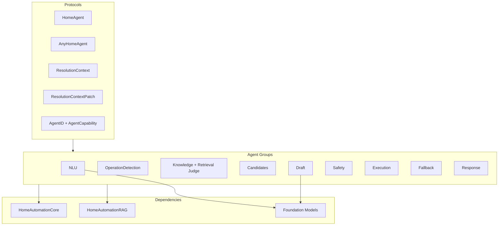
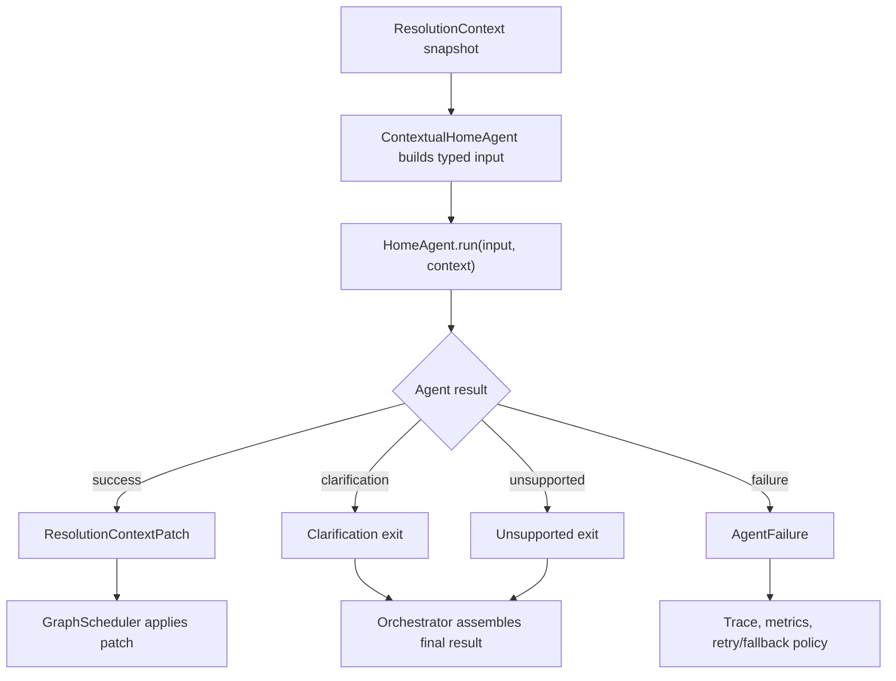

# HomeAutomationAgents Source Module

`HomeAutomationAgents` contains the specialist workers used by the orchestrator. Each agent has a narrow job, typed input/output, and a stable `AgentID`. Agents return context patches rather than mutating shared state.

This module answers the question: "Which specialist should produce the next piece of the resolution?"

## Architecture Role



## Folder Structure

```text
HomeAutomationAgents/
|-- Protocols/
|-- Runtime/
|-- OperationDetection/
|   |-- OperationDetectionAgent.swift
|   |-- OperationDetectionWorkerSession.swift
|   |-- HomeOperationDetectionService.swift
|   `-- Tools/
|-- NLU/
|   |-- Semantic/
|   |-- SlotExtraction/
|   |-- RiskClassification/
|   `-- Shared/
|       `-- Tools/
|-- AutomationRuntime/
|-- AutomationDraftExtraction/
|-- AutomationActionResolution/
|-- AutomationConditionOperandResolution/
|-- AutomationResultAssembly/
|-- SmartThingsCompilation/
|-- SmartThingsRuleCreation/
|-- Knowledge/
|   |-- Bixby/
|   |-- Capability/
|   |-- CommandExample/
|   |-- RetrievalJudge/
|   `-- Support/
|-- Candidates/
|   |-- Retrieval/
|   |-- Ranking/
|   |-- Shard/
|   |-- Hydration/
|   `-- Support/
|-- Draft/
|   |-- InstructionComposer/
|   |-- DraftGeneration/
|   |-- DraftRepair/
|   |-- Resolver/
|   |-- Tools/
|   `-- Types/
|-- Safety/
|   |-- Validation/
|   |-- ParameterValidation/
|   |-- ConfirmationPolicy/
|   `-- Support/
|-- Execution/
|   |-- Planning/
|   |-- Mock/
|   `-- Support/
|-- Fallback/
|   |-- Rule/
|   |-- Bixby/
|   `-- Unsupported/
|-- Response/
|   |-- Clarification/
|   `-- ResultSummary/
`-- RAG/
```

The directory layout intentionally separates agent boundaries from shared support code. Multi-agent domains such as `NLU`, `Candidates`, `Draft`, `Knowledge`, `Safety`, `Execution`, and `Fallback` use one subfolder per agent responsibility, while cross-agent DTOs and deterministic helpers live under `Support`, `Shared`, `Types`, or `Runtime`. Foundation Models tools are kept in `Tools` folders instead of being embedded in worker/session or resolver files.

## Agent Flow



## Agent Inventory

| Group | Agents | Responsibility |
| --- | --- | --- |
| Runtime | `AgentEventBus`, `ResolutionContextPatchKey` | Shared agent runtime utilities and patch/event types used by graph execution. |
| OperationDetection | `OperationDetectionAgent` | Root-routing Foundation Model-backed agent that emits operation, language, and domain, using semantic analyzer fallback and automation-creation safety preference. |
| NLU | `SemanticNLUAgent`, `SlotExtractionAgent`, `RiskClassificationAgent` | Active direct-command NLU stack. `SemanticNLUAgent` fuses intent-family and device-type extraction; slot and risk remain separate. |
| Automation | `AutomationDraftExtractionAgent`, `AutomationActionResolutionAgent`, `AutomationConditionOperandResolutionAgent`, `AutomationResultAssemblyAgent` | Extract automation drafts, resolve action/condition sub-work, and assemble final automation outcomes. |
| SmartThings | `SmartThingsCompilationAgent`, `SmartThingsRuleCreationAgent` | Compile SmartThings Rule JSON and optionally call the SmartThings rule creation backend. |
| Knowledge | `CapabilityKnowledgeAgent`, `BixbyKnowledgeAgent`, `CommandExampleAgent`, `RetrievalJudgeAgent` | Retrieve relevant context, hydrate canonical capability/Bixby/example facts, and report or retry weak retrieval. |
| Candidates | `CandidateRetrievalAgent`, `CandidateRankingAgent`, `CandidateShardAgent`, `CandidateHydrationAgent` | Find, scope, rank, shard, and hydrate candidate devices/routines. |
| Draft | `InstructionComposerAgent`, `DraftGenerationAgent`, `DraftRepairAgent` | Build prompt/tool packages and produce or repair `HomeCommandDraft` values. |
| Safety | `SafetyValidationAgent`, `ParameterValidationAgent`, `ConfirmationPolicyAgent` | Validate target/capability/command/risk/parameters and enforce confirmation policy. |
| Execution | `ExecutionPlanningAgent`, `MockExecutionAgent` | Convert valid drafts into plans and execute low-risk command steps against the mock registry. |
| Fallback | `RuleFallbackAgent`, `BixbyFallbackAgent`, `UnsupportedCommandAgent` | Resolve without Foundation Models or produce safe unsupported outcomes. |
| Response | `ClarificationAgent`, `ResultSummaryAgent` | Produce user-facing clarification or summary responses. |

## Protocol Components

| Component | Role |
| --- | --- |
| `AgentID` | Stable identity for each agent. These IDs are used by plans, registry lookup, circuit breakers, traces, and UI dashboard rows. |
| `AgentCapability` | Capability taxonomy used by registries and future dynamic planning. |
| `HomeAgent` | Strongly typed agent protocol with associated `Input` and `Output`. |
| `AnyHomeAgent` | Type-erased async agent interface consumed by `GraphScheduler`. |
| `AgentFailure` | Structured failure with agent ID, reason, and retryability. |
| `AgentTraceEntry` | Per-agent timing and result record. |
| `ResolutionContext` | Shared state snapshot read by agents. |
| `CommandRequest` | User command plus low-risk execution toggle. |
| `KnowledgeSnippet` | Compact knowledge item generated by knowledge agents. |
| `KnowledgeRetrievalReport` | Per-agent retrieval quality report with strategy, score stats, filters, retry count, and reformulated query. |
| `MemoryHint` | Conversation-memory hint. Agents may use it for ranking, never for execution authority. |
| `ResolutionContextPatch` | Typed patch emitted by an agent. |
| `AnySendableValue` | Sendable value box used inside patches. |
| `AgentRunResult` | Type-erased agent result: success, clarification, unsupported, retryable failure, or terminal failure. |

## NLU Components

| Component | Role |
| --- | --- |
| `OperationDetectionAgent` | Produces `HomeOperationRoutingResult` for orchestration routing, language detection, and domain classification. |
| `OperationDetectionWorkerSession` | Foundation Models worker session owned by `OperationDetectionAgent`; can call `OperationSemanticAnalyzerTool` for deterministic semantic grounding and preserves high-confidence automation creation from the analyzer. |
| `HomeOperationDetectionService` | Deterministic semantic analyzer used as the operation-detection fallback and optional model tool. |
| `SemanticNLUAgent` | Produces `HomeSemanticNLUResult` for active direct-command intent and device-type classification. |
| `SemanticNLUWorkerSession` | Foundation Models worker session that uses deterministic intent/device hints plus `AvailableDeviceTypesTool` to keep device types canonical. |
| `SlotExtractionAgentWorkerSession` | Foundation Models worker session owned by `SlotExtractionAgent`, with deterministic parser fallback. |
| `RiskClassificationAgentWorkerSession` | Foundation Models worker session owned by `RiskClassificationAgent`, with deterministic parser fallback. |
| `NLUModelCallPolicy` | Model-call policy for model-first, hinting, and legacy threshold-gated NLU behavior. |
| `SlotExtractionAgent` | Produces `HomeSlotExtractionResult`. |
| `RiskClassificationAgent` | Produces `HomeRiskClassificationResult`. |

Active NLU agents may use RAG few-shot examples, but their output is still treated as an advisory signal until deterministic validation. Root routing supplies language/domain before operation-specific graph planning; the direct-command graph runs `SemanticNLUAgent`, `SlotExtractionAgent`, and `RiskClassificationAgent` in parallel.

`AgentTextParser` extracts only the actual user command from few-shot prompts before deterministic parsing. It also keeps multiple high-signal intent families when a command combines goals, such as `.power` and `.temperature` for "Make bedroom warmer by turning off the AC".

## Knowledge Components

| Component | Role |
| --- | --- |
| `KnowledgeRetrievalAgentOutput` | Compatibility collection of snippets plus retrieval reports. |
| `CapabilityKnowledgeAgent` | Uses NLU-informed hybrid RAG to find relevant capability context, then hydrates canonical capability details. |
| `BixbyKnowledgeAgent` | Finds relevant Bixby commands using device names plus NLU hints, then returns canonical Bixby snippets. |
| `CommandExampleAgent` | Retrieves generated examples similar to the user command with semantic-only retrieval and device-type filters. |
| `RetrievalJudgeInput` | User text input for retrieval quality review. |
| `RetrievalJudgeAgent` | Accepts high-quality retrieval reports on a fast path, skips safely when models/RAG are unavailable, and performs one bounded reformulated retry for weak sources. |
| `AgentRAGSupport` | Internal helper for retrieval calls and chunk-to-snippet formatting. |

Knowledge agents reduce prompt size and improve focus, but they do not own source-of-truth capability or risk data. They return `KnowledgeRetrievalReport` values so the orchestrator can expose retrieval strategy, score, filter, retry, and judge metrics.

## Candidate Components

| Component | Role |
| --- | --- |
| `CandidateRetrievalInput` | User text, worker state, and memory hints for candidate lookup. |
| `CandidateRankingInput` | Candidate ranking input with compact candidates and hints. |
| `CandidateShardInput` | Input for one candidate shard. |
| `CandidateHydrationInput` | Candidate IDs to hydrate into full records. |
| `HomeCandidateResolverMetrics` | Stores strategy and candidate-count diagnostics. |
| `HomeCandidateResolverSupport` | Candidate scoring, strong room/device-type scoping, ranking, sharding, and aggregation support. |
| `CandidateRetrievalAgent` | Retrieves candidates from `MockHomeDeviceRegistry`, optionally merging semantic RAG device matches. |
| `CandidateRankingAgent` | Selects final candidate IDs or asks for clarification after strong room/device-type scoping. |
| `CandidateShardAgent` | Selects candidates inside one shard for large candidate lists. |
| `CandidateHydrationAgent` | Converts selected IDs into full `HomeCandidateRecord` values. |

Candidate model prompts are budgeted with `CandidateResolutionPromptBuilder`, compact candidate descriptions when needed, and use runtime `DynamicGenerationSchema` ID choices before the existing post-generation ID filter. The resolver scopes candidate lists by explicit room and device-type hints before sharding so a room-mismatched shard cannot introduce a misleading model winner.

## Draft Components

| Component | Role |
| --- | --- |
| `AgentToolProvider` | Chooses the compact default Foundation Models tools available to draft generation and estimates tool output budgets. |
| `AgentToolOutputSizeStore` | Tracks observed tool output sizes so later prompt budgets can use adaptive estimates. |
| `AgentFindDevicesTool` | Tool for searching devices by query, room, type, and limit. |
| `AgentInspectCandidateCommandTool` | Consolidated capability, command, mode, range, validation, and risk lookup tool. |
| `AgentGetCapabilitiesTool` | Compatibility tool for capability, command, enum, range, and risk lookup. |
| `AgentGetDeviceStateTool` | Tool for current device state. |
| `AgentGetSupportedModesTool` | Compatibility tool for supported enum and mode values. |
| `AgentValidateCommandTool` | Compatibility tool for pre-validating capability/command support and risk. |
| `AgentHydrateCandidatesTool` | Tool for hydrating candidate IDs. |
| `AgentInstructionSetFactory` | Builds `HomeModelInstructionPackage` from final input, tools, RAG context, canonical registries, and context-budget compaction. |
| `AgentDraftAttemptReport` | One draft attempt diagnostic, including structured Foundation Models error kind. |
| `AgentDraftResolutionReport` | Aggregate report across draft attempts. |
| `AgentDraftResolutionOutput` | Draft plus report. |
| `AgentDraftResolverMetrics` | Stores the latest draft-resolution report. |
| `AgentDraftResolver` | Retry wrapper around draft generation packages. |
| `InstructionComposerAgent` | Produces the instruction package. |
| `DraftGenerationAgent` | Produces the primary draft. |
| `DraftRepairAgent` | Attempts draft repair or lower-confidence draft selection. |

Draft generation now uses a consolidated inspection tool by default, caps tool outputs, and carries `HomeModelContextBudgetReport` inside the instruction package. Large prompts are compacted in ordered stages before being sent to Foundation Models. Adapter retry variants are skipped when no adapter is configured, and later adapter attempts are skipped after an adapter-unavailable failure.

## Safety and Execution Components

| Component | Role |
| --- | --- |
| `SafetyValidationInput` | Draft plus final resolution input. |
| `ParameterValidationInput` | Parameters plus selected device/capability/command. |
| `ConfirmationPolicyInput` | Intent, capability, device type, risk, command, and memory-derived-target flag. |
| `AgentCommandValidator` | Deterministic validator for target, capability, command, risk, and plan eligibility. |
| `SafetyValidationAgent` | Mandatory gate that produces a safe `HomeCommandResolution`. |
| `ParameterValidationAgent` | Mandatory gate that checks ranges and enum values. |
| `ConfirmationPolicyAgent` | Mandatory gate that blocks high-risk and memory-derived sensitive actions behind confirmation. |
| `ExecutionPlanningInput` | Draft plus selected device. |
| `AgentExecutionPlanner` | Converts validated drafts into execution plans. |
| `AgentPlanExecutor` | Executes allowed command steps through the mock registry. |
| `ExecutionPlanningAgent` | Mandatory gate that produces the execution plan. |
| `MockExecutionAgent` | Mandatory gate that mutates mock device state only for allowed low-risk commands. |

## Fallback and Response Components

| Component | Role |
| --- | --- |
| `RuleFallbackInput` | Text, execution toggle, and memory hints for deterministic fallback. |
| `AgentRuleBasedResolver` | Deterministic parser/scorer/executor used when models are unavailable or fallback is selected. |
| `RuleFallbackAgent` | Runs rule fallback and emits a resolver result patch. |
| `AgentTextParser` | Multilingual deterministic parser used by fallback and worker fallback logic; strips few-shot examples before parsing and can emit multiple intent families. |
| `AgentBixbyDraftMatch` | Candidate Bixby-derived draft and score. |
| `BixbyFallbackInput` | User text plus candidate devices for Bixby mapping. |
| `AgentBixbyFallbackMapper` | Maps Bixby command language into local drafts. |
| `BixbyFallbackAgent` | Produces draft/candidate patches from Bixby mappings. |
| `UnsupportedCommandAgent` | Produces a safe unsupported resolution. |
| `ClarificationAgent` | Produces clarification resolution text. |
| `ResultSummaryAgent` | Converts final resolution into user-facing summary text. |

## Safety Rules

- Agents never execute directly except `MockExecutionAgent`.
- Safety agents are mandatory fail-closed gates in the scheduler.
- Memory hints can influence ranking but cannot bypass hydration, validation, or confirmation.
- Retrieved RAG text is advisory; final facts are hydrated from `HomeAutomationCore`.
- Agent outputs must be traceable through `AgentTraceEntry` and pipeline events.
