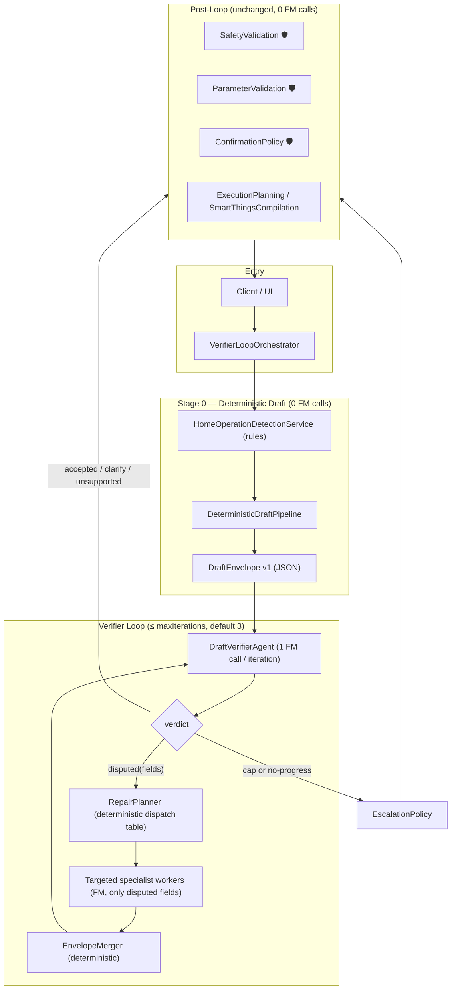

# Verifier-Loop Orchestration — Redesign Architecture

> **Status**: Proposal (design document)
> **Author**: Architecture analysis, 2026-07-07
> **Scope**: Replaces the fan-out "FM-first" pipelines with a deterministic-first,
> verifier-gated repair loop that minimizes Foundation Model calls.
> **Related docs**: `OrchestratorArchitecture.md`, `HomeAutomationAgents.md`
> **Implementation plan**: `LoopOrchestrationImplementationPlan.md` (task-level plan for coding agents)

---

## Part 1 — Current System Analysis

### 1.1 How the system works today

Every command flows through `HomeCommandOrchestrator.resolveStream(_:)`:

1. **Root routing graph** — a single-node DAG runs `OperationDetectionAgent`
   (1 FM call) to classify the command into `executeDeviceCommand`,
   `automationCreation`, or `unsupported`.
2. **Operation graph** — `GraphPlanner` + `OperationGraphCatalog` select a static
   DAG per operation; `GraphScheduler` executes it with a `withTaskGroup`
   batch loop: all nodes whose dependencies are satisfied run concurrently,
   each receiving an immutable `ResolutionContext` snapshot and returning a
   `ResolutionContextPatch` that the `ResolutionContextStore` actor applies
   atomically.
3. **Resilience** — per-agent circuit breakers, `GraphRetryController`,
   safety-gate nodes that `failClosed()`, and a rule-only fallback graph when
   `OrchestratorPolicyEngine.shouldUseModels()` is false.

### 1.2 The FM-first agent pattern

Every model-backed worker session follows the same shape:

```
deterministic result (AgentTextParser / heuristic)  ──► always computed
        │
        ▼
FM available?  ──no──► return deterministic result
        │yes
        ▼
FM call, with the deterministic result embedded as a "hint" in the prompt
        │
        ├─ success ──► return model result (risk can only be raised, never lowered)
        └─ error   ──► return deterministic result
```

**Key observation**: in the default `NLUModelCallPolicy.modelFirstWithHint` mode
the deterministic result is *always computed and then always double-checked by
an FM call*, even when the deterministic result is high-confidence and correct.
The legacy `thresholdGated` mode (skip FM when deterministic confidence ≥
threshold) already exists but is not the default.

### 1.3 Foundation Model call inventory

FM call sites (via `FoundationModelCallRecorder` and `session.respond`):

| Worker | Graph node | Calls per run |
|---|---|---|
| `OperationDetectionWorkerSession` | root graph | 1 (+ in-session analyzer tool round-trips) |
| `SemanticNLUWorkerSession` | direct P1 | 1 (+ `getAvailableDeviceTypes` tool) |
| `SlotExtractionAgentWorkerSession` | direct P1 | 1 |
| `RiskClassificationAgentWorkerSession` | direct P1 | 1 |
| Knowledge agents (capability / bixby / example) | direct P2 | 0 (RAG retrieval only) |
| `RetrievalJudgeAgent` | direct | 0 on fast path; bounded retry retrieval otherwise |
| `HomeCandidateResolverSupport` (ranking) | direct | 1 direct; or ⌈N/20⌉ shard calls + 1 aggregation for large candidate sets |
| `CapabilityResolutionWorker` | direct | 1 (+ inspection tool round-trips) |
| `AgentDraftResolver` → `FoundationHomeCommandDraftResolver` | direct | 1–2 without adapter (base/full → base/simplified), up to 4 with adapter |
| `AutomationComponentSegmentationWorkerSession` | automation | 1 |
| `AutomationTriggerResolutionWorkerSession` | automation fan-out | 1 per trigger |
| `AutomationConditionClauseResolutionWorkerSession` | automation fan-out | 1 per condition |
| `AutomationActionResolver` | automation fan-out | **full direct-command subgraph per action** |
| Safety / parameter / confirmation / execution / compilation agents | — | 0 (deterministic) |

### 1.4 Model-call budget today

**Direct command** ("Turn on the bedroom light"):

| Phase | FM calls |
|---|---|
| Operation detection | 1 |
| NLU fan-out (semantic, slot, risk — parallel) | 3 |
| Candidate ranking | 1 (up to ⌈N/20⌉+1) |
| Capability resolution | 1 |
| Draft generation | 1–2 |
| **Total** | **7 typical, 6–12 range** |

**Automation creation** ("Every day at 7 AM turn on the AC and close the blinds
if I'm home"): operation detection (1) + segmentation (1) + trigger (1) +
1 condition (1) + 2 actions × direct-command subgraph (~6 each) ≈ **16–18 FM
calls**. Actions are the dominant multiplier because each action re-runs
semantic NLU, slot extraction, risk, ranking, capability resolution, and draft
generation on a short action fragment.

### 1.5 Parallelism reality check

The `GraphScheduler` genuinely runs independent nodes concurrently
(`withTaskGroup`), and the automation fan-out runner and candidate shard
resolver do the same. However, **Apple's on-device Foundation Model is a single
shared system resource**: concurrent `LanguageModelSession.respond` requests
are effectively serialized/queued at the model layer. Parallel graph nodes
overlap their non-FM work (RAG retrieval, hydration, scoring), but the FM-bound
critical path is roughly *the sum of all FM calls*, not the longest branch.
That makes "reduce total FM calls" and "reduce end-to-end latency" the same
optimization on this platform — the strongest argument for the loop redesign.

### 1.6 Communication model (retained by the redesign)

- `ResolutionContextStore` (actor): snapshot-in / patch-out; no shared mutable state.
- `AgentEventBus` (actor): `AsyncStream` of pipeline events to the UI.
- `AgentTraceEntry` + `OrchestratorMetricsCollector` + `HomeAutomationTelemetry`: per-node observability.
- `CircuitBreakerRegistry`: per-agent failure isolation.

These subsystems are orchestration-topology-agnostic and are reused unchanged.

---

## Part 2 — Feasibility of the Verifier-Loop Strategy

### 2.1 The proposed strategy (restated)

1. **Deterministic pass** — rule-based system produces a complete result JSON
   with zero FM calls.
2. **Verifier** — one FM call compares the JSON against the user text and either
   accepts it (exit) or emits the specific *disagreed fields*.
3. **Repair loop** — for each disagreement, run only the specialist agents that
   own those fields, rebuild the JSON, and re-verify. Loop capped at 3–4
   iterations.

### 2.2 Why this is feasible in this codebase — the evidence

| Requirement | Existing building block | Gap |
|---|---|---|
| Full deterministic resolution, no FM | `AgentRuleBasedResolver` (intent → scoring → draft → validation), `AgentTextParser.deterministicState`, `HomeOperationDetectionService`, deterministic fallbacks inside *every* worker session (`AutomationPatternParserHintTool.fallbackPlan`, `deterministicOutput(for:)`, `CapabilityResolutionAgent.resolveDeterministically`, deterministic candidate scoring in `HomeCandidateResolverSupport`) | Assemble them into one first-pass pipeline that also emits per-field confidence |
| Structured verify verdict from a 3B on-device model | `@Generable` structured output + `DynamicGenerationSchema` (already used to constrain candidate IDs) | New `VerifierAgent` + verdict schema |
| Field-targeted re-resolution | Worker sessions are already independently invocable with typed inputs (`SlotExtractionAgentWorkerSession`, `CapabilityResolutionWorker`, trigger/condition workers, `AgentDraftResolver`) | A deterministic dispatch table mapping disputed field → worker |
| Loop state, tracing, events | `ResolutionContextStore`, `AgentEventBus`, `GraphRunMetrics`, telemetry spans | New per-iteration loop metrics |
| Safety invariants | Deterministic safety gates (`SafetyValidationAgent`, `ParameterValidationAgent`, `ConfirmationPolicyAgent`), risk safety floor | Keep gates *outside* the loop, unchanged |
| Precedent for skipping FM when rules are confident | `NLUModelCallPolicy.thresholdGated` mode | Promote the concept from per-agent gate to pipeline-level gate |

**Verdict: feasible with low architectural risk.** The system was built
"model-first with deterministic fallback"; the redesign inverts it to
"deterministic-first with model verification" — every deterministic component
required already exists and is unit-tested via the fallback paths.

### 2.3 Why a verifier is a good fit for the on-device model

- **Verification is easier than generation.** Judging whether
  `{device: bedroom-light-1, command: on}` matches "turn on the bedroom light"
  is a constrained classification task — much friendlier to a ~3B on-device
  model than open-ended multi-slot generation.
- **Constrained decoding** — the verdict schema enumerates the disputable
  fields, so the model literally cannot invent new failure categories.
- **Small prompts** — the on-device context window (~4k tokens) is tight for
  the current draft-generation prompts (hence `HomeModelContextBudgetReport`
  and staged compaction). A verifier prompt (user text + compact JSON + top-N
  candidate table) fits comfortably.
- **Session reuse** — a single multi-turn `LanguageModelSession` can host all
  verifier turns in a run, so re-verification benefits from prefix KV cache.

### 2.4 Risks and mitigations

| # | Risk | Mitigation |
|---|---|---|
| R-1 | Verifier false-accept (bad JSON ships) | Deterministic safety gates still run after the loop; risk floor unchanged; confirmation policy blocks high-risk actions; golden-dataset eval gate before rollout (§8) |
| R-2 | Verifier false-reject loops forever | Hard iteration cap (3); *strict progress rule*: the disputed-field set must shrink every iteration or the loop exits; per-field "already repaired once" latch |
| R-3 | Verifier lowers risk assessment | Verdict schema has no field that can lower risk; `riskUnderstated` is the only risk dispute, i.e. risk is raise-only, same safety floor as today |
| R-4 | Deterministic pass too weak on paraphrased/multilingual input | Verifier catches it and routes to FM specialists — this is precisely the designed repair path; RAG semantic hints already feed the deterministic scorer |
| R-5 | Verifier can't ground device names it has never seen | Verifier prompt includes the deterministic top-N candidate table (IDs + names + rooms + types) built with the existing `CandidateResolutionPromptBuilder` budgeting |
| R-6 | FM unavailable entirely | Loop degrades to "deterministic pass ships as-is", which is byte-for-byte today's fallback-graph behavior |
| R-7 | Oscillation between two specialists disputing each other | Specialist outputs are written through the same patch mechanism; re-verification only re-opens fields listed in the previous verdict; latch from R-2 stops the second re-repair |
| R-8 | Ambiguity that no repair can fix ("turn on the light" with 4 lights) | Deterministic pass already emits `needsClarification`; verifier confirms clarification as the *correct* outcome and the loop exits in 1 FM call |

### 2.5 Expected model-call budget (to be validated by evaluation)

| Scenario | Today | Loop redesign |
|---|---|---|
| Direct command, rules correct (est. 50–70% of golden set) | ~7 | **1** (verifier accept) |
| Direct command, 1–2 disputed fields | ~7 | 1 + 1–2 specialists + 1 re-verify = **3–4** |
| Direct command, worst case (cap hit) | ~10–12 | 1 + 3×(2+1) = **10** (bounded) |
| Automation, rules correct | ~16–18 | **1** |
| Automation, 2 disputed components | ~16–18 | 1 + 2–3 + 1 = **4–5** |
| FM unavailable | 0 (fallback graph) | **0** (identical) |

Even with a pessimistic 30% accept rate the expected average drops by ~50%;
with realistic accept rates the reduction is 60–85%, and — because on-device
FM calls serialize (§1.5) — latency scales down proportionally.

---

## Part 3 — Redesign Architecture

### 3.1 High-level topology



Operation detection moves into Stage 0 as a *rules-only* step
(`HomeOperationDetectionService` — already the analyzer behind today's FM
operation detection). Misroutes are caught by the verifier
(`operationType` is a disputable field), so the dedicated up-front FM routing
call is eliminated.

### 3.2 The DraftEnvelope — one JSON for the whole loop

A single versioned envelope unifies direct commands and automations so the
verifier sees one shape:

```swift
/// The canonical intermediate result that the loop verifies and repairs.
public struct DraftEnvelope: Codable, Sendable, Equatable {
    public var version: Int                       // schema version = 1
    public var userText: String
    public var operation: HomeAutomationOperationKind
    public var operationConfidence: Double

    // executeDeviceCommand payload
    public var command: CommandDraftSection?

    // automationCreation payload
    public var automation: AutomationDraftSection?

    // Cross-cutting
    public var risk: RiskSection                  // deterministic floor; raise-only
    public var clarification: ClarificationSection?
    public var provenance: [FieldID: FieldProvenance]   // rules | model | repaired(n)
    public var fieldConfidence: [FieldID: Double]
}

public struct CommandDraftSection: Codable, Sendable, Equatable {
    public var targetDeviceID: String?
    public var candidateTable: [CompactCandidate]  // top-N, feeds verifier grounding
    public var capability: String?
    public var commandName: String?
    public var parameters: [String: ParameterValue]
    public var room: String?
}

public struct AutomationDraftSection: Codable, Sendable, Equatable {
    public var trigger: TriggerDraft?
    public var conditions: [ConditionDraft]
    public var actions: [ActionDraft]              // each holds its own CommandDraftSection
    public var unsupportedFragments: [String]
}
```

`FieldID` is a stable dotted path (`"command.targetDeviceID"`,
`"automation.actions[1].parameters.temperature"`). Provenance and per-field
confidence let the verifier prompt say *which parts are least trusted* and let
telemetry attribute final-answer quality to rules vs. model repairs.

### 3.3 Stage 0 — DeterministicDraftPipeline

Composed entirely from existing deterministic components:

| Envelope field | Producer (existing code) |
|---|---|
| `operation` | `HomeOperationDetectionService.analyzeSemantics` |
| intent / device type / slots / risk | `AgentTextParser.deterministicState(for:)` |
| `candidateTable`, `targetDeviceID` | `AgentRuleBasedResolver` scoring (+ RAG `semanticHints`, memory hints) |
| `capability` / `commandName` / `parameters` | `AgentRuleIntent.makeDraftIntent` + `CapabilityResolutionAgent.resolveDeterministically` |
| `automation.trigger` | trigger worker's `deterministicOutput(for:)` |
| `automation.conditions` | condition worker's deterministic clause parser |
| `automation.actions[i]` | segmentation fallback (`AutomationPatternParserHintTool.fallbackPlan`) + per-action rule-based draft |
| `risk` | deterministic risk classification (the floor) |
| `clarification` | ambiguity detection already in `AgentRuleBasedResolver` (score gap < 2 → clarify) |

Runtime cost: registry scan + token scoring + optional vector retrieval —
tens of milliseconds, no FM.

### 3.4 Stage 1 — DraftVerifierAgent

One FM call per iteration, structured output, session reused across iterations:

```swift
@Generable
public struct DraftVerdict: Sendable, Equatable {
    @Guide(description: "true only if the draft faithfully covers every part of the user command")
    public var accepted: Bool

    @Guide(description: "Disagreements, empty when accepted. Never invent field ids.")
    public var disputes: [DraftDispute]

    @Guide(description: "Set true if the command is ambiguous and a clarification question is the right outcome")
    public var needsClarification: Bool

    @Guide(description: "Set true only if the draft understates risk; risk can never be lowered")
    public var riskUnderstated: Bool
}

@Generable
public struct DraftDispute: Sendable, Equatable {
    @Guide(description: "One of the disputable field ids listed in the prompt")
    public var fieldID: String
    public var kind: DisputeKind      // wrongValue | missing | extraneous | wrongTarget | wrongOperation | valueOutOfRange
    @Guide(description: "One short sentence citing the words in the user command that contradict the draft")
    public var evidence: String
    @Guide(description: "Optional corrected value when it is directly stated in the user command")
    public var suggestedValue: String?
}
```

Prompt contents (budgeted with the existing prompt-budget machinery):

1. User text (verbatim).
2. Compact rendering of the envelope (only populated fields).
3. The candidate table (IDs, names, rooms, types) — grounding for target checks.
4. The *closed list* of disputable field IDs for this envelope.
5. Low-confidence fields flagged (`fieldConfidence < 0.6`) to focus attention.
6. On iterations ≥ 2: only the previously disputed fields plus their new values
   (delta re-verification — smaller prompt, cached session prefix).

Hard rules enforced *after* the call, in code:
- Disputes referencing unknown field IDs are dropped (same pattern as
  `constrainAggregation` dropping invented candidate IDs).
- `suggestedValue` is advisory: it becomes a *hint* to the specialist, never
  written directly into the envelope.
- `riskUnderstated` can only raise `risk` (safety floor preserved).

### 3.5 Stage 2 — RepairPlanner (deterministic, zero FM calls)

The user-stated requirement "decide on demand which agents are needed, in which
sequence" is satisfied by a static dispatch table — no planning model call:

| Disputed field prefix | Specialist invoked (existing worker) | Notes |
|---|---|---|
| `operation` | `OperationDetectionWorkerSession` | re-route; if operation flips, rebuild envelope Stage 0 for the new operation (counts as one iteration) |
| `command.targetDeviceID`, `command.room` | `HomeCandidateResolverSupport.resolveDirectly` | scoped to the candidate table; shards only if verifier disputes the table itself |
| `command.capability`, `command.commandName` | `CapabilityResolutionWorker` | tool-assisted canonical lookup |
| `command.parameters.*` | `SlotExtractionAgentWorkerSession` → deterministic re-mapping | numeric/mode slots |
| `risk` (`riskUnderstated`) | none — deterministic raise to next level; `RiskClassificationAgentWorkerSession` only if evidence names a hazard the rules can't grade | raise-only |
| `automation.trigger.*` | `AutomationTriggerResolutionWorkerSession` | |
| `automation.conditions[i].*` | `AutomationConditionClauseResolutionWorkerSession` | only disputed index |
| `automation.actions[i].*` | targeted repair of that action's fields via the command-field rows above — **not** a full direct-command subgraph | |
| `automation.actions` (`missing`/`extraneous`) | `AutomationComponentSegmentationWorkerSession` | re-segment, then Stage 0 re-drafts only new components |

> The automation rows are elaborated in `AutomationCreationRedesign.md`, which
> replaces the per-action direct-command subgraph with automation-native
> specialists (`ActionFragmentNLUAgent`, `ActionTargetAgent`,
> `ActionCapabilityAgent`, rule-level `AutomationRiskAgent`) — those specialists
> are the dispatch targets for `automation.actions[i].*` disputes.
| whole-draft `wrongValue` on `command` draft | `AgentDraftResolver` (base/full only) | last-resort holistic regeneration |

Ordering and batching rules:

0. **Pre-verify repair pass**: envelope fields whose Stage-0 confidence is 0
   (the rules *know* they failed to fill them — e.g. a verb the capability
   table can't map) dispatch directly to their specialist **before the first
   verifier call**. Verifying a knowingly-incomplete envelope wastes a round;
   the verifier should always see the best complete draft. (Worked example:
   `AutomationCreationRedesign.md` §6.3.)
1. **Dependency order**: `operation` → segmentation → target/trigger →
   capability/condition → parameters. A dispute earlier in this chain defers
   repairs later in the chain to the next iteration (their inputs are stale).
2. **Independent repairs in one iteration run concurrently** at the task level
   (they still serialize at the FM layer, but non-FM work overlaps).
3. **Per-iteration specialist budget**: max 3 FM repair calls; overflow rolls
   to the next iteration (keeps the worst case bounded and the verifier's
   delta-prompt small).
4. **Repair latch**: a field repaired in iteration *k* that is disputed again
   in iteration *k+1* is not repaired a second time — it forces loop exit via
   the escalation policy (prevents oscillation).

### 3.6 Stage 3 — EnvelopeMerger and loop control

`EnvelopeMerger` applies specialist outputs as typed patches (same discipline
as `ResolutionContextPatch`), updates `provenance` to `.repaired(iteration:)`,
and bumps `fieldConfidence` from the specialist result.

```swift
public struct VerifierLoopPolicy: Sendable {
    public var maxIterations: Int = 3            // user requirement: 3–4
    public var maxRepairCallsPerIteration: Int = 3
    public var requireStrictProgress: Bool = true // dispute set must shrink
    public var escalation: EscalationMode = .clarify
}

public enum LoopExit: Sendable {
    case accepted(DraftEnvelope, iterations: Int)
    case clarification(String)                    // verifier or rules asked to clarify
    case unsupported(String)
    case escalated(DraftEnvelope, reason: EscalationReason) // cap / no progress / repair latch
}
```

Termination is structural, not probabilistic: the loop exits on **accept**,
**clarify**, **unsupported**, **iteration cap**, **no-progress** (dispute set
did not strictly shrink), or **repair latch** (same field disputed twice after
repair). Escalation policy on non-accept exit:

- `clarify` (default): convert the highest-severity unresolved dispute into a
  clarification question via the existing `ClarificationAgent` — safe, honest,
  and cheap.
- `legacyGraph` (rollout safety net): fall through to today's full
  direct-command / automation graph for this request. Guarantees the redesign
  can never be *worse* than the current system on quality, only on the rare
  escalated request's call count.

### 3.7 Post-loop stage (unchanged)

The accepted envelope is converted to today's `HomeCommandDraft` /
`HomeAutomationRuleDraft` and flows through the **unchanged** deterministic
tail: `SafetyValidationAgent` → `ParameterValidationAgent` →
`ConfirmationPolicyAgent` → `ExecutionPlanningAgent` / `MockExecutionAgent`,
and for automations `AutomationValidation` → `SmartThingsCompilation` →
`SmartThingsRuleCreation` → `AutomationResultAssembly`. All safety rules from
`HomeAutomationAgents.md` §Safety Rules hold verbatim: the verifier and
specialists influence the draft, never execution.

### 3.8 Sequence — direct command with one dispute

```mermaid
sequenceDiagram
    participant UI as Client
    participant VLO as VerifierLoopOrchestrator
    participant DDP as DeterministicDraftPipeline
    participant VER as DraftVerifierAgent (FM)
    participant RP as RepairPlanner
    participant CAP as CapabilityResolutionWorker (FM)
    participant GATES as Safety Gates (deterministic)

    UI->>VLO: "Make the living room warmer by 2 degrees"
    VLO->>DDP: build envelope (rules + RAG hints)
    DDP-->>VLO: envelope{target: thermostat-lr, capability: switch, cmd: on, conf: 0.41}
    VLO->>VER: verify(userText, envelope)         %% FM call 1
    VER-->>VLO: disputes[{command.capability, wrongValue, "warmer by 2 = temperature delta"}]
    VLO->>RP: plan(disputes)
    RP-->>VLO: [capabilityResolution]
    VLO->>CAP: resolve(target, hint)              %% FM call 2
    CAP-->>VLO: capability: thermostatCoolingSetpoint, cmd: raiseSetpoint, params:{delta:2}
    VLO->>VER: re-verify(delta fields)            %% FM call 3 (same session, cached prefix)
    VER-->>VLO: accepted
    VLO->>GATES: validate + confirm policy
    GATES-->>UI: readyToExecute (3 FM calls total; today: ~7)
```

### 3.9 Integration with the existing runtime

The loop is introduced as a **new orchestration mode beside the graph runtime**,
not a rewrite of it:

- `VerifierLoopOrchestrator` implements `HomeCommandResolving`, reusing
  `ResolutionContextStore`, `AgentEventBus`, `CircuitBreakerRegistry`,
  `OrchestratorMetricsCollector`, and telemetry spans (`spanKind: .graph`
  gains a sibling `.loopIteration`).
- Specialists are invoked through the existing `AgentRegistry` /
  `ContextualHomeAgent` adapters, so circuit breakers, timeouts
  (`withAgentTimeout`), and trace entries work unchanged.
- The envelope lives in the context store under a typed
  `ContextArtifactKey<DraftEnvelope>`; each loop stage emits normal patches, so
  the UI event stream and dashboards keep functioning.
- `OrchestratorPolicyEngine` gains `orchestrationMode: .graph | .verifierLoop`
  (config/feature flag), and `shouldUseModels() == false` short-circuits the
  loop to "ship the deterministic envelope through the gates" — the exact
  fallback-graph semantics of today.

New metrics per run: `loopIterations`, `verifierVerdictPerIteration`,
`disputedFieldIDs`, `repairCallCount`, `acceptedOnIteration`,
`escalationReason`, plus the existing FM-usage counters (which become the
headline KPI).

---

## Part 4 — Rollout Plan

### Phase 1 — Envelope + deterministic pipeline (no behavior change)
Build `DraftEnvelope` and `DeterministicDraftPipeline` from the existing
deterministic components; snapshot-test envelope output on the golden
evaluation dataset (`HomeAutomationEvaluation` already provides the corpus,
runner, and trace comparators).

### Phase 2 — Verifier offline
Run `DraftVerifierAgent` in shadow mode: verify Stage-0 envelopes for eval
corpus commands, log verdicts, measure **verifier precision/recall against
golden labels** (the make-or-break metric: false-accept rate must be ≤ the
current pipeline's end-to-end error rate on the same commands).

### Phase 3 — Loop behind a flag
Wire `VerifierLoopOrchestrator` with `escalation: .legacyGraph`. A/B against
the graph runtime in `EvaluationRunner`: accuracy delta, FM calls per command,
p50/p95 latency, clarification rate.

### Phase 4 — Default flip + simplification
Make the loop the default once quality gates pass, switch escalation to
`.clarify`, and demote the always-on FM fan-out graphs to the escalation path.
Candidate deletions afterward: the dedicated FM operation-detection call, the
3-call NLU fan-out, and the per-action direct-command subgraph.

### Exit criteria (measured on the golden dataset)

| Metric | Gate |
|---|---|
| End-to-end resolution accuracy | ≥ current graph runtime |
| False-accept rate (bad draft accepted) | ≤ current end-to-end error rate |
| Mean FM calls / direct command | ≤ 4 (vs ~7) |
| Mean FM calls / automation | ≤ 6 (vs ~16) |
| p95 loop iterations | ≤ 2 |
| Clarification rate | ≤ current + 3 pts |

---

## Part 5 — Open Questions

1. **Verifier grounding depth** — is the top-N candidate table enough, or does
   the verifier need capability catalogs for the target device type? Start
   with candidates only; add a read-only inspection tool to the verifier
   session if eval shows capability false-accepts.
2. **Session lifetime** — one verifier session per run (proposed) vs. a warm
   long-lived session with a rolling transcript. Warm sessions save prewarm
   latency but risk context bleed between commands; measure in Phase 2.
3. **Where clarification ranks vs. repair** — if the verifier flags both a
   dispute and `needsClarification`, current design prefers one repair
   iteration before asking the user. Eval should confirm users prefer that.
4. **Adapter models** — if a fine-tuned adapter ships later
   (`fine_tuning_strategy.md`), the verifier is the highest-leverage adapter
   target: a small verdict-tuned adapter compounds every command's savings.

---

## Appendix A — Component inventory (new vs. reused)

| Component | Status |
|---|---|
| `DraftEnvelope`, `FieldID`, provenance/confidence maps | **new** (pure data) |
| `DeterministicDraftPipeline` | **new façade** over existing deterministic code |
| `DraftVerifierAgent` + `DraftVerdict` schema | **new** (1 worker session, FM-backed) |
| `RepairPlanner` dispatch table | **new** (pure function) |
| `EnvelopeMerger` | **new** (pure function) |
| `VerifierLoopOrchestrator` + `VerifierLoopPolicy` | **new** (control flow) |
| All specialist worker sessions | **reused unchanged** |
| Safety gates, execution planning, SmartThings compilation | **reused unchanged** |
| Context store, event bus, circuit breakers, metrics, telemetry, eval harness | **reused unchanged** |
| Graph runtime (`GraphScheduler` et al.) | **retained** as escalation path during rollout |
