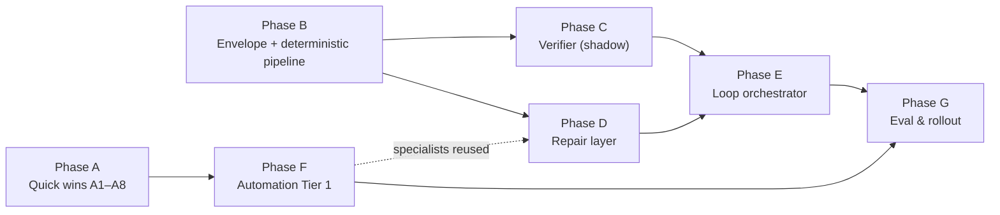

# Implementation Plan — Verifier-Loop Orchestration & Automation-Native Redesign

> **Status**: Ready for implementation
> **Date**: 2026-07-07
> **Audience**: Coding agents implementing the redesign. Every task lists exact
> files, API sketches, wiring points, tests, and acceptance criteria.
> **Required reading (in order)**:
> 1. `Docs/LoopOrchestrationArchitecture.md` — target architecture (envelope, verifier, repair loop)
> 2. `Docs/AutomationCreationRedesign.md` — automation-native specialists, quick wins Q-1…Q-6, worked example
> 3. `Docs/OrchestratorArchitecture.md` — current graph runtime being extended
>
> **Design decisions referenced here** (do not re-litigate; see the design docs):
> deterministic-first with FM verification; deterministic repair dispatch (no FM
> planner); pre-verify repair of confidence-0 fields; risk raise-only floor;
> safety gates stay outside the loop; iteration cap 3 with strict-progress rule.

---

## 0. Ground rules for implementing agents

### 0.1 Build & test

- Package root: `HomeAutomationCore/` (Swift 6.1, strict concurrency; platforms iOS 26 / macOS 26).
- Run tests: `cd HomeAutomationCore && swift test` (filter: `swift test --filter <TestClassName>`).
- Test targets: `HomeAutomationCoreTests`, `HomeAutomationAgentTests`,
  `HomeAutomationOrchestratorTests`, `HomeAutomationRAGTests`, `HomeAutomationEvaluationTests`.
- Eval CLI: `swift run home-automation-eval` (target `HomeAutomationEvalCLI`).

### 0.2 Conventions that MUST be followed

1. **No Foundation Models in unit tests.** Every worker session in this repo
   accepts mock closures (`classify:`, `extract:`, `resolve:` …) and a
   `foundationModelAvailability: @Sendable () -> Bool` parameter. New workers
   must follow the same pattern. Tests pass `{ false }` (deterministic path) or
   a mock closure (model path).
2. **All new types are `Sendable`**; shared mutable state lives in `actor`s.
   Follow the snapshot-in / patch-out discipline (`ResolutionContext` /
   `ResolutionContextPatch`) — agents never mutate shared state.
3. **Everything ships behind flags, default off.** The graph runtime must be
   byte-for-byte unaffected while a flag is off. Each phase lands green.
4. **Safety invariants** (violating any of these fails review):
   risk is raise-only; `SafetyValidationAgent`/`ParameterValidationAgent`/
   `ConfirmationPolicyAgent` run on every accepted draft; only
   `MockExecutionAgent` mutates device state; verifier/specialist output never
   reaches execution without passing the gates.
5. **Telemetry**: every FM call goes through `FoundationModelCallRecorder.record`
   (`Sources/HomeAutomationCore/Telemetry/FoundationModelCallRecorder.swift`);
   every new pipeline stage publishes `OrchestratorPipelineEvent`s and
   `HomeAutomationTelemetry` spans like existing code does.
6. New agent IDs are added in
   `Sources/HomeAutomationAgents/Protocols/AgentCapability.swift` (extension on
   `AgentID`); new typed artifacts in
   `Sources/HomeAutomationAgents/Protocols/ScopedContext.swift`
   (`ContextArtifactKeys`).

### 0.3 Phase / dependency map



Phases A, B, and F can start in parallel. Within a phase, tasks are ordered by
dependency. Suggested PR granularity = one task (A-tasks) or one to two tasks
(B–F).

---

## Phase A — Quick wins (independently shippable, no architecture change)

### A1. Semantic NLU timeout parity

**Problem**: `SemanticNLUAgent.timeoutNanoseconds = 560_000_000_000` (9.3 min)
and the worker has no soft timeout, unlike slot/risk workers.

**Modify**
- `Sources/HomeAutomationAgents/NLU/Semantic/SemanticNLUAgent.swift`
  — `timeoutNanoseconds` 560 s → `60_000_000_000`.
- `Sources/HomeAutomationAgents/NLU/Semantic/SemanticNLUWorkerSession.swift`
  — add `modelSoftTimeoutNanoseconds: UInt64 = 12_000_000_000` init parameter;
  wrap the `session.respond` block in `withNLUModelSoftTimeout(agentID: .semanticNLU, …)`
  exactly as `SlotExtractionAgentWorkerSession.extractSlots` does (timeout →
  catch → return deterministic `fallback`).

**Tests** (`Tests/HomeAutomationAgentTests/`, extend `Phase2AgentTests.swift` or
new `SemanticNLUTimeoutTests.swift`): a mock `classify` closure that sleeps past
a tiny configured soft timeout must yield the deterministic fallback result —
note the mock path bypasses the FM branch, so instead inject via
`modelExtract`-style seam: add an optional `modelClassify` closure parameter
mirroring `SlotExtractionAgentWorkerSession.modelExtract` so the timeout path is
testable without FM.

**Accept**: soft-timeout test green; existing `FMFirstMigrationTests`,
`AgentContractTests` unchanged and green.

### A2. Configurable NLU soft-timeout budget

**Modify**
- Add `public struct NLUSoftTimeoutBudget: Sendable { public var nluClassNanoseconds: UInt64 }`
  to `Sources/HomeAutomationAgents/NLU/Shared/NLUModelSoftTimeout.swift` with
  `static let `default` = NLUSoftTimeoutBudget(nluClassNanoseconds: 4_000_000_000)`.
- Thread it through the three NLU worker session inits (default parameter keeps
  source compatibility) and through `DefaultAgentRegistryFactory.make`
  (`Sources/HomeAutomationOrchestrator/DefaultAgentRegistryFactory.swift`) so a
  single value controls all three.

**Accept**: default budget is 4 s for all NLU-class workers; overridable per
construction; tests assert the plumbing (constructor passes value through).

### A3. Scoped NLU policy override → threshold-gate the automation action subgraph

**Problem**: workers are built once with `NLUModelCallPolicy.default`
(`modelFirstWithHint`); action subgraphs can't opt into `thresholdGated`.

**Create**
- `ContextArtifactKeys.nluPolicyOverride()` in
  `Sources/HomeAutomationAgents/Protocols/ScopedContext.swift`:

```swift
public static func nluPolicyOverride(
    in scope: ContextScope = .root
) -> ContextArtifactKey<NLUModelCallMode> {
    ContextArtifactKey("nluPolicyOverride", scope: scope,
        debugDescription: "Per-run override of the NLU model-call mode.")
}
```

**Modify**
- `SemanticNLUAgent.run`, `SlotExtractionAgent.run`,
  `RiskClassificationAgent.run`: read the artifact from `context`; pass an
  optional `modeOverride: NLUModelCallMode?` into the worker call.
- The three worker sessions: accept `modeOverride` in the public method
  signature; when present, evaluate `shouldUseModel`/`shouldProvideHint` with a
  policy whose `mode` is the override (thresholds unchanged).
- `AutomationActionResolver.seedDirectCommandRoutingContext`
  (`Sources/HomeAutomationOrchestrator/Automation/AutomationActionResolver.swift`):
  set the artifact to `.thresholdGated` on the fresh subgraph context store
  (add a `setArtifact` helper on `ResolutionContextStore` if not present —
  mirror `setScopedValue`).

**Tests**
- `HomeAutomationAgentTests`: with override `.thresholdGated` and a
  deterministic parse ≥ threshold (input `"turn on the ac"` → 0.82), the model
  closure must NOT be invoked (assert via a counting mock).
- `HomeAutomationOrchestratorTests` (extend `AutomationCreationFlowTests`):
  automation run with mocked workers — assert action-subgraph NLU model mocks
  are not called for a simple action, while root-level direct commands still
  call them.

**Accept**: for `"Turn on <device>"` actions, zero NLU FM calls inside the
subgraph; `OrchestratorMetrics.foundationModelUsage.modelCallCount` drops
accordingly (assert in test via `FoundationModelCallRecorder` counters if
exposed, else via mock counters).

### A4. Skip RAG few-shot enrichment for short/confident inputs

**Modify** `AgentRAGSupport.nluInput`
(`Sources/HomeAutomationAgents/RAG/AgentRAGSupport.swift` — the `enum AgentRAGSupport`):

```swift
static func nluInput(
    _ input: String,
    task: String,
    contextRetriever: ContextRetriever?,
    deterministicConfidence: Double? = nil,   // new
    minTokenCount: Int = 8                    // new
) async -> String
```

Return `input` unchanged when `input` has fewer than `minTokenCount`
whitespace-separated tokens OR `deterministicConfidence ?? 0 >= 0.78`.
Callers (`SemanticNLUAgent.run`, `SlotExtractionAgent.run`,
`RiskClassificationAgent.run`) pass the confidence from
`AgentTextParser.deterministicState(for: input)` (compute once, reuse for the
worker fallback — removes one duplicate parse, cf. RC-7).

**Tests**: short input → no retriever call (counting mock `ContextRetriever`);
long low-confidence input → retriever called, examples prepended.

### A5. `FoundationModelGate` — global FM admission + queue-wait telemetry

**Create** `Sources/HomeAutomationCore/Telemetry/FoundationModelGate.swift`:

```swift
/// Serializes/limits concurrent Foundation Model calls so queue wait is
/// explicit and measurable instead of hidden inside model latency.
public actor FoundationModelGate {
    public static let shared = FoundationModelGate(maxConcurrent: 2)
    public init(maxConcurrent: Int)
    /// Waits for a slot; returns queue-wait duration for telemetry.
    public func admit() async -> TimeInterval
    public func release()
}
```

FIFO waiter queue via `CheckedContinuation`s stored in an array; `admit`
returns immediately when below `maxConcurrent`.

**Modify** `FoundationModelCallRecorder.record` to `await
FoundationModelGate.shared.admit()` before invoking the operation, `release()`
in a `defer`, and add `fmQueueWaitMs` to its telemetry payload and to
`OrchestratorMetrics.foundationModelUsage` (add field
`totalQueueWaitMs: Double` in
`Sources/HomeAutomationOrchestrator/OrchestratorMetricsCollector.swift`
metric struct + capture path).

**Tests** (`HomeAutomationCoreTests/TelemetryTests.swift` extension): with
`maxConcurrent: 1` and two concurrent fake operations of 50 ms, second
reports ≥ 40 ms queue wait; no deadlock on cancellation (cancel a waiting
task, gate still admits others).

**Accept**: all FM call sites (they already funnel through the recorder) are
gated; dashboards show `fmQueueWaitMs`.

### A6. Remove mandated tool round-trip from semantic NLU

**Modify** `SemanticNLUWorkerSession`:
- Build the instruction text with the catalog inlined:
  `AvailableDeviceTypesTool.defaultCatalog()` rendered as
  `"Valid device types: id — displayName"` lines (the catalog is small/static).
- Drop the tool from `LanguageModelSession(tools:…)` and delete rule
  "1. FIRST call the getAvailableDeviceTypes tool…"; renumber rules; keep the
  "identifiers only from the list" constraint.
- Keep `AvailableDeviceTypesTool` (still used elsewhere/tests).

**Tests**: existing `AvailableDeviceTypesToolTests` untouched; update any
semantic NLU prompt snapshot assertions; add assertion that instructions
contain the inlined catalog.

### A7. Close the `windowShade` verb gap deterministically

**Modify** `Sources/HomeAutomationAgents/Fallback/Rule/FallbackRuleTypes.swift`
power branches (`tvRulePowerOffPhrases` / `tvRulePowerOnPhrases` init cases):
capability preferences become ordered lists —
off: `[switch.off, windowShade.close]`, on: `[switch.on, windowShade.open]`.
`makeDraftIntent` already picks the first capability the device supports, so
blinds now bind `windowShade.close` for "turn off the blinds".

**Tests** (`HomeAutomationAgentTests`, new `RuleIntentCoverageTests.swift`):
`"turn off the blinds"` against a `HomeCandidateRecord` with
`capabilities: ["windowShade", …]` yields draft `windowShade`/`close`; a
switch device still yields `switch`/`off` (ordering preserved).

### A8. Cap automation fan-out concurrency

**Modify**
- `AutomationActionResolver.defaultMaxConcurrentActions` `Int.max` → `2`.
- `AutomationComponentFanOutRunner.resolve`: chunk the task-group submission
  (trigger + conditions + actions) with the same admission style — simplest:
  rely on A5's gate for FM-level fairness and keep task-level concurrency
  unbounded, but reduce `maxConcurrentActions` so per-action context stores /
  event forwarding don't fan out unboundedly.

**Tests**: `Phase7FanOutTests` — assert `maxConcurrentComponents` telemetry ≤
configured bound for a 4-action plan.

---

## Phase B — DraftEnvelope + DeterministicDraftPipeline

New folder: `Sources/HomeAutomationAgents/Loop/` (module `HomeAutomationAgents`).

### B1. Envelope types

**Create** `Sources/HomeAutomationAgents/Loop/DraftEnvelope.swift` implementing
the schema from `LoopOrchestrationArchitecture.md` §3.2:

- `DraftEnvelope` (Codable, Sendable, Equatable) with `version = 1`,
  `userText`, `operation: HomeAutomationOperationKind`, `operationConfidence`,
  `command: CommandDraftSection?`, `automation: AutomationDraftSection?`,
  `risk: RiskSection`, `clarification: ClarificationSection?`,
  `provenance: [FieldID: FieldProvenance]`, `fieldConfidence: [FieldID: Double]`.
- `FieldID`: `struct FieldID: RawRepresentable<String>, Hashable, Codable,
  Sendable, ExpressibleByStringLiteral` — dotted paths; provide builders:
  `FieldID.command(.targetDeviceID)`, `FieldID.action(1, .capability)`,
  `FieldID.conditionLeaf(0, .target)`, `FieldID.conditionTreeGroup(0)` so
  string assembly is centralized. **All disputable IDs must be enumerable**:
  `DraftEnvelope.disputableFieldIDs() -> [FieldID]` returns the closed list for
  the current envelope shape (drives verifier schema + verdict constraint).
- `FieldProvenance`: `enum { case rules, model, repaired(iteration: Int) }`.
- `CommandDraftSection`: `targetDeviceID`, `candidateTable: [CompactCandidate]`
  (reuse `HomeCompactCandidateView` if it is `Codable`; otherwise define
  `CompactCandidate { id, name, room, deviceType }` with an init from
  `HomeCandidateRecord`), `capability`, `commandName`,
  `parameters: [HomeResolvedParameter]`, `room`.
- `AutomationDraftSection`: `trigger: TriggerDraft?`,
  `conditionTree: ConditionTreeDraft?`, `conditionLeaves: [ConditionLeafDraft]`,
  `actions: [ActionDraft]` (each `ActionDraft` embeds a `CommandDraftSection` +
  `rawText` + `order`), `unsupportedFragments: [String]`,
  `precedenceAmbiguous: Bool` (amendment A-1 in
  `AutomationCreationRedesign.md` §6.4).
- `RiskSection`: `level: HomeRiskLevel`-equivalent (reuse
  `HomeRiskClassificationResult`), `floorReason: String`. Provide
  `mutating func raise(to:reason:)` that ignores lower levels (floor).

**Tests** `Tests/HomeAutomationAgentTests/DraftEnvelopeTests.swift`:
round-trip Codable; `disputableFieldIDs` for a command envelope vs an
automation envelope (exact expected lists); `RiskSection.raise` cannot lower.

### B2. Envelope artifact key + patch plumbing

**Modify**
- `ContextArtifactKeys` (ScopedContext.swift): add
  `draftEnvelope() -> ContextArtifactKey<DraftEnvelope>`.
- No `ResolutionContextStore.apply` changes needed — artifacts already flow
  through `patch.setArtifact` (see `AutomationDraftExtractionAgent` patch in
  `DefaultAgentRegistryFactory.swift` for the pattern).

### B3. DeterministicDraftPipeline — direct command

**Create** `Sources/HomeAutomationAgents/Loop/DeterministicDraftPipeline.swift`:

```swift
public struct DeterministicDraftPipeline: Sendable {
    public init(
        registry: any DeviceRegistryProtocol,
        contextRetriever: ContextRetriever?,   // semantic hints only
        validator: AgentCommandValidator
    )
    public func makeCommandEnvelope(
        text: String, memoryHints: [MemoryHint]
    ) async -> DraftEnvelope
    public func makeAutomationEnvelope(text: String) async -> DraftEnvelope   // B4
}
```

`makeCommandEnvelope` composes **existing** deterministic components — do not
rewrite logic, extract/reuse:
1. `HomeOperationDetectionService().analyzeSemantics(text)` → `operation` + confidence.
2. `AgentTextParser.deterministicState(for:)` → intent/deviceType/slots/risk
   (risk → `RiskSection` floor).
3. Candidate scoring: reuse `AgentRuleBasedResolver`'s scoring. **Refactor
   step**: extract its private `score(_:for:normalized:semanticHints:)` +
   `AgentRuleIntent` binding into an internal
   `RuleCandidateScorer` (`Sources/HomeAutomationAgents/Fallback/Rule/RuleCandidateScorer.swift`)
   used by both `AgentRuleBasedResolver` and this pipeline (keeps one source of
   truth; `AgentRuleBasedResolver` behavior unchanged — pin with existing tests).
4. Capability: `CapabilityResolutionAgent.resolveDeterministically(…)`
   (`Sources/HomeAutomationAgents/Candidates/CapabilityResolution/`).
5. Fill `fieldConfidence` (scorer margins → target confidence; rule-intent hit →
   capability confidence; unresolved → **0.0**) and `provenance = .rules` for
   every populated field. Ambiguity (top-2 score gap < 2, mirroring
   `AgentRuleBasedResolver.isAmbiguous`) → `clarification` section populated,
   target confidence 0.4.

**Tests** `DeterministicDraftPipelineTests.swift` against
`MockHomeDeviceRegistry`: "turn on the bedroom light" → full envelope, no
zero-confidence fields; "make the living room warmer by 2 degrees" → envelope
with `thermostatCoolingSetpoint/heatingSetpoint` preference and delta param;
"turn off the blinds" (pre-A7) → `capability` confidence 0. Table-driven; add
cases from `EvaluationCorpus.defaultCases` inputs.

### B4. DeterministicDraftPipeline — automation

Same file/type, `makeAutomationEnvelope`:
1. `AutomationPatternParser().parse(text)` →
   `AutomationPatternParserHintTool.componentPlan(from:sourceText:)` (already
   public) → trigger/actions/conditions/conditionTree.
2. Trigger: reuse the deterministic path of
   `AutomationTriggerResolutionWorkerSession` — **refactor step**: extract its
   private `deterministicOutput(for:)`/`scheduleTrigger(from:)` into
   `Sources/HomeAutomationAgents/Automation/TriggerResolution/DeterministicTriggerResolver.swift`
   (struct, pure), consumed by both the worker session and this pipeline.
3. Condition leaves: reuse `AutomationConditionParser` output; each leaf gets a
   per-leaf candidate table (score leaf `description` against
   `registry.allDevices()` with `RuleCandidateScorer`).
4. Actions: `makeCommandEnvelope` per action fragment (§B3) mapped into
   `ActionDraft`s.
5. `precedenceAmbiguous`: true iff the normalized condition text contains both
   `" and "` and `" or "` (top level, reuse
   `AutomationPatternParser.logicalSegments`).
6. Envelope risk = max over trigger/actions deterministic risk.

**Tests**: the §6 worked example from `AutomationCreationRedesign.md` verbatim —
assert tree shape `OR(AND(light,fan),tv)`, `precedenceAmbiguous == true`,
action a2 capability confidence 0 (pre-A7) / `windowShade.close` (post-A7);
plus 3–4 simpler automations.

### B5. Envelope fixtures over the golden dataset

**Create** `Tests/HomeAutomationEvaluationTests/EnvelopeSnapshotTests.swift`:
run `DeterministicDraftPipeline` over `EvaluationCorpus.defaultCases` (and the
generated dataset via `EvaluationRunner.runGeneratedDataset` inputs), write
JSON snapshots under `Tests/…/__Snapshots__/`, assert stability + report the
fraction of cases with all-fields-confident envelopes (this number is the
baseline "verifier-accept upper bound" for Phase G).

---

## Phase C — Verifier (shadow mode first)

New folder: `Sources/HomeAutomationAgents/Loop/Verifier/`.

### C1. Verdict types

**Create** `DraftVerdict.swift`:
- Plain structs (Codable/Sendable/Equatable): `DraftVerdict { accepted,
  disputes: [DraftDispute], needsClarification, riskUnderstated }`,
  `DraftDispute { fieldID: String, kind: DisputeKind, evidence: String,
  suggestedValue: String? }`,
  `enum DisputeKind: String, Codable { wrongValue, missing, extraneous,
  wrongTarget, wrongOperation, valueOutOfRange, wrongGrouping }`.
- FM schema built with **`DynamicGenerationSchema`**, not `@Generable`, so
  `fieldID` is constrained to `envelope.disputableFieldIDs()` and `kind` to the
  enum cases — follow the exact pattern of
  `HomeCandidateResolverSupport.aggregationSchema(allowedIDs:)`
  (`Sources/HomeAutomationAgents/Candidates/Support/CandidateResolverSupport.swift:397`),
  including the `GeneratedContent` → struct decode helpers.

### C2. Verifier prompt builder

**Create** `VerifierPromptBuilder.swift`:

```swift
public struct VerifierPromptBuilder: Sendable {
    public static let instructions: String   // static system instructions
    public func makeInitialPrompt(envelope: DraftEnvelope) -> VerifierPrompt
    public func makeDeltaPrompt(
        envelope: DraftEnvelope,
        previousDisputes: [DraftDispute],
        repairedFields: [FieldID]
    ) -> VerifierPrompt
}
public struct VerifierPrompt: Sendable { let text: String; let characterCount: Int }
```

Initial prompt contents (order matters, see architecture doc §3.4): user text;
compact envelope rendering (only populated fields, human-readable lines, NOT
raw JSON — cheaper tokens, easier for a 3B model); candidate table(s); for
automations the **stated grouping interpretation in words** (amendment A-2,
e.g. `Interpretation: (light is on AND fan is off) OR tv is off`); the closed
disputable-field list; low-confidence fields flagged `⚠`. Delta prompt: only
previously disputed fields + their new values. Enforce a character budget
(reuse the budgeting approach of `CandidateResolutionPromptBuilder`); if over
budget, truncate candidate tables to top-3 per section first.

**Tests** `VerifierPromptBuilderTests.swift`: snapshot both prompts for a
command envelope and the §6 automation envelope; budget enforcement test
(40-device candidate table → truncated, prompt under budget).

### C3. Verifier worker session

**Create** `DraftVerifierWorkerSession.swift` — follow the standard worker
pattern (mock closure, availability closure, recorder, soft timeout):

```swift
public struct DraftVerifierWorkerSession: Sendable {
    public init(
        verify: (@Sendable (DraftEnvelope, VerifierPrompt) async throws -> DraftVerdict)? = nil,
        foundationModelAvailability: @escaping @Sendable () -> Bool = { SystemLanguageModel.default.isAvailable },
        softTimeoutNanoseconds: UInt64 = 8_000_000_000
    )
    /// One LanguageModelSession per loop run, held by the caller for KV reuse.
    public func makeSession() -> LanguageModelSession
    public func verify(
        envelope: DraftEnvelope, prompt: VerifierPrompt,
        session: LanguageModelSession
    ) async throws -> DraftVerdict
}
```

- FM unavailable → **throw `VerifierUnavailable`** (caller decides: ship
  deterministic envelope through gates — architecture doc R-6).
- Record via `FoundationModelCallRecorder` with
  `agentID: AgentID.draftVerifier.rawValue` (add
  `static let draftVerifier = AgentID("draftVerifier")` — Protocols/AgentCapability.swift).
- **Post-constraint (in code, after decode)**: drop disputes whose `fieldID` ∉
  `disputableFieldIDs()`; drop duplicates; clamp `disputes.count ≤ 6`;
  `accepted == true` forces `disputes = []`. Mirror
  `constrainAggregation`'s defensive style.

**Tests**: mock-closure driven — constraint dropping (invented fieldID
removed), unavailability throw, accepted-clears-disputes.

### C4. Shadow-mode evaluation

**Create** `Sources/HomeAutomationEvaluation/VerifierShadowRunner.swift` +
CLI subcommand `shadow-verify` in
`Sources/HomeAutomationEvalCLI/EvalCLI.swift`:

- For each eval case: build Stage-0 envelope (B3/B4) → real verifier (requires
  FM-capable machine; skip gracefully when unavailable) → compare
  `verdict.accepted` and disputed fields against golden expectations
  (`ExpectedTraceContractFactory` / dataset labels) → emit
  `VerifierShadowReport { acceptRate, falseAcceptRate, falseRejectRate,
  perFieldConfusion }` as JSON via the existing `EvaluationRunner.write` style.
- **This produces the go/no-go number for Phase E** (gate: false-accept rate ≤
  current end-to-end error rate on the same cases — architecture doc §Phase 2).

---

## Phase D — Repair layer

New folder: `Sources/HomeAutomationAgents/Loop/Repair/`.

### D1. RepairPlanner

**Create** `RepairPlanner.swift` — pure, deterministic, unit-testable:

```swift
public struct RepairPlanner: Sendable {
    public struct Plan: Sendable, Equatable {
        public let steps: [RepairStep]          // ordered
        public let deferred: [DraftDispute]     // stale-input or over-budget
    }
    public struct RepairStep: Sendable, Equatable {
        public let specialist: RepairSpecialistID
        public let fieldIDs: [FieldID]
        public let disputes: [DraftDispute]
    }
    public func plan(
        disputes: [DraftDispute],
        envelope: DraftEnvelope,
        latchedFieldIDs: Set<FieldID>,          // repaired-once fields
        maxRepairCalls: Int                     // per-iteration budget (3)
    ) -> Plan
}
public enum RepairSpecialistID: String, Sendable {
    case operationDetection, fragmentNLU, target, capability,
         riskRaise /*deterministic*/, trigger, conditionClause, segmentation,
         holisticDraft
}
```

Dispatch table + ordering per `LoopOrchestrationArchitecture.md` §3.5
(dependency order `operation → segmentation → target/trigger →
capability/condition → parameters`; disputes on latched fields → `deferred`
and mark loop-exit; batch independent steps up to `maxRepairCalls`).
`riskUnderstated` maps to `riskRaise` (deterministic, does not consume FM budget).

**Tests** `RepairPlannerTests.swift` — table-driven: single capability dispute →
one step; operation dispute + parameter dispute → parameter deferred; latched
field disputed again → deferred + flagged; 5 disputes with budget 3 → 3 steps
+ 2 deferred; `wrongGrouping` → `segmentation` specialist scoped to the
condition tree.

### D2. `ActionFragmentNLUAgent` (merged NLU specialist)

**Create** `Sources/HomeAutomationAgents/Loop/Repair/FragmentNLUWorkerSession.swift`:
- One FM call producing `{intentFamilies, deviceTypes, slots}` in a single
  `DynamicGenerationSchema` (union of `HomeSemanticNLUResult` +
  `HomeSlotExtractionResult` fields, **no risk**).
- Deterministic-first: `AgentTextParser.deterministicState`; call FM only when
  invoked as a repair (the planner only invokes it on disputes, so no
  τ-gating needed inside).
- No RAG few-shot, no tools; device-type catalog inlined (A6 pattern).
- `AgentID`: `static let fragmentNLU = AgentID("fragmentNLU")`.

**Tests**: mock closure decode test + deterministic fallback test.

### D3. `ActionTargetAgent`

**Create** `Repair/ActionTargetResolver.swift` — thin wrapper over the existing
`HomeCandidateResolverSupport.resolveDirectly` scoped to
`envelope.command.candidateTable` (or a condition leaf's table):

```swift
public struct ActionTargetResolver: Sendable {
    public init(support: HomeCandidateResolverSupport)
    public func resolve(
        fragmentText: String, state: HomeResolutionState,
        candidates: [HomeCompactCandidateView], hint: String?  // verifier suggestedValue
    ) async throws -> HomeCandidateAggregationResult
}
```

Deterministic skip rule: if top-2 deterministic score gap ≥ margin, return
without FM (the support already computes `deterministicAggregation`; add a
public entry that exposes it — small refactor, keep private logic in place).

### D4. `ActionCapabilityAgent` + `StructuralDraftBuilder`

- Capability repair = existing `CapabilityResolutionWorker.resolve`
  (`Sources/HomeAutomationAgents/Candidates/CapabilityResolution/CapabilityResolutionWorker.swift`)
  — **no new worker**. Wrap: build `CapabilityResolutionInput` from the
  envelope (fragment text, selected device, slots) and feed
  `verifier.suggestedValue` into the prompt's hint block.
- **Create** `Loop/StructuralDraftBuilder.swift`:

```swift
public enum StructuralDraftBuilder {
    /// Builds the final HomeCommandDraft purely from resolved envelope fields.
    public static func commandDraft(from section: CommandDraftSection,
                                    risk: RiskSection) -> HomeCommandDraft?
}
```

  Direct field mapping; returns nil if target/capability/command missing.
  **This replaces the per-action `draftGeneration` FM call.**

**Tests**: envelope → draft mapping including parameters; nil on missing
capability.

### D5. `AutomationRiskAgent` (deterministic)

**Create** `Loop/Repair/AutomationRiskAssessor.swift` (pure):
`assess(envelope) -> RiskSection` = max over per-component deterministic risk
(`AgentTextParser.deterministicState(for: fragment).risk`), floor semantics,
plus rule-level confirmation flag via existing `ConfirmationPolicyAgent`
inputs (`ConfirmationPolicyInput`) evaluated **once** post-loop — no new FM.

**Tests**: high-risk action ("unlock the front door" as automation action)
raises the envelope risk and sets confirmation.

### D6. `EnvelopeMerger`

**Create** `Loop/EnvelopeMerger.swift` (pure):

```swift
public enum EnvelopeMerger {
    public static func apply(
        _ result: RepairResult, to envelope: DraftEnvelope, iteration: Int
    ) -> DraftEnvelope
}
public enum RepairResult: Sendable {   // one case per specialist output type
    case fragmentNLU(actionIndex: Int?, FragmentNLUOutput)
    case target(fieldID: FieldID, HomeCandidateAggregationResult)
    case capability(fieldID: FieldID, HomeCapabilityDecision)
    case trigger(AutomationTriggerResolutionOutput)
    case conditionClause(index: Int, AutomationConditionClauseResolutionResult)
    case segmentation(AutomationComponentPlan)
    case riskRaise(HomeRiskClassificationResult)
    case operation(HomeOperationDetectionResult)
}
```

Updates the field(s), sets `provenance = .repaired(iteration:)`, updates
`fieldConfidence` from the result confidence, **never lowers risk**.
Segmentation results rebuild the automation section but preserve untouched
resolved actions by `rawText` match (avoid re-resolving unchanged components).

**Tests**: provenance/confidence updates; risk floor; segmentation merge
preserves already-resolved identical actions.

---

## Phase E — Loop orchestrator + wiring

New folder: `Sources/HomeAutomationOrchestrator/Loop/`.

### E1. Policy & exit types

**Create** `VerifierLoopPolicy.swift` in the new folder — exactly as specified
in `LoopOrchestrationArchitecture.md` §3.6 (`maxIterations = 3`,
`maxRepairCallsPerIteration = 3`, `requireStrictProgress = true`,
`escalation: .clarify | .legacyGraph`), plus `LoopExit` and
`EscalationReason { iterationCap, noProgress, repairLatch, verifierUnavailable }`.

### E2. `VerifierLoopOrchestrator`

**Create** `VerifierLoopOrchestrator.swift`:

```swift
public struct VerifierLoopOrchestrator: Sendable {
    public init(
        pipeline: DeterministicDraftPipeline,
        verifier: DraftVerifierWorkerSession,
        promptBuilder: VerifierPromptBuilder,
        planner: RepairPlanner,
        specialists: RepairSpecialistRegistry,   // see below
        policy: VerifierLoopPolicy,
        eventBus injection per run
    )
    public func run(
        request: CommandRequest,
        operationHint: HomeOperationDetectionResult?, // rules-only op detection
        contextStore: ResolutionContextStore,
        eventBus: AgentEventBus, runID: UUID
    ) async -> LoopExit
}
```

Control flow (must match the architecture doc; each numbered step publishes an
`OrchestratorPipelineEvent` with stage `verifierLoop/…`):
1. Stage 0 envelope (command or automation by rules-detected operation).
2. **Pre-verify repair pass**: fields with confidence 0 → `planner.plan` with a
   synthetic `missing` dispute per field → run specialists → merge
   (architecture doc §3.5 rule 0).
3. Iterate ≤ `maxIterations`: build prompt (initial → delta), verify;
   on `accepted` → `.accepted`; on `needsClarification` (and no repairable
   dispute) → `.clarification`; else plan repairs; empty plan or no strict
   progress or latch hit → `.escalated`; run steps (task-group; FM serialization
   handled by A5 gate); merge; latch repaired fields.
4. `VerifierUnavailable` → `.escalated(reason: .verifierUnavailable)` with the
   deterministic envelope (caller ships it through gates — same as fallback
   graph semantics).

`RepairSpecialistRegistry`: struct holding the D2–D5 resolvers + the reused
workers (trigger/condition/segmentation/capability/operation worker sessions),
constructed in the coordinator (E4). Keep it a plain struct of closures
(`(RepairStep, DraftEnvelope) async -> RepairResult?`) so tests can stub any
specialist.

**Tests** `Tests/HomeAutomationOrchestratorTests/VerifierLoopTests.swift` — all
with stubbed verifier/specialists (no FM):
- accept-on-first-verdict → 1 verifier call, `.accepted(iterations: 1)`.
- one dispute → repair → accept: verifier stub returns dispute then accept;
  assert specialist called once with right `fieldID`, delta prompt used.
- non-shrinking disputes → `.escalated(.noProgress)` after iteration 2.
- same field disputed after repair → `.escalated(.repairLatch)`.
- cap: always-disputing verifier → exactly `maxIterations` verifier calls.
- pre-verify repair: envelope with conf-0 capability → specialist runs before
  first verify (assert ordering via recorded call log).
- clarification verdict → `.clarification`.

### E3. Envelope → result bridge + post-loop gates

**Create** `LoopResultBridge.swift`:

- `func seedContext(_ envelope: DraftEnvelope, into store: ResolutionContextStore) async`
  — writes `draft` (via `StructuralDraftBuilder`), `hydratedCandidates` /
  `retrievedCandidates` / `aggregation` / `resolutionState` (build
  `HomeResolutionState` from envelope NLU fields — reuse
  `HomeResolutionState.forOperation` style), automation artifacts
  (`ContextArtifactKeys.automationRuleDraft` etc. for the automation tail).
- Post-loop gate execution **reuses the graph runtime**: build mini-graphs with
  existing nodes and run through the existing `GraphScheduler`:
  - command tail: `safetyValidation → parameterValidation → confirmationPolicy
    → executionPlanning → mockExecution` (same nodes/policies as
    `GraphPlanner.directCommandGraph` sequential tail; add
    `static func commandGateGraph() -> OrchestrationGraph` to `GraphPlanner`).
  - automation tail: `automationValidation → smartThingsCompilation →
    smartThingsRuleCreation → automationResultAssembly`
    (`static func automationGateGraph()`).
  This keeps fail-closed semantics, circuit breakers, and events identical.
- Convert `LoopExit` + post-gate context snapshot →
  `HomeAutomationResolverResult` (mirror the assembly in
  `HomeCommandOrchestrator.resolveStream` direct-command branch).

**Tests**: gate graphs validated by `GraphValidator`; a high-risk accepted
envelope comes out `requiresConfirmation` (gates still bind); an envelope
draft that fails `ParameterValidationAgent` fails closed.

### E4. Runtime mode flag + wiring

**Modify**
- `OrchestratorPolicyEngine`: add
  `public enum OrchestrationMode: String, Sendable { case graph, verifierLoop }`,
  init parameter `mode: OrchestrationMode = .graph`, accessor
  `orchestrationMode()`. Default `.graph` — nothing changes until opted in.
- `HomeAutomationCoordinator` (`Sources/HomeAutomationOrchestrator/HomeAutomationCoordinator.swift`):
  accept `orchestrationMode` (plumb from init through
  `HomeAutomationRuntimeDependencies`); construct
  `DeterministicDraftPipeline`, verifier session, planner,
  `RepairSpecialistRegistry`, `VerifierLoopOrchestrator` when mode is
  `.verifierLoop`; expose via `makeRuntimeDependencies()`.
- `HomeCommandOrchestrator.resolveStream`: after trimming/validation, branch —
  `.verifierLoop` → rules-only operation detection
  (`HomeOperationDetectionService`), run loop, bridge, gates, emit the same
  `OrchestratorUpdate` stream and metrics; `.graph` → existing path untouched.
  On `LoopExit.escalated` with `escalation == .legacyGraph` → fall through to
  the existing graph path for that request (E6).
- `HomeAutomationEvalCLI`: `--orchestration-mode graph|loop` flag; env var
  `HOME_AUTOMATION_ORCHESTRATION_MODE` for the app
  (`HomeAutomationApp/HomeAutomationViewModel.swift` reads it when
  constructing the orchestrator).

**Tests** (`OrchestratorInfrastructureTests` extension): mode `.graph` →
loop components never constructed/invoked (stub assertion); mode
`.verifierLoop` with stubbed accept-verdict → result equals bridged envelope;
FM-unavailable + loop mode → deterministic result identical to today's
fallback-graph outcome for the same input (golden assertion on 2–3 corpus
cases).

### E5. Loop metrics & telemetry

**Modify** `OrchestratorMetricsCollector.swift` (+ `OrchestratorMetricsV2` if
applicable): add `loop: LoopRunMetrics?` —
`{ iterations, acceptedOnIteration: Int?, verifierCallCount, repairCallCount,
disputedFieldIDsPerIteration: [[String]], escalationReason: String?,
preVerifyRepairCount }`. Populate from `VerifierLoopOrchestrator` (return a
metrics struct alongside `LoopExit`). Telemetry: new span kind
`.loopIteration` in `HomeAutomationTelemetryContext.spanKind` values; emit
`loop.iteration.started/completed`, `loop.verdict`, `loop.repair.completed`
events (payload: fieldIDs, dispute kinds).

**Tests**: `ObservabilityV2Tests` extension asserting the metric JSON shape.

### E6. Escalation to legacy graph

Covered by E4 branch; add integration test: verifier stub that always disputes
+ `escalation: .legacyGraph` → the request completes via the graph path and
`metrics.loop.escalationReason == "iterationCap"` while
`metrics.outcome` matches the graph result.

---

## Phase F — Automation Tier 1 (graph runtime, no loop; parallel to C–E)

### F1. Automation action mini-pipeline

**Create** `Sources/HomeAutomationOrchestrator/Automation/AutomationActionMiniPipeline.swift`:

```swift
public struct AutomationActionMiniPipeline: Sendable {
    public init(
        registry: any DeviceRegistryProtocol,
        candidateSupport: HomeCandidateResolverSupport,
        capabilityWorker: CapabilityResolutionWorker,
        fragmentNLU: FragmentNLUWorkerSession,     // D2; if D2 not landed, inline τ-gated trio
        validator: AgentCommandValidator
    )
    public func resolve(_ actionText: String, eventBus: AgentEventBus, runID: UUID)
        async -> AutomationActionResolutionResult
}
```

Steps (each 0–1 FM, deterministic-first): deterministic state (seed) →
fragment NLU (only if det confidence < 0.78) → scoped target resolution
(deterministic; FM only on ambiguity margin) → capability
(`resolveDeterministically` → worker on miss) → `StructuralDraftBuilder`
(D4) → `AgentCommandValidator.validate` (target/capability/param checks; **no
per-action risk/confirmation/execution planning**). Returns the same
`AutomationActionResolutionResult` shape so downstream assembly is untouched.

**Modify** `AutomationActionResolver`: constructor gains
`useMiniPipeline: Bool` (default false) or an enum strategy; when enabled,
`resolve` delegates to the mini-pipeline instead of
`executeDirectCommandPipeline`. Keep event namespacing
(`automationActionResolution:aN/…`) so the UI dashboard rows keep working.

**Tests** (`AutomationActionResolverTests` — new): "Turn on AC" with all-mock
FM closures asserting **zero FM invocations**; "turn off the blinds" (post-A7:
zero FM; with A7 reverted: exactly one capability FM call); parity test — for
each corpus automation case, mini-pipeline result’s
draft/candidates/aggregation matches the legacy subgraph result (run legacy
with mocked NLU to keep it deterministic).

### F2. τ-gate segmentation / trigger / condition workers

**Modify**
- `AutomationComponentSegmentationWorkerSession`: if
  `AutomationPatternParserHintTool.fallbackPlan(for:)` returns confidence ≥
  0.88 (`AutomationRAGPolicy.deterministicConfidenceThreshold` — reuse the
  constant), return the fallback plan **without** the FM call. Add init
  parameter `deterministicAcceptThreshold: Double = 0.88`.
- `AutomationTriggerResolutionWorkerSession` /
  `AutomationConditionClauseResolutionWorkerSession`: same pattern with their
  deterministic outputs (trigger deterministic = 0.84 → threshold 0.8).

**Tests**: existing worker tests + new gating cases ("every day at 7 pm" →
no FM; "when the humidity trend looks weird" → FM path).

### F3. Rule-level risk & confirmation

**Modify** `AutomationDraftAssemblyAgent`
(`Sources/HomeAutomationAgents/Automation/DraftAssembly/`): after assembly,
run `AutomationRiskAssessor` (D5) and store the rule-level risk in the
context (`ResolutionContextPatchKey.risk`), so `automationValidation` and the
one-shot confirmation check consume it. Remove nothing yet — per-action risk
simply stops being produced once F1 is on.

### F4. Provider flag

**Modify** `OperationGraphCatalog` / `AutomationCreationGraphProvider`: no
graph shape change needed (fan-out node stays; the resolver inside it changes
via F1's flag). Add the flag to
`HomeAutomationAgentFactoryDependencies.constructionServices` (or a new
`AutomationRuntimeOptions` struct on the coordinator) and thread to
`makeActionResolver` in `HomeAutomationCoordinator`.

---

## Phase G — Evaluation & rollout

### G1. A/B evaluation runs

**Create** CLI subcommand `compare-orchestration` in `EvalCLI.swift`:
runs the corpus + generated dataset under (a) graph, (b) graph+F1, (c) loop;
writes a comparison table (JSON + markdown): resolution-accuracy delta per
case class, mean/max FM calls (from `foundationModelUsage`), p50/p95 duration,
`fmQueueWaitMs`, clarification rate, loop iteration histogram, escalation rate.

### G2. Exit criteria & default flip

Gates (all measured by G1 on the golden dataset; numbers from the design docs):

| Gate | Threshold |
|---|---|
| End-to-end accuracy (loop & Tier 1) | ≥ graph baseline |
| Verifier false-accept rate (C4 shadow report) | ≤ graph end-to-end error rate |
| Mean FM calls, direct command (loop) | ≤ 4 |
| Mean FM calls, automation (Tier 1 / loop) | ≤ 6 / ≤ 4 |
| p95 loop iterations | ≤ 2 |
| Clarification rate | ≤ baseline + 3 pts |
| Safety-gate outcomes (confirmation/fail-closed cases) | identical set to baseline |

Flip sequence once green: (1) Tier 1 default on (F4 flag), (2) loop default on
with `escalation: .legacyGraph`, (3) after one more eval cycle switch
escalation to `.clarify`. Then file cleanup tasks (do NOT do in the same PR):
remove per-action direct-command subgraph path, dedicated FM operation
detection (loop mode), and the 3-call NLU fan-out from the loop path — each
with its own deprecation PR.

---

## Appendix A — New/modified file inventory

**New files**
```
Sources/HomeAutomationCore/Telemetry/FoundationModelGate.swift                (A5)
Sources/HomeAutomationAgents/Fallback/Rule/RuleCandidateScorer.swift          (B3 refactor)
Sources/HomeAutomationAgents/Automation/TriggerResolution/DeterministicTriggerResolver.swift (B4 refactor)
Sources/HomeAutomationAgents/Loop/DraftEnvelope.swift                         (B1)
Sources/HomeAutomationAgents/Loop/DeterministicDraftPipeline.swift            (B3/B4)
Sources/HomeAutomationAgents/Loop/StructuralDraftBuilder.swift                (D4)
Sources/HomeAutomationAgents/Loop/EnvelopeMerger.swift                        (D6)
Sources/HomeAutomationAgents/Loop/Verifier/DraftVerdict.swift                 (C1)
Sources/HomeAutomationAgents/Loop/Verifier/VerifierPromptBuilder.swift        (C2)
Sources/HomeAutomationAgents/Loop/Verifier/DraftVerifierWorkerSession.swift   (C3)
Sources/HomeAutomationAgents/Loop/Repair/RepairPlanner.swift                  (D1)
Sources/HomeAutomationAgents/Loop/Repair/FragmentNLUWorkerSession.swift       (D2)
Sources/HomeAutomationAgents/Loop/Repair/ActionTargetResolver.swift           (D3)
Sources/HomeAutomationAgents/Loop/Repair/AutomationRiskAssessor.swift         (D5)
Sources/HomeAutomationOrchestrator/Loop/VerifierLoopPolicy.swift              (E1)
Sources/HomeAutomationOrchestrator/Loop/VerifierLoopOrchestrator.swift        (E2)
Sources/HomeAutomationOrchestrator/Loop/LoopResultBridge.swift                (E3)
Sources/HomeAutomationOrchestrator/Automation/AutomationActionMiniPipeline.swift (F1)
Sources/HomeAutomationEvaluation/VerifierShadowRunner.swift                   (C4)
```

**Key modified files**: `SemanticNLUAgent/WorkerSession` (A1, A6),
NLU worker sessions (A2, A3), `AgentRAGSupport` (A4),
`FoundationModelCallRecorder` (A5), `FallbackRuleTypes` (A7),
`AutomationActionResolver` (A3, A8, F1), `ScopedContext.swift` (A3, B2),
`AgentCapability.swift` (C3, D2 — new AgentIDs), `GraphPlanner` (E3 gate
graphs), `OrchestratorPolicyEngine` + `HomeAutomationCoordinator` +
`HomeCommandOrchestrator` (E4), `OrchestratorMetricsCollector` (A5, E5),
`EvalCLI.swift` (C4, E4, G1), automation worker sessions (F2),
`AutomationDraftAssemblyAgent` (F3).

## Appendix B — Suggested PR sequence

1. A1+A2 (timeouts) · 2. A5 (gate) · 3. A3 (policy override) · 4. A4+A6
(prompt slimming) · 5. A7+A8 (rules/fan-out) — **checkpoint: re-run eval,
record improvement** · 6. B1+B2 · 7. B3 (+scorer refactor) · 8. B4 (+trigger
refactor) + B5 · 9. C1+C2 · 10. C3 · 11. C4 shadow report — **go/no-go** ·
12. D1 · 13. D2–D5 · 14. D6 · 15. E1+E2 · 16. E3 · 17. E4+E5+E6 · 18. F1 ·
19. F2+F3+F4 · 20. G1 · 21. G2 flips + cleanup PRs.

## Appendix C — Implementation risk register

| Risk | Mitigation |
|---|---|
| `DynamicGenerationSchema` size for envelopes with many fieldIDs | `disputableFieldIDs()` capped (collapse per-action params into one `actions[i].parameters` ID); budget test in C2 |
| Refactors (B3/B4) drift `AgentRuleBasedResolver`/trigger worker behavior | Extract-only refactors, pinned by existing tests before moving logic |
| Loop/graph result divergence breaks UI expectations | `LoopResultBridge` emits the same `OrchestratorUpdate`/`HomeAutomationResolverResult` shapes; parity tests in E4 |
| Gate actor (A5) deadlock under cancellation | Cancellation test in A5; `release()` in `defer` |
| Shadow eval needs FM hardware | C4 skips gracefully; CI runs everything else with mocks; shadow report generated on dev machines |
