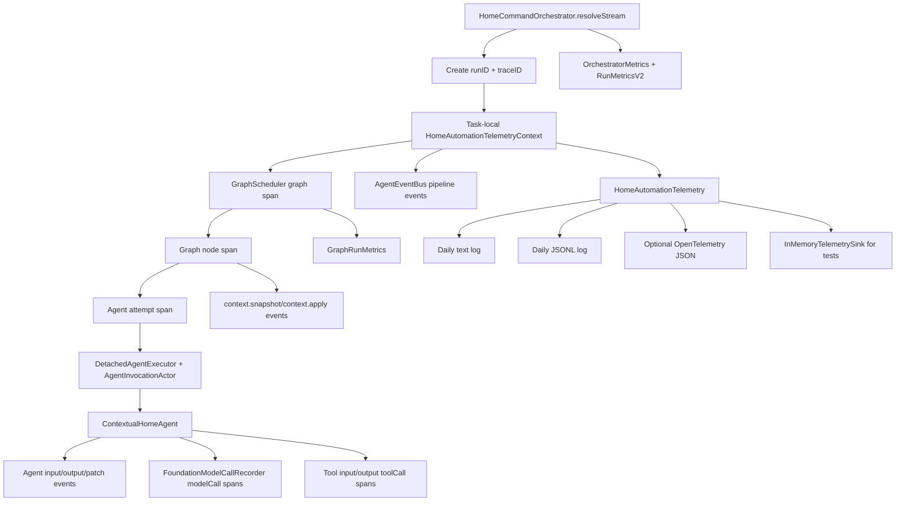
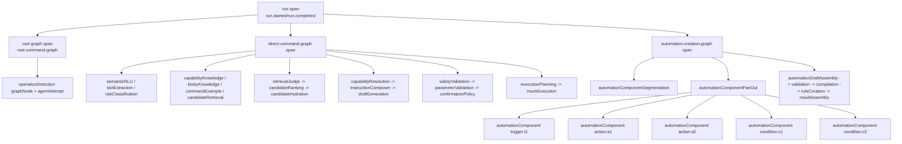
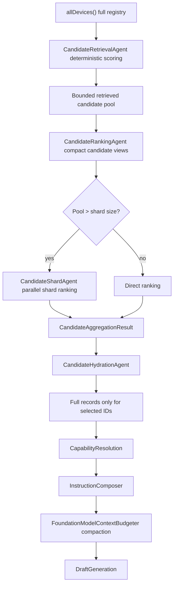

# Observability, Metrics, And Evaluation Guide

This document explains how the project currently logs, measures, and evaluates individual agents, independent FoundationModel-backed branches, automation component fan-out, and the overall command-resolution system.

The short version:

- Runtime observability is trace-first and emitted as schema-v2 `ObservabilityEvent` records.
- The same events are written to text logs, JSONL logs, optional OpenTelemetry-shaped JSON, and in-memory sinks for tests.
- `AgentEventBus` is the UI-facing progress stream, while `HomeAutomationTelemetry` is the durable event stream.
- `OrchestratorMetrics` and `RunMetricsV2` are summary snapshots derived from graph execution state.
- `home-automation-eval` runs deterministic and live suites through the real orchestrator.
- Per-agent evaluation is currently split between unit tests, integration tests, JSONL trace assertions, and the evaluation runner.

## Key Files

| Area | Files |
| --- | --- |
| Typed telemetry schema | `HomeAutomationCore/Sources/HomeAutomationCore/Telemetry/ObservabilityTypes.swift` |
| Telemetry actor and task-local context | `HomeAutomationCore/Sources/HomeAutomationCore/Telemetry/HomeAutomationTelemetry.swift` |
| JSONL/text/OTel/in-memory sinks | `HomeAutomationCore/Sources/HomeAutomationCore/Telemetry/DailyJSONLLogWriter.swift`, `DailyTextLogWriter.swift`, `TelemetrySinks.swift` |
| Payload redaction | `HomeAutomationCore/Sources/HomeAutomationCore/Telemetry/TelemetryRedactor.swift` |
| FoundationModel call recorder | `HomeAutomationCore/Sources/HomeAutomationCore/Telemetry/FoundationModelCallRecorder.swift` |
| UI event stream | `HomeAutomationCore/Sources/HomeAutomationAgents/Runtime/AgentEventBus.swift` |
| Graph runtime instrumentation | `HomeAutomationCore/Sources/HomeAutomationOrchestrator/GraphScheduler.swift`, `GraphNodeExecutionLoop.swift`, `GraphPatchCommitter.swift`, `GraphCheckpointCoordinator.swift` |
| Detached agent execution | `HomeAutomationCore/Sources/HomeAutomationOrchestrator/DetachedAgentExecutor.swift` |
| Automation component fan-out telemetry | `HomeAutomationCore/Sources/HomeAutomationOrchestrator/Automation/AutomationComponentFanOutRunner.swift` |
| Summary metrics | `HomeAutomationCore/Sources/HomeAutomationOrchestrator/OrchestratorMetrics.swift`, `OrchestratorMetricsV2.swift`, `GraphRunMetrics.swift` |
| Evaluation library | `HomeAutomationCore/Sources/HomeAutomationEvaluation/EvaluationTypes.swift`, `EvaluationRunner.swift`, `EvaluationCorpus.swift` |
| Evaluation CLI | `HomeAutomationCore/Sources/HomeAutomationEvalCLI/EvalCLI.swift` |
| CI evaluation wiring | `.github/workflows/home-automation-ci.yml` |

## Current Observability Architecture



There are two event streams:

1. `AgentEventBus` emits `OrchestratorPipelineEvent` values for UI and streaming progress. These events include sequence number, run ID, stage, status, trace/span IDs, and component metadata when available.
2. `HomeAutomationTelemetry` emits durable `ObservabilityEvent` records to sinks. These are the main source for analysis.

## Trace Shape

Each user command gets one `runID`. The orchestrator currently uses the same UUID as the `traceID`, which makes joining stream events, JSONL logs, and metrics simple.



For graph nodes, `agentInvocationID` is generated as:

```text
<run-prefix>-<scope>-<agentID>-<attempt>
```

For automation fan-out components, it is generated as:

```text
<run-prefix>-<component-kind>-<component-id>-<agentID>
```

Always group repeated agent work by `agentInvocationID`, not only by `agentID`. For example, action subgraphs can run `semanticNLU`, `candidateRanking`, and `draftGeneration` multiple times in the same parent automation run.

## Log Locations And Configuration

Default logs are written relative to the process working directory:

```text
Logs/home-automation-YYYY-MM-DD.jsonl
Logs/home-automation-YYYY-MM-DD.txt
Logs/home-automation-YYYY-MM-DD.otel.json   # only when enabled
```

When running from the package directory, that normally means:

```text
HomeAutomationCore/Logs/home-automation-YYYY-MM-DD.jsonl
HomeAutomationCore/Logs/home-automation-YYYY-MM-DD.txt
```

Useful environment variables:

```bash
export HOME_AUTOMATION_LOGGING_ENABLED=1
export HOME_AUTOMATION_LOG_DIR="$PWD/Logs"
export HOME_AUTOMATION_LOG_PAYLOAD_MODE=cappedPayload
export HOME_AUTOMATION_LOG_MAX_PAYLOAD_CHARS=8000
export HOME_AUTOMATION_OTEL_JSON_ENABLED=1
```

Payload modes:

| Mode | Behavior | Use |
| --- | --- | --- |
| `metadataOnly` | Replaces values with `<metadata-only>`, but keeps character counts, truncation markers, and stable hashes. | CI, privacy-sensitive runs. |
| `cappedPayload` | Keeps payload values up to `HOME_AUTOMATION_LOG_MAX_PAYLOAD_CHARS`. | Default local debugging. |
| `fullPayload` | Writes full payload after secret redaction. | Deep local debugging only. |

The redactor adds fields such as `inputCharacterCount`, `inputTruncated`, and `inputHash`. This means you can measure prompt or output size even when the raw payload is hidden.

## Event Types To Know

| Event type | Meaning |
| --- | --- |
| `run.started`, `run.operationDetected`, `run.completed` | Overall command lifecycle. |
| `graph.started`, `graph.completed`, `graph.interrupted` | Operation graph lifecycle. |
| `graph.node.started`, `graph.node.completed` | Graph node span events. |
| `agent.started`, `agent.completed`, `agent.failed`, `agent.timeout`, `agent.unsupported`, `agent.clarification` | Agent attempt lifecycle. |
| `agent.input`, `agent.output`, `agent.evaluationOutput`, `agent.patch` | Agent I/O and patch details. |
| `model.call.started`, `model.call.completed`, `model.call.failed` | FoundationModel calls through `FoundationModelCallRecorder`. |
| `tool.input`, `tool.output` | FoundationModel tool call logging helpers. |
| `context.snapshot`, `context.apply` | Actor-owned context reads and writes. |
| `pipeline.event` | UI-visible progress event mirrored into telemetry. |
| `automation.component.completed` | Per trigger/action/condition component span in fan-out. |
| `automation.componentFanOut.completed` | Aggregate fan-out metrics. |
| `run.metrics` | Serialized `OrchestratorMetrics` summary. |

## Measuring Logs For One Run

Set a log file and run ID:

```bash
cd HomeAutomationCore
LOG="Logs/home-automation-$(date +%F).jsonl"
RUN="<run-id>"
```

List completed runs:

```bash
jq -r '
  select(.eventType == "run.completed")
  | [.timestamp, .runID, (.payload.outcome // ""), (.payload.resolution // "")]
  | @tsv
' "$LOG"
```

Get the ordered trace for one run:

```bash
jq -r --arg run "$RUN" '
  select(.runID == $run)
  | [
      .timestamp,
      .spanKind,
      .eventType,
      (.graphID // ""),
      (.stage // ""),
      (.agentID // ""),
      (.agentInvocationID // ""),
      (.componentKind // ""),
      (.componentID // ""),
      (.status // ""),
      (.durationMs // "")
    ]
  | @tsv
' "$LOG"
```

List agent attempts for one run:

```bash
jq -r --arg run "$RUN" '
  select(.runID == $run and (.eventType | test("^agent\\.(completed|failed|timeout|unsupported|clarification)$")))
  | [
      .timestamp,
      .agentID,
      .agentInvocationID,
      .stage,
      .status,
      (.durationMs // 0),
      (.payload.result // ""),
      (.payload.detail // "")
    ]
  | @tsv
' "$LOG"
```

Summarize agent latency and failures across a log file:

```bash
jq -s '
  map(select(.eventType | test("^agent\\.(completed|failed|timeout|unsupported|clarification)$")))
  | group_by(.agentID // "unknown")
  | map({
      agentID: .[0].agentID,
      count: length,
      avgMs: ((map(.durationMs // 0) | add) / length),
      failures: (map(select(.status == "failed")) | length),
      timeouts: (map(select(.eventType == "agent.timeout")) | length)
    })
' "$LOG"
```

Measure p50/p95 duration for one agent:

```bash
AGENT="candidateRanking"
jq -s --arg agent "$AGENT" '
  [ .[]
    | select((.agentID == $agent) and (.eventType | test("^agent\\.(completed|failed|timeout|unsupported|clarification)$")))
    | (.durationMs // 0)
  ] | sort as $values
  | {
      agentID: $agent,
      count: ($values | length),
      p50Ms: (if ($values | length) == 0 then null else $values[(($values | length) * 0.50 | floor)] end),
      p95Ms: (if ($values | length) == 0 then null else $values[(($values | length) * 0.95 | floor)] end)
    }
' "$LOG"
```

## Measuring Each Agent

Use this five-step process for every agent:

1. Identify all invocations:

   ```bash
   jq -r --arg agent "$AGENT" '
     select(.agentID == $agent and .agentInvocationID != null)
     | .agentInvocationID
   ' "$LOG" | sort -u
   ```

2. Reconstruct each invocation:

   ```bash
   INV="<agent-invocation-id>"
   jq -r --arg inv "$INV" '
     select(.agentInvocationID == $inv)
     | [.timestamp, .eventType, .spanKind, .status, (.durationMs // ""), (.payload | tostring)]
     | @tsv
   ' "$LOG"
   ```

3. Attribute model usage:

   ```bash
   jq -r --arg inv "$INV" '
     select(.agentInvocationID == $inv and .spanKind == "modelCall")
     | [.timestamp, .eventType, .agentID, .status, (.durationMs // ""), (.payload.failureKind // ""), (.payload.promptCharacterCount // "")]
     | @tsv
   ' "$LOG"
   ```

4. Attribute tool usage:

   ```bash
   jq -r --arg inv "$INV" '
     select(.agentInvocationID == $inv and .spanKind == "toolCall")
     | [.timestamp, .eventType, (.payload.toolName // .toolName // ""), .status, (.durationMs // ""), (.payload.outputCharacterCount // "")]
     | @tsv
   ' "$LOG"
   ```

5. Validate outputs and patches:

   ```bash
   jq -r --arg inv "$INV" '
     select(.agentInvocationID == $inv and (.eventType == "agent.evaluationOutput" or .eventType == "agent.patch"))
     | [.eventType, (.selectedCandidateIDs // ""), (.selectedCapability // ""), (.selectedCommand // ""), (.targetDeviceID // ""), (.validationResult // ""), (.finalOutcome // "")]
     | @tsv
   ' "$LOG"
   ```

The minimum per-agent scorecard should include:

| Metric | How to compute | Why it matters |
| --- | --- | --- |
| Attempt count | Count terminal `agent.*` events grouped by `agentInvocationID`. | Detect retries, duplicate work, or missing nodes. |
| Success rate | `completed / all terminal attempts`. | Basic reliability. |
| Timeout rate | Count `agent.timeout`. | Shows slow or blocked model/tool work. |
| p50/p95 duration | Terminal agent event `durationMs`. | Performance and regression tracking. |
| Model call count | `model.call.completed` + `model.call.failed` under invocation. | Cost and model dependency. |
| Context-window failures | `model.call.failed.payload.failureKind == contextWindowExceeded`. | Prompt budget and candidate filtering health. |
| Tool count/output size | `tool.output` count and `outputCharacterCount`. | Tool bloat and prompt expansion risk. |
| Patch fields produced | `agent.patch` promoted fields and `patch` payload. | Confirms agent ownership contract. |
| Output confidence | `agent.evaluationOutput.payload.confidence` where present. | Ranking and confidence calibration. |

## Per-Agent Evaluation Matrix

The table below describes what to measure and what to assert for each agent family.

| Agent or group | Key outputs | Log measurements | Evaluation assertions |
| --- | --- | --- | --- |
| `operationDetection` | `operation`, `language`, `domain` | Model call count, operation confidence, routed operation, fallback reason. | Scheduled commands route to `automationCreation`; direct commands route to `executeDeviceCommand`; unsupported domains route safely. |
| `semanticNLU` | Intent families, device types | Device type confidence, model failure/fallback, prompt size. | Device types are canonical; ambiguous commands keep multiple relevant families; unsupported commands do not invent types. |
| `slotExtraction` | Rooms, nicknames, values, modes | Slot confidence, payload size, fallback use. | Extracts only the user command, not RAG examples; numbered names like `bulb 2` remain distinguishable. |
| `riskClassification` | Risk level, confirmation hint | Risk confidence, model escalation, safety floor. | High/critical deterministic risk is never downgraded; unlock/open/cooking/security commands require confirmation. |
| `capabilityKnowledge` | Canonical capability snippets | Retrieval source counts, low-score count, selected snippets. | Retrieves capability definitions relevant to intent and candidate capabilities. |
| `bixbyKnowledge` | Bixby command snippets | Retrieval count, score distribution. | Relevant catalog command appears when command maps to Bixby examples. |
| `commandExample` | Similar natural-language examples | Retrieval score, selected example IDs. | Examples match intent/device type and do not pollute slot extraction. |
| `candidateRetrieval` | Retrieved candidate pool | Retrieved count, candidate IDs, memory/RAG additions. | Expected device appears in the pool; recall remains high; pool stays bounded. |
| `retrievalJudge` | Retrieval quality and retry decisions | Judge invoked/skipped, retry count, reformulated query count. | Retries weak retrieval when model is available and preserves/improves quality. |
| `candidateRanking` | Final candidate IDs, clarification | Candidate count before ranking, final IDs, clarification flag, shard count. | Correct selected ID; asks clarification for true ambiguity; never returns IDs outside candidates. |
| `candidateShard` | Shard winners | Per-shard latency and selected IDs. | Large candidate sets are split and merged without losing expected target. |
| `candidateHydration` | Full `HomeCandidateRecord` values | Hydrated count and selected IDs. | Hydrates only selected IDs; preserves supported commands, modes, and state. |
| `capabilityResolution` | Capability, command, target device | Selected capability/command/target, alternatives, confidence. | Capability and command are supported by target; evidence mentions the decisive match. |
| `instructionComposer` | `HomeModelInstructionPackage` | Prompt char count, context budget report, selected tool names. | Prompt stays within budget; compacted prompts keep selected candidates and capability decision. |
| `draftGeneration` | `HomeCommandDraft` | Model attempts, selected draft attempt, context-window failures, deterministic fallback. | Draft uses selected candidate/capability/command; unsupported model runtime can fall back only from validated deterministic decision. |
| `safetyValidation` | Ready/clarification/unsupported/confirmation resolution | Validation result and issue count. | Invalid target/capability/command fails clearly; high risk propagates confirmation. |
| `parameterValidation` | Parameter-valid result | Parameter issue count, validation result. | Setter commands have required numeric/mode parameters and ranges. |
| `confirmationPolicy` | Confirmation decision | Confirmation flag and risk reason. | Unlock/open/high-risk actions are blocked without explicit confirmation. |
| `executionPlanning` | Execution plan | Step count, command plan fields. | Plan mirrors validated draft exactly. |
| `mockExecution` | Mutated mock device state | Execution skipped/completed, final state. | Runs only when `executeLowRiskCommands` is true and plan is safe. |
| `ruleFallback` | Deterministic direct-command result | Fallback success rate and selected target. | Model-unavailable direct commands still resolve common low-risk commands. |
| `bixbyFallback` | Catalog fallback result | Fallback attempt count. | Uses Bixby mapping only when deterministic fallback cannot resolve. |
| `unsupportedCommand` | Unsupported result | Unsupported rate by domain/operation. | Fails closed with a clear reason. |
| `automationComponentSegmentation` | Trigger/actions/condition leaves/tree | Model call count, unsupported fragments, condition tree shape. | Extracts stable IDs and raw spans; no device/capability resolution here. |
| `automationComponentFanOut` | Resolved trigger/action/condition set | Component count, start spread, max concurrency, failed IDs. | Trigger, all actions, and all conditions start concurrently and aggregate in stable order. |
| `automationTriggerResolution` | `HomeAutomationTrigger` | Trigger confidence and fallback. | Daily time schedules resolve to correct repeat rule/time. |
| `automationConditionClauseResolution` | Resolved condition leaf | Per-condition model calls, relevant device count, confidence. | Each condition resolves independently; OR/AND tree references valid leaf IDs. |
| `automationDraftAssembly` | `HomeAutomationRuleDraft` | Assembly failure reason, unresolved diagnostics. | Reconstructs condition tree and fails clearly for missing leaf IDs. |
| `automationValidation` | Validation status/issues | Issue count, confirmation flag. | Rejects unresolved actions/conditions; propagates high-risk confirmation. |
| `smartThingsCompilation` | SmartThings Rule JSON | Compilation supported flag, JSON markers. | Schedule/action/condition shapes match SmartThings Rules expectations. |
| `smartThingsRuleCreation` | Backend receipt/dry-run status | Backend status/rule ID/location ID. | Dry run does not call backend; persistent creation requires confirmation when high risk. |
| `automationResultAssembly` | Final automation resolution | Final outcome and plan summary. | Produces drafted/confirmation/clarification/unsupported outcome consistent with validation. |

## FoundationModel Observability

Every direct `.respond(...)` call in source is guarded by `FoundationModelCallRecorder.record(...)`. There is a test that scans source files and fails if a new FoundationModel call bypasses the recorder.

Current recorded fields include:

- `agentID`
- `modelCallID`
- `policyMode`
- `modelAvailability`
- `promptCharacterCount`
- `selectedToolNames`
- `estimatedToolOutputCharacterCount`
- `outputCharacterCount`
- `failureKind`
- `error`
- `durationMs`

Find all model failures for a run:

```bash
jq -r --arg run "$RUN" '
  select(.runID == $run and .eventType == "model.call.failed")
  | [.timestamp, .agentID, .agentInvocationID, (.payload.modelCallID // ""), (.payload.failureKind // ""), (.payload.error // "")]
  | @tsv
' "$LOG"
```

Find prompt sizes by agent:

```bash
jq -r '
  select(.eventType == "model.call.started")
  | [.agentID, .agentInvocationID, (.payload.promptCharacterCount // 0), (.payload.estimatedToolOutputCharacterCount // 0), (.payload.selectedToolNames // "")]
  | @tsv
' "$LOG"
```

Measure context-window failure rate by agent:

```bash
jq -s '
  map(select(.spanKind == "modelCall"))
  | group_by(.agentID // "unknown")
  | map({
      agentID: .[0].agentID,
      modelEvents: length,
      failures: (map(select(.eventType == "model.call.failed")) | length),
      contextWindowFailures: (map(select(.eventType == "model.call.failed" and .payload.failureKind == "contextWindowExceeded")) | length)
    })
' "$LOG"
```

Important interpretation rule: an agent can be `completed` even when a model call failed if it has a deterministic fallback. To detect that, inspect both `model.call.failed` and the later `agent.completed` or `agent.evaluationOutput` for the same `agentInvocationID`.

## Candidate Filtering And Context-Window Control

The project avoids FoundationModel context-window failures by narrowing data before model calls:



Measure candidate filtering from logs:

```bash
jq -r --arg run "$RUN" '
  select(.runID == $run and (.eventType == "agent.evaluationOutput" or .eventType == "agent.patch"))
  | select(.agentID == "candidateRanking" or .agentID == "candidateRetrieval" or .agentID == "candidateHydration" or .agentID == "capabilityResolution")
  | [.timestamp, .agentID, (.selectedCandidateIDs // ""), (.selectedCapability // ""), (.selectedCommand // ""), (.targetDeviceID // "")]
  | @tsv
' "$LOG"
```

Measure context budget from `run.metrics`:

```bash
jq -r --arg run "$RUN" '
  select(.runID == $run and .eventType == "run.metrics")
  | .payload.metrics
' "$LOG" | jq '.foundationModelUsage.contextBudgetReport'
```

## Automation Component Fan-Out Measurement

Automation fan-out has exact component-level telemetry. Each trigger/action/condition component emits `automation.component.completed`, and the fan-out runner emits `automation.componentFanOut.completed`.

Get component spans:

```bash
jq -r --arg run "$RUN" '
  select(.runID == $run and .eventType == "automation.component.completed")
  | [
      .timestamp,
      .componentKind,
      .componentID,
      .agentID,
      .agentInvocationID,
      .status,
      (.durationMs // 0),
      (.payload.resolved // "")
    ]
  | @tsv
' "$LOG"
```

Get aggregate fan-out metrics:

```bash
jq --arg run "$RUN" '
  select(.runID == $run and .eventType == "automation.componentFanOut.completed")
  | {
      componentCount: .payload.componentCount,
      triggerCount: .payload.triggerCount,
      actionCount: .payload.actionCount,
      conditionCount: .payload.conditionCount,
      maxConcurrentComponents: .payload.maxConcurrentComponents,
      componentStartSpreadMs: .payload.componentStartSpreadMs,
      componentFanOutDurationMs: .payload.componentFanOutDurationMs,
      componentAggregationDurationMs: .payload.componentAggregationDurationMs,
      failedComponentIDs: .payload.failedComponentIDs
    }
' "$LOG"
```

Healthy fan-out for a command with one trigger, two actions, and two conditions should show:

- `componentCount = 5`
- `triggerCount = 1`
- `actionCount = 2`
- `conditionCount = 2`
- a small `componentStartSpreadMs`
- `maxConcurrentComponents` greater than `1`
- no `failedComponentIDs`

## Summary Metrics

`OrchestratorMetrics` is stored by `OrchestratorMetricsCollector` and can be accessed through:

```swift
let metrics = await orchestrator.lastMetrics()
let metricsJSON = await orchestrator.lastMetricsJSON()
```

The serialized metrics are also logged as `run.metrics`.

Important sections:

| Section | Meaning |
| --- | --- |
| `agentTraces` | Per-agent timing and result from context trace. |
| `stageDurations` | Legacy per-stage duration map. |
| `agentStatuses` | Legacy status by agent ID. Be careful: repeated agents can overwrite here. |
| `graphRun` | Graph node status, duration, queue duration, snapshot/apply timing, runnable batch sizes, subgraph summaries. |
| `contextMetrics` | Command size, snippet count, memory count, errors, draft/plan presence. |
| `candidateMetrics` | Retrieved/hydrated/selected counts and IDs. |
| `safetyMetrics` | Safety gate execution, confirmation, risk, memory target. |
| `automationMetrics` | Automation action/condition count, graph status, backend status, SmartThings compilation support. |
| `foundationModelUsage` | Model availability, model call estimates, skipped model calls, context failures, tools, budget report. |
| `retrievalQuality` | RAG strategy names, score metrics, judge retry fields. |
| `metricsV2` | V2 summary: graph metrics, agent attempts, model/tool call summary, fan-out summary, candidate decision. |

Current interpretation note: `RunMetricsV2` is a summary derived from `OrchestratorMetrics`. For precise timing, retry, model call, and component-concurrency reconstruction, use JSONL `ObservabilityEvent` records as the source of truth.

## Evaluation Runner

Run deterministic evaluation:

```bash
cd HomeAutomationCore
swift run home-automation-eval --mode deterministic --suite all --output .build/evaluation
```

Run a single suite:

```bash
swift run home-automation-eval --mode deterministic --suite candidate-filtering --output .build/evaluation-candidate-filtering
```

Run live FoundationModel evaluation:

```bash
HOME_AUTOMATION_EVAL_LIVE=1 \
swift run home-automation-eval --mode live --suite all --require-live-model true --output .build/evaluation-live
```

Generated artifacts:

```text
.build/evaluation/evaluation-results.jsonl
.build/evaluation/evaluation-summary.json
.build/evaluation/evaluation-report.md
.build/evaluation/evaluation-traces/
```

Current default suites:

- `operation-routing`
- `semantic-nlu`
- `candidate-filtering`
- `capability-command`
- `automation-segmentation`
- `trigger-resolution`
- `condition-resolution`
- `smartthings-compilation`
- `rag-retrieval`
- `end-to-end-direct-command`
- `end-to-end-automation`
- `observability-contract`

Evaluation result fields:

| Field | Meaning |
| --- | --- |
| `id`, `suite`, `mode` | Case identity. |
| `status` | Ready, drafted, clarification, confirmation, unsupported, or skipped. |
| `passed`, `skipped` | Case result. |
| `durationMs` | Wall-clock duration. |
| `assertionFailures` | Human-readable failed assertions. |
| `selectedDeviceIDs` | Selected candidate IDs. |
| `modelCallCount` | Model call count from metrics. |
| `metrics` | `RunMetricsV2` snapshot when available. |

Add new cases in `EvaluationCorpus.defaultCases` by creating an `EvaluationCase` with:

- `id`
- `suite`
- `tags`
- `input`
- optional fixture devices
- `expected` operation/domain/language/device/capability/command/action/condition/outcome/budgets

## How To Evaluate Each Agent

Use three layers for every agent.

### 1. Contract Unit Tests

Test the agent directly with injected closures or deterministic workers.

Use this for:

- typed input/output schema;
- deterministic fallback;
- safety floor;
- prompt builder and parser behavior;
- no-model behavior;
- edge cases such as numbered device names.

Existing examples live in:

- `HomeAutomationCore/Tests/HomeAutomationAgentTests/Phase2AgentTests.swift`
- `HomeAutomationCore/Tests/HomeAutomationAgentTests/AutomationDraftAgentTests.swift`
- `HomeAutomationCore/Tests/HomeAutomationAgentTests/AutomationValidationAgentTests.swift`
- `HomeAutomationCore/Tests/HomeAutomationOrchestratorTests/AutomationActionResolverTests.swift`
- `HomeAutomationCore/Tests/HomeAutomationOrchestratorTests/Phase7FanOutTests.swift`

### 2. Graph Integration Tests

Run the real graph and assert context plus metrics.

Use this for:

- dependency ordering;
- skipped nodes;
- safety gates;
- context patch application;
- repeated action subgraphs;
- component fan-out concurrency;
- model-unavailable fallback behavior.

Existing examples live in:

- `HomeAutomationCore/Tests/HomeAutomationOrchestratorTests/Phase3GraphRuntimeTests.swift`
- `HomeAutomationCore/Tests/HomeAutomationOrchestratorTests/Phase7FanOutTests.swift`
- `HomeAutomationCore/Tests/HomeAutomationOrchestratorTests/AutomationCreationFlowTests.swift`
- `HomeAutomationCore/Tests/HomeAutomationOrchestratorTests/OrchestratorInfrastructureTests.swift`

### 3. Evaluation CLI Cases

Use `home-automation-eval` for stable CI-facing behavior.

Use this for:

- end-to-end accuracy;
- candidate selection regressions;
- automation segmentation;
- SmartThings compilation shape;
- RAG retrieval quality;
- observability contract presence;
- model-call budget.

### Agent Evaluation Template

For each new agent or changed agent, define this scorecard:

```text
Agent:
Input type:
Output type:
Owned context patch keys:
Required upstream context:
Required downstream consumers:

Accuracy:
- Golden deterministic cases:
- Ambiguous/clarification cases:
- Unsupported cases:
- Safety cases:

Observability:
- Required event types:
- Required fields:
- Model call fields:
- Tool call fields:
- Evaluation output fields:

Metrics:
- p50/p95 duration budget:
- max model call count:
- max prompt character count:
- max tool output character count:
- fallback rate threshold:
- context-window failure threshold:

Regression:
- Unit tests:
- Graph tests:
- Evaluation suites:
```

## Overall System Evaluation

For every PR or major change, run:

```bash
cd HomeAutomationCore
swift build
swift test
swift run home-automation-eval --mode deterministic --suite all --output .build/evaluation
```

For FoundationModel behavior on compatible machines:

```bash
cd HomeAutomationCore
HOME_AUTOMATION_EVAL_LIVE=1 \
swift run home-automation-eval --mode live --suite all --require-live-model true --output .build/evaluation-live
```

System-level metrics to track:

| Metric | Source | Target |
| --- | --- | --- |
| Deterministic eval pass rate | `evaluation-summary.json.passRate` | 100% in CI. |
| Live eval pass rate | `.build/evaluation-live/evaluation-summary.json` | Track trend; fail live job when required. |
| Direct-command exact match | Evaluation cases with direct-command tags. | No regressions. |
| Automation drafted rate | Automation suites. | No regressions unless expected behavior changes. |
| Clarification rate | Evaluation summary and logs. | High only on true ambiguity. |
| Unsupported rate | Evaluation summary and logs. | High only on unsupported domains or invalid automation. |
| Confirmation rate | Evaluation summary and safety metrics. | High-risk commands require confirmation. |
| p95 run duration | JSONL `run.completed.durationMs` or metrics. | Track by suite and operation. |
| Model call count | `model.call.*` or `metricsV2.modelCalls`. | Bounded by suite budget. |
| Context-window failure rate | `model.call.failed.failureKind`. | Zero in deterministic CI, low in live runs. |
| Candidate recall | Candidate/eval assertions. | Expected device appears before ranking and final selection. |
| Fan-out concurrency | `automation.componentFanOut.completed`. | Components enqueue immediately; no artificial cap. |
| Safety false-pass | Safety tests/eval. | Zero. |
| Safety false-block | Safety tests/eval. | Track and inspect manually. |

## CI Behavior

The GitHub workflow currently runs on `macos-26` because the package uses Swift tools 6.2 and platform v26 APIs.

Required job:

```text
swift build
xcodebuild test -scheme HomeAutomationCore-Package -destination iOS Simulator
swift run home-automation-eval --mode deterministic --suite all --output .build/evaluation
```

Manual live job:

```text
HOME_AUTOMATION_EVAL_LIVE=1
swift run home-automation-eval --mode live --suite all --require-live-model true --output .build/evaluation-live
```

CI uploads deterministic and live evaluation artifacts.

## Known Gaps And Improvement Opportunities

These are the most important observability gaps to keep in mind when analyzing current logs:

1. `RunMetricsV2` is not yet fully reconstructed from raw span events. It is derived from `OrchestratorMetrics`, so use JSONL for exact trace reconstruction.
2. Some legacy dictionaries such as `agentStatuses` are keyed by `agentID`, so repeated agents in action subgraphs can overwrite each other. Use `agentInvocationID` in JSONL.
3. `tool.input` and `tool.output` currently create separate tool-call spans without a shared `toolCallID`. Use timestamp, agent invocation, and tool name for approximate pairing.
4. The evaluation runner is primarily end-to-end. Independent agent evaluation exists mostly as unit and integration tests. A future enhancement should add a per-agent evaluation harness that emits `evaluationCase` spans for each agent directly.
5. `EvaluationCaseResult.traceID` is not a complete durable trace linkage for all cases. Use JSONL `runID` and `traceID` when reconstructing runtime traces.
6. Model-call token counts are estimated from character counts and budget reports, not from a tokenizer.
7. Fan-out exact concurrency is available in `automation.componentFanOut.completed`; `RunMetricsV2.automationFanOut` is a summary and may not include every per-component failure detail.

## Recommended Next Steps

1. Add a small trace-analysis script that reads JSONL and emits per-agent p50/p95, failure rate, model-call count, tool count, and context-window failures.
2. Store full `traceID` and `runID` in `EvaluationCaseResult`.
3. Add `toolCallID` to tool input/output events.
4. Derive `RunMetricsV2` directly from `ObservabilityEvent` spans.
5. Add formal per-agent evaluation cases for NLU, candidate ranking, capability resolution, draft generation, condition clause resolution, and SmartThings compilation.
6. Add suite-level model budgets and latency budgets to every evaluation case.
7. Add artifact upload for JSONL telemetry produced during deterministic eval.
8. Track regressions over time by comparing `evaluation-summary.json` across CI runs.
