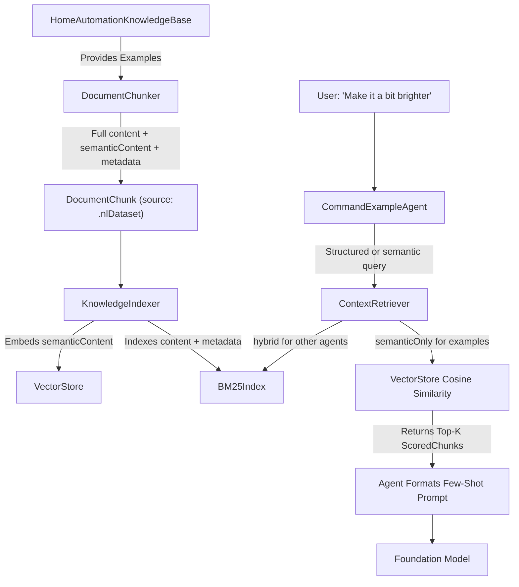

# HomeAutomationRAG Implementation

This document details the implementation of Retrieval-Augmented Generation (RAG) within the `HomeAutomationRAG` module and explains how it optimizes token usage and improves Foundation Model responses.

## 1. RAG Architecture and Implementation

The `HomeAutomationRAG` module acts as the targeted context retrieval layer for the Home Automation multi-agent orchestrator. Instead of relying on static, monolithic system prompts, the system dynamically retrieves relevant pieces of knowledge based on the user's current request.

### Core Components

- **Canonical Sources**: The RAG pipeline ingests ground-truth data from four primary sources:
  1. **Capability Catalog**: Definitions of what devices can do (e.g., commands, risk levels, attributes).
  2. **Generated NL Dataset**: Example natural language commands mapped to device capabilities and intents.
  3. **Bixby Command Catalog**: Mappings of Bixby actions to system capabilities.
  4. **Device Registry**: The actual smart home devices available to the user.
- **`DocumentChunker`**: Converts the raw canonical data into small, manageable `DocumentChunk` records. Each chunk stores full display `content`, clean embeddable `semanticContent`, its origin (`KnowledgeSource`), and dictionary metadata for precise filtering.
- **`EmbeddingProvider`**: Converts chunk text into mathematical vector representations (`[Float]`). The system uses a highly resilient provider architecture:
  - `SemanticEmbeddingProvider`: For high-quality, production-grade semantic vectors.
  - `TFIDFEmbeddingProvider`: A deterministic, local term frequency-inverse document frequency provider. Excellent for local testing, offline fallback, and reproducible behavior.
  - `FallbackEmbeddingProvider`: Seamlessly falls back to TF-IDF if semantic embeddings fail or are unavailable.
- **`VectorStore`, `BM25Index` & `KnowledgeIndexer`**: The `KnowledgeIndexer` runs at app startup, processing all chunks into both an actor-backed semantic `VectorStore` and an actor-backed sparse `BM25Index`. To optimize launch times, the system utilizes `VectorIndexCache` to persist vectors and vocabulary to disk, while BM25 is rebuilt deterministically from restored chunks.
- **`ContextRetriever`**: The public API consumed by the agents. It supports existing string queries and structured queries carrying semantic text, keyword terms, metadata filters, NLU hints, retrieval strategy, score floors, and top-K limits.

---

## 2. Capability Catalog Data Ingestion (Exact Implementation)

To understand exactly how canonical data is fed into the RAG system, we look at the `Capability Catalog`. This catalog acts as the source of truth for every possible device action (e.g., `switch.on`, `thermostat.setpoint`).

The `DocumentChunker` parses the `HomeCapabilityRegistry` and translates each capability into a highly structured `DocumentChunk`.

**Implementation Details:**
1. **Full Content String**: For each capability, the chunker creates a display/debug text block combining all critical fields:
   ```swift
   "Capability switch. Display name Switch. Commands on off. Attributes power. Enum values . Risk low"
   ```
2. **Semantic Content**: The chunker also creates clean `semanticContent` without boilerplate labels. Embeddings use this field so capability IDs, commands, attributes, enum values, and display names carry more signal.
3. **Metadata Dictionary**: It also extracts exact values into a `metadata` dictionary for precise filtering later:
   ```swift
   metadata: [
       "capabilityId": "switch",
       "commands": "on,off",
       "risk": "low",
       "relatedDeviceTypes": "light,switch"
   ]
   ```
4. **Source Tagging**: The chunk is tagged with `source: .capability`.

When the `KnowledgeIndexer` runs, it converts `semanticContent` into vectors using the `EmbeddingProvider`, stores vectors alongside full chunks in the `VectorStore`, and indexes full content plus metadata in `BM25Index`.

---

## 3. Querying the RAG & Retrieval Techniques

### Current Retrieval Implementation
When an agent queries the RAG, it uses one of two `ContextRetriever.retrieve()` paths:

- **String query path**: Existing callers pass raw text plus an optional `MetadataFilter` and `minScore`. The retriever embeds the text and performs cosine similarity search over the `VectorStore`.
- **Structured query path**: NLU-aware callers pass `StructuredRetrievalQuery`, including raw text, semantic text, keyword terms, metadata filters, `NLURetrievalHints`, a `RetrievalStrategy`, score floor, and top-K. The retriever can run semantic-only, keyword-only, hybrid, or agentic retrieval.
- **Hybrid strategy**: `HybridRetrievalStrategy` runs semantic vector search and BM25 keyword search, gates weak raw evidence, and fuses ranked results with reciprocal-rank fusion.

### Retrieval Algorithms

- **Cosine similarity**: Used by `VectorStore` for semantic retrieval over `semanticContent`.
- **BM25 (Best Matching 25)**: Implemented by `BM25Index` for exact and metadata-rich keyword evidence.
- **Hybrid Search**: Implemented by `HybridRetrievalStrategy`, combining semantic and BM25 results with Reciprocal Rank Fusion (RRF).
- **HNSW (future)**: An Approximate Nearest Neighbor (ANN) algorithm could replace linear vector scans if the catalog becomes very large.
- **MMR (future)**: A diversity re-ranker could prevent near-duplicate snippets when many chunks describe similar capabilities or examples.

### Alternative Preprocessing Techniques for Efficient Retrieval
To improve how information is fed into the RAG system, the following preprocessing techniques could be added:

1. **Query Expansion & HyDE (Hypothetical Document Embeddings)**: The current `QueryReformulator` already performs deterministic NLU-hint expansion for weak retrievals. A future model-assisted HyDE step could generate a hypothetical capability JSON when deterministic expansion is not enough.
2. **Sliding Window Chunking**: For very large datasets (like long generated examples), chunks can overlap by a certain number of tokens. This prevents important context from being cut off at the boundary between two chunks.
3. **Hierarchical Metadata Enrichment**: Automatically expanding metadata based on relationships. For example, if a device chunk is located in the "Living Room", the chunker could enrich the metadata to also include "Zone: First Floor" or "Synonyms: Family Room, Lounge".
4. **Entity Extraction**: Running a fast Named Entity Recognition (NER) pass over the user query to explicitly extract the target device and action, and mapping those directly as required filters before executing the vector search.

---

## 4. NL Dataset Ingestion & Retrieval (Exact Implementation)

The `Generated NL Dataset` provides few-shot examples for NLU (Natural Language Understanding) agents. It maps natural phrasing (e.g., "Dim the lights") to strict system concepts (`intent`, `capability`, `deviceType`).

### How it is Maintained and Chunked
When `KnowledgeIndexer` runs, the `DocumentChunker.nlDatasetChunks()` method parses every `HomeGeneratedCommandExample`. 

**Implementation Details:**
1. **Full Content String**: Similar to capabilities, the example is flattened into a descriptive sentence for display, hydration, BM25, and formatted debug output.
   ```swift
   "Natural language example Dim the lights. Language en. Device type light. Device name living room lamp. Room living room. Capability switchLevel. Command setLevel. Intent set_brightness. Risk low"
   ```
2. **Semantic Content**: The chunk's `semanticContent` is only the natural-language command text, avoiding metadata dilution during vector embedding.
3. **Metadata Dictionary**: Key categorical data is extracted for targeted querying.
   ```swift
   metadata: [
       "exampleId": "123",
       "language": "en",
       "deviceType": "light",
       "capability": "switchLevel",
       "command": "setLevel"
   ]
   ```
4. **Source Tagging**: The chunk is strictly tagged with `source: .nlDataset`.

### How it is Queried
Agents responsible for Natural Language Understanding (like `CommandExampleAgent`, `SemanticNLUAgent`, or `SlotExtractionAgent`) query the dataset using `ContextRetriever.retrieve()` with a `MetadataFilter(source: .nlDataset)`.

The user's query is converted to a vector and compared against each example's clean `semanticContent`. `CommandExampleAgent` also applies NLU-derived device-type filters when available, so examples for unrelated device classes do not crowd out the result.

### Flow Diagram



### Remaining Improvements for NL Dataset RAG

The current implementation already avoids metadata dilution by embedding `example.text`, and it pre-filters by device type when NLU hints are available. Remaining improvements include:

1. **Hard Negative Mining**: The dataset has similar linguistic commands with different consequences (e.g., "turn on the TV" vs "turn up the TV"). Adapter training or embedding fine-tuning could improve these boundaries.
2. **Diversity Reranking**: If top examples are near-duplicates, an MMR-style reranker could preserve coverage across command/capability variants.
3. **Model-Assisted Reformulation**: The retrieval judge currently uses deterministic reformulation. A tightly budgeted Foundation Models reformulator could be added for especially weak retrieval reports.

---

## 5. The Total Flow: From Input to Resolution

Here is exactly how RAG operates within this system when a user issues a command.

**1. The User Input**
Let's assume the user says: *"Make it colder in the living room."*
This string is passed into the `HomeCommandOrchestrator`, which spins up a series of specialized agents to resolve the command. 

**2. The RAG Query**
Instead of one massive RAG query, the orchestrator delegates to specialized agents (e.g., `CandidateRetrievalAgent` for devices, `CapabilityKnowledgeAgent` for actions). The NLU phase runs first, then knowledge agents build `StructuredRetrievalQuery` values from the user's input plus `NLURetrievalHints`:
- The `CandidateRetrievalAgent` can query device chunks and merge semantic device matches with registry results.
- The `CapabilityKnowledgeAgent` uses intent-to-capability hints from `IntentCapabilityMap`, device types, rooms, and a capability metadata filter.
- The `BixbyKnowledgeAgent` uses inferred or hydrated device names plus NLU hints.
- The `CommandExampleAgent` uses semantic-only retrieval over natural-language examples with device-type filtering.

**3. Inside the Context Retriever**
- **Embedding:** The `EmbeddingProvider` (using Semantic models or the local TF-IDF fallback) converts semantic query text into a mathematical vector (`[Float]`).
- **Keyword Evidence:** `BM25Index` scores exact terms and metadata values.
- **Hybrid Fusion:** `HybridRetrievalStrategy` combines semantic and keyword rankings through reciprocal-rank fusion when the query strategy requests hybrid or agentic retrieval.
- **Filtering:** `MetadataFilter` restricts sources and multi-value metadata, while `minScore` prevents weak semantic hits from entering the result set.

**4. The RAG Output (`[ScoredChunk]`)**
The `ContextRetriever` returns a ranked list of the `Top-K` (usually top 5) closest matches. For example, the device query might return a `ScoredChunk` that looks like this:
```swift
// A highly scored chunk for the device query
ScoredChunk(
    score: 0.89,
    chunk: DocumentChunk(
        content: "Living Room AC Thermostat",
        semanticContent: "Living Room AC thermostat living room thermostatCoolingSetpoint",
        source: .device,
        metadata: ["deviceId": "living_room_ac", "room": "living_room"]
    )
)
```

**5. Retrieval Quality Reporting and Optional Judge**
Knowledge agents append `KnowledgeRetrievalReport` records to the `ResolutionContext`. The `RetrievalJudgeAgent` accepts good reports on a fast path. If a source is empty or below score thresholds, and model/RAG support is available, it performs one bounded retry using `QueryReformulator` and appends any additional hydrated snippets.

**6. Hydration (The "Secret Sauce" for Accuracy)**
RAG output can sometimes be slightly outdated or hallucinated if generated poorly. To prevent this, the agents **do not** feed the raw RAG text directly to the model. 
Instead, the agent looks at the `metadata["deviceId"]` (e.g., `"living_room_ac"`) and fetches the absolute, authoritative definition of that device directly from the hardcoded `DeviceRegistry` in `HomeAutomationCore`. 

**7. Prompt Construction and Model Execution**
The agent packages these hydrated, canonical definitions into a concise `KnowledgeSnippet` and injects them into the Foundation Model's prompt. 
The LLM receives a prompt that essentially says: *"The user said 'Make it colder'. Here are the 5 devices and capabilities that are most relevant to their request: [Canonical Details]. Draft the command."*

---

## 6. Improving Model Answers and Token Efficiency

This flow fundamentally improves the Foundation Model's performance in three ways:

### Using Fewer Tokens (Efficiency & Latency)
- **Dynamic Prompt Sizing**: Before RAG, the orchestrator would have to inject the entire `HomeAutomationKnowledgeBase` and `DeviceRegistry` into the system prompt of every agent. As the user adds more devices and routines, the prompt size grows linearly. 
- **O(1) Token Cost**: With RAG, the system prompt size is effectively constant, regardless of how many devices the user owns. The `ContextRetriever` strictly limits context to the `Top-K` results (typically K=5). 
- **Lower Latency**: Fewer input tokens directly translate to faster Time-To-First-Token (TTFT) from the Foundation Model. This is critical for voice-activated home automation systems where user perceived latency must remain under a strict budget.

### Getting Better Answers (Accuracy & Grounding)
- **Eliminating "Lost in the Middle" Syndrome**: Large Language Models often suffer from poor recall when presented with massive contexts (e.g., thousands of lines of device definitions). By narrowing the context to a handful of highly relevant items (e.g., only devices in the "living room" with cooling capabilities), the model's attention is laser-focused, preventing it from accidentally controlling a device in the wrong room.
- **Preventing Hallucinations & Guarantees Safety**: Because the RAG output is used to *lookup* authoritative data from the system's core registry (Step 5), the LLM only ever sees exact, system-verified schemas (e.g., `capability: thermostat.setpoint`, `enumValues: [16...30]`, `risk: low`). This guarantees that the LLM generates a valid command payload that the system can actually parse and execute safely.
