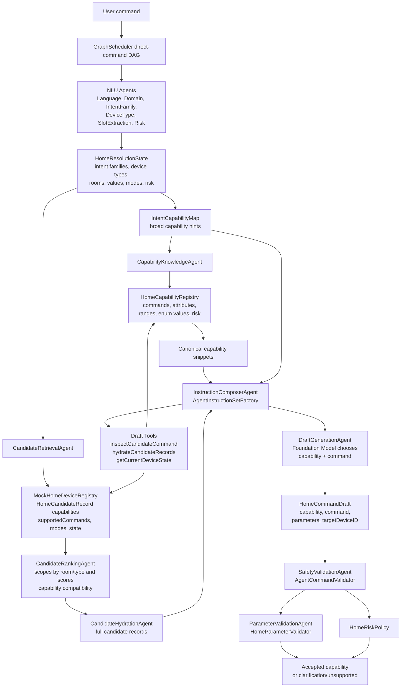
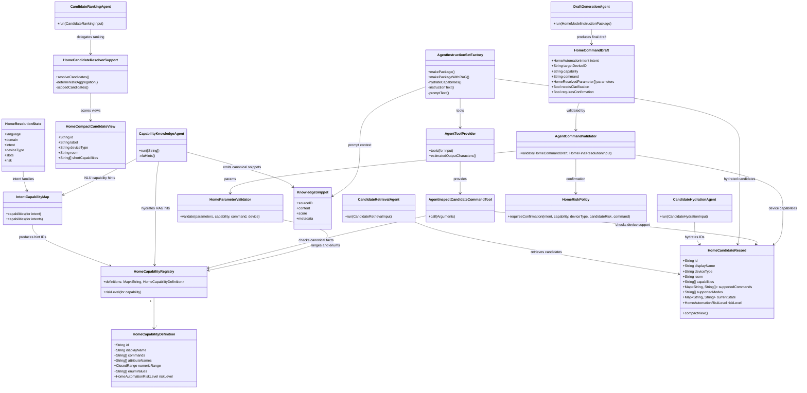
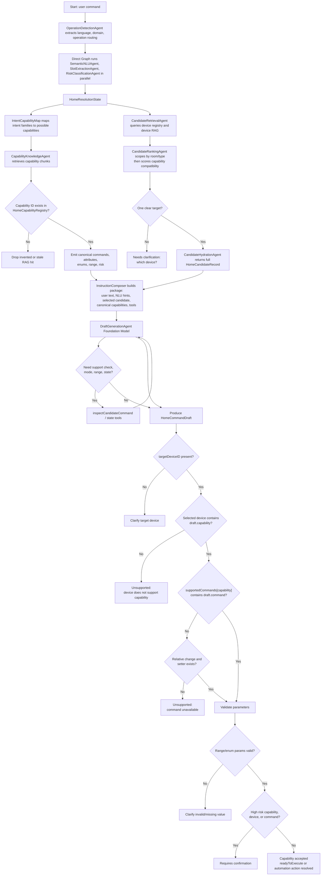
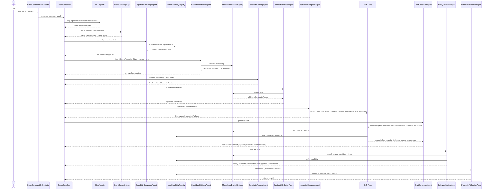
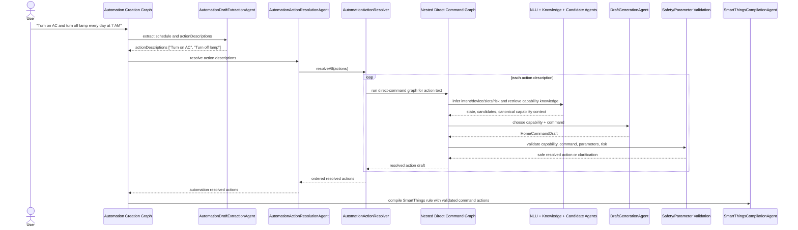
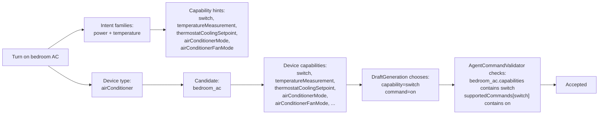
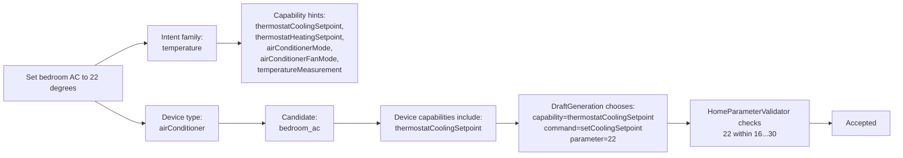
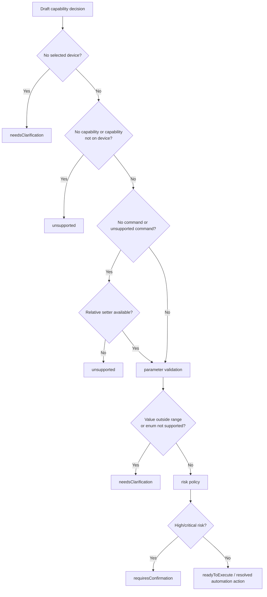

# Capability Matching Architecture

This document explains how the project determines which smart-home capability the user is asking for, for both direct commands and automation action resolution.

Capability matching is not owned by a single class. It is a layered pipeline:

1. NLU detects broad intent and device-type hints.
2. Candidate retrieval/ranking finds the target device or routine.
3. Capability knowledge retrieval adds canonical capability facts.
4. Draft generation chooses the exact `capability` and `command`.
5. Deterministic validation verifies the chosen capability is supported by the selected device.

The final capability is accepted only if it survives validation against the hydrated candidate record and canonical capability registry.

## Source Files

| Area | Files |
| --- | --- |
| Canonical capability catalog | `HomeAutomationCore/Sources/HomeAutomationCore/HomeAutomation/HomeCapabilityRegistry.swift` |
| Intent-to-capability hints | `HomeAutomationCore/Sources/HomeAutomationCore/HomeAutomation/IntentCapabilityMap.swift` |
| Device candidate schema | `HomeAutomationCore/Sources/HomeAutomationCore/HomeAutomation/HomeAutomationModels.swift` |
| Mock registry candidate retrieval | `HomeAutomationCore/Sources/HomeAutomationCore/HomeAutomation/MockHomeDeviceRegistry.swift` |
| Capability RAG agent | `HomeAutomationCore/Sources/HomeAutomationAgents/Knowledge/Capability/CapabilityKnowledgeAgent.swift` |
| Candidate retrieval/ranking/hydration | `HomeAutomationCore/Sources/HomeAutomationAgents/Candidates/...` |
| Prompt/tool package builder | `HomeAutomationCore/Sources/HomeAutomationAgents/Draft/InstructionComposer/AgentInstructionSetFactory.swift` |
| Capability inspection tool | `HomeAutomationCore/Sources/HomeAutomationAgents/Draft/Tools/AgentInspectCandidateCommandTool.swift` |
| Draft generation agent | `HomeAutomationCore/Sources/HomeAutomationAgents/Draft/DraftGeneration/DraftGenerationAgent.swift` |
| Capability/command validation | `HomeAutomationCore/Sources/HomeAutomationAgents/Safety/Support/AgentCommandValidator.swift` |
| Parameter and risk validation | `HomeAutomationCore/Sources/HomeAutomationCore/HomeAutomation/HomeSafetyAndParameterPolicy.swift` |

## High-Level Architecture

### Important Boundaries

- `IntentCapabilityMap` only produces hints. It does not decide the final capability.
- `CapabilityKnowledgeAgent` retrieves context, but hydrates every retrieved capability through `HomeCapabilityRegistry`, so RAG cannot invent unsupported schema.
- `HomeCandidateRecord.capabilities` and `supportedCommands` are the per-device source of truth.
- `DraftGenerationAgent` chooses the final `capability` and `command`, but only from hydrated candidates and canonical context.
- `AgentCommandValidator` is the final fail-closed gate. Unsupported capability/command combinations are rejected.

## Class Diagram

## Capability Matching Flow

## Sequence Diagram: Direct Command Capability Matching

## Sequence Diagram: Automation Action Capability Matching

Automation creation reuses the same capability matching pipeline for each action description. The automation graph first extracts an automation draft, then `AutomationActionResolutionAgent` fans out nested direct-command graphs for each action.

## Concrete Example: "Turn on bedroom AC"

The broad `temperature` intent does not force a temperature-setting capability. Because the command phrase is "turn on", the model can select the `switch` capability if the selected AC supports it. Validation confirms the device supports `switch.on`.

## Concrete Example: "Set bedroom AC to 22 degrees"

Here the same selected device can support multiple capabilities. The final capability is resolved from the action semantics plus the selected device's supported capabilities.

## Capability Matching Responsibilities

| Stage | Responsibility | Output | Can Finalize Capability? |
| --- | --- | --- | --- |
| `SemanticNLUAgent` | Extracts intent family and likely device types together | `HomeSemanticNLUResult` | No |
| `SlotExtractionAgent` | Extracts room, values, modes | `HomeSlotExtractionResult` | No |
| `IntentCapabilityMap` | Converts intent family into capability hints | `[String]` capability IDs | No |
| `CapabilityKnowledgeAgent` | Retrieves and hydrates canonical capability facts | `KnowledgeSnippet` | No |
| `CandidateRetrievalAgent` | Retrieves devices whose names/types/capabilities fit hints | `[HomeCandidateRecord]` | No |
| `CandidateRankingAgent` | Chooses target candidate IDs | `HomeCandidateAggregationResult` | No |
| `CandidateHydrationAgent` | Loads full candidate capabilities and supported commands | `[HomeCandidateRecord]` | No |
| `InstructionComposerAgent` | Builds constrained prompt and tools | `HomeModelInstructionPackage` | No |
| `DraftGenerationAgent` | Chooses `targetDeviceID`, `capability`, `command`, params | `HomeCommandDraft` | Yes, provisional |
| `SafetyValidationAgent` / `AgentCommandValidator` | Verifies selected device supports capability and command | `HomeCommandResolution` | Yes, final |
| `ParameterValidationAgent` | Verifies numeric range and enum values | `Bool` | Confirms final |
| `SmartThingsCompilationAgent` | Converts validated automation actions to rule JSON | `SmartThingsCompilationOutput` | Uses final only |

## Failure Modes and Guardrails

Guardrails:

- RAG context is advisory and must hydrate through `HomeCapabilityRegistry`.
- Candidate IDs selected by the model are constrained to known IDs.
- Draft generation instructions explicitly say not to invent devices, capabilities, commands, modes, or IDs.
- `inspectCandidateCommand` gives the model a compact capability/command/risk lookup before it returns the draft.
- `AgentCommandValidator` rechecks capability support after model generation.
- `HomeParameterValidator` rechecks ranges and enum values using canonical definitions and device supported modes.
- `HomeRiskPolicy` can require confirmation based on device risk, capability risk, intent, or command.

## Current Architectural Observation

The current implementation has a strong validation boundary, but capability matching is distributed. That is good for safety, because the final model choice is checked deterministically, but it can make evaluation harder. For future evaluation, the logger should capture at least these per-run capability signals:

- Intent family output and confidence.
- Intent-derived capability hints.
- Capability RAG query, filters, retrieved capability IDs, and hydrated canonical IDs.
- Candidate list with each candidate's capabilities.
- Draft model's selected `capability` and `command`.
- `inspectCandidateCommand` tool calls and outputs.
- Validation result: accepted, unsupported capability, unsupported command, invalid parameter, or confirmation required.
