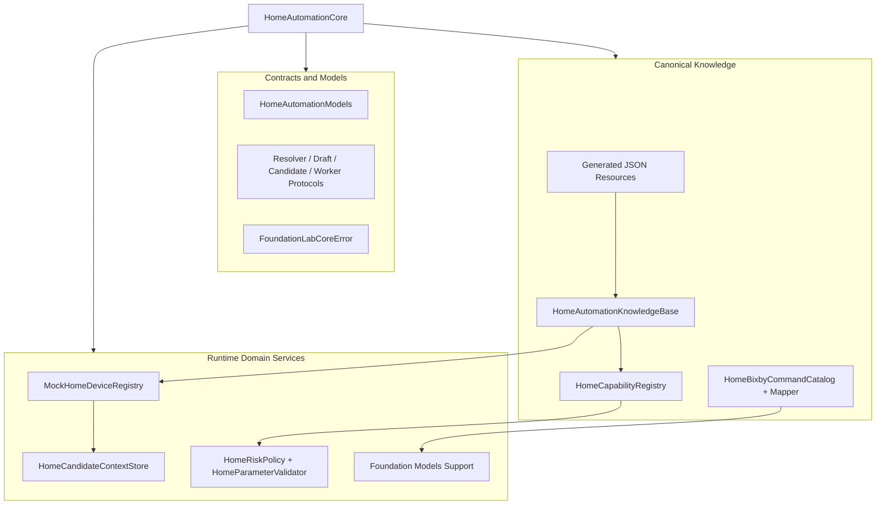
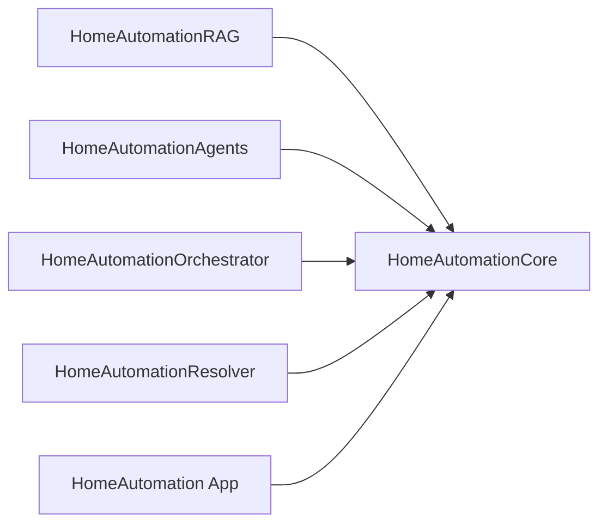
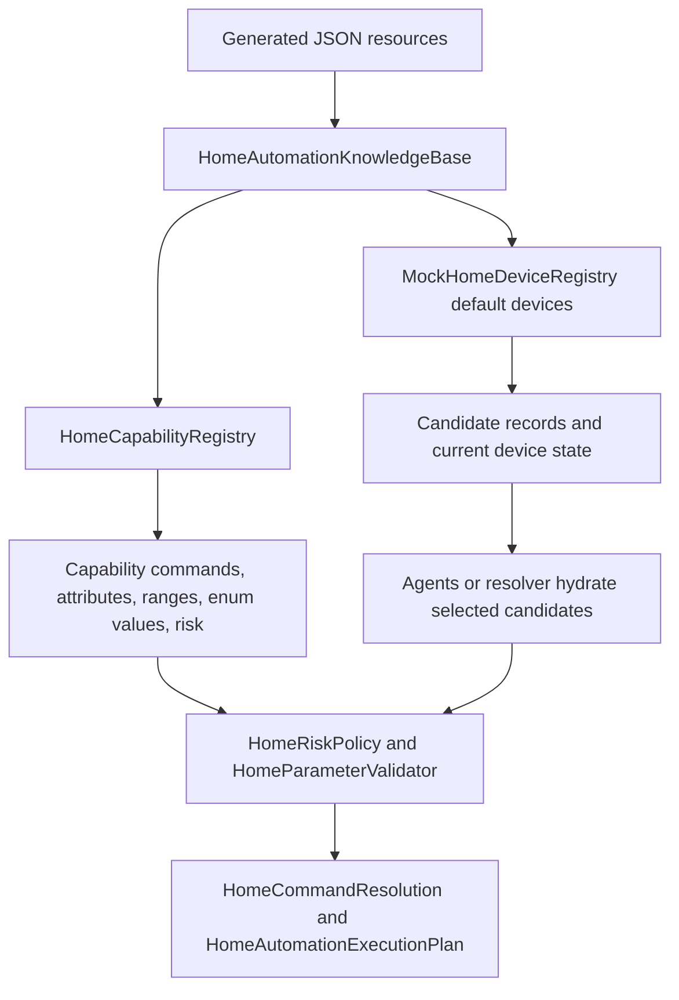

# HomeAutomationCore Source Module

`HomeAutomationCore` is the domain foundation of the project. It owns the shared data contracts, canonical catalogs, generated resources, deterministic safety policies, mock device registry, and Foundation Models support types used by the app, agents, orchestrator, RAG system, and legacy resolver.

This module should stay free of orchestration-specific behavior. It answers the question: "What is a home command, what devices and capabilities exist, and what is safe?"

## Architecture Role



## Dependency Position

`HomeAutomationCore` is the lowest project-specific target. Other package targets depend on it, but it does not depend on `HomeAutomationRAG`, `HomeAutomationAgents`, `HomeAutomationOrchestrator`, or `HomeAutomationResolver`.



## Folder Structure

```text
HomeAutomationCore/
|-- Errors/
|   `-- FoundationLabCoreError.swift
|-- HomeAutomation/
|   |-- HomeAutomationModels.swift
|   |-- HomeCommandResolutionSupport.swift
|   |-- HomeCandidateResolving.swift
|   |-- HomeWorkerSessionAnalyzing.swift
|   |-- HomeModelInstructionPackage.swift
|   |-- HomeAutomationKnowledgeBase.swift
|   |-- HomeCapabilityRegistry.swift
|   |-- HomeBixbyCommandCatalog.swift
|   |-- HomeBixbyCommandMapper.swift
|   |-- HomeSafetyAndParameterPolicy.swift
|   |-- HomeCandidateContextStore.swift
|   `-- MockHomeDeviceRegistry.swift
`-- Resources/
    |-- home_automation_capability_catalog.json
    `-- home_automation_nl_command_dataset.json
```

## Core Flow



## Component Details

| Component | Role |
| --- | --- |
| `FoundationLabCoreError` | Shared typed error enum for invalid requests, unavailable capabilities, provider failures, unsupported environments, and user-readable error descriptions. |
| `HomeAutomationCommandDomain` | Domain classifier output, used to distinguish home automation from app navigation, general questions, and unsupported commands. |
| `HomeAutomationIntentFamily` | Broad intent category such as power, brightness, temperature, lock/unlock, open/close, routine, media, appliance, or status. |
| `HomeAutomationRiskLevel` | Shared low/medium/high/critical scale used by policy, registry, models, metrics, and UI. |
| `HomeAutomationIntent` | Final normalized command intent such as `turnOn`, `setValue`, `increaseValue`, `unlock`, `runRoutine`, or `getStatus`. |
| `HomeLanguageDetectionResult` | Language worker output with language code, mixed-language status, confidence, and unsupported-language likelihood. |
| `HomeDomainClassificationResult` | Domain worker output with command domain and confidence. |
| `HomeIntentFamilyResult` | Worker output containing likely intent families in priority order. |
| `HomeDeviceTypeResult` | Worker output containing normalized device-type hints. |
| `HomeExtractedSlot` | Single extracted slot such as value, mode, room, duration, unit, or nickname. |
| `HomeSlotExtractionResult` | Aggregated slot output containing rooms, nicknames, values, modes, durations, and confidence. |
| `HomeRiskClassificationResult` | Initial risk classifier output with risk level, confirmation hint, reason, and confidence. |
| `HomeResolutionState` | Bundle of all worker signals. It is the bridge between NLU, candidate retrieval, prompt composition, validation, UI, and metrics. |
| `HomeCandidateType` | Candidate category: device, group, or routine. |
| `HomeCandidateRecord` | Full canonical candidate record with ID, display name, room, type, capabilities, supported commands, current state, metadata, and risk. |
| `HomeCompactCandidateView` | Compact candidate projection used for ranking prompts and deterministic candidate scoring. |
| `HomeCandidateShardSelection` | Output from a shard-level candidate selector. |
| `HomeCandidateAggregationResult` | Final ranked candidate IDs, clarification flag/question, and confidence. |
| `HomeResolvedParameter` | Normalized parameter value with raw value, numeric value, unit, name, and confidence. |
| `HomeCommandDraft` | Pre-validation command proposal containing intent, target, capability, command, parameters, clarification flag, confirmation flag, and confidence. |
| `HomeAutomationExecutionStep` | One planned query, read, or command operation. Supports direct values and relative formulas. |
| `HomeAutomationExecutionPlan` | Ordered execution steps plus plan-level confirmation requirement. |
| `HomeCommandResolution` | Final result shape: ready to execute, executed, requires confirmation, needs clarification, or unsupported. |
| `HomeFinalResolutionInput` | Compound input for draft generation and validation: raw text, worker state, hydrated candidates, and candidate aggregation. |
| `HomeAutomationResolverResult` | Top-level resolver result returned by orchestrator and legacy resolver. |
| `HomeCommandResolving` | Resolver abstraction implemented by orchestrator, fallback, and legacy resolver paths. |
| `HomeCommandDraftResolving` | Draft-generation abstraction used by Foundation Models and test doubles. |
| `HomeCandidateResolving` | Candidate-selection abstraction used by both agent and legacy candidate resolvers. |
| `HomeWorkerSessionAnalyzing` | Worker-analysis abstraction for creating `HomeResolutionState`. |
| `HomeGenerationMode` | Prompt generation mode, currently default or greedy. |
| `HomeModelInstructionPackage` | Foundation Models prompt package containing instructions, prompt text, tools, adapter flag, and generation mode. |
| `HomeCapabilityDefinition` | Canonical in-memory capability definition with commands, attributes, numeric ranges, enum values, and risk. |
| `HomeCapabilityRegistry` | Source-of-truth capability lookup. Agents and validators hydrate final facts from here instead of trusting retrieved text. |
| `HomeAutomationKnowledgeBase` | Loads generated resources and builds catalog summaries and catalog-derived mock devices. |
| `HomeGeneratedCommandDataset` | Decodes generated command examples used by RAG, tests, and adapter export. |
| `HomeGeneratedCommandExample` | One generated natural-language example with expected device, capability, command, risk, and parameters. |
| `HomeGeneratedCommandParameter` | Generated example parameter shape. |
| `HomeGeneratedCommandExpectation` | Expected structured outcome for a generated example. |
| `HomeCatalogCapability` | JSON-backed capability record. |
| `HomeCatalogDeviceType` | JSON-backed device type record. |
| `HomeBixbyVoiceCommand` | One embedded Bixby voice command with source capability, action, method, access, and hint text. |
| `HomeBixbyCommandCatalog` | Embedded Bixby Home Studio voice-intent catalog and lookup helpers. |
| `HomeBixbyLinkedVoiceIntentPair` | Normalized link between local capabilities and Bixby source voice intents. |
| `HomeBixbyCommandMapper` | Converts linked Bixby voice intents or utterances into `HomeCommandDraft` values. |
| `HomeRiskPolicy` | Deterministic confirmation policy based on intent, capability, device type, command, and candidate risk. |
| `HomeParameterValidator` | Deterministic range and enum validation for draft parameters. |
| `MockHomeDeviceRegistry` | Actor-backed mock home registry. Retrieves scored candidates, lists devices, and mutates mock state when a low-risk plan executes. |
| `HomeCandidateContextStore` | Thread-safe candidate cache for save/hydrate/clear operations. |
| `shardHomeCandidates` | Utility for breaking large candidate sets into deterministic shards. |
| `FoundationHomeCommandDraftResolver` | Concrete Foundation Models draft resolver that asks a `LanguageModelSession` for `HomeCommandDraft`. |
| `HomeAdapterModelDiagnostic` | Captures adapter-load attempts and outcomes. |
| `HomeAdapterModelDiagnosticsStore` | Thread-safe last-diagnostic store. |
| `HomeAdapterModelProvider` | Creates Foundation Models sessions, optionally using an adapter configured by environment. |

## Source-of-Truth Rules

- Capability names, commands, enum values, numeric ranges, and risk come from `HomeCapabilityRegistry` and `HomeAutomationKnowledgeBase`.
- Bixby fallback mappings must hydrate final facts from `HomeBixbyCommandCatalog` and local capability definitions.
- Device state and candidate records come from `MockHomeDeviceRegistry`.
- Safety decisions come from `HomeRiskPolicy` and `HomeParameterValidator`.
- RAG may select and rank relevant context, but this module owns the final canonical facts.
