# HomeAutomation Orchestrator — Architecture Document

> **Module**: `HomeAutomationOrchestrator`
> **Last Updated**: 2026-05-17
> **Status**: Production (graph-only orchestrator)

---

## 1. Executive Summary

The `HomeAutomationOrchestrator` is the central coordination layer of the HomeAutomation system. It receives raw natural-language voice commands, classifies them into operation types, dynamically constructs a Directed Acyclic Graph (DAG) of specialized AI agents, executes them with resilience guarantees (circuit breakers, safety gates, fallback paths), and produces a fully resolved command output — either a device command draft, an automation creation plan, or a clarification request.

The module implements a **model-first with deterministic fallback** architecture: Foundation Model (FM) calls are prioritized for all NLU tasks, with rule-based systems providing hints and serving as robust fallbacks when the FM is unavailable.

---

## 2. High-Level Architecture

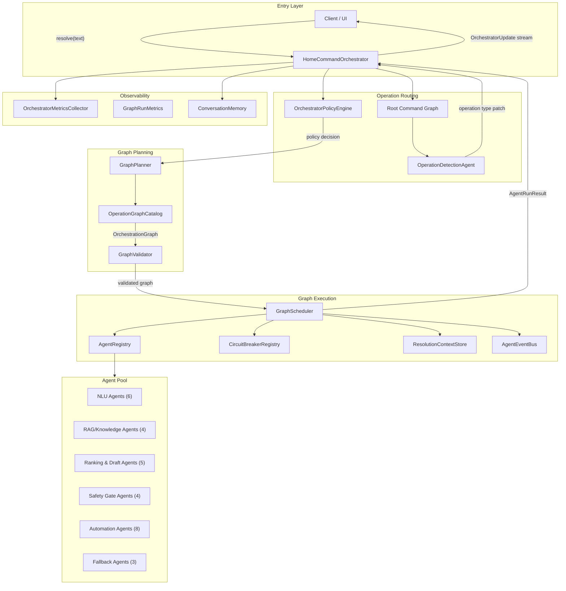

---

## 3. Component Inventory

| Component | Type | LOC | Responsibility |
|---|---|---|---|
| `HomeCommandOrchestrator` | `final class` | 761 | Entry point, lifecycle coordination, metrics assembly |
| `GraphScheduler` | `struct` | — | DAG-based agent execution engine |
| `GraphPlanner` | `struct` | 181 | Constructs operation-specific DAGs |
| `GraphValidator` | `struct` | 235 | Pre-execution graph integrity checks (cycles, reachability) |
| `AgentRegistry` | `final class` | 111 | Agent lookup by ID, capability, or operation |
| `ContextualAgentAdapters` | — | 820 | Type-erased wrappers + `DefaultAgentRegistryFactory` |
| `HomeAutomationAgents/AutomationRuntime` | directory | — | Shared automation runtime context keys, bridge types, and input/output DTOs |
| `HomeAutomationAgents/AutomationDraftExtraction` | directory | — | Automation draft extraction DAG agent |
| `HomeAutomationAgents/AutomationActionResolution` | directory | — | Automation action-resolution DAG agent plus action result DTOs |
| `HomeAutomationAgents/AutomationConditionOperandResolution` | directory | — | Automation condition operand DAG agent plus condition result DTOs |
| `HomeAutomationAgents/SmartThingsCompilation` | directory | — | SmartThings Rule compilation DAG agent |
| `HomeAutomationAgents/SmartThingsRuleCreation` | directory | — | SmartThings Rule creation DAG agent |
| `HomeAutomationAgents/AutomationResultAssembly` | directory | — | Final automation result assembly DAG agent |
| `ResolutionContextStore` | `actor` | 226 | Thread-safe mutable context with typed patch application |
| `OrchestratorPolicyEngine` | `struct` | 150 | Routing, retry, safety gate, and fail-closed policies |
| `CircuitBreakerRegistry` | `actor` | 130 | Per-agent failure isolation (closed → open → half-open) |
| `AgentEventBus` | `actor` | 106 | Real-time event streaming to UI via `AsyncStream` |
| `ConversationMemory` | `actor` | 101 | Short-term multi-turn memory for pronoun resolution |
| `OrchestratorMetricsCollector` | `actor` | 590 | Comprehensive per-run telemetry snapshots |
| `AutomationCreationResolver` | `struct` | — | Automation creation service support retained for reusable logic |
| `AutomationActionResolver` | `struct` | 328 | Resolves action descriptions via direct-command pipeline |
| `AutomationConditionOperandResolver` | `struct` | ~500 | Resolves condition operands to device attributes |
| `OperationGraphCatalog` | `struct` | 82 | Registry of graph providers per operation type |
| `GraphRunMetrics` | — | 81 | Per-node timing, status, and agent selection tracking |

---

## 4. Request Lifecycle — Detailed Flow

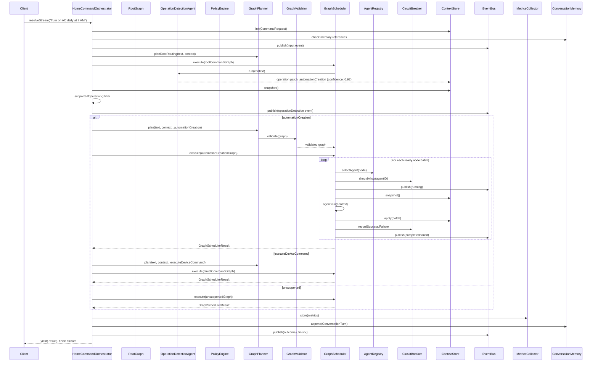

---

## 5. Operation-Specific DAG Topologies

### 5.1 Direct Command Graph

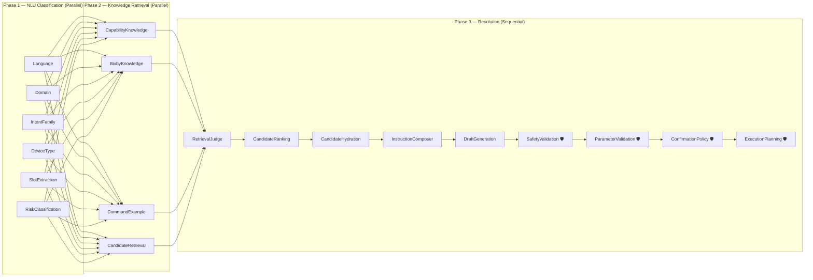

> 🛡 = Safety Gate. Failure triggers `failClosed()` producing a safe resolution (confirmation or unsupported).

### 5.2 Automation Creation Graph

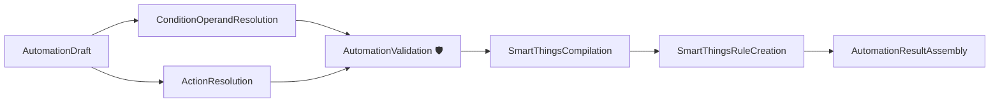

Key design: operation detection is owned by the root routing graph. `ConditionOperandResolution` and `ActionResolution` fan out in parallel after draft extraction, then converge at the validation gate.

### 5.3 Fallback Graph

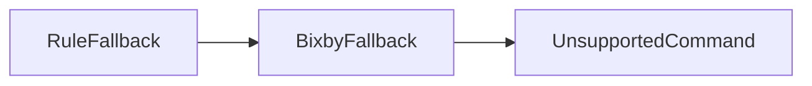

Activated when `PolicyEngine.shouldUseModels()` returns `false`.

---

## 6. Core Subsystem Deep Dives

### 6.1 Agent Protocol Hierarchy

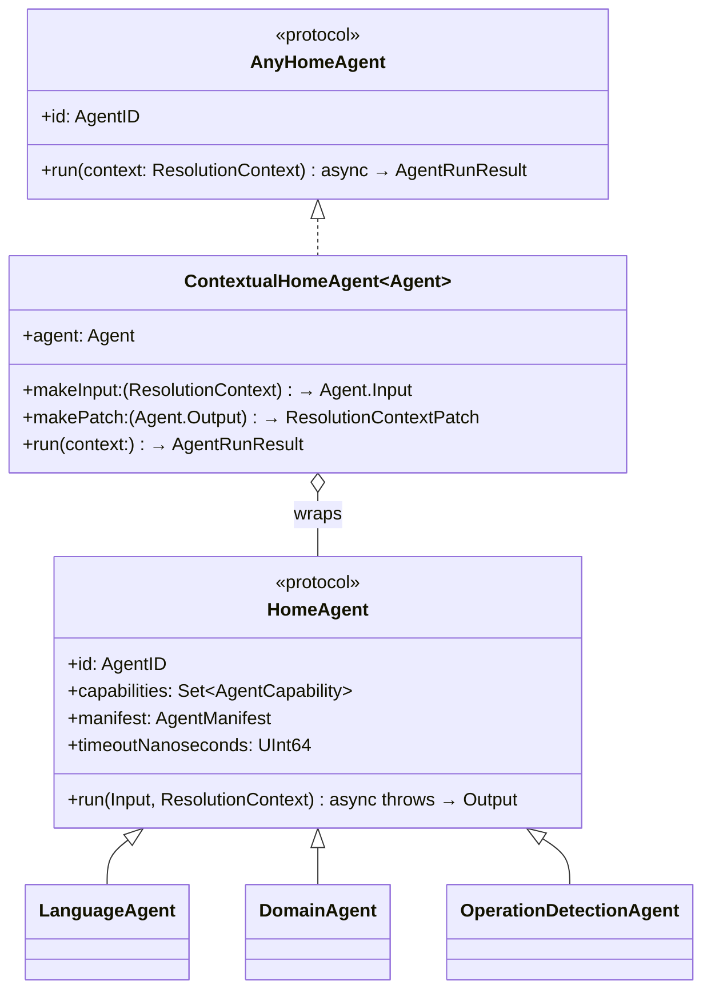

The **two-protocol split** is critical: `HomeAgent` provides type safety for individual agent development, while `AnyHomeAgent` provides type-erasure for the scheduler. `ContextualHomeAgent` bridges them by converting `ResolutionContext` ↔ typed I/O.

### 6.2 ResolutionContext — Shared State Architecture

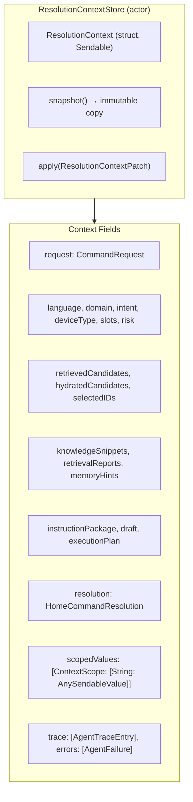

**Critical invariant**: Agents receive an immutable `snapshot()`. They return a `ResolutionContextPatch` containing only the fields they update. The store applies patches atomically. This prevents race conditions during parallel execution.

### 6.3 Circuit Breaker State Machine

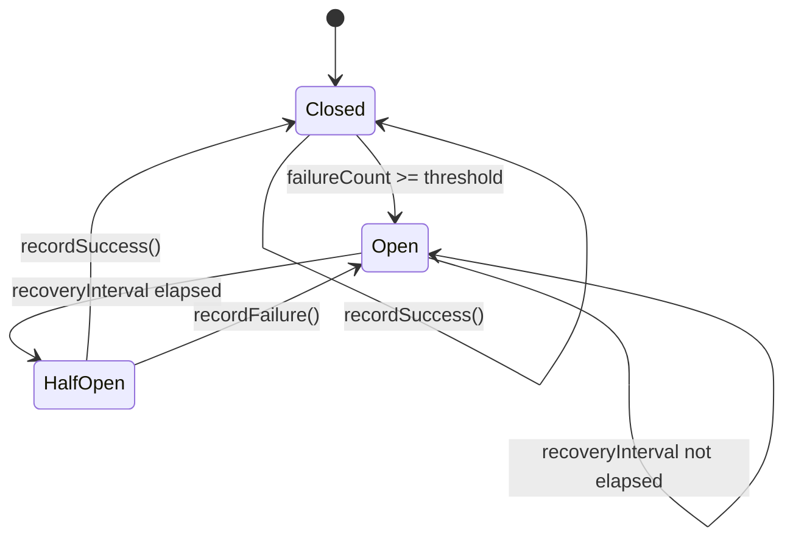

**Defaults**: threshold=3, recoveryInterval=30s. Safety-gate agents that are circuit-broken trigger `failClosed()`.

### 6.4 Graph-Only Runtime

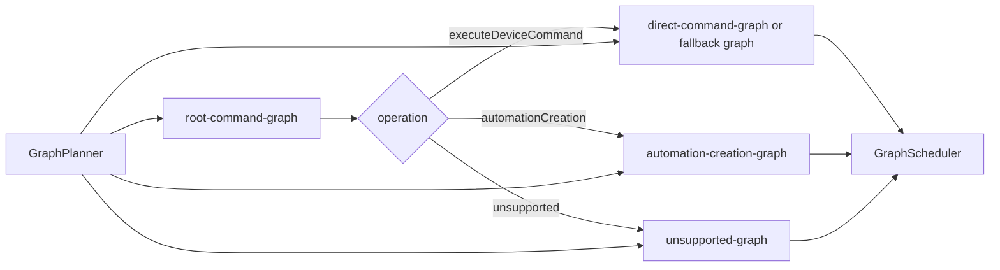

Every command path now runs through `GraphPlanner`, `OperationGraphCatalog`, and `GraphScheduler`. The old phased runtime mode has been removed from active orchestration.

---

## 7. FM-First Agent Pattern

Every NLU worker session follows this pattern:

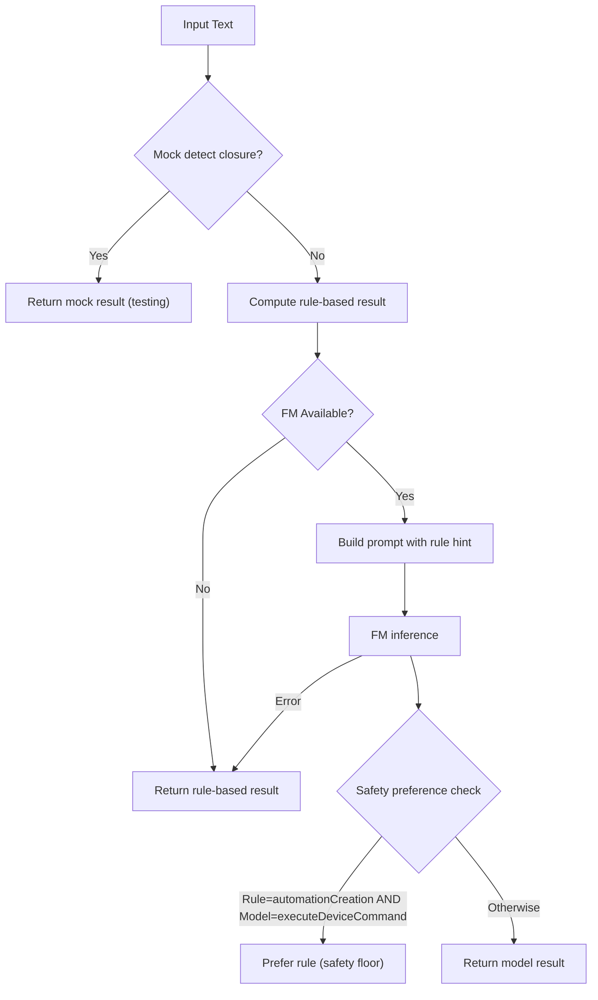

**Key design decision**: The rule-based result is always computed first and provided as a "hint" to the FM. For risk classification, the rule-based risk level serves as a **safety floor** — the FM cannot lower it.

---

## 8. Metrics & Observability

The `OrchestratorMetrics` struct captures 7 metric categories per run:

| Category | Key Fields |
|---|---|
| **Context** | commandCharacterCount, knowledgeSnippetCount, errorCount |
| **Safety** | safetyValidationRan, riskLevel, requiresConfirmation |
| **Candidates** | retrievedCount, hydratedCount, selectedCount, aggregationConfidence |
| **Automation** | operation, graphID, actionCount, conditionCount, compilationSupported |
| **FM Usage** | modelCallCount, skippedCount, contextWindowFailures, guardrailFailures |
| **Retrieval Quality** | strategyNames, averageScore, judgeInvoked, retryCount |
| **Graph Run** | nodeStatuses, nodeDurations, selectedAgents, skippedNodeIDs |

---

## 9. Optimization Analysis

### 9.1 Critical — Performance

| # | Issue | Location | Impact | Recommendation |
|---|---|---|---|---|
| **O-1** | **Redundant context snapshots in GraphScheduler** | `GraphScheduler.execute()` L51 + L111 | Two `await contextStore.snapshot()` calls per iteration — one for candidate filtering, one for the batch. The first snapshot is discarded. | Reuse the same snapshot for both candidate evaluation and batch execution within a single loop iteration. |
| **O-2** | **Agent timeout tuning** | `GraphScheduler.runNode()` | Every agent declares `timeoutNanoseconds` and the scheduler enforces it. Timeout values should continue to be calibrated for parallel action fan-out and FM latency. | Keep timeout enforcement in `withAgentTimeout`, tune per-agent limits, and monitor `agent.timeout` telemetry. |
| **O-3** | **Sequential condition operand resolution** | `AutomationConditionOperandResolver.resolveDraft()` | Condition operands are resolved sequentially. Multi-condition automations pay O(n) latency. | Parallelize operand resolution using `withTaskGroup`, similar to `AutomationActionResolver.resolveAll()`. |
| **O-4** | **Duplicate `stableUnique` implementations** | 4 copies across `HomeCommandOrchestrator`, `AutomationCreationResolver`, `AutomationActionResolutionAggregate` | Code duplication and maintenance risk. | Extract to a shared utility extension on `Array`. |

### 9.2 High — Architecture

| # | Issue | Location | Impact | Recommendation |
|---|---|---|---|---|
| **O-5** | **Duplicated `makeOperationState` factory** | `HomeCommandOrchestrator` L704, `AutomationCreationResolver` L591, `AutomationResultAssemblyAgent` L629 | Three identical 30-line methods. Any change must be synchronized across all three. | Extract to a shared static factory on `HomeResolutionState`. |
| **O-6** | **Root routing graph consolidation** | `HomeCommandOrchestrator`, `GraphPlanner` | Operation routing belongs to the same DAG-owned execution model as direct command and automation creation. | Keep operation detection as the first root graph node and avoid reintroducing pre-graph routing branches. |
| **O-7** | **`AgentEventBus` continuation leak potential** | `AgentEventBus.stream()` L72 | Continuations are appended but never cleaned up on cancellation. If a consumer task is cancelled, its continuation remains in the array, holding memory. | Register an `onTermination` handler on each continuation to remove it from the array. |
| **O-8** | **`ResolutionContextStore.apply()` is a linear chain of conditionals** | `ResolutionContextStore.apply()` L26-95 | 20+ sequential `if let` checks for every patch. Adding a new context field requires modifying this method. | Refactor to a registry-based approach: `[String: (AnySendableValue, inout ResolutionContext) -> Void]` mapping patch keys to typed applicators. |

### 9.3 Medium — Resilience

| # | Issue | Location | Impact | Recommendation |
|---|---|---|---|---|
| **O-9** | **No retry logic in GraphScheduler** | `GraphScheduler.runNode()` | `PolicyEngine.shouldRetry()` exists but is never called by the graph scheduler. Retryable failures are recorded but not retried. | Add a retry loop in `runNode()` that calls `policy.shouldRetry()` and re-executes with exponential backoff up to `maxRetries`. |
| **O-10** | **Circuit breaker state is not persisted** | `CircuitBreakerRegistry` | Circuit breakers reset on process restart. A persistently failing agent will re-trip on every cold start, causing latency spikes. | Persist circuit states to `UserDefaults` or a lightweight store; restore on init. |
| **O-11** | **`GraphScheduler` blocked-node detection is fragile** | `GraphScheduler.execute()` L57 | If all remaining nodes have unsatisfied dependencies but no cycle exists (e.g., a skipped node's dependents), the scheduler correctly detects the block but emits a `terminalFailure`. | Treat blocked nodes with `.optional` policy as skippable rather than terminal. |

### 9.4 Low — Observability & Maintainability

| # | Issue | Location | Impact | Recommendation |
|---|---|---|---|---|
| **O-12** | **`ResolutionContextPatchKey` uses raw strings** | `ResolutionContextPatchKey` | Typos in key strings cause silent data loss. No compile-time safety. | Convert to an enum with `rawValue` strings, or use `ScopedContextKey<T>` consistently for all fields. |
| **O-13** | **`OrchestratorMetrics` is monolithic** | `OrchestratorMetricsCollector.swift` (590 LOC) | Contains 7 nested metric structs, capture logic, confidence computation, and FM diagnostics in a single file. | Split into separate files per metric category. Extract `captureEvaluationFields` and `captureAutomationFields` into dedicated metric builders. |
| **O-14** | **Conversation memory reference detection is naive** | `ConversationMemoryReferenceDetector.containsMemoryReference()` | Simple token matching for ["it", "that", "same", "there"]. High false-positive rate (e.g., "put it there" triggers twice). | Use an FM-backed coreference resolution step, or at minimum add bigram context (e.g., "turn it" vs "it is"). |

---

## 10. Optimization Priority Matrix

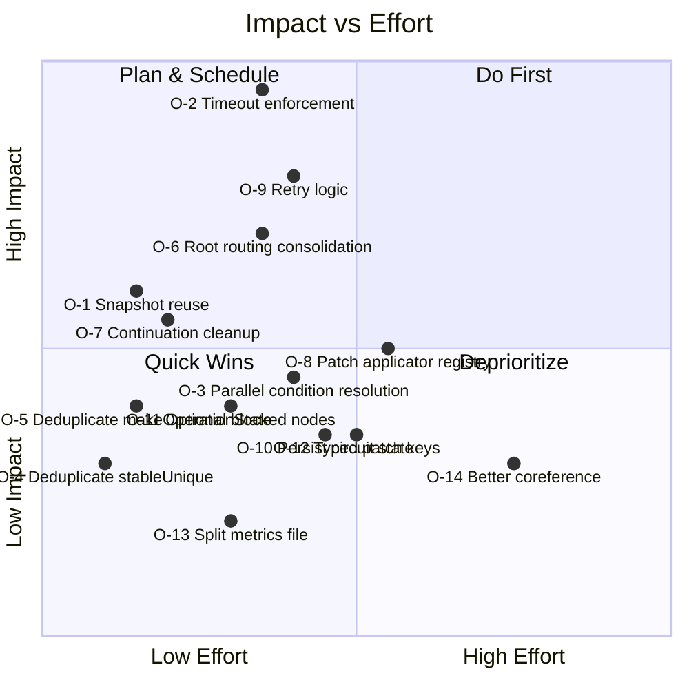

### Recommended Execution Order

1. **O-2** — Add timeout enforcement (prevents hung pipelines)
2. **O-1** — Eliminate redundant snapshots (free performance win)
3. **O-7** — Fix continuation leak (memory safety)
4. **O-9** — Wire retry logic into GraphScheduler (resilience)
5. **O-5 + O-4** — Deduplicate shared code (maintainability)
6. **O-6** — Preserve graph-only root routing (reduce surface area)

---

## 11. File Dependency Graph

```mermaid
graph TB
    HCO["HomeCommandOrchestrator.swift"]
    CAA["ContextualAgentAdapters.swift"]
    ART["HomeAutomationAgents/AutomationRuntime"]
    ADE["HomeAutomationAgents/AutomationDraftExtraction"]
    AARAgent["HomeAutomationAgents/AutomationActionResolution"]
    ACRAgent["HomeAutomationAgents/AutomationConditionOperandResolution"]
    STC["HomeAutomationAgents/SmartThingsCompilation"]
    STRC["HomeAutomationAgents/SmartThingsRuleCreation"]
    ARAss["HomeAutomationAgents/AutomationResultAssembly"]
    GS["GraphScheduler.swift"]
    GP["GraphPlanner.swift"]
    OGC["OperationGraphCatalog.swift"]
    GV["GraphValidator.swift"]
    AReg["AgentRegistry.swift"]
    PE["OrchestratorPolicyEngine.swift"]
    RCS["ResolutionContextStore.swift"]
    CBR["CircuitBreakerRegistry.swift"]
    EB["HomeAutomationAgents/Runtime/AgentEventBus.swift"]
    CM["ConversationMemory.swift"]
    MC["OrchestratorMetricsCollector.swift"]
    ACR["Automation/Creation/AutomationCreationResolver.swift"]
    AAR["Automation/ActionResolution/AutomationActionResolver.swift"]
    OG["OrchestrationGraph.swift"]
    GRM["GraphRunMetrics.swift"]
    PCK["HomeAutomationAgents/Runtime/ResolutionContextPatchKey.swift"]

    HCO --> CAA & ART & ADE & AARAgent & ACRAgent & STC & STRC & ARAss & GS & GP & AReg & PE & RCS & CBR & EB & CM & MC & ACR & OG & GRM
    GS --> OG & AReg & RCS & EB & PE & CBR & GV & GRM
    GP --> OGC & OG
    ACR --> AAR & CAA
    AAR --> GS & AReg & PE & GP & CBR
    CAA --> AReg & PE & RCS
```

---

## 12. Glossary

| Term | Definition |
|---|---|
| **Agent** | A single-responsibility processing unit that reads `ResolutionContext` and produces a `ResolutionContextPatch` |
| **Safety Gate** | An agent whose failure triggers `failClosed()` — producing a safe-but-degraded resolution rather than continuing |
| **Resolution** | The final outcome: `readyToExecute`, `requiresConfirmation`, `needsClarification`, `unsupported`, `automationDrafted`, or `executed` |
| **Patch** | A typed dictionary update (`ResolutionContextPatch`) that an agent emits to update shared state |
| **Guard Condition** | A predicate on `GraphNode` that must be true for the node to execute (e.g., `contextKeyPresent("draft")`) |
| **Fan-out** | Parallel execution of independent graph nodes (e.g., Phase 1 NLU agents or Action + Condition resolution) |
| **FM-First** | Architecture where Foundation Model is the primary inference path, with deterministic rules as hints and fallbacks |
| **Safety Floor** | The principle that deterministic risk assessment cannot be lowered by the FM — only raised |
