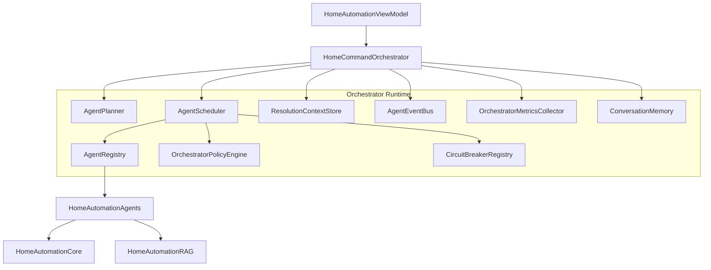
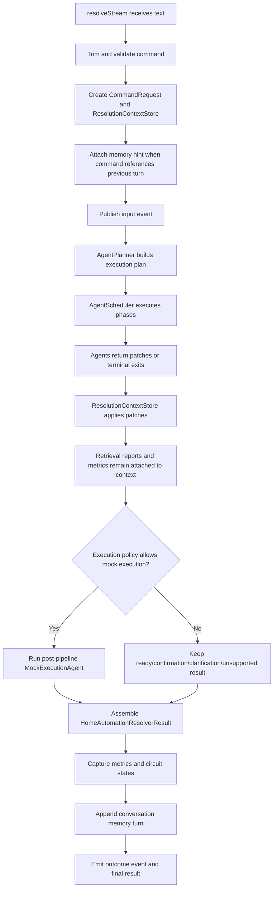
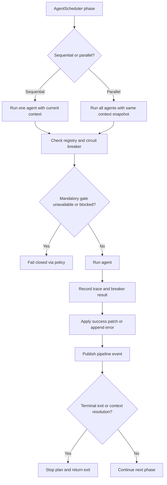

# HomeAutomationOrchestrator Source Module

`HomeAutomationOrchestrator` is the runtime coordinator for the multi-agent architecture. It plans agent work, executes sequential and parallel stages, merges context patches, streams pipeline events, records metrics, applies conversation memory, tracks retrieval quality, and enforces fail-closed safety behavior.

This module answers the question: "How do specialized agents cooperate safely to produce one command resolution?"

## Architecture Role



## Runtime Flow



## Plan Shapes

```text
Fallback-only plan:
RuleFallbackAgent -> BixbyFallbackAgent -> UnsupportedCommandAgent

Full model plan:
Parallel NLU agents
-> Parallel knowledge agents + candidate retrieval
-> RetrievalJudgeAgent
-> CandidateRankingAgent
-> CandidateHydrationAgent
-> InstructionComposerAgent
-> DraftGenerationAgent
-> SafetyValidationAgent
-> ParameterValidationAgent
-> ConfirmationPolicyAgent
-> ExecutionPlanningAgent
-> post-pipeline MockExecutionAgent when allowed by policy
```

## Component Details

| Component | Role |
| --- | --- |
| `OrchestratorUpdate` | Stream output enum: either an `OrchestratorPipelineEvent` or final `HomeAutomationResolverResult`. |
| `HomeCommandOrchestrator` | Main resolver. Owns high-level lifecycle, stream creation, context store setup, memory hint injection, scheduling, result assembly, metrics storage, and memory append. |
| `HomeCommandOrchestrator.makeRAGEnabled` | Convenience factory that indexes canonical knowledge and injects a `ContextRetriever` into the agent registry. |
| `AgentTask` | One planned agent call identified by `AgentID`. |
| `AgentPhase` | Execution phase, either sequential or parallel. |
| `AgentExecutionPlan` | Ordered plan of agent phases plus fallback-only marker. |
| `AgentPlanner` | Builds fallback-only or full model execution plans based on `OrchestratorPolicyEngine.shouldUseModels`. |
| `AgentScheduler` | Executes phases, checks circuit breakers, publishes events, runs agents, applies patches, records traces, and returns terminal exits. |
| `AgentRegistry` | Stores type-erased agents by ID and capability for scheduler lookup. |
| `ContextualHomeAgent` | Adapts a typed `HomeAgent` to `AnyHomeAgent` by deriving input from context and mapping output to a patch. |
| `DefaultAgentRegistryFactory` | Wires default agent instances, dependencies, RAG retriever, model availability closure, registry, validators, tools, and executors. |
| `ResolutionContextPatchKey` | String constants for patch keys used by `ResolutionContextStore`. |
| `ResolutionContextStore` | Actor that owns the evolving `ResolutionContext`; supports snapshots, patch application, retrieval report append, error append, trace append, and memory hint append. |
| `OrchestratorPipelineEvent` | UI-visible event with run ID, stage, optional agent ID, status, and detail. |
| `AgentEventBus` | Async event publisher and replay stream for pipeline events. |
| `OrchestratorPolicyEngine` | Central policy for model availability, retry limits, terminal exits, execution permission, mandatory safety gate detection, and fail-closed results. |
| `CircuitState` | Circuit breaker state: closed, open, or half-open. |
| `AgentCircuitBreaker` | Per-agent breaker with failure threshold and recovery behavior. |
| `CircuitBreakerRegistry` | Actor that provides breakers and status snapshots for all agents. |
| `ConversationTurn` | Stored summary of a previous command, selected device, capability, confirmation status, and risk. |
| `ConversationMemory` | Actor storing recent turns and returning last resolved device hints. |
| `ConversationMemoryReferenceDetector` | Detects follow-up wording such as "it", "that", "same", or relative phrases. |
| `OrchestratorContextMetrics` | Context and retrieval-related metrics. |
| `OrchestratorSafetyMetrics` | Safety, confirmation, and execution-safety metrics. |
| `OrchestratorCandidateMetrics` | Candidate count, shard, and ranking metrics. |
| `RetrievalQualityMetrics` | Retrieval strategies, average/max score, low-score source count, judge invocation/skips, retry count, and reformulated-query count. |
| `FoundationModelUsageMetrics` | Foundation Models availability, model-call, skipped-call, failure, tool, and context-budget metrics. |
| `OrchestratorMetrics` | Full run metrics payload, including traces, fallback usage, retrieval quality, Foundation Models usage, circuit states, evaluation fields, and final outcome. |
| `OrchestratorMetricsCollector` | Actor storing latest metrics and serializing them as JSON for the UI. |

## Scheduling Behavior



## Safety and Resilience Rules

- `SafetyValidationAgent`, `ParameterValidationAgent`, `ConfirmationPolicyAgent`, `ExecutionPlanningAgent`, and `MockExecutionAgent` are mandatory gates.
- Mandatory gates fail closed if unavailable, failed, or blocked by an open circuit breaker.
- Non-mandatory agents may be skipped when circuit breakers are open, allowing deterministic fallback to continue.
- `MockExecutionAgent` fail-closed behavior returns a ready plan instead of mutating the registry.
- Conversation memory can add hints only before planning; it cannot bypass validation.
- Every attempted agent should appear in traces, metrics, and pipeline events.
- Foundation Models availability, prompt budget, selected tools, skipped calls, and model failure categories are surfaced through metrics.
- Retrieval judge behavior is observable through `RetrievalQualityMetrics`; weak retrieval can trigger at most one bounded reformulated retry.
