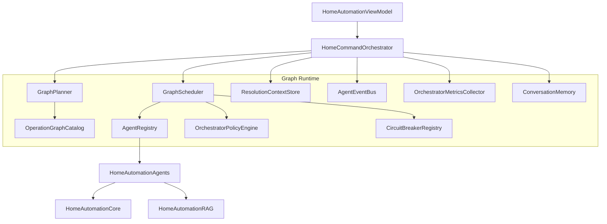
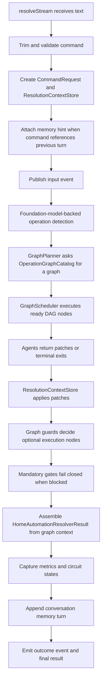
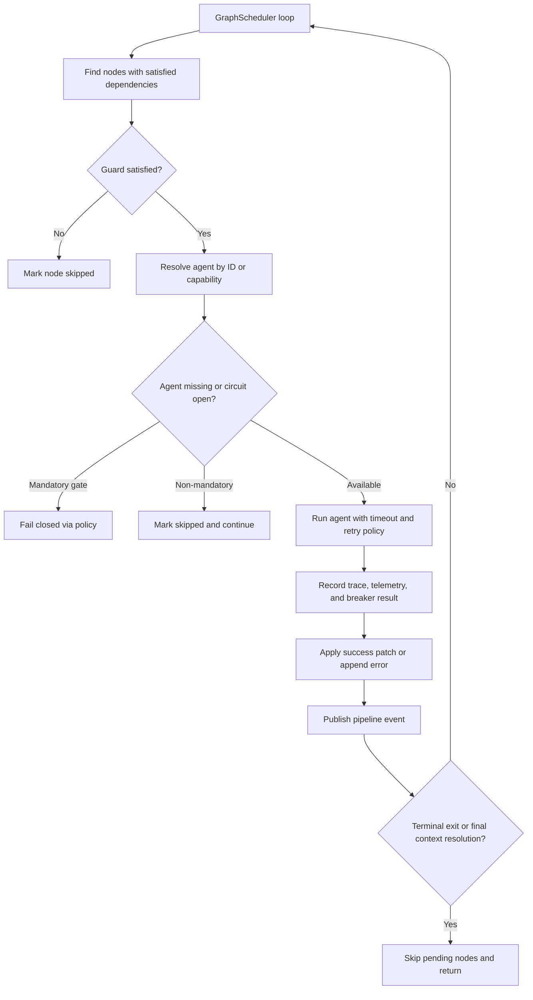

# HomeAutomationOrchestrator Source Module

`HomeAutomationOrchestrator` is the graph-only runtime coordinator for the multi-agent architecture. It detects the requested operation, selects an operation graph, executes ready DAG nodes, merges context patches, streams pipeline events, records metrics, applies conversation memory, tracks retrieval quality, and enforces fail-closed safety behavior.

This module answers the question: "How do specialized agents cooperate safely to produce one command resolution?"

## Architecture Role



## Runtime Flow



All command paths run through `GraphPlanner` plus `GraphScheduler`. There is no runtime-mode branching and no phased scheduler rollback path.

## Graph Shapes

```text
Direct command graph:
Parallel NLU agents
-> Parallel knowledge agents + candidate retrieval
-> RetrievalJudgeAgent
-> CandidateRankingAgent
-> CandidateHydrationAgent
-> InstructionComposerAgent
-> DraftGenerationAgent
-> SafetyValidationAgent
-> ParameterValidationAgent
-> ConfirmationPolicyAgent
-> ExecutionPlanningAgent
-> MockExecutionAgent guarded by OrchestratorPolicyEngine.canExecute(context:)

Fallback graph:
RuleFallbackAgent
-> BixbyFallbackAgent
-> UnsupportedCommandAgent

Automation creation graph:
OperationDetectionAgent
-> AutomationDraftAgent
-> AutomationConditionOperandResolutionAgent and AutomationActionResolutionAgent in parallel
-> AutomationValidationAgent
-> SmartThingsCompilationAgent
-> SmartThingsRuleCreationAgent
-> AutomationResultAssemblyAgent

Unsupported graph:
UnsupportedCommandAgent
```

`MockExecutionAgent` is part of the direct-command DAG. If `executeLowRiskCommands` is false, its graph guard skips the node and the result remains `.readyToExecute`. If execution is allowed and the plan is safe, the node runs inside `GraphScheduler` and produces `.executed`.

Automation creation is also graph-native. If the automation graph cannot produce a final result, the orchestrator returns the graph-derived failure or unsupported outcome instead of running a second non-DAG resolver.

## Component Details

| Component | Role |
| --- | --- |
| `OrchestratorUpdate` | Stream output enum: either an `OrchestratorPipelineEvent` or final `HomeAutomationResolverResult`. |
| `HomeCommandOrchestrator` | Main resolver. Owns high-level lifecycle, stream creation, context setup, operation detection, graph execution, result assembly, metrics storage, and memory append. |
| `HomeCommandOrchestrator.makeRAGEnabled` | Convenience factory that indexes canonical knowledge and injects a `ContextRetriever` into the agent registry. |
| `GraphPlanner` | Selects operation-specific DAGs via `OperationGraphCatalog`. |
| `OperationGraphCatalog` | Maps operation kinds to direct-command, fallback, automation-creation, or unsupported graphs. |
| `GraphScheduler` | Executes graph nodes when dependencies and guards are satisfied, records graph metrics, checks circuits, publishes events, applies patches, and respects fail-closed policy. |
| `OrchestrationGraph` | Immutable graph definition containing nodes, edges, entry nodes, and orchestration goal. |
| `GraphNode` | One executable graph node with an agent requirement, execution policy, and optional guard. |
| `GraphGuard` | Predicate used to skip guarded nodes such as `mockExecution` when policy does not allow execution. |
| `GraphRunMetrics` | Per-graph metrics containing node statuses, selected agents, skipped nodes, and node durations. |
| `AgentRegistry` | Stores type-erased agents by ID and capability for graph lookup. |
| `ContextualHomeAgent` | Adapts a typed `HomeAgent` to `AnyHomeAgent` by deriving input from context and mapping output to a patch. |
| `DefaultAgentRegistryFactory` | Wires default agent instances, dependencies, RAG retriever, model availability closure, registry, validators, tools, and executors. |
| `ResolutionContextPatchKey` | String constants for patch keys used by `ResolutionContextStore`. |
| `ResolutionContextStore` | Actor that owns the evolving `ResolutionContext`; supports snapshots, patch application, retrieval report append, error append, trace append, and memory hint append. |
| `OrchestratorPipelineEvent` | UI-visible event with run ID, stage, optional agent ID, status, and detail. |
| `AgentEventBus` | Async event publisher and replay stream for pipeline events. |
| `OrchestratorPolicyEngine` | Central policy for model availability, retry limits, terminal exits, execution permission, mandatory safety gate detection, and fail-closed results. |
| `CircuitState` | Circuit breaker state: closed, open, or half-open. |
| `AgentCircuitBreaker` | Per-agent breaker with failure threshold and recovery behavior. |
| `CircuitBreakerRegistry` | Actor that provides breakers and status snapshots for all agents. |
| `ConversationTurn` | Stored summary of a previous command, selected device, capability, confirmation status, and risk. |
| `ConversationMemory` | Actor storing recent turns and returning last resolved device hints. |
| `ConversationMemoryReferenceDetector` | Detects follow-up wording such as "it", "that", "same", or relative phrases. |
| `OrchestratorMetrics` | Full run metrics payload, including traces, fallback usage, retrieval quality, Foundation Models usage, graph metrics, circuit states, automation fields, and final outcome. |
| `OrchestratorMetricsCollector` | Actor storing latest metrics and serializing them as JSON for the UI. |

Telemetry and metrics keep `runtimeMode` as a string field for analytics continuity, but orchestration always writes `"graph"`.

## Scheduling Behavior



## Safety and Resilience Rules

- `AutomationValidationAgent`, `SafetyValidationAgent`, `ParameterValidationAgent`, `ConfirmationPolicyAgent`, `ExecutionPlanningAgent`, and `MockExecutionAgent` are mandatory gates.
- Mandatory gates fail closed if unavailable, failed, or blocked by an open circuit breaker.
- Non-mandatory agents may be skipped when circuit breakers are open, allowing later graph nodes or fallback nodes to determine the outcome.
- `MockExecutionAgent` fail-closed behavior returns a ready plan instead of mutating the registry.
- Conversation memory can add hints only before graph execution; it cannot bypass validation.
- Every attempted or skipped graph node should appear in graph metrics and pipeline events.
- Foundation Models availability, prompt budget, selected tools, skipped calls, and model failure categories are surfaced through metrics.
- Retrieval judge behavior is observable through `RetrievalQualityMetrics`; weak retrieval can trigger at most one bounded reformulated retry.
