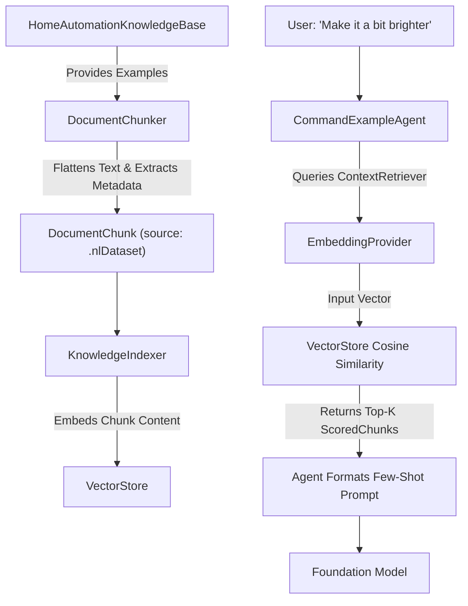

# HomeAutomationRAG Implementation

This document details the implementation of Retrieval-Augmented Generation (RAG) within the `HomeAutomationRAG` module and explains how it optimizes token usage and improves Foundation Model responses.

## 1. RAG Architecture and Implementation

The `HomeAutomationRAG` module acts as the targeted context retrieval layer for the Home Automation multi-agent orchestrator. Instead of relying on static, monolithic system prompts, the system dynamically retrieves relevant pieces of knowledge based on the user's current request.

### Core Components

- **Canonical Sources**: The RAG pipeline ingests ground-truth data from four primary sources:
  1. **Capability Catalog**: Definitions of what devices can do (e.g., commands, risk levels, attributes).
  2. **Generated NL Dataset**: Example natural language commands mapped to device capabilities and intents.
  3. **Bixby Command Catalog**: Mappings of Bixby actions to system capabilities.
  4. **Device Registry**: The actual smart home devices available to the user.
- **`DocumentChunker`**: Converts the raw canonical data into small, manageable `DocumentChunk` records. Each chunk maintains its origin (`KnowledgeSource`) and dictionary metadata for precise filtering.
- **`EmbeddingProvider`**: Converts chunk text into mathematical vector representations (`[Float]`). The system uses a highly resilient provider architecture:
  - `SemanticEmbeddingProvider`: For high-quality, production-grade semantic vectors.
  - `TFIDFEmbeddingProvider`: A deterministic, local term frequency-inverse document frequency provider. Excellent for local testing, offline fallback, and reproducible behavior.
  - `FallbackEmbeddingProvider`: Seamlessly falls back to TF-IDF if semantic embeddings fail or are unavailable.
- **`VectorStore` & `KnowledgeIndexer`**: The `KnowledgeIndexer` runs at app startup, processing all chunks and storing them in the `VectorStore`—an actor-backed, in-memory index. To optimize launch times, the system utilizes `VectorIndexCache` to persist the vectors and vocabulary to disk, allowing near-instant restoration on subsequent launches.
- **`ContextRetriever`**: The public API consumed by the agents. It takes a user query, embeds it, and performs a Cosine Similarity search against the `VectorStore`, returning a ranked list of `ScoredChunk` results.

---

## 2. Capability Catalog Data Ingestion (Exact Implementation)

To understand exactly how canonical data is fed into the RAG system, we look at the `Capability Catalog`. This catalog acts as the source of truth for every possible device action (e.g., `switch.on`, `thermostat.setpoint`).

The `DocumentChunker` parses the `HomeCapabilityRegistry` and translates each capability into a highly structured `DocumentChunk`.

**Implementation Details:**
1. **Flattened Content String**: For each capability, the chunker creates a single, searchable text block combining all critical fields:
   ```swift
   "Capability switch. Display name Switch. Commands on off. Attributes power. Enum values . Risk low"
   ```
2. **Metadata Dictionary**: It also extracts exact values into a `metadata` dictionary for precise filtering later:
   ```swift
   metadata: [
       "capabilityId": "switch",
       "commands": "on,off",
       "risk": "low"
   ]
   ```
3. **Source Tagging**: The chunk is tagged with `source: .capability`.

When the `KnowledgeIndexer` runs, it loops through all these capability chunks, converts the flattened content string into a vector using the `EmbeddingProvider`, and stores the vector alongside the metadata in the `VectorStore`.

---

## 3. Querying the RAG & Retrieval Techniques

### Current Retrieval Implementation
When an agent queries the RAG, it uses the `ContextRetriever.retrieve()` method. 
- **Query Strategy**: The agent passes the user's raw text command (e.g., "Turn on the lights") and a `MetadataFilter` (e.g., `filter: .capability`).
- **Searching Technique**: The system uses **Cosine Similarity**. The `ContextRetriever` converts the user's query into a vector and then calculates the cosine angle between the query vector and all chunk vectors in the `VectorStore` that match the metadata filter. The top-K chunks with the highest cosine similarity (closest to 1.0) are returned.

### Alternative Retrieval Algorithms
While Cosine Similarity over dense vectors (or TF-IDF sparse vectors) is used here, other algorithms could be implemented:

- **BM25 (Best Matching 25)**: A highly efficient sparse-vector algorithm based on term frequency and document length. Excellent for exact keyword matching (e.g., finding exact capability IDs).
- **Hybrid Search**: Combines Dense Vector Search (semantic meaning) with BM25 (exact keywords) and fuses the results using Reciprocal Rank Fusion (RRF). This is the industry standard for production RAG systems.
- **HNSW (Hierarchical Navigable Small World)**: An Approximate Nearest Neighbor (ANN) algorithm. Instead of calculating cosine similarity against *every* vector (which is $O(N)$), HNSW uses a graph structure to find nearest neighbors in $O(\log N)$ time, crucial for massive datasets.
- **MMR (Maximal Marginal Relevance)**: An algorithm that re-ranks results to ensure diversity. This prevents the RAG from returning 5 chunks that basically say the exact same thing.

### Alternative Preprocessing Techniques for Efficient Retrieval
To improve how information is fed into the RAG system, the following preprocessing techniques could be added:

1. **Query Expansion & HyDE (Hypothetical Document Embeddings)**: Before querying the VectorStore, an LLM could generate a hypothetical capability JSON based on the user's command. The RAG system then embeds this hypothetical document instead of the raw user query, resulting in much higher similarity matches with the actual capability chunks.
2. **Sliding Window Chunking**: For very large datasets (like long generated examples), chunks can overlap by a certain number of tokens. This prevents important context from being cut off at the boundary between two chunks.
3. **Hierarchical Metadata Enrichment**: Automatically expanding metadata based on relationships. For example, if a device chunk is located in the "Living Room", the chunker could enrich the metadata to also include "Zone: First Floor" or "Synonyms: Family Room, Lounge".
4. **Entity Extraction**: Running a fast Named Entity Recognition (NER) pass over the user query to explicitly extract the target device and action, and mapping those directly as required filters before executing the vector search.

---

## 4. NL Dataset Ingestion & Retrieval (Exact Implementation)

The `Generated NL Dataset` provides few-shot examples for NLU (Natural Language Understanding) agents. It maps natural phrasing (e.g., "Dim the lights") to strict system concepts (`intent`, `capability`, `deviceType`).

### How it is Maintained and Chunked
When `KnowledgeIndexer` runs, the `DocumentChunker.nlDatasetChunks()` method parses every `HomeGeneratedCommandExample`. 

**Implementation Details:**
1. **Flattened Content String**: Similar to capabilities, the example is flattened into a descriptive sentence.
   ```swift
   "Natural language example Dim the lights. Language en. Device type light. Device name living room lamp. Room living room. Capability switchLevel. Command setLevel. Intent set_brightness. Risk low"
   ```
2. **Metadata Dictionary**: Key categorical data is extracted for targeted querying.
   ```swift
   metadata: [
       "exampleId": "123",
       "language": "en",
       "deviceType": "light",
       "capability": "switchLevel",
       "command": "setLevel"
   ]
   ```
3. **Source Tagging**: The chunk is strictly tagged with `source: .nlDataset`.

### How it is Queried
Agents responsible for Natural Language Understanding (like `CommandExampleAgent`, `IntentFamilyAgent`, or `SlotExtractionAgent`) query the dataset using `ContextRetriever.retrieve()` with a `MetadataFilter(source: .nlDataset)`. 

The user's query is converted to a vector. Because the chunk content begins with *"Natural language example [user phrase]"*, the Cosine Similarity heavily weights linguistic overlap, returning the closest historical examples to the user's current request.

### Flow Diagram



### Potential Improvements for NL Dataset RAG
Currently, the system embeds the entire flattened string. This can cause **"metadata dilution,"** where the actual user phrase is mathematically watered down by the boilerplate metadata text included in the chunk.

We can improve this via:
1. **Targeted Embedding (Dual-Encoder Approach)**: Instead of embedding the entire flattened string, the `EmbeddingProvider` should *only* embed the `example.text` (e.g., "Dim the lights"). The rest of the data (Capability, Intent) remains strictly in the `metadata` payload. This guarantees that Cosine Similarity is measuring pure semantic intent without interference from boilerplate labels.
2. **Pre-Filter by Device Type**: If a previous agent (like `DeviceTypeAgent`) has already classified the target device as a `light`, the `CommandExampleAgent` could apply a compound filter: `MetadataFilter(source: .nlDataset, metadata: ["deviceType": "light"])`. This instantly cuts out thousands of irrelevant examples (like thermostat commands) before the vector search even runs, achieving $O(1)$ scaling performance per device domain.
3. **Hard Negative Mining**: The dataset likely has very similar linguistic commands with different consequences (e.g., "turn on the TV" vs "turn up the TV"). The embedding model could be fine-tuned using Hard Negative Mining to ensure the vector space accurately separates these subtle intent boundaries.

---

## 5. The Total Flow: From Input to Resolution

Here is exactly how RAG operates within this system when a user issues a command.

**1. The User Input**
Let's assume the user says: *"Make it colder in the living room."*
This string is passed into the `HomeCommandOrchestrator`, which spins up a series of specialized agents to resolve the command. 

**2. The RAG Query**
Instead of one massive RAG query, the orchestrator delegates to specialized agents (e.g., `CandidateRetrievalAgent` for devices, `CapabilityKnowledgeAgent` for actions). Each agent independently queries the RAG `ContextRetriever` using the user's input, but applies a specific **Metadata Filter**:
- The `CandidateRetrievalAgent` calls `ContextRetriever.retrieve("Make it colder in the living room", filter: .device)`.
- The `CapabilityKnowledgeAgent` calls `ContextRetriever.retrieve("Make it colder in the living room", filter: .capability)`.

**3. Inside the Context Retriever**
- **Embedding:** The `EmbeddingProvider` (using Semantic models or the local TF-IDF fallback) converts *"Make it colder in the living room"* into a mathematical vector (`[Float]`).
- **Vector Search:** It searches the `VectorStore` (which was indexed at app startup) and calculates the Cosine Similarity between the input vector and all the chunk vectors in the database.

**4. The RAG Output (`[ScoredChunk]`)**
The `ContextRetriever` returns a ranked list of the `Top-K` (usually top 5) closest matches. For example, the device query might return a `ScoredChunk` that looks like this:
```swift
// A highly scored chunk for the device query
ScoredChunk(
    score: 0.89,
    chunk: DocumentChunk(
        content: "Living Room AC Thermostat",
        source: .device,
        metadata: ["deviceId": "living_room_ac", "room": "living_room"]
    )
)
```

**5. Hydration (The "Secret Sauce" for Accuracy)**
RAG output can sometimes be slightly outdated or hallucinated if generated poorly. To prevent this, the agents **do not** feed the raw RAG text directly to the model. 
Instead, the agent looks at the `metadata["deviceId"]` (e.g., `"living_room_ac"`) and fetches the absolute, authoritative definition of that device directly from the hardcoded `DeviceRegistry` in `HomeAutomationCore`. 

**6. Prompt Construction and Model Execution**
The agent packages these hydrated, canonical definitions into a concise `KnowledgeSnippet` and injects them into the Foundation Model's prompt. 
The LLM receives a prompt that essentially says: *"The user said 'Make it colder'. Here are the 5 devices and capabilities that are most relevant to their request: [Canonical Details]. Draft the command."*

---

## 6. Improving Model Answers and Token Efficiency

This flow fundamentally improves the Foundation Model's performance in three ways:

### Using Fewer Tokens (Efficiency & Latency)
- **Dynamic Prompt Sizing**: Before RAG, the orchestrator would have to inject the entire `HomeAutomationKnowledgeBase` and `DeviceRegistry` into the system prompt of every agent. As the user adds more devices and routines, the prompt size grows linearly. 
- **O(1) Token Cost**: With RAG, the system prompt size is effectively constant, regardless of how many devices the user owns. The `ContextRetriever` strictly limits context to the `Top-K` results (typically K=5). 
- **Lower Latency**: Fewer input tokens directly translate to faster Time-To-First-Token (TTFT) from the Foundation Model. This is critical for voice-activated home automation systems where user perceived latency must remain under a strict budget.

### Getting Better Answers (Accuracy & Grounding)
- **Eliminating "Lost in the Middle" Syndrome**: Large Language Models often suffer from poor recall when presented with massive contexts (e.g., thousands of lines of device definitions). By narrowing the context to a handful of highly relevant items (e.g., only devices in the "living room" with cooling capabilities), the model's attention is laser-focused, preventing it from accidentally controlling a device in the wrong room.
- **Preventing Hallucinations & Guarantees Safety**: Because the RAG output is used to *lookup* authoritative data from the system's core registry (Step 5), the LLM only ever sees exact, system-verified schemas (e.g., `capability: thermostat.setpoint`, `enumValues: [16...30]`, `risk: low`). This guarantees that the LLM generates a valid command payload that the system can actually parse and execute safely.
