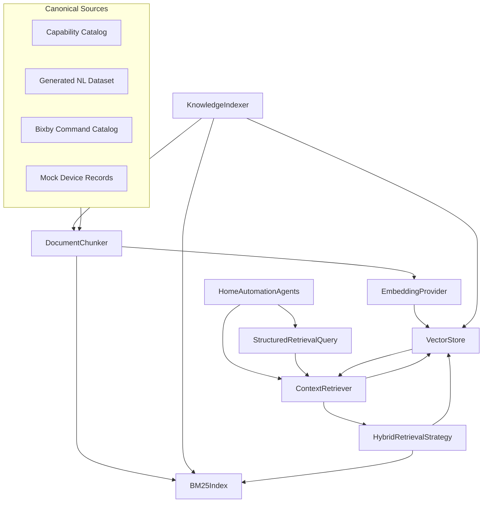
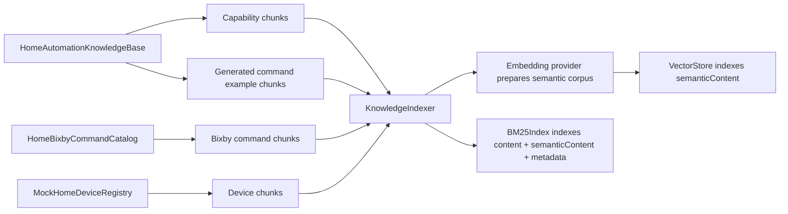
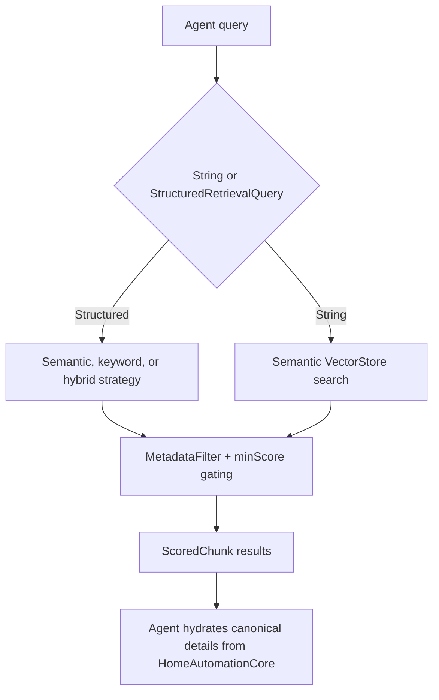

# HomeAutomationRAG Source Module

`HomeAutomationRAG` is the retrieval layer for the home-automation orchestrator. It indexes canonical knowledge into small chunks and returns relevant context to agents without forcing every prompt to include the entire catalog.

This module answers the question: "Which small pieces of trusted context are relevant to this command or agent?"

## Architecture Role

## Indexing Flow

## Query Flow

## Component Details

| Component | Role |
| --- | --- |
| `DocumentChunk` | Identifiable unit of retrievable knowledge. It stores full display `content`, clean embeddable `semanticContent`, source, and metadata. |
| `KnowledgeSource` | Enum that identifies chunk origin: capability, natural-language dataset, Bixby command, or device. |
| `ScoredChunk` | Result wrapper containing a chunk and similarity score. |
| `MetadataFilter` | Optional source, exact metadata, and multi-value metadata constraints for retrieval. |
| `DocumentChunker` | Converts capabilities, generated examples, Bixby commands, and device records into chunk lists. |
| `EmbeddingProviding` | Protocol for converting text into vector embeddings. |
| `CorpusAwareEmbeddingProviding` | Embedding protocol for providers that can prepare themselves from the full corpus before indexing. |
| `TFIDFEmbeddingProvider` | Deterministic local embedding provider. Good for tests, offline operation, and reproducible fallback behavior. |
| `SemanticEmbeddingProvider` | Semantic provider wrapper for production-grade embeddings when available. |
| `FallbackEmbeddingProvider` | Attempts semantic vectors and falls back to TF-IDF when semantic embeddings are unavailable or empty. |
| `VectorStore` | Actor-backed in-memory vector index. Stores chunks, vectors, top-k cosine search, metadata filtering, and `minScore` gating. |
| `BM25Index` | Actor-backed sparse keyword index over chunk content, semantic content, and metadata values. |
| `StructuredRetrievalQuery` | Query object with raw text, semantic text, keyword terms, metadata filter, NLU hints, strategy, score floor, and top-K. |
| `NLURetrievalHints` | Device type, intent family, room, and capability hints passed from NLU-aware agents. |
| `RetrievalStrategy` | Strategy selector for semantic-only, keyword-only, hybrid, and agentic retrieval. |
| `HybridRetrievalStrategy` | Combines semantic and BM25 results with reciprocal-rank fusion. |
| `QueryReformulator` | Deterministically expands weak queries with NLU hints for retrieval judge retries. |
| `KnowledgeIndexer` | Builds the vector and BM25 indexes from canonical sources at app launch or orchestrator initialization. |
| `KnowledgeIndexingResult` | Summary of indexed chunks and source counts. |
| `ContextRetriever` | Public retrieval API consumed by agents for string and structured queries. |
| `cosineSimilarity` | Shared vector similarity function. |

## Source Types and Metadata

| Source | Chunk Granularity | Important Metadata | Typical Consumers |
| --- | --- | --- | --- |
| Capability catalog | One chunk per capability | Capability name, commands, risk, attributes, enum/range hints, related device types | `CapabilityKnowledgeAgent`, `RetrievalJudgeAgent`, `InstructionComposerAgent`, safety-aware prompts |
| Generated command dataset | One chunk per example | Language, device type, capability, command, risk, expected values | NLU agents, `CommandExampleAgent`, `RetrievalJudgeAgent`, instruction composition |
| Bixby command catalog | One chunk per Bixby command | Source capability, action, method, access level, related device types | `BixbyKnowledgeAgent`, `BixbyFallbackAgent`, `RetrievalJudgeAgent` |
| Device registry | One chunk per device/routine | Device ID, room, type, capabilities, risk | `CandidateRetrievalAgent` |

## Retrieval Invariants

- RAG ranks and narrows context; it never becomes the final authority for capability support or safety.
- Agents must hydrate final capability, device, Bixby, and risk facts from `HomeAutomationCore`.
- Metadata filters should be used when an agent needs a specific source, such as only generated examples or only device chunks.
- Structured retrieval should carry NLU hints whenever the caller has intent, device type, room, or capability evidence.
- Semantic retrieval embeds `semanticContent`; BM25 and formatted debug output can still use full `content` and metadata.
- The index is safe to rebuild from canonical sources because chunks are derived, not manually authored truth.
- Deterministic TF-IDF fallback preserves testability and offline behavior.

## Operational Notes

- `HomeCommandOrchestrator.makeRAGEnabled` creates a `KnowledgeIndexer`, indexes canonical knowledge, builds a `ContextRetriever`, and injects that retriever into the default agent registry.
- Retrieval scores are used for ranking, prompt selection, retrieval reports, and optional retrieval judge decisions. Low scores should reduce influence rather than bypass deterministic fallback.
- The vector store and BM25 index are in memory. BM25 is rebuilt from chunks; the vector cache stores vectors and TF-IDF vocabulary with a semantic-index version marker so stale caches miss cleanly.
