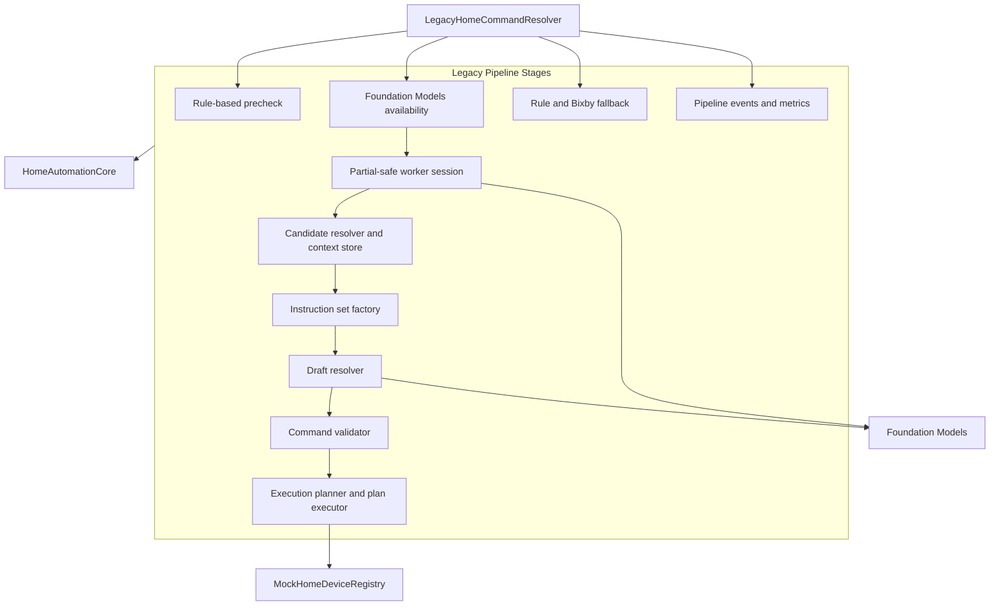
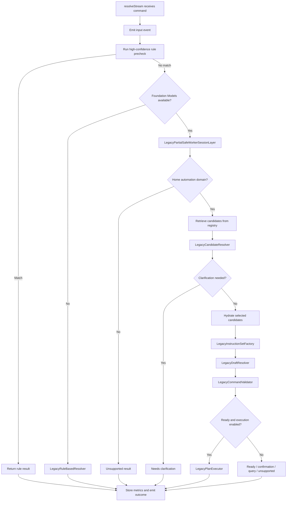

# HomeAutomationResolver Source Module

`HomeAutomationResolver` is the legacy-compatible resolver target. It preserves the original staged pipeline for parity tests, regression coverage, adapter export, and migration safety while the app uses the multi-agent orchestrator path.

This module answers the question: "How did the original single-pipeline resolver solve the same command-resolution problem?"

For a type-by-type mapping from this legacy resolver to the current orchestrator and agent architecture, see [Legacy Resolver to Current Architecture Comparison](LEGACY_TO_CURRENT_COMPARISON.md).

## Architecture Role

## Legacy Command Flow

## Component Details

| Component | Role |
| --- | --- |
| `LegacyHomeCommandResolver` | Original end-to-end resolver. Streams pipeline events, runs rules, checks model availability, coordinates worker/candidate/draft/validation/execution stages, falls back safely, and stores metrics. |
| `LegacyPipelineOutput` | Private pair of resolver result and metrics used inside timed Foundation Models path. |
| `LegacyEventCounter` | Private event counter used to populate metrics. |
| `LegacyRuleBasedResolver` | Deterministic resolver for model-unavailable and fallback paths. Parses text, scores devices, builds drafts, validates, and optionally executes low-risk plans. |
| `ScoredDevice` | Private ranking record for deterministic device scoring. |
| `DraftIntent` | Private simplified intent/capability/command package before draft creation. |
| `CapabilityCommand` | Private capability-command preference used by deterministic rule matching. |
| `RuleIntent` | Private parser output for family, intent, capability preferences, values, device hints, and relative-change metadata. |
| `LegacyTextParser` | Deterministic multilingual parser used by fallback and worker fallback logic. |
| `String.legacyNormalizedHomeTokenString` | Legacy normalization extension for matching translated/common command tokens. |
| `LegacyPartialWorkerOverrides` | Test/injection container for replacing worker functions. |
| `LegacyPartialSafeWorkerSessionLayer` | Runs language, domain, intent, device type, slot, and risk workers concurrently, with per-worker fallback behavior. |
| `LegacyTimeoutError` | Timeout error type. |
| `LegacyTimeout` | Async timeout helper using task groups and cancellation. |
| `LegacyCandidateResolverMetrics` | Actor storing last candidate strategy and count. |
| `LegacyCandidateResolver` | Candidate selection implementation using deterministic direct selection, model selection, or sharded selection. |
| `LegacyCandidateContextStore` | Actor cache for retrieved candidates and selected-candidate hydration. |
| `LegacyDeviceRegistryProviding` | Registry abstraction implemented by `MockHomeDeviceRegistry`. |
| `LegacyInstructionSetFactory` | Builds model prompt, instructions, language rules, and tool list from `HomeFinalResolutionInput`. |
| `LegacyDraftAttemptReport` | Single draft-generation attempt report. |
| `LegacyDraftResolutionReport` | Aggregate report for draft attempts. |
| `LegacyDraftResolutionOutput` | Draft plus report output. |
| `LegacyDraftResolverMetrics` | Actor storing latest draft report. |
| `LegacyDraftResolver` | Retry wrapper that tries base/full, adapter/full, base/simplified, and adapter/simplified packages. |
| `LegacyDraftPackageAttempt` | Private description of one draft attempt. |
| `LegacyFindDevicesTool` | Foundation Models tool for device search. |
| `LegacyGetCapabilitiesTool` | Tool for capability, command, range, enum, and risk lookup. |
| `LegacyGetDeviceStateTool` | Tool for current state lookup. |
| `LegacyGetSupportedModesTool` | Tool for mode and enum lookup. |
| `LegacyValidateCommandTool` | Tool for support and risk hints. |
| `LegacyHydrateCandidatesTool` | Tool for candidate hydration. |
| `LegacyToolProvider` | Selects the tools available to the draft resolver. |
| `LegacyToolFormatting` | JSON-lines formatting helper for tool outputs. |
| `LegacyCommandValidator` | Deterministic draft validator for target, capability, command, risk, parameters, and execution plan readiness. |
| `LegacyExecutionPlanner` | Converts valid drafts into execution plans, including read-plus-command plans for relative changes. |
| `LegacyPlanExecutor` | Executes executable low-risk command steps through the mock registry. |
| `LegacyBixbyDraftMatch` | Bixby-derived draft match with source metadata and score. |
| `LegacyBixbyFallbackMapper` | Maps Bixby catalog utterances and source capabilities into local command drafts. |
| `LegacyPipelineStage` | Stage ID enum for timeline events. |
| `LegacyPipelineEvent` | Legacy timeline event with ID, title, status, and detail. |
| `LegacyResolverUpdate` | Stream update enum: event or result. |
| `LegacyResolutionMetrics` | Legacy metrics payload with model/fallback flags, timings, candidate strategy, confidence, risk, adapter diagnostics, and stage durations. |
| `LegacyMetricsCollector` | Actor storing and serializing latest metrics. |
| `LegacyStageTimer` | Small elapsed-time helper. |
| `LegacyAdapterTrainingExample` | Compact generated-example row for adapter training. |
| `LegacyAdapterTrainingExporter` | Exports generated dataset examples as values or JSONL. |
| `LegacyAdapterCompatibility` | Expected/installed model compatibility record. |
| `LegacyDeploymentChecklist` | Static deployment checklist for running the legacy resolver safely. |

## Relationship to the Orchestrator

- The app no longer calls `LegacyHomeCommandResolver` directly.
- `HomeAutomationOrchestrator` and `HomeAutomationAgents` contain extracted or equivalent behavior in agent form.
- Legacy tests remain valuable for parity and safety regression coverage.
- The target depends only on `HomeAutomationCore`, so it stays isolated from new orchestrator dependencies.
- New production behavior should be implemented in agents/orchestrator first; legacy updates should be limited to parity or compatibility needs.

## Legacy Safety Guarantees

- High-risk actions require confirmation.
- Unsupported capabilities or commands are rejected.
- Invalid formulas do not mutate state.
- Query/read steps do not mutate state.
- Low-risk execution is gated by the caller's `executeLowRiskCommands` flag.
- Foundation Models failures, unavailability, or timeouts route to deterministic fallback.
