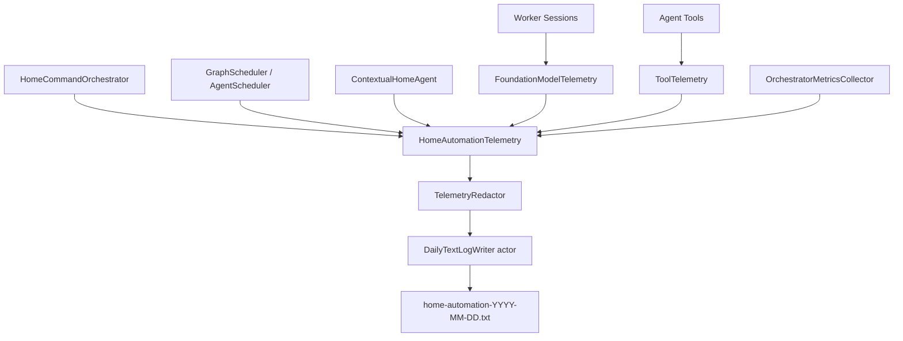

# Logging And Monitoring Architecture Plan

## Goal

Create a project-wide custom logger that records every important input, output, decision, model call, tool call, timing, retry, timeout, and final outcome in daily append-only text files. The logs must be easy to filter by agent tag, stage, run ID, action scope, tool name, and event type so they can later drive evaluation for both individual agents and total system performance.

The primary target is automation creation and direct command resolution, including nested action resolution such as:

```text
Turn on bedroom AC and turn off the bedroom lamp every day at 7 AM
```

## Current State

The project already has several useful observability pieces, but they are not unified or persistently stored:

- `OSLog.Logger` is used across agents and orchestrator components. This is good for local debugging, but the messages are scattered, inconsistent, and not easy to analyze later from a single daily file.
- `AgentEventBus` publishes UI-visible `OrchestratorPipelineEvent` values with `runID`, `stage`, `agentID`, `status`, `detail`, and `timestamp`.
- `GraphScheduler` and legacy `AgentScheduler` record `AgentTraceEntry` values with per-agent start/end/duration/result.
- `OrchestratorMetrics` captures run-level evaluation fields, graph node statuses, confidence values, candidate counts, retrieval quality, FoundationModel usage, circuit states, and automation-specific fields.
- Agent worker sessions already log many useful strings like `[Input]`, `[FoundationModelInput]`, `[FoundationModelOutput]`, and `[FoundationModelError]`, but these are not consistently structured and cannot be reliably grouped by run or agent.
- Tool calls in `AgentTools.swift` record output sizes via `AgentToolOutputSizeStore`, but do not persist arguments, outputs, duration, errors, or caller context.
- Automation action fan-out now emits scoped pipeline events such as `automationActionResolution:a1/deviceType`, which is valuable for per-action evaluation but should also be persisted in the custom logs.

## Gaps

- No daily file-based log sink exists.
- No single event schema exists for agent input/output/model/tool telemetry.
- `OSLog` messages do not always include `runID`, `agentID`, `actionID`, graph ID, attempt number, or event type.
- Model prompts and outputs are logged manually in worker sessions, which makes future analysis brittle.
- Tool arguments and tool outputs are not logged.
- Run metrics are stored only as latest in-memory JSON through `OrchestratorMetricsCollector`.
- Current logs cannot reliably answer questions like:
  - Which agent timed out most often?
  - Which model prompt caused deserialization failures?
  - How long did each nested automation action pipeline take?
  - Which tool was called by which agent, with which arguments?
  - What was the final input/output pair for a specific agent in a specific run?

## Proposed Architecture

Add a telemetry module inside `HomeAutomationOrchestrator` with one shared actor-based file sink and small typed helper APIs.



### Core Components

1. `HomeAutomationTelemetry`

Central facade used by orchestrator, agents, workers, and tools.

Responsibilities:

- Accept typed telemetry events.
- Add shared fields like timestamp, app version if available, thread/task marker, and schema version.
- Apply redaction and truncation policy.
- Write to the daily text sink.
- Optionally continue forwarding summary messages to `OSLog`.

2. `DailyTextLogWriter`

Actor responsible for file I/O.

Responsibilities:

- Create one log file per local day.
- Append log lines to the current day file.
- Rotate automatically when the calendar date changes.
- Keep file writes serialized.
- Create the log directory when missing.
- Flush safely after each line or after a small batch.

Default file naming:

```text
Logs/home-automation-2026-05-18.txt
Logs/home-automation-2026-05-19.txt
```

3. `TelemetryEvent`

Structured event type encoded as a single text line. Use JSON Lines with a readable tag prefix, so it remains a `.txt` file and still supports robust parsing.

Recommended log line shape:

```text
2026-05-18T13:42:11.219Z [RUN:8FAD182B] [INV:8FAD182B-a1-deviceType-01] [AGENT:deviceType] [STAGE:automationActionResolution:a1/deviceType] [EVENT:agent.output] {"schemaVersion":1,"runID":"8FAD...","agentID":"deviceType","agentInvocationID":"8FAD182B-a1-deviceType-01","status":"completed","durationMs":912,"payload":{"deviceTypes":["airConditioner"],"confidence":1.0}}
```

Important: `agentID` is the stable logical agent name, such as `deviceType`. It is not unique when the same agent runs multiple times in parallel. Every agent event must also include an `agentInvocationID` so parallel runs can be separated.

The bracket tags make simple filtering easy:

```bash
rg "\[AGENT:deviceType\]" Logs/home-automation-2026-05-18.txt
rg "\[INV:8FAD182B-a1-deviceType-01\]" Logs/home-automation-2026-05-18.txt
rg "\[EVENT:model.error\]" Logs/
rg "\[ACTION:a1\]" Logs/home-automation-2026-05-18.txt
```

4. `TelemetryRedactor`

Inputs, outputs, prompts, and tool results may contain user data. The logger should support explicit modes:

- `metadataOnly`: log lengths, hashes, confidence, status, duration, but no raw payload.
- `cappedPayload`: log raw payload capped to a safe character count. Recommended for development.
- `fullPayload`: log full input/output for evaluation runs only.

Every raw field should include:

- `content`
- `characterCount`
- `truncated`
- `sha256`

5. `TelemetryContext`

Small context value propagated through orchestrator execution.

Fields:

- `runID`
- `graphID`
- `stage`
- `agentID`
- `agentInvocationID`, unique per agent execution attempt
- `graphNodeID`, such as `deviceType` or `automationActionResolution`
- `actionID`, for automation sub-actions like `a1`
- `conditionID`, for condition operand resolution like `c1`
- `attempt`
- `operation`, such as `automationCreation`
- `runtimeMode`

### Agent Identity Rules

The logger must distinguish three related identities:

- `agentID`: stable logical agent identifier, for example `deviceType`, `slotExtraction`, or `draftGeneration`.
- `graphNodeID`: the DAG node that selected the agent. In the direct-command graph this is often the same as `agentID`, but in future graphs one node may choose among multiple agents by capability.
- `agentInvocationID`: unique execution instance ID. This must be present on every `agent.*`, `model.*`, and `tool.*` event.

For automation fan-out, the same agent can run for multiple actions in parallel or near-parallel:

```text
runID=8FAD..., actionID=a1, agentID=deviceType, agentInvocationID=8FAD-a1-deviceType-01
runID=8FAD..., actionID=a2, agentID=deviceType, agentInvocationID=8FAD-a2-deviceType-01
```

For retries, increment the attempt suffix:

```text
8FAD-a1-deviceType-01
8FAD-a1-deviceType-02
```

Evaluation must group by `agentID` for aggregate performance, and by `agentInvocationID` for exact input/output timelines.

## Event Taxonomy

Use stable event names so later evaluation scripts can group them.

### Run Events

- `run.started`
- `run.operationDetected`
- `run.graphSelected`
- `run.completed`
- `run.failed`
- `run.metrics`

### Graph Events

- `graph.started`
- `graph.node.ready`
- `graph.node.skipped`
- `graph.node.completed`
- `graph.node.failed`
- `graph.completed`

### Agent Events

- `agent.input`
- `agent.started`
- `agent.output`
- `agent.patch`
- `agent.completed`
- `agent.failed`
- `agent.timeout`
- `agent.retry`
- `agent.skipped`

### Foundation Model Events

- `model.input`
- `model.output`
- `model.error`
- `model.fallbackUsed`
- `model.deserializationFailed`
- `model.contextBudget`

### Tool Events

- `tool.input`
- `tool.output`
- `tool.error`
- `tool.completed`

### RAG Events

- `rag.query`
- `rag.results`
- `rag.retry`
- `rag.quality`

### Evaluation Events

- `evaluation.agentSummary`
- `evaluation.runSummary`
- `evaluation.actionSummary`
- `evaluation.toolSummary`

## Agent Logging Contract

Every agent execution should produce this minimum sequence:

```text
agent.input
agent.started
agent.output OR agent.failed
agent.completed OR agent.timeout
```

Each `agent.input` should include:

- `agentID`
- `agentInvocationID`
- graph node ID
- attempt number
- input type name
- serialized or stringified input payload
- payload character count
- context snapshot summary, not the full context by default
- action/condition scope if present

Each `agent.output` should include:

- `agentID`
- `agentInvocationID`
- output type name
- output payload
- confidence if available
- selected IDs, candidates, draft fields, or validation status when applicable

Each `agent.completed` should include:

- `agentID`
- `agentInvocationID`
- duration
- attempt count
- trace result
- circuit breaker state after execution

## Integration Points

### 1. `HomeCommandOrchestrator`

Add run-level logging around:

- command received
- operation detection result
- selected graph/runtime
- final result
- stored `OrchestratorMetrics`

This gives one top-level timeline per user request.

### 2. `GraphScheduler` And `AgentScheduler`

Add scheduler-level logging around:

- graph start/end
- node ready/running/completed/skipped/failed
- selected agent for node
- timeout/retry/fail-closed decisions
- per-node duration

This is the best place to log total pipeline performance because it sees all nodes, dependencies, retries, and timing.

### 3. `ContextualHomeAgent`

This is the best central place for most agent input/output logs because it has:

- typed input after `makeInput`
- typed output before `makePatch`
- generated patch
- failure error

This avoids adding duplicate input/output logging to every agent.

### 4. Worker Sessions

Worker sessions should not own file writing. They should call a model telemetry helper only for model-specific details:

- prompt
- system instructions
- deterministic hint
- model output
- model error
- fallback path

Replace manual `[FoundationModelInput]` and `[FoundationModelOutput]` style logging with a shared helper over time.

### 5. Foundation Model Wrapper

Create helper functions like:

```swift
FoundationModelTelemetry.respond(
    agentID: .automationDraft,
    task: "draftExtraction",
    context: telemetryContext,
    instructions: instructionsText,
    prompt: promptText,
    generating: AutomationDraftOutput.self
)
```

This wrapper should log `model.input`, `model.output`, `model.error`, duration, generated type, and deserialization failure kind.

### 6. Tool Logging

The current tools in `AgentTools.swift` can log through a shared `ToolTelemetrySink`.

For every tool call, log:

- `toolName`
- calling `agentID` if known
- arguments
- output
- duration
- output character count
- error if thrown

Because Foundation Models call tools indirectly, tool structs need access to telemetry context at construction time through `AgentToolProvider`.

### 7. `OrchestratorMetricsCollector`

Keep the current in-memory `lastMetrics`, but also write the full metrics snapshot as `run.metrics`.

This turns current evaluation data into persistent daily logs without replacing the metrics model.

## Log File Format

Use text files containing one event per line.

Recommended format:

```text
<iso8601> [RUN:<shortRunID>] [INV:<agentInvocationID>] [OP:<operation>] [GRAPH:<graphID>] [ACTION:<actionID>] [AGENT:<agentID>] [STAGE:<stage>] [EVENT:<eventType>] <json>
```

Examples:

```text
2026-05-18T13:42:10.101Z [RUN:8FAD182B] [OP:automationCreation] [EVENT:run.started] {"command":{"content":"Turn on bedroom AC and turn off the bedroom lamp every day at 7 AM","characterCount":68,"truncated":false}}
2026-05-18T13:42:12.332Z [RUN:8FAD182B] [INV:8FAD182B-a1-deviceType-01] [ACTION:a1] [AGENT:deviceType] [EVENT:agent.output] {"agentID":"deviceType","agentInvocationID":"8FAD182B-a1-deviceType-01","output":{"deviceTypes":["airConditioner"],"confidence":1.0},"durationMs":702}
2026-05-18T13:42:12.351Z [RUN:8FAD182B] [INV:8FAD182B-a2-deviceType-01] [ACTION:a2] [AGENT:deviceType] [EVENT:agent.output] {"agentID":"deviceType","agentInvocationID":"8FAD182B-a2-deviceType-01","output":{"deviceTypes":["light"],"confidence":1.0},"durationMs":719}
2026-05-18T13:42:14.551Z [RUN:8FAD182B] [INV:8FAD182B-a1-draftGeneration-01] [ACTION:a1] [AGENT:draftGeneration] [EVENT:model.output] {"agentID":"draftGeneration","agentInvocationID":"8FAD182B-a1-draftGeneration-01","generatedType":"HomeCommandDraft","confidence":1.0,"payload":{"targetDeviceID":"bedroom_ac","capability":"switch","command":"on"}}
2026-05-18T13:42:18.120Z [RUN:8FAD182B] [EVENT:run.metrics] {"totalDurationMs":8019,"outcome":"automationDrafted","modelCallCount":17,"timeoutCount":0}
```

## Daily Rotation

Rotation should happen inside `DailyTextLogWriter`.

Algorithm:

1. On every write, compute the current date key with `Calendar.current`.
2. If the date key differs from the open file key, close the current handle.
3. Create/open `home-automation-YYYY-MM-DD.txt`.
4. Seek to end.
5. Append UTF-8 line plus newline.

Optional future settings:

- `maxFileSizeBytes`
- `maxRetentionDays`
- gzip archived logs
- separate error file, such as `home-automation-errors-YYYY-MM-DD.txt`

## Evaluation Model

The logger should make evaluation possible without rerunning the app.

### Per-Agent Metrics

From logs, compute:

- call count
- success/failure/timeout counts
- average, p50, p95, p99 duration
- model call count
- model error count
- deserialization failure count
- average confidence
- fallback usage count
- retry count
- input/output payload sizes

### Per-Tool Metrics

From logs, compute:

- call count by tool
- average duration
- output size distribution
- error count
- most common calling agents
- tool calls per final success/failure

### Total System Metrics

From `run.metrics` and graph events, compute:

- total command duration
- total automation action duration
- graph node durations
- final outcome distribution
- failure reasons
- timeout rate
- average model calls per command
- RAG retry rate
- automation creation success rate
- direct command success rate

### Automation-Specific Metrics

For automation creation:

- operation detection accuracy candidates
- draft extraction success/failure
- action count
- condition count
- action resolution success rate
- per-action failure reason
- SmartThings compilation success rate
- confirmation required rate

## Performance Considerations

- File writing should be asynchronous through an actor and should not block agent execution.
- Logging full prompts and outputs can be large. Use capped payload mode by default.
- Use one-line events to avoid parsing ambiguity.
- Avoid logging the full `ResolutionContext` on every event. Log summaries and scoped deltas.
- Add a `TelemetryEventSamplingPolicy` later if model/tool logs become too expensive.
- Use stable tags instead of relying on free-form messages.

## Privacy And Safety

Because logs include user commands and device names:

- Keep logs local by default.
- Do not upload logs automatically.
- Redact secrets, API keys, tokens, access headers, location IDs, and backend credentials.
- Make full payload logging configurable.
- Cap prompt and output fields.
- Store hashes for full correlation when payload is truncated.

## Proposed Implementation Phases

### Phase 1: Core Logger

- Add `TelemetryEvent`, `TelemetryPayload`, `TelemetryContext`, `TelemetryRedactor`, and `DailyTextLogWriter`.
- Add `HomeAutomationTelemetry` facade.
- Add `LoggingConfiguration` with directory, payload mode, max payload characters, and enabled flag.
- Add unit tests for daily file rotation and append behavior.

### Phase 2: Run And Graph Instrumentation

- Instrument `HomeCommandOrchestrator` for `run.started`, `run.operationDetected`, `run.graphSelected`, `run.completed`, and `run.metrics`.
- Instrument `GraphScheduler` and legacy `AgentScheduler` for node/agent lifecycle, retries, timeout, and circuit breaker events.
- Ensure `runID`, `graphID`, `stage`, `agentID`, `agentInvocationID`, attempt number, graph node ID, and action scope are included.

### Phase 3: Agent Input/Output Logging

- Instrument `ContextualHomeAgent.run` for `agent.input`, `agent.output`, `agent.patch`, and `agent.failed`.
- Add safe stringification/encoding utilities for typed inputs and outputs.
- Capture confidence fields where possible.

### Phase 4: Foundation Model Logging

- Add `FoundationModelTelemetry` helper.
- Migrate worker sessions from ad-hoc `[FoundationModelInput]` logs to shared model telemetry.
- Log deterministic hints, prompts, instructions, generated output, deserialization failures, and fallback decisions.

### Phase 5: Tool Logging

- Add telemetry-aware tool context to `AgentToolProvider`.
- Log all tool arguments, outputs, output sizes, duration, and errors.
- Continue updating `AgentToolOutputSizeStore`.

### Phase 6: Evaluation Extractors

- Add a small log parser/evaluator script or Swift utility that reads daily `.txt` files and prints:
  - per-agent report
  - per-tool report
  - run-level performance report
  - failure/timeout report

### Phase 7: Documentation And Operational Controls

- Document log directory and filter examples.
- Add retention settings.
- Add environment variables:
  - `HOME_AUTOMATION_LOGGING_ENABLED`
  - `HOME_AUTOMATION_LOG_DIR`
  - `HOME_AUTOMATION_LOG_PAYLOAD_MODE`
  - `HOME_AUTOMATION_LOG_MAX_PAYLOAD_CHARS`

## Recommended Defaults

- Logging enabled in development and test builds.
- Payload mode: `cappedPayload`.
- Max payload characters per field: `8_000`.
- Log directory: configurable; default to app support/logs when available.
- File format: `.txt` with JSON Lines plus bracket tags.
- Rotation: daily by local calendar date.
- Retention: not required for first implementation, but prepare config field.

## First Implementation Target

Start with these files:

- `HomeAutomationCore/Sources/HomeAutomationOrchestrator/HomeAutomationTelemetry.swift`
- `HomeAutomationCore/Sources/HomeAutomationOrchestrator/DailyTextLogWriter.swift`
- `HomeAutomationCore/Sources/HomeAutomationOrchestrator/TelemetryEvent.swift`
- `HomeAutomationCore/Sources/HomeAutomationOrchestrator/TelemetryRedactor.swift`
- `HomeAutomationCore/Sources/HomeAutomationOrchestrator/TelemetryContext.swift`

Then instrument these integration points first:

- `HomeCommandOrchestrator`
- `GraphScheduler`
- `ContextualHomeAgent`
- `OrchestratorMetricsCollector`

This gives immediate run-level, graph-level, and agent-level observability before touching each individual worker and tool.
