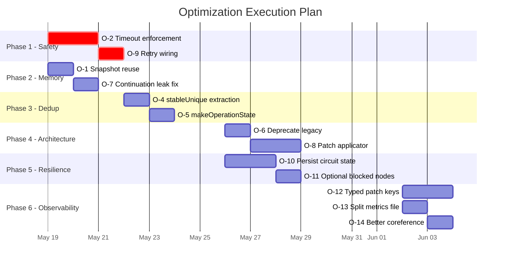

# Orchestrator Optimization Plan

> **Reference**: [HomeAutomationCore/Sources/HomeAutomationOrchestrator/OrchestratorArchitecture.md](./HomeAutomationCore/Sources/HomeAutomationOrchestrator/OrchestratorArchitecture.md) §9
> **Created**: 2026-05-17
> **Total Issues**: 14 (4 Critical, 4 High, 3 Medium, 3 Low)
> **Phases**: 6 independent phases, executable in any order
> **Status**: Historical optimization checklist. The active orchestrator is graph-only; legacy phased runtime references have been removed from this plan.

---

## Phase Overview

| Phase | Focus | Issues | Risk | Estimated Effort |
|-------|-------|--------|------|-----------------|
| **Phase 1** | Pipeline Safety | O-2, O-9 | 🔴 Critical | Medium |
| **Phase 2** | Memory & Concurrency | O-1, O-7 | 🟡 High | Low |
| **Phase 3** | Code Deduplication | O-4, O-5 | 🟡 High | Low |
| **Phase 4** | Architecture Cleanup | O-6, O-8 | 🟡 High | High |
| **Phase 5** | Resilience Hardening | O-10, O-11 | 🟠 Medium | Medium |
| **Phase 6** | Observability & Quality | O-12, O-13, O-14 | 🔵 Low | Medium |

---

## Phase 1 — Pipeline Safety

> **Goal**: Prevent hung pipelines and wire existing retry infrastructure.
> **Dependencies**: None. Can start immediately.
> **Risk if skipped**: A single hung FM call blocks the entire orchestrator indefinitely.

---

### O-2: Agent Timeout Enforcement

**Problem**: Every agent declares `timeoutNanoseconds` (e.g., `3_000_000_000` for OperationDetection). `GraphScheduler.runNode()` must enforce this timeout consistently so a hung FM inference cannot stall the entire pipeline.

**Root Cause**: This is handled by the graph runtime via `withAgentTimeout`; future work should focus on per-agent timeout tuning and telemetry.

#### Implementation Steps

**Step 1**: Create a timeout utility in `HomeAutomationOrchestrator/`

```swift
// File: AgentTimeoutRunner.swift (NEW)

import Foundation
import HomeAutomationAgents

enum AgentTimeoutError: Error {
    case timedOut(agentID: AgentID, timeoutNanoseconds: UInt64)
}

/// Races an agent execution against its declared timeout.
/// Returns `.retryableFailure` if the agent exceeds its timeout.
func withAgentTimeout<T: Sendable>(
    agentID: AgentID,
    timeoutNanoseconds: UInt64,
    operation: @Sendable () async -> T
) async throws -> T {
    try await withThrowingTaskGroup(of: T.self) { group in
        group.addTask { await operation() }
        group.addTask {
            try await Task.sleep(nanoseconds: timeoutNanoseconds)
            throw AgentTimeoutError.timedOut(
                agentID: agentID,
                timeoutNanoseconds: timeoutNanoseconds
            )
        }
        guard let result = try await group.next() else {
            throw AgentTimeoutError.timedOut(
                agentID: agentID,
                timeoutNanoseconds: timeoutNanoseconds
            )
        }
        group.cancelAll()
        return result
    }
}
```

**Step 2**: Modify `GraphScheduler.runNode()` — wrap the agent execution

```diff
// GraphScheduler.swift, inside runNode(), around line 250-253
 let start = Date()
 await metrics.markRunning(nodeID: node.id, agentID: agentID, startedAt: start)
-let result = await selection.agent.run(context: context)
+let result: AgentRunResult
+do {
+    result = try await withAgentTimeout(
+        agentID: agentID,
+        timeoutNanoseconds: selection.agent.timeoutNanoseconds
+    ) {
+        await selection.agent.run(context: context)
+    }
+} catch is AgentTimeoutError {
+    result = .retryableFailure(AgentFailure(
+        agentID: agentID,
+        reason: "Agent timed out after \(selection.agent.timeoutNanoseconds / 1_000_000)ms",
+        isRetryable: true
+    ))
+} catch {
+    result = .terminalFailure(AgentFailure(
+        agentID: agentID,
+        reason: error.localizedDescription,
+        isRetryable: false
+    ))
+}
 let end = Date()
```

**Step 3**: Verify graph timeout telemetry reports `agent.timeout` events with `agentInvocationID`, graph node ID, and attempt number.

**Step 4**: Add unit test

```swift
// Test: Verify that an agent exceeding its timeout produces a retryableFailure
func testAgentTimeoutProducesRetryableFailure() async {
    let slowAgent = MockAgent(id: .language, timeout: 100_000_000) { _ in
        try await Task.sleep(nanoseconds: 5_000_000_000) // 5s, timeout is 100ms
        return .success(/* patch */)
    }
    // Register, run through scheduler, assert .retryableFailure
}
```

#### Verification
- Run all existing `OrchestratorInfrastructureTests` — should pass unchanged
- Add new test confirming timeout behavior
- Manual test: inject a 10s delay into a mock agent with 1s timeout, verify pipeline completes

---

### O-9: Wire Retry Logic into GraphScheduler

**Problem**: `OrchestratorPolicyEngine.shouldRetry()` exists with per-agent retry budgets (e.g., `draftGeneration: 3`, NLU agents: `1`) but `GraphScheduler.runNode()` never calls it. Retryable failures are logged and recorded but not retried.

**Root Cause**: The retry loop was implemented in the policy engine but the migration from legacy to graph scheduler did not wire it.

#### Implementation Steps

**Step 1**: Add retry loop inside `GraphScheduler.runNode()`

```diff
// GraphScheduler.swift, inside runNode()
// After agent selection and circuit breaker check, before the actual execution:

+var attemptCount = 0
+var result: AgentRunResult
+
+repeat {
+    attemptCount += 1
     let start = Date()
     await metrics.markRunning(nodeID: node.id, agentID: agentID, startedAt: start)
-    let result = await selection.agent.run(context: context)
+    result = await selection.agent.run(context: context) // (with timeout from O-2)
     let end = Date()
     
     await record(result: result, breaker: breaker)
     // ... trace, patch, event publishing stays the same ...
+    
+    if case .retryableFailure(let failure) = result,
+       policy.shouldRetry(failure: failure, attemptCount: attemptCount) {
+        logger.info("Retrying agent \(agentID.rawValue) (attempt \(attemptCount + 1))")
+        continue
+    }
+    break
+} while true
```

**Step 2**: Ensure metrics record all attempts (append trace entries for each attempt, not just the last).

**Step 3**: Add test

```swift
func testRetryableAgentIsRetriedUpToMaxAttempts() async {
    var callCount = 0
    let flaky = MockAgent(id: .draftGeneration) { _ in
        callCount += 1
        if callCount < 3 { return .retryableFailure(AgentFailure(...)) }
        return .success(/* patch */)
    }
    // Assert callCount == 3 and final result is .success
}
```

#### Verification
- Run `FMFirstMigrationTests` — all 24 should pass
- New test confirming retry count matches policy limits
- Verify metrics show per-attempt trace entries

---

## Phase 2 — Memory & Concurrency

> **Goal**: Eliminate memory leaks and redundant async work.
> **Dependencies**: None. Independent of Phase 1.

---

### O-1: Eliminate Redundant Context Snapshots

**Problem**: In `GraphScheduler.execute()`, each loop iteration calls `contextStore.snapshot()` twice — once at L51 for candidate filtering, and once at L111 for batch execution. The first snapshot is used only for guard evaluation, then immediately discarded.

#### Implementation Steps

**Step 1**: Modify `GraphScheduler.execute()` to reuse the snapshot

```diff
// GraphScheduler.swift, execute() method
 while !pending.isEmpty {
     let context = await contextStore.snapshot()
     let candidates = graph.nodes.filter { node in
         pending.contains(node.id) &&
             dependencies[node.id, default: []].isSubset(of: completed)
     }
     // ... guard check, runnable filtering ...
     
-    let batchContext = await contextStore.snapshot()
-    let firstExit = await withTaskGroup(of: GraphNodeOutcome.self) { group in
+    let firstExit = await withTaskGroup(of: GraphNodeOutcome.self) { group in
         for node in runnable {
             group.addTask {
                 await self.runNode(
                     node,
                     // ...
-                    context: batchContext,
+                    context: context,
                     // ...
                 )
             }
         }
```

**Impact**: Eliminates one `actor` hop per scheduling loop iteration. Under parallel NLU execution (6 agents), this removes 6 redundant context copies.

#### Verification
- Run full test suite — behavior should be identical since both snapshots captured the same state within the same `while` iteration

---

### O-7: Fix AgentEventBus Continuation Leak

**Problem**: `AgentEventBus.stream()` appends continuations to an array but never removes them when the consumer task is cancelled. Over multiple `resolveStream()` calls, leaked continuations accumulate.

#### Implementation Steps

**Step 1**: Modify `AgentEventBus.stream()` to register a termination handler

```diff
// AgentEventBus.swift, stream() method
 public func stream() -> AsyncStream<OrchestratorPipelineEvent> {
     let replayEvents = events
     return AsyncStream { continuation in
         for event in replayEvents {
             continuation.yield(event)
         }
         if isFinished {
             continuation.finish()
             return
         }
-        addContinuation(continuation)
+        let index = addContinuation(continuation)
+        continuation.onTermination = { @Sendable _ in
+            Task { await self.removeContinuation(at: index) }
+        }
     }
 }

-private func addContinuation(_ continuation: AsyncStream<OrchestratorPipelineEvent>.Continuation) {
-    continuations.append(continuation)
-}
+private func addContinuation(_ continuation: AsyncStream<OrchestratorPipelineEvent>.Continuation) -> Int {
+    let index = continuations.count
+    continuations.append(continuation)
+    return index
+}
+
+private func removeContinuation(at index: Int) {
+    guard index < continuations.count else { return }
+    // Use a sentinel pattern: replace with a finished continuation
+    // or maintain a dictionary with stable IDs instead
+    continuations.remove(at: index)
+}
```

> [!WARNING]
> Index-based removal is fragile if multiple continuations are removed concurrently. A safer approach is to use a `[UUID: Continuation]` dictionary instead of an array.

**Step 1 (Alternative — recommended)**: Replace the array with a dictionary

```diff
-private var continuations: [AsyncStream<OrchestratorPipelineEvent>.Continuation] = []
+private var continuations: [UUID: AsyncStream<OrchestratorPipelineEvent>.Continuation] = [:]

 public func publish(_ event: OrchestratorPipelineEvent) {
     guard !isFinished else { return }
     events.append(event)
-    for continuation in continuations {
+    for continuation in continuations.values {
         continuation.yield(event)
     }
 }

 public func stream() -> AsyncStream<OrchestratorPipelineEvent> {
     let replayEvents = events
     return AsyncStream { continuation in
         for event in replayEvents { continuation.yield(event) }
         if isFinished { continuation.finish(); return }
+        let id = UUID()
-        addContinuation(continuation)
+        self.continuations[id] = continuation
+        continuation.onTermination = { @Sendable _ in
+            Task { await self.removeContinuation(id: id) }
+        }
     }
 }

+private func removeContinuation(id: UUID) {
+    continuations.removeValue(forKey: id)
+}

 public func finish() {
     isFinished = true
-    for continuation in continuations { continuation.finish() }
-    continuations = []
+    for continuation in continuations.values { continuation.finish() }
+    continuations.removeAll()
 }
```

#### Verification
- Run existing tests — no behavior change
- Add test: create stream, cancel consumer task, verify continuation is removed from bus
- Memory profile: verify no growth across 100 sequential `resolveStream()` calls

---

## Phase 3 — Code Deduplication

> **Goal**: Eliminate copy-pasted code across the module.
> **Dependencies**: None. Pure refactoring, no behavioral changes.

---

### O-4: Extract Shared `stableUnique` Utility

**Problem**: 4 identical implementations of `stableUnique(_:)` and `stableUniqueDevices(_:)` exist across:
- `HomeCommandOrchestrator.swift` L741-758
- `AutomationCreationResolver.swift` L628-646
- `AutomationActionResolutionAggregate` L102-120
- (inline in `AutomationCreationResolver.stableUnique`)

#### Implementation Steps

**Step 1**: Create a shared utility file

```swift
// File: HomeAutomationOrchestrator/StableUniqueUtilities.swift (NEW)

import Foundation
import HomeAutomationAgents

extension Array where Element: Identifiable, Element.ID == String {
    /// Returns elements in stable order, deduplicating by `id`.
    func stableUnique() -> [Element] {
        var seen = Set<String>()
        return filter { seen.insert($0.id).inserted }
    }
}

extension Array where Element == String {
    /// Returns strings in stable order, deduplicating by value.
    func stableUnique() -> [String] {
        var seen = Set<String>()
        return filter { seen.insert($0).inserted }
    }
}
```

**Step 2**: Replace all 4 call sites with the extension method.

**Step 3**: Delete the private methods from each file.

#### Verification
- `swift build` — compile check
- Full test suite — no behavioral change

---

### O-5: Extract Shared `makeOperationState` Factory

**Problem**: Three identical 30-line `makeOperationState(for:operation:)` methods exist in:
- `HomeCommandOrchestrator.swift` L704-738
- `AutomationCreationResolver.swift` L591-626
- `AutomationResultAssemblyAgent` L629-664

#### Implementation Steps

**Step 1**: Create a static factory on `HomeResolutionState`

```swift
// Add to an existing file or create HomeResolutionState+Factory.swift

extension HomeResolutionState {
    static func forOperation(
        text: String,
        operation: HomeOperationDetectionResult
    ) -> HomeResolutionState {
        HomeResolutionState(
            rawText: text,
            language: HomeLanguageDetectionResult(
                languageCode: "en", isMixedLanguage: false,
                confidence: 0.75, unsupportedLanguageLikely: false
            ),
            domain: HomeDomainClassificationResult(
                domain: operation.domain, confidence: operation.confidence
            ),
            intent: HomeIntentFamilyResult(
                topFamilies: operation.operation == .automationCreation
                    ? [.createAutomation] : [.unsupported],
                confidence: operation.confidence
            ),
            deviceType: HomeDeviceTypeResult(deviceTypes: [], confidence: 0.4),
            slots: HomeSlotExtractionResult(
                rooms: [], deviceNicknames: [], values: [], modes: [], confidence: 0.4
            ),
            risk: HomeRiskClassificationResult(
                riskLevel: .low, requiresConfirmation: false,
                reason: operation.reason, confidence: operation.confidence
            )
        )
    }
}
```

**Step 2**: Replace all three call sites:
```diff
-let state = Self.makeOperationState(for: text, operation: operation)
+let state = HomeResolutionState.forOperation(text: text, operation: operation)
```

**Step 3**: Delete the three private methods.

#### Verification
- Full test suite — no behavioral change

---

## Phase 4 — Architecture Cleanup

> **Goal**: Remove dead code paths and improve extensibility.
> **Dependencies**: Phase 1 recommended first (to validate graph mode stability before removing legacy).
> **Risk**: Highest-effort phase. Consider feature-flagging removals.

---

### O-6: Preserve Graph-Only Runtime

**Problem**: Top-level routing and operation-specific execution should remain owned by `GraphPlanner`, `OperationGraphCatalog`, and `GraphScheduler`. Reintroducing a phased runtime would fragment telemetry, policy, and testing.

#### Implementation Steps

**Step 1**: Keep operation detection in the `root-command-graph`.

**Step 2**: Keep direct command, fallback, automation creation, and unsupported handling as graph providers in `OperationGraphCatalog`.

**Step 3**: Reject future orchestration branches that bypass `GraphScheduler`.

#### Verification
- Run graph routing tests and confirm operation detection appears as the first graph-owned node.
- Confirm telemetry and metrics runtime labels remain `"graph"`.

---

### O-8: Refactor ResolutionContextStore Patch Application

**Problem**: `ResolutionContextStore.apply()` is a 70-line chain of `if let` type-checks. Adding a new context field requires modifying this method. It violates the Open-Closed Principle.

#### Implementation Steps

**Step 1**: Define a patch applicator registry

```swift
// File: ResolutionContextPatchApplicator.swift (NEW)

typealias PatchApplicator = (AnySendableValue, inout ResolutionContext) -> Void

enum ResolutionContextPatchApplicators {
    static let registry: [String: PatchApplicator] = [
        ResolutionContextPatchKey.language: { value, ctx in
            if let v = value.get(HomeLanguageDetectionResult.self) { ctx.language = v }
        },
        ResolutionContextPatchKey.domain: { value, ctx in
            if let v = value.get(HomeDomainClassificationResult.self) { ctx.domain = v }
        },
        ResolutionContextPatchKey.intent: { value, ctx in
            if let v = value.get(HomeIntentFamilyResult.self) { ctx.intent = v }
        },
        // ... register all keys ...
    ]
}
```

**Step 2**: Replace the `apply()` method body

```diff
 public func apply(_ patch: ResolutionContextPatch) {
     for (key, value) in patch.updates {
-        if key == ResolutionContextPatchKey.language, let v = value.get(...) { ... }
-        // ... 20+ lines of if-let chains ...
+        if let applicator = ResolutionContextPatchApplicators.registry[key] {
+            applicator(value, &context)
+        }
     }
     for (scope, values) in patch.scopedUpdates {
         context.mergeScopedValues(values, in: scope)
     }
     refreshResolutionStateIfPossible()
 }
```

**Step 3**: Handle special cases (`resolverResult` bulk-apply, `knowledgeSnippets` append-semantics) as dedicated applicators.

#### Verification
- Run full test suite — exact behavioral parity required
- Add test: register a new patch key, verify it applies correctly without modifying `apply()`

---

## Phase 5 — Resilience Hardening

> **Goal**: Improve failure recovery and persistence.
> **Dependencies**: None. Independent of all other phases.

---

### O-10: Persist Circuit Breaker State

**Problem**: Circuit breaker states reset on process restart. A consistently failing agent re-trips its breaker on every cold start, causing a latency penalty during the threshold-reaching window.

#### Implementation Steps

**Step 1**: Add serialization to `AgentCircuitBreaker`

```swift
struct CircuitBreakerSnapshot: Codable {
    let agentID: String
    let state: CircuitState
    let failureCount: Int
    let lastFailure: Date?
}
```

**Step 2**: Add persistence to `CircuitBreakerRegistry`

```swift
public actor CircuitBreakerRegistry {
    private let persistenceKey = "com.homeautomation.circuitBreakers"
    
    public func persist() {
        let snapshots = breakers.map { (id, breaker) in
            // Collect snapshots
        }
        // Encode to UserDefaults or file
    }
    
    public func restore() {
        // Decode and recreate breakers with saved state
    }
}
```

**Step 3**: Call `persist()` after each `recordSuccess()`/`recordFailure()` (debounced to avoid excessive writes).

**Step 4**: Call `restore()` in `CircuitBreakerRegistry.init()`.

#### Verification
- Test: trip a breaker, persist, create new registry, verify breaker is still open
- Test: verify recovery interval is respected across restarts

---

### O-11: Handle Optional Blocked Nodes Gracefully

**Problem**: When all remaining nodes have unsatisfied dependencies (e.g., a required predecessor was skipped), `GraphScheduler` emits a `terminalFailure`. This is overly aggressive for nodes marked `.optional`.

#### Implementation Steps

**Step 1**: In the blocked-node detection block of `GraphScheduler.execute()`:

```diff
 guard !candidates.isEmpty else {
-    // Terminal failure for all blocked nodes
+    // Check if all blocked nodes are optional
+    let blockedNodes = pending.compactMap { nodesByID[$0] }
+    let allOptional = blockedNodes.allSatisfy { $0.executionPolicy == .optional }
+    if allOptional {
+        // Skip all optional blocked nodes
+        await markPendingSkipped(pending, ..., reason: "Optional nodes blocked")
+        break // Exit loop normally
+    }
     let failure = AgentFailure(...)
     return GraphSchedulerResult(exit: .terminalFailure(failure), ...)
 }
```

#### Verification
- Test: create a graph with an optional node depending on a skipped required node. Verify it is skipped, not terminal-failed.

---

## Phase 6 — Observability & Quality

> **Goal**: Improve type safety, code organization, and NLU quality.
> **Dependencies**: None. Lowest priority but high maintainability value.

---

### O-12: Convert Patch Keys to Type-Safe Enum

**Problem**: `ResolutionContextPatchKey` uses raw `String` constants. Typos cause silent data loss.

#### Implementation Steps

**Step 1**: Convert to a `String`-backed enum

```diff
-public enum ResolutionContextPatchKey {
-    public static let language = "language"
-    public static let domain = "domain"
+public enum ResolutionContextPatchKey: String, CaseIterable {
+    case language
+    case domain
+    case intent
     // ...
 }
```

**Step 2**: Update all call sites from `ResolutionContextPatchKey.language` (no change needed if using enum with same names) to use the enum. Update dictionary keys from `[String: AnySendableValue]` to `[ResolutionContextPatchKey: AnySendableValue]`.

> [!WARNING]
> This is a **wide-reaching change** affecting `ResolutionContextPatch`, `ResolutionContextStore.apply()`, all agent `makePatch` closures, and `GraphScheduler.contextHasValue()`. Best paired with O-8.

#### Verification
- Compile-time check: any typo in a key now produces a compiler error
- Full test suite

---

### O-13: Split OrchestratorMetricsCollector

**Problem**: 590 LOC in a single file containing 7 metric structs plus collection logic.

#### Implementation Steps

Split into:
| New File | Contents |
|----------|----------|
| `OrchestratorContextMetrics.swift` | `OrchestratorContextMetrics` struct |
| `OrchestratorSafetyMetrics.swift` | `OrchestratorSafetyMetrics` struct |
| `OrchestratorCandidateMetrics.swift` | `OrchestratorCandidateMetrics` struct |
| `OrchestratorAutomationMetrics.swift` | `OrchestratorAutomationMetrics` struct |
| `FoundationModelUsageMetrics.swift` | `FoundationModelUsageMetrics` + `FoundationModelDiagnostics` |
| `RetrievalQualityMetrics.swift` | `RetrievalQualityMetrics` + `RetrievalSourceQualityMetrics` |
| `OrchestratorMetrics.swift` | Main `OrchestratorMetrics` struct + capture methods |
| `OrchestratorMetricsCollector.swift` | `OrchestratorMetricsCollector` actor (storage only) |

#### Verification
- `swift build` — no behavioral change, purely organizational

---

### O-14: Improve Conversation Memory Reference Detection

**Problem**: `ConversationMemoryReferenceDetector.containsMemoryReference()` uses naive token matching for `["it", "that", "same", "there"]`. Sentences like "it is cold" or "that is a device" trigger false positives.

#### Implementation Steps

**Step 1**: Add bigram context to reduce false positives

```swift
public static func containsMemoryReference(_ text: String) -> Bool {
    let normalized = text.lowercased()
    let tokens = normalized
        .components(separatedBy: CharacterSet.alphanumerics.inverted)
        .filter { !$0.isEmpty }
    
    // Action-pronoun bigrams that indicate device reference
    let actionPronouns: Set<String> = [
        "turn it", "switch it", "set it", "dim it",
        "turn that", "switch that", "set that",
        "do same", "the same", "do that", "same thing"
    ]
    return actionPronouns.contains { normalized.contains($0) }
}
```

**Step 2** (future): Replace with FM-backed coreference resolution as a lightweight pre-processing step. This would be a new agent in the pipeline, positioned before NLU Phase 1.

#### Verification
- Unit tests: "turn it on" → true, "it is cold outside" → false
- "do the same thing" → true, "that is a smart plug" → false

---

## Execution Timeline



---

## Success Criteria

| Phase | Metric | Target |
|-------|--------|--------|
| Phase 1 | Max pipeline latency under FM hang | ≤ agent timeout + 500ms |
| Phase 1 | Retry success rate for flaky agents | > 0% (currently 0%, retries never fire) |
| Phase 2 | Memory growth across 100 sequential resolves | 0 leaked continuations |
| Phase 3 | Duplicate code instances of target functions | 0 (down from 7) |
| Phase 4 | Legacy runtime usage in production telemetry | 0% for 2 release cycles before removal |
| Phase 5 | Cold-start circuit breaker re-trip latency | 0ms (state restored from disk) |
| Phase 6 | Compile-time patch key safety | 100% (no raw string keys) |
