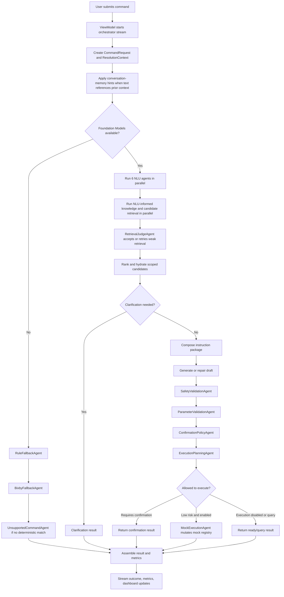
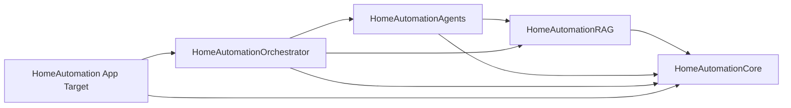

# HomeAutomation

`HomeAutomation` is a SwiftUI smart-home command resolution demo. It turns natural-language requests such as "Set the bedroom lamp to 40 percent" into validated home-automation drafts, execution plans, confirmations, or clarification questions.

The current implementation is orchestrator-first: a SwiftUI app calls a multi-agent command orchestrator, the orchestrator coordinates specialist agents, agents use canonical domain catalogs plus NLU-informed hybrid RAG context, and deterministic safety gates decide whether anything can execute.

## Project Goals

- Resolve natural-language home commands into structured `HomeCommandDraft` and `HomeCommandResolution` values.
- Keep model output advisory until deterministic validation passes.
- Support Foundation Models when available while preserving deterministic fallback behavior.
- Retrieve only relevant catalog, device, command, and Bixby context through semantic, BM25, and hybrid RAG.
- Preserve observability through streamed pipeline events, per-agent traces, retrieval-quality reports, metrics JSON, and UI dashboards.
- Execute only low-risk mock-device commands when execution is enabled.

## High-Level Architecture

```mermaid
flowchart TB
    User["User"]
    App["HomeAutomation SwiftUI App"]
    VM["HomeAutomationViewModel"]
    Orchestrator["HomeCommandOrchestrator"]

    subgraph OrchestratorLayer["HomeAutomationOrchestrator"]
        Planner["AgentPlanner"]
        Scheduler["AgentScheduler"]
        Registry["AgentRegistry"]
        Context["ResolutionContextStore"]
        Events["AgentEventBus"]
        Metrics["OrchestratorMetricsCollector"]
        Policy["OrchestratorPolicyEngine"]
        Circuit["CircuitBreakerRegistry"]
        Memory["ConversationMemory"]
    end

    subgraph Agents["HomeAutomationAgents - 27 Specialist Agents"]
        subgraph NLU["NLU Agents"]
            LanguageAgent["LanguageAgent"]
            DomainAgent["DomainAgent"]
            IntentFamilyAgent["IntentFamilyAgent"]
            DeviceTypeAgent["DeviceTypeAgent"]
            SlotExtractionAgent["SlotExtractionAgent"]
            RiskClassificationAgent["RiskClassificationAgent"]
        end
        subgraph Knowledge["Knowledge Agents"]
            CapabilityKnowledgeAgent["CapabilityKnowledgeAgent"]
            BixbyKnowledgeAgent["BixbyKnowledgeAgent"]
            CommandExampleAgent["CommandExampleAgent"]
            RetrievalJudgeAgent["RetrievalJudgeAgent"]
        end
        subgraph Candidates["Candidate Agents"]
            CandidateRetrievalAgent["CandidateRetrievalAgent"]
            CandidateRankingAgent["CandidateRankingAgent"]
            CandidateShardAgent["CandidateShardAgent"]
            CandidateHydrationAgent["CandidateHydrationAgent"]
        end
        subgraph Draft["Draft Agents"]
            InstructionComposerAgent["InstructionComposerAgent"]
            DraftGenerationAgent["DraftGenerationAgent"]
            DraftRepairAgent["DraftRepairAgent"]
        end
        subgraph Safety["Safety Agents"]
            SafetyValidationAgent["SafetyValidationAgent"]
            ParameterValidationAgent["ParameterValidationAgent"]
            ConfirmationPolicyAgent["ConfirmationPolicyAgent"]
        end
        subgraph Execution["Execution Agents"]
            ExecutionPlanningAgent["ExecutionPlanningAgent"]
            MockExecutionAgent["MockExecutionAgent"]
        end
        subgraph Fallback["Fallback Agents"]
            RuleFallbackAgent["RuleFallbackAgent"]
            BixbyFallbackAgent["BixbyFallbackAgent"]
            UnsupportedCommandAgent["UnsupportedCommandAgent"]
        end
        subgraph Response["Response Agents"]
            ClarificationAgent["ClarificationAgent"]
            ResultSummaryAgent["ResultSummaryAgent"]
        end
    end

    subgraph RAG["HomeAutomationRAG"]
        Indexer["KnowledgeIndexer"]
        Retriever["ContextRetriever"]
        VectorStore["VectorStore"]
        BM25["BM25Index"]
        Hybrid["HybridRetrievalStrategy"]
        Embeddings["EmbeddingProvider"]
        Query["StructuredRetrievalQuery"]
    end

    subgraph Core["HomeAutomationCore"]
        Models["Domain Models"]
        DeviceRegistry["MockHomeDeviceRegistry"]
        CapabilityRegistry["HomeCapabilityRegistry"]
        KnowledgeBase["HomeAutomationKnowledgeBase"]
        Bixby["HomeBixbyCommandCatalog"]
        Policies["Risk and Parameter Policies"]
    end

    User --> App --> VM --> Orchestrator
    Orchestrator --> Planner
    Orchestrator --> Scheduler
    Orchestrator --> Context
    Orchestrator --> Events
    Orchestrator --> Metrics
    Orchestrator --> Policy
    Orchestrator --> Circuit
    Orchestrator --> Memory
    Scheduler --> Registry --> Agents
    CapabilityKnowledgeAgent --> RAG
    BixbyKnowledgeAgent --> RAG
    CommandExampleAgent --> RAG
    RetrievalJudgeAgent --> RAG
    CandidateRetrievalAgent --> RAG
    RAG --> BM25
    RAG --> Hybrid
    RAG --> Core
    Agents --> Core
    MockExecutionAgent --> DeviceRegistry
    ExecutionPlanningAgent --> DeviceRegistry
    SafetyValidationAgent --> Policies
    ParameterValidationAgent --> Policies
    ConfirmationPolicyAgent --> Policies
```



## Command Flow



## Package Structure

```text
HomeAutomation/
|-- HomeAutomation.xcodeproj/
|-- HomeAutomationApp/
|   |-- HomeAutomationApp.swift
|   |-- HomeAutomationView.swift
|   `-- HomeAutomationViewModel.swift
|-- HomeAutomationCore/
|   |-- Package.swift
|   |-- Sources/
|   |   |-- HomeAutomationCore/
|   |   |-- HomeAutomationRAG/
|   |   |-- HomeAutomationAgents/
|   |   `-- HomeAutomationOrchestrator/
|   `-- Tests/
|       |-- HomeAutomationRAGTests/
|       |-- HomeAutomationAgentTests/
|       `-- HomeAutomationOrchestratorTests/
|-- Architecture.md
|-- implementation_plan.md
|-- implementation_plan_part2.md
`-- implementation_plan_part3.md
```

## Swift Package Modules and READMEs

The main Swift package source folders each have their own detailed architecture note:

| Source folder | README | Focus |
| --- | --- | --- |
| `HomeAutomationCore/Sources/HomeAutomationCore` | [Core module README](HomeAutomationCore/Sources/HomeAutomationCore/README.md) | Domain contracts, canonical catalogs, policies, generated resources, mock registry, and Foundation Models support. |
| `HomeAutomationCore/Sources/HomeAutomationAgents` | [Agents module README](HomeAutomationCore/Sources/HomeAutomationAgents/README.md) | Agent protocol, 27 specialist agents, group responsibilities, retrieval reports, agent flow, and safety constraints. |
| `HomeAutomationCore/Sources/HomeAutomationRAG` | [RAG module README](HomeAutomationCore/Sources/HomeAutomationRAG/README.md) | Semantic content, embeddings, BM25, hybrid retrieval, indexing, retrieval flow, metadata filters, and retrieval invariants. |
| `HomeAutomationCore/Sources/HomeAutomationOrchestrator` | [Orchestrator module README](HomeAutomationCore/Sources/HomeAutomationOrchestrator/README.md) | Planning, scheduling, context patching, event streaming, metrics, memory, circuit breakers, and fail-closed behavior. |

| Module | Role |
| --- | --- |
| `HomeAutomationCore` | Shared domain model, command/result types, canonical capability and Bixby catalogs, generated resource loading, mock registry, safety policy, parameter validation, and Foundation Models session support. |
| `HomeAutomationRAG` | In-memory retrieval system for capabilities, generated command examples, Bixby commands, and device records. |
| `HomeAutomationAgents` | Specialist agents for NLU, knowledge lookup, candidate handling, draft generation, safety checks, execution, fallback, and response formatting. |
| `HomeAutomationOrchestrator` | Runtime coordinator that plans stages, schedules agents, merges context patches, emits events, records metrics, applies circuit breakers, and manages conversation memory. |

Dependency direction:



## Main Components

### App Layer

| Component | Role |
| --- | --- |
| `HomeAutomationApp` | SwiftUI app entry point. |
| `HomeAutomationView` | Main user interface for command input, sample commands, pipeline timeline, result output, metrics, agent dashboard, device grid, and command history. |
| `HomeAutomationViewModel` | Main UI coordinator. Owns app state, creates `HomeCommandOrchestrator`, initializes RAG, streams updates, formats results, and refreshes dashboard/metrics data. |
| `HomePipelineEventItem`, `AgentDashboardItem`, `HomeDeviceDashboardItem`, `HomeCommandHistoryItem` | UI projection models for the timeline, agent status, device cards, and command history. |

### Orchestrator Layer

| Component | Role |
| --- | --- |
| `HomeCommandOrchestrator` | Main command resolver. Creates context, streams events, runs the scheduler, assembles `HomeAutomationResolverResult`, records metrics, and stores conversation turns. |
| `AgentPlanner` | Builds the execution plan. Uses fallback-only flow when models are unavailable; otherwise runs NLU, knowledge, candidate, draft, safety, and execution-planning stages. |
| `AgentScheduler` | Executes sequential and parallel phases, checks circuit breakers, runs agents, applies patches, records traces, and fails closed for mandatory gates. |
| `AgentRegistry` | Stores `AnyHomeAgent` instances by `AgentID` and capability. |
| `ResolutionContextStore` | Actor-backed holder for the evolving `ResolutionContext`. |
| `AgentEventBus` | Async event stream for UI timeline updates. |
| `OrchestratorPolicyEngine` | Central policy for model availability, retry limits, terminal exits, execution eligibility, and fail-closed safety behavior. |
| `CircuitBreakerRegistry` | Per-agent circuit breaker registry. |
| `ConversationMemory` | Stores recent resolved turns and contributes low-priority memory hints for follow-up commands. |
| `OrchestratorMetricsCollector` | Stores and serializes the latest orchestrator metrics. |

### Agent Inventory (27 Specialist Agents)

#### NLU Agents (6) — Parallel Signal Extraction

| Agent | Input | Output | Description |
| --- | --- | --- | --- |
| `LanguageAgent` | `String` | `HomeLanguageDetectionResult` | Detects BCP-47 language code, mixed-language flag, and confidence. Uses Foundation Models when available, falls back to `AgentTextParser` keyword detection. |
| `DomainAgent` | `String` | `HomeDomainClassificationResult` | Classifies whether the command is `.homeAutomation` or `.unsupported`. Enables early pipeline exit for non-home commands. |
| `IntentFamilyAgent` | `String` | `HomeIntentFamilyResult` | Identifies broad intent families (`.power`, `.temperature`, `.brightness`, `.lockUnlock`, `.routine`, `.statusQuery`, etc.) that drive tool selection and safety routing. |
| `DeviceTypeAgent` | `String` | `HomeDeviceTypeResult` | Extracts normalized device type hints (`light`, `thermostat`, `lock`, etc.) to narrow candidate search space. |
| `SlotExtractionAgent` | `String` | `HomeSlotExtractionResult` | Extracts rooms, device nicknames, numeric values, units, and modes from the command text. |
| `RiskClassificationAgent` | `String` | `HomeRiskClassificationResult` | Produces initial risk estimate (`.low`/`.medium`/`.high`/`.critical`) as advisory signal for downstream safety gates. |

All 6 NLU agents run **in parallel** during Phase 1 of the orchestrator pipeline. Each supports optional RAG few-shot enrichment via `ContextRetriever`.

#### Knowledge Agents (4) - Context Hydration and Retrieval Quality

| Agent | Input | Output | Description |
| --- | --- | --- | --- |
| `CapabilityKnowledgeAgent` | `[String]` | `[KnowledgeSnippet]` | Retrieves relevant capability context via RAG, then hydrates canonical definitions from `HomeCapabilityRegistry`. |
| `BixbyKnowledgeAgent` | `BixbyKnowledgeInput` | `[KnowledgeSnippet]` | Finds relevant Bixby voice commands via RAG + `HomeBixbyCommandCatalog` matching. |
| `CommandExampleAgent` | `CommandExampleInput` | `[KnowledgeSnippet]` | Retrieves similar generated command examples for few-shot context during draft generation. |
| `RetrievalJudgeAgent` | `RetrievalJudgeInput` | `KnowledgeRetrievalAgentOutput` | Reviews retrieval reports, fast-path accepts high-quality retrieval, and performs one bounded reformulated retry when retrieval quality is weak and models/RAG are available. |

#### Candidate Agents (4) — Device Resolution

| Agent | Input | Output | Description |
| --- | --- | --- | --- |
| `CandidateRetrievalAgent` | `CandidateRetrievalInput` | `[HomeCandidateRecord]` | Retrieves candidate devices from `MockHomeDeviceRegistry`, optionally merging semantic RAG device matches. |
| `CandidateRankingAgent` | `CandidateRankingInput` | `HomeCandidateAggregationResult` | Scopes candidates by strong room/device-type hints before ranking, selects final IDs, or triggers clarification when ambiguous. |
| `CandidateShardAgent` | `CandidateShardInput` | `[String]` | Selects candidates within a single shard for large candidate lists (>12 devices). |
| `CandidateHydrationAgent` | `CandidateHydrationInput` | `[HomeCandidateRecord]` | Converts selected candidate IDs into fully hydrated `HomeCandidateRecord` values. |

#### Draft Agents (3) — Command Draft Generation

| Agent | Input | Output | Description |
| --- | --- | --- | --- |
| `InstructionComposerAgent` | `HomeFinalResolutionInput` | `HomeModelInstructionPackage` | Builds prompt, instructions, compact default tools, RAG-selected context, and context-budget reports for Foundation Models draft generation. |
| `DraftGenerationAgent` | `HomeModelInstructionPackage` | `HomeCommandDraft` | Produces the primary `HomeCommandDraft` via Foundation Models with guided schema constraints and retry across 4 strategy variants (base/adapter × full/simplified). |
| `DraftRepairAgent` | `HomeModelInstructionPackage` | `AgentDraftResolutionOutput` | Attempts draft repair when initial generation fails or produces low-confidence results. |

#### Safety Agents (3) — Mandatory Fail-Closed Gates

| Agent | Input | Output | Description |
| --- | --- | --- | --- |
| `SafetyValidationAgent` | `SafetyValidationInput` | `HomeCommandResolution` | Validates target device, capability, command support, and risk. Produces `.readyToExecute`, `.needsClarification`, `.unsupported`, or `.requiresConfirmation`. |
| `ParameterValidationAgent` | `ParameterValidationInput` | `Bool` | Validates parameter ranges, enum values, and numeric constraints against `HomeCapabilityRegistry` definitions. |
| `ConfirmationPolicyAgent` | `ConfirmationPolicyInput` | `Bool` | Enforces confirmation requirements for high-risk commands, memory-derived targets, and sensitive device types. |

> **Safety invariant**: All three safety agents are **mandatory fail-closed gates**. If any safety agent fails or times out, the command is rejected — never executed.

#### Execution Agents (2) — Plan and Execute

| Agent | Input | Output | Description |
| --- | --- | --- | --- |
| `ExecutionPlanningAgent` | `ExecutionPlanningInput` | `HomeAutomationExecutionPlan` | Converts validated drafts into multi-step execution plans, handling relative changes (read → compute → set). |
| `MockExecutionAgent` | `HomeAutomationExecutionPlan` | `HomeCandidateRecord` | Executes low-risk command steps against `MockHomeDeviceRegistry`. Only agent permitted to mutate device state. |

#### Fallback Agents (3) — Model-Free Resolution

| Agent | Input | Output | Description |
| --- | --- | --- | --- |
| `RuleFallbackAgent` | `RuleFallbackInput` | `HomeAutomationResolverResult` | Deterministic rule-based resolver using `AgentTextParser` keyword matching + `AgentBixbyFallbackMapper`. Used when Foundation Models are unavailable. |
| `BixbyFallbackAgent` | `BixbyFallbackInput` | `[AgentBixbyDraftMatch]` | Maps user text against Bixby voice command catalog to produce draft candidates without model inference. |
| `UnsupportedCommandAgent` | `String` | `HomeCommandResolution` | Produces a safe `.unsupported` resolution when no agent can resolve the command. |

#### Response Agents (2) — User-Facing Output

| Agent | Input | Output | Description |
| --- | --- | --- | --- |
| `ClarificationAgent` | `String` | `HomeCommandResolution` | Converts ambiguity questions into `.needsClarification` resolutions. |
| `ResultSummaryAgent` | `HomeCommandResolution` | `String` | Formats final resolution into human-readable summary text for the UI. |

### Core and Data Layer

| Component | Role |
| --- | --- |
| `MockHomeDeviceRegistry` | Actor-backed mock home graph with candidate retrieval and low-risk state mutation. |
| `HomeCapabilityRegistry` | Source-of-truth capability definitions and risk/command lookup helpers. |
| `HomeAutomationKnowledgeBase` | Loads generated capability catalog and natural-language dataset resources. |
| `HomeBixbyCommandCatalog` and `HomeBixbyCommandMapper` | Bixby command source data and utterance-to-draft mapping support. |
| `HomeRiskPolicy` and `HomeParameterValidator` | Deterministic safety and parameter validation rules. |
| `IntentCapabilityMap` | Maps NLU intent families to likely capability IDs for retrieval hints. |
| `HomeModelInstructionPackage`, `FoundationModelContextBudgeter`, and `HomeAdapterModelProvider` | Foundation Models prompt/tool/session support, context budgeting, and adapter diagnostics. |

## Safety Rules

- No registry mutation happens before safety, parameter, confirmation, and execution-planning gates complete.
- Safety, parameter, confirmation, execution-planning, and mock-execution agents fail closed if missing, failed, or blocked by a circuit breaker.
- Memory-derived targets are hints only. Candidate retrieval, hydration, safety validation, and confirmation policy run again.
- High-risk actions such as lock/unlock, open/close, camera, valve, oven, and security-sensitive operations require explicit confirmation.
- RAG ranks and selects relevant context, but canonical registries remain the source of truth.
- Foundation Models prompts are budgeted and compacted before draft generation; tool outputs are capped and safety still depends on deterministic validators.

## RAG Sources

| Source | Stored As | Used By |
| --- | --- | --- |
| Capability catalog | Capability chunks | Knowledge, instruction composition, safety context |
| Generated NL dataset | Example chunks | NLU few-shot hints and command examples |
| Bixby command catalog | Voice-command chunks | Bixby knowledge and fallback mapping |
| Device registry | Device chunks | Candidate retrieval and semantic device matching |

RAG now stores both full display `content` and clean `semanticContent`. Embeddings use the clean semantic field, while BM25 and formatted debugging keep the full content plus metadata. Knowledge agents use `StructuredRetrievalQuery`, `NLURetrievalHints`, and metadata filters so intent families, device types, rooms, and capability hints can narrow retrieval before prompts are built.

## Testing

Run all package tests:

```sh
cd HomeAutomationCore
swift test
```

Build the macOS app target:

```sh
xcodebuild -scheme HomeAutomation -destination platform=macOS build
```

Current verified package state: `swift test` passes with 101 tests across the RAG, agent, and orchestrator suites.
