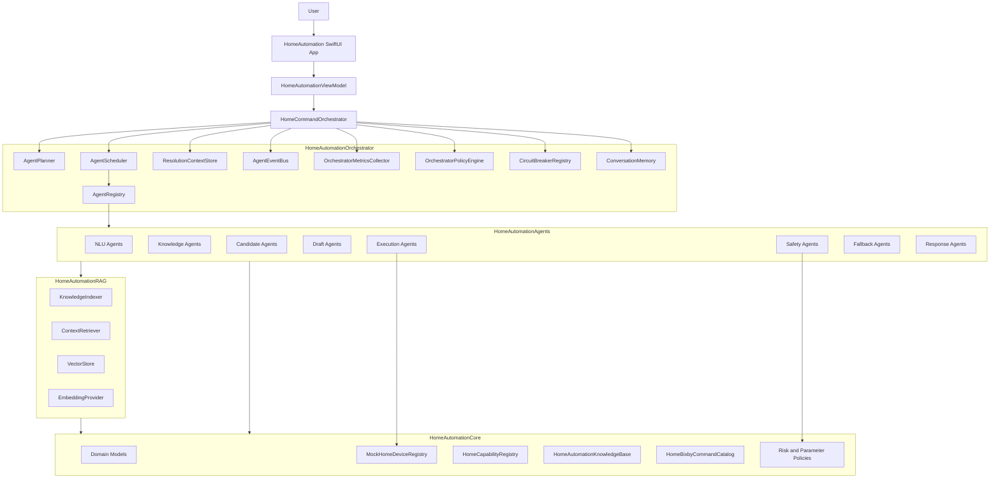
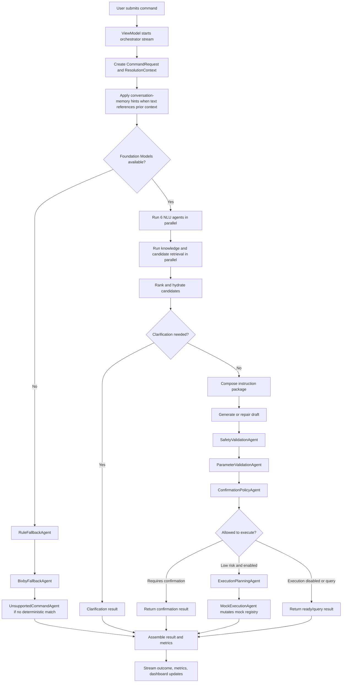
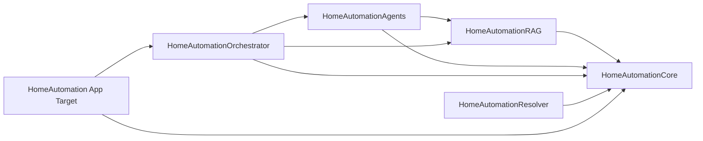

# HomeAutomation

`HomeAutomation` is a SwiftUI smart-home command resolution demo. It turns natural-language requests such as "Set the bedroom lamp to 40 percent" into validated home-automation drafts, execution plans, confirmations, or clarification questions.

The current implementation is orchestrator-first: a SwiftUI app calls a multi-agent command orchestrator, the orchestrator coordinates specialist agents, agents use canonical domain catalogs plus optional RAG context, and deterministic safety gates decide whether anything can execute.

## Project Goals

- Resolve natural-language home commands into structured `HomeCommandDraft` and `HomeCommandResolution` values.
- Keep model output advisory until deterministic validation passes.
- Support Foundation Models when available while preserving deterministic fallback behavior.
- Retrieve only relevant catalog, device, command, and Bixby context through RAG.
- Preserve observability through streamed pipeline events, per-agent traces, metrics JSON, and UI dashboards.
- Execute only low-risk mock-device commands when execution is enabled.

## High-Level Architecture



## Command Flow



## Package Structure

```text
HomeAutomation/
|-- HomeAutomation.xcodeproj/
|-- HomeAutomationApp/
|   |-- HomeAutomationApp.swift
|   |-- HomeAutomationView.swift
|   `-- HomeAutomationViewModel.swift
|-- HomeAutomationCore/
|   |-- Package.swift
|   |-- Sources/
|   |   |-- HomeAutomationCore/
|   |   |-- HomeAutomationRAG/
|   |   |-- HomeAutomationAgents/
|   |   |-- HomeAutomationOrchestrator/
|   |   `-- HomeAutomationResolver/
|   `-- Tests/
|       |-- HomeAutomationRAGTests/
|       |-- HomeAutomationAgentTests/
|       |-- HomeAutomationOrchestratorTests/
|       `-- HomeAutomationResolverTests/
|-- ARCHITECTURE.md
|-- UNIFIED_ARCHITECTURE.md
|-- UNIFIED_IMPLEMENTATION_PLAN.md
`-- unified_impl/
```

## Swift Package Modules

## Source Module READMEs

The main Swift package source folders each have their own detailed architecture note:

| Source folder | README | Focus |
| --- | --- | --- |
| `HomeAutomationCore/Sources/HomeAutomationCore` | [Core module README](HomeAutomationCore/Sources/HomeAutomationCore/README.md) | Domain contracts, canonical catalogs, policies, generated resources, mock registry, and Foundation Models support. |
| `HomeAutomationCore/Sources/HomeAutomationAgents` | [Agents module README](HomeAutomationCore/Sources/HomeAutomationAgents/README.md) | Agent protocol, 26 specialist agents, group responsibilities, agent flow, and safety constraints. |
| `HomeAutomationCore/Sources/HomeAutomationRAG` | [RAG module README](HomeAutomationCore/Sources/HomeAutomationRAG/README.md) | Chunking, embeddings, vector store, indexing, retrieval flow, metadata filters, and retrieval invariants. |
| `HomeAutomationCore/Sources/HomeAutomationOrchestrator` | [Orchestrator module README](HomeAutomationCore/Sources/HomeAutomationOrchestrator/README.md) | Planning, scheduling, context patching, event streaming, metrics, memory, circuit breakers, and fail-closed behavior. |
| `HomeAutomationCore/Sources/HomeAutomationResolver` | [Resolver module README](HomeAutomationCore/Sources/HomeAutomationResolver/README.md) | Legacy-compatible resolver pipeline, parity role, fallback flow, metrics, tools, validation, and execution safety. |

| Module | Role |
| --- | --- |
| `HomeAutomationCore` | Shared domain model, command/result types, canonical capability and Bixby catalogs, generated resource loading, mock registry, safety policy, parameter validation, and Foundation Models session support. |
| `HomeAutomationRAG` | In-memory retrieval system for capabilities, generated command examples, Bixby commands, and device records. |
| `HomeAutomationAgents` | Specialist agents for NLU, knowledge lookup, candidate handling, draft generation, safety checks, execution, fallback, and response formatting. |
| `HomeAutomationOrchestrator` | Runtime coordinator that plans stages, schedules agents, merges context patches, emits events, records metrics, applies circuit breakers, and manages conversation memory. |
| `HomeAutomationResolver` | Legacy-compatible resolver implementation retained for parity tests and migration safety. New app flow uses the orchestrator. |

Dependency direction:



## Main Components

### App Layer

| Component | Role |
| --- | --- |
| `HomeAutomationApp` | SwiftUI app entry point. |
| `HomeAutomationView` | Main user interface for command input, sample commands, pipeline timeline, result output, metrics, agent dashboard, device grid, and command history. |
| `HomeAutomationViewModel` | Main UI coordinator. Owns app state, creates `HomeCommandOrchestrator`, initializes RAG, streams updates, formats results, and refreshes dashboard/metrics data. |
| `HomePipelineEventItem`, `AgentDashboardItem`, `HomeDeviceDashboardItem`, `HomeCommandHistoryItem` | UI projection models for the timeline, agent status, device cards, and command history. |

### Orchestrator Layer

| Component | Role |
| --- | --- |
| `HomeCommandOrchestrator` | Main command resolver. Creates context, streams events, runs the scheduler, assembles `HomeAutomationResolverResult`, records metrics, and stores conversation turns. |
| `AgentPlanner` | Builds the execution plan. Uses fallback-only flow when models are unavailable; otherwise runs NLU, knowledge, candidate, draft, safety, and execution-planning stages. |
| `AgentScheduler` | Executes sequential and parallel phases, checks circuit breakers, runs agents, applies patches, records traces, and fails closed for mandatory gates. |
| `AgentRegistry` | Stores `AnyHomeAgent` instances by `AgentID` and capability. |
| `ResolutionContextStore` | Actor-backed holder for the evolving `ResolutionContext`. |
| `AgentEventBus` | Async event stream for UI timeline updates. |
| `OrchestratorPolicyEngine` | Central policy for model availability, retry limits, terminal exits, execution eligibility, and fail-closed safety behavior. |
| `CircuitBreakerRegistry` | Per-agent circuit breaker registry. |
| `ConversationMemory` | Stores recent resolved turns and contributes low-priority memory hints for follow-up commands. |
| `OrchestratorMetricsCollector` | Stores and serializes the latest orchestrator metrics. |

### Agent Layer

| Group | Agents |
| --- | --- |
| NLU | `LanguageAgent`, `DomainAgent`, `IntentFamilyAgent`, `DeviceTypeAgent`, `SlotExtractionAgent`, `RiskClassificationAgent` |
| Knowledge | `CapabilityKnowledgeAgent`, `BixbyKnowledgeAgent`, `CommandExampleAgent` |
| Candidates | `CandidateRetrievalAgent`, `CandidateRankingAgent`, `CandidateShardAgent`, `CandidateHydrationAgent` |
| Draft | `InstructionComposerAgent`, `DraftGenerationAgent`, `DraftRepairAgent` |
| Safety | `SafetyValidationAgent`, `ParameterValidationAgent`, `ConfirmationPolicyAgent` |
| Execution | `ExecutionPlanningAgent`, `MockExecutionAgent` |
| Fallback | `RuleFallbackAgent`, `BixbyFallbackAgent`, `UnsupportedCommandAgent` |
| Response | `ClarificationAgent`, `ResultSummaryAgent` |

### Core and Data Layer

| Component | Role |
| --- | --- |
| `HomeAutomationModels.swift` | Domain enums, worker outputs, candidate records, command drafts, execution plans, and final command resolutions. |
| `MockHomeDeviceRegistry` | Actor-backed mock home graph with candidate retrieval and low-risk state mutation. |
| `HomeCapabilityRegistry` | Source-of-truth capability definitions and risk/command lookup helpers. |
| `HomeAutomationKnowledgeBase` | Loads generated capability catalog and natural-language dataset resources. |
| `HomeBixbyCommandCatalog` and `HomeBixbyCommandMapper` | Bixby command source data and utterance-to-draft mapping support. |
| `HomeRiskPolicy` and `HomeParameterValidator` | Deterministic safety and parameter validation rules. |
| `HomeModelInstructionPackage` and `HomeAdapterModelProvider` | Foundation Models prompt/tool/session support. |

## Safety Rules

- No registry mutation happens before safety, parameter, confirmation, and execution-planning gates complete.
- Safety, parameter, confirmation, execution-planning, and mock-execution agents fail closed if missing, failed, or blocked by a circuit breaker.
- Memory-derived targets are hints only. Candidate retrieval, hydration, safety validation, and confirmation policy run again.
- High-risk actions such as lock/unlock, open/close, camera, valve, oven, and security-sensitive operations require explicit confirmation.
- RAG ranks and selects relevant context, but canonical registries remain the source of truth.

## RAG Sources

| Source | Stored As | Used By |
| --- | --- | --- |
| Capability catalog | Capability chunks | Knowledge, instruction composition, safety context |
| Generated NL dataset | Example chunks | NLU few-shot hints and command examples |
| Bixby command catalog | Voice-command chunks | Bixby knowledge and fallback mapping |
| Device registry | Device chunks | Candidate retrieval and semantic device matching |

## Testing

Run all package tests:

```sh
cd HomeAutomationCore
swift test
```

Build the macOS app target:

```sh
xcodebuild -scheme HomeAutomation -destination platform=macOS build
```

The current verified state has 77 passing Swift package tests across the RAG, agent, orchestrator, and legacy resolver suites, and the `HomeAutomation` Xcode scheme builds successfully.
