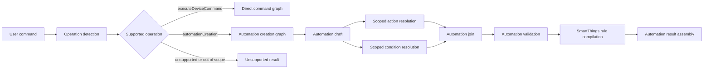

# Automation Creation Combined Implementation Plan

## Purpose

This plan combines the two active goals:

1. Preserve the existing immediate device-command pipeline.
2. Make **automation creation only** a graph-native, production-ready workflow.

The plan intentionally excludes automation update, automation deletion, automation query, scene creation, and routine execution. Those operation names may remain reserved in the code, but they should return explicit unsupported results unless the product scope changes later.

## Implementation Status Snapshot

This snapshot reflects the current codebase after the automation-creation graph, SmartThings rule creation backend, and automation RAG optimization work.

| Phase | Status | Notes |
| --- | --- | --- |
| Phase 1: Supported operation contract | Implemented | Orchestrator supports `executeDeviceCommand`, `automationCreation`, and `unsupported`; reserved operations are normalized to unsupported at the orchestrator boundary. |
| Phase 2: Graph-executed operation detection | Implemented for automation graph | `OperationDetectionAgent` is registered and runs as the entry node of the automation creation graph. Top-level deterministic detection still selects the graph before scheduling. |
| Phase 3: Automation-focused graph catalog | Implemented | `OperationGraphCatalog` owns direct command, automation creation, and unsupported graph providers behind the `GraphPlanner` facade. |
| Phase 4: Scoped runtime context | Implemented | `ContextScope`, `ScopedContextKey`, and scoped values in `ResolutionContext`/`ResolutionContextStore` isolate root, action, condition, and backend outputs. |
| Phase 5: Automation runtime agents | Implemented | Draft extraction, action resolution, condition operand resolution, validation, SmartThings compilation, SmartThings rule creation, and result assembly are registered contextual agents. |
| Phase 6: Automation through graph | Implemented with legacy fallback | Graph runtime executes `automationCreationGraph`; `AutomationCreationResolver` remains the legacy/parity path. |
| Phase 7: Dynamic fan-out | Implemented as scoped concurrent subflows | Actions resolve concurrently inside `AutomationActionResolver` and write action-scoped outputs. Condition operands write scoped records. Full dynamic graph node expansion remains future hardening. |
| Phase 8: Grammar/compiler strengthening | Implemented for `between` and `changes`; partial for schedules | Daily and interval schedules compile. Weekday, one-time, and relative-delay schedules are preserved with unsupported compilation reasons. |
| Phase 9: SmartThings rule creation backend | Implemented | Create-only backend protocol, dry-run default, validation gate, location requirement, and high-risk confirmation gate are in place. |
| Phase 10: Automation RAG optimization | Implemented baseline | Automation knowledge is split by source and subproblem, simple daily schedules stay retrieval-free, and an evaluation corpus now checks policy behavior. Precision benchmarking can still be expanded. |

## Current State Reanalysis

### What Already Works

- Direct commands such as `Turn on the TV` and `Turn on the bedroom lamp` resolve through the graph runtime by default.
- Legacy direct-command scheduling remains available through `OrchestratorRuntimeMode.legacy` and `HOME_AUTOMATION_ORCHESTRATOR_RUNTIME=legacy`.
- `HomeAutomationOperationKind` and `HomeOperationDetectionResult` exist.
- `HomeOperationDetectionService` detects scheduled and trigger-based automation creation requests.
- `AutomationCreationResolver` remains available as the legacy/parity automation creation flow.
- `AutomationDraftAgent` and `AutomationPatternParser` can extract basic schedules, device triggers, multiple action descriptions, and simple condition trees.
- `AutomationActionResolver` reuses the existing direct-command pipeline for each embedded automation action.
- `AutomationConditionOperandResolver` resolves simple condition operands to device attributes.
- `AutomationValidationPolicy` requires confirmation for high-risk unattended automations and blocks some unsafe schedules.
- `SmartThingsRuleCompiler` compiles supported automation plans into SmartThings-style Rule JSON.
- Automation RAG knowledge exists for patterns, rule examples, condition operators, and SmartThings schema grounding.
- Automation creation runs through `GraphScheduler` in graph runtime mode and still has a legacy service fallback.
- SmartThings Rule creation can persist compiled rules only when explicitly requested.
- Retrieval quality is tracked by source, including automation-specific sources.

### What Is Still Missing

- The operation router still runs once before graph selection; the graph-executed operation node records automation graph context but does not choose the graph by itself.
- Dynamic fan-out is implemented inside automation agents with scoped outputs, not as expanded graph nodes for each action and condition.
- Condition operands use deterministic matching only; they do not yet reuse candidate retrieval/ranking or RAG-backed clarification.
- Scheduler terminal stop behavior is still tied to `HomeCommandResolution` instead of an operation-neutral internal outcome.
- Weekday, one-time, relative-delay, sunrise/sunset, location-mode, presence, and duration-window automation grammar remain future work.
- Ambiguous logical grouping is not clarified robustly yet.
- Non-creation automation requests are normalized to unsupported at the orchestrator boundary rather than executed through an unsupported graph.

## Scope

### In Scope

- `executeDeviceCommand`
- `automationCreation`
- `unsupported`
- Graph-native automation creation
- Multiple actions inside an automation
- Multiple and nested conditions inside an automation
- SmartThings Rule JSON compilation
- Optional SmartThings Rule creation backend after validation and confirmation
- RAG optimization for automation creation only

### Out of Scope

- Automation update
- Automation deletion
- Automation query/listing
- Scene creation
- Routine execution
- SmartThings API update/delete/query operations
- Executing automation actions immediately during automation creation

## Target Architecture



The important architectural rule is that automation creation should reuse existing direct-command agents for action resolution, but it should not reuse the direct-command root context directly for every action. Each action needs its own scope.

## Combined Implementation Phases

### Phase 1: Lock the Supported Operation Contract

Goal: make the runtime contract match the narrowed product scope.

Tasks:

1. Treat only `executeDeviceCommand`, `automationCreation`, and `unsupported` as supported runtime paths.
2. Keep reserved enum cases if useful for future compatibility, but route them to unsupported.
3. Add tests for:
   - `Turn on AC everyday at 7 AM` -> automation creation
   - `When the door opens, turn on hallway light` -> automation creation
   - `Delete my morning automation` -> unsupported
   - `List automations` -> unsupported
4. Decide whether non-creation requests should be normalized to `.unsupported` inside `HomeOperationDetectionService` or only at the orchestrator boundary.

Recommended choice: normalize at the orchestrator boundary first, because it is lower risk and preserves the enum for diagnostics.

### Phase 2: Add Graph-Executed Operation Detection

Goal: make operation detection part of the graph/runtime contract.

Tasks:

1. Add a contextual `OperationDetectionAgent` wrapping `HomeOperationDetectionService`.
2. Register it in `DefaultAgentRegistryFactory`.
3. Add operation storage to `ResolutionContextStore`.
4. Add `ResolutionContextPatchKey.operation`.
5. Add graph tests proving operation detection can run as a node and write operation context.

Acceptance criteria:

- Operation detection appears in trace and graph metrics.
- Direct commands still route exactly as before.
- Automation creation still returns the same result as the legacy service/parity path.

### Phase 3: Add an Automation-Focused Graph Catalog

Goal: separate graph selection from hardcoded planner branches without expanding product scope.

Tasks:

1. Add a small graph catalog for:
   - direct command graph
   - direct command fallback graph
   - automation creation graph
   - unsupported graph
2. Keep `GraphPlanner` as a compatibility facade.
3. Add tests that select the expected graph for direct commands, automation creation, and unsupported operations.

Acceptance criteria:

- The scheduler does not need special-case automation creation code.
- The graph catalog does not include update/delete/query/scene/routine providers.

### Phase 4: Introduce Scoped Runtime Context

Goal: enable multiple actions and conditions without overwriting root command state.

Tasks:

1. Add `ContextScope` with at least:
   - `root`
   - `operation`
   - `action(String)`
   - `condition(String)`
   - `backend(String)`
2. Add typed context descriptors or equivalent scoped keys.
3. Add scoped value storage inside `ResolutionContextStore`.
4. Preserve existing root fields and patch behavior.
5. Add tests proving:
   - root direct-command fields still work
   - action `a1` draft does not overwrite action `a2` draft
   - condition `c1` result does not overwrite condition `c2` result

Acceptance criteria:

- Existing direct-command tests pass unchanged.
- Automation graph nodes can write scoped outputs.

### Phase 5: Convert Automation Services Into Runtime Agents

Goal: prepare automation creation to run through `GraphScheduler`.

Tasks:

1. Add contextual agents or adapters for:
   - automation draft extraction
   - condition operand resolution
   - automation action resolution
   - automation validation
   - SmartThings compilation
   - automation result assembly
2. Keep current service implementations as reusable internals.
3. Update manifests with supported operation `.automationCreation`.
4. Define consumes/produces descriptors for each automation node.

Acceptance criteria:

- The default registry can satisfy every node in `automationCreationGraph`.
- The automation graph validates successfully against the default registry.

### Phase 6: Run Automation Creation Through the Graph

Goal: replace the service-orchestrated automation path with graph execution.

Tasks:

1. Add a feature flag or runtime mode for graph-native automation creation.
2. Execute the automation creation graph through `GraphScheduler`.
3. Keep `AutomationCreationResolver` as the parity baseline during migration.
4. Compare service output and graph output for:
   - simple daily schedule
   - daily schedule with condition
   - device trigger
   - multiple actions
   - high-risk automation
   - unsupported weekday compilation

Acceptance criteria:

- Graph-native automation creation produces the same public `HomeAutomationResolverResult` as the legacy service/parity path.
- Automation actions are not executed immediately.
- Automation graph metrics contain actual node statuses, not just planned graph metadata.

### Phase 7: Add Dynamic Fan-Out for Actions and Conditions

Goal: make multiple actions and condition operands first-class graph work.

Tasks:

1. Expand the automation graph after draft extraction based on `actionDescriptions`.
2. Run each action through an action-scoped direct-command subgraph.
3. Resolve each condition operand in a condition-scoped node.
4. Join action and condition outputs deterministically.
5. Preserve early clarification for unresolved required actions or operands.

Acceptance criteria:

- Multiple action resolution can run independently.
- Action result ordering remains stable.
- Ambiguous condition operands produce clarification, not silent wrong choices.

### Phase 8: Strengthen Automation Grammar and Compiler

Goal: improve automation creation coverage without widening operation scope.

Tasks:

1. Add day-of-week schedule compilation if SmartThings schema support is clear.
2. Add `between` and `changes` compilation.
3. Add one-time absolute date/time only if it can be represented safely.
4. Add relative delay support only if validation can prevent unsafe repeated execution.
5. Keep unsupported fragments in the plan when compilation is not possible.

Acceptance criteria:

- Parsed-but-unsupported automations still return a draft and an unsupported compilation reason.
- Compiler failures do not erase the resolved automation plan.

### Phase 9: Add SmartThings Rule Creation Backend

Goal: persist validated automation creation plans when explicitly allowed.

Tasks:

1. Add a `SmartThingsRuleCreating` protocol for create-only API work.
2. Keep JSON dry-run as the default.
3. Require validation before API calls.
4. Require explicit confirmation for high-risk persistent automations.
5. Store backend response metadata separately from parser/compiler output.

Acceptance criteria:

- No update/delete/query API methods are introduced.
- No API call happens before deterministic validation.
- No high-risk rule is created without confirmation.

### Phase 10: RAG Optimization for Automation Creation

Goal: use RAG where it helps and keep simple commands fast.

Tasks:

1. Build an automation-creation evaluation corpus.
2. Track retrieval quality by source:
   - automation patterns
   - rule examples
   - condition operators
   - SmartThings schema
3. Split retrieval by subproblem:
   - operation routing
   - draft extraction
   - condition grammar
   - compiler/schema grounding
4. Keep deterministic simple daily schedules retrieval-free.
5. Keep final device IDs, capabilities, commands, and safety decisions deterministic.

Acceptance criteria:

- RAG improves complex automation extraction without slowing common daily schedules.
- RAG cannot bypass validation, device hydration, or safety policy.

## Old Agent Reuse Strategy

The old direct-command agents should be reused only for embedded automation actions.

Example:

```text
Turn on AC everyday at 7 AM
```

Automation draft extraction produces:

```text
actionDescriptions = ["Turn on AC"]
trigger = everyDay at 07:00
```

Then the existing direct-command graph resolves `Turn on AC` into:

- target device
- capability
- command
- parameters
- confirmation requirements

The old agents should not parse the whole automation sentence as a direct command. They should receive clean action text from the automation draft step.

## DAG Orchestrator Benefit

The DAG orchestrator helps this pipeline because automation creation is naturally not a single linear command:

- operation detection can happen before graph selection
- action resolution can fan out per action
- condition resolution can fan out per condition operand
- validation can wait for all required action and condition outputs
- compilation can run only after validation succeeds
- metrics can show exactly which node failed or asked clarification

The immediate benefit is not just "more extensible architecture." The practical benefit is safe multi-action and multi-condition automation creation without overwriting shared direct-command state.

## Required Test Coverage

### Direct Command Regression

- `Turn on the bedroom lamp`
- `Turn on the TV`
- `Set bedroom lamp to 40 percent`
- `Make bedroom AC cooler by 2 degrees`
- high-risk lock confirmation
- memory-based pronoun resolution

### Operation Routing

- direct command routes to direct graph
- daily schedule routes to automation creation
- device trigger routes to automation creation
- update/delete/query/scene/routine requests return unsupported

### Automation Creation

- simple daily schedule
- interval schedule
- weekday schedule parsed with unsupported compilation reason
- device trigger
- multiple actions
- `and` condition
- `or` condition
- nested `not` condition
- high-risk action requires confirmation
- unresolved action asks clarification
- unresolved condition operand asks clarification

### Graph Runtime

- automation graph validates against default registry
- graph-native automation output matches service-path output during migration
- scoped action outputs remain isolated
- scoped condition outputs remain isolated
- automation node metrics reflect actual execution

## Suggested Implementation Order

1. Lock supported operations and unsupported behavior.
2. Add graph-executed operation detection.
3. Add automation-focused graph catalog.
4. Add scoped context.
5. Register automation service wrappers as agents.
6. Run automation creation graph behind a feature flag.
7. Add dynamic fan-out for actions and conditions.
8. Switch automation creation to graph-native by default.
9. Expand compiler grammar.
10. Add create-only SmartThings Rule backend.
11. Tune automation-only RAG.

This order keeps the current working automation creation path available while the graph-native version catches up.
