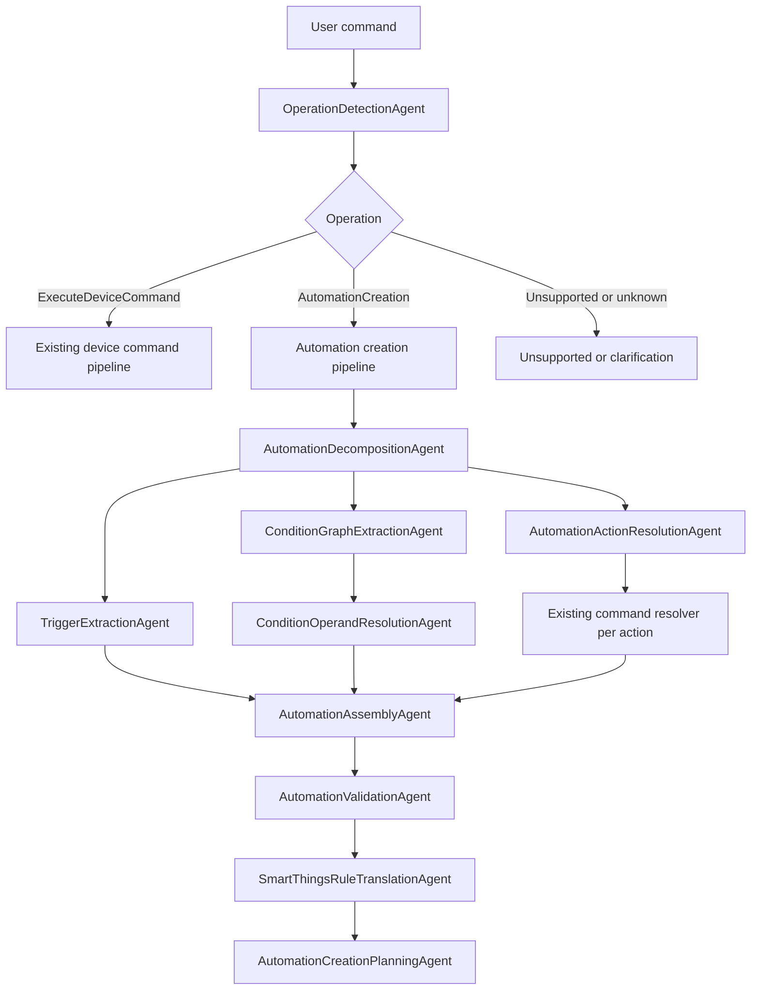

# Operation Routing and Automation Creation Requirements

## Purpose

This document captures the current project state, the desired new automation capability, and a proposed implementation plan.

The project currently resolves direct smart-home control commands such as:

```text
Turn on the TV
Set the bedroom lamp to 40 percent
Make the bedroom AC cooler by 2 degrees
```

The new goal is to support operation-level detection so the system can decide whether the user wants to execute a device command now or create a persistent automation/rule.

Example target command:

```text
Turn on AC everyday at 7 AM
```

Expected high-level interpretation:

```json
{
  "domain": "homeAutomation",
  "operation": "AutomationCreation",
  "intent": ["createAutomation"],
  "actions": [
    {
      "intent": ["power"],
      "device": "AC",
      "deviceType": "airConditioner",
      "capability": "switch",
      "command": "on",
      "value": "on"
    }
  ],
  "condition": null,
  "trigger": {
    "type": "schedule",
    "time": "07:00",
    "displayTime": "7:00 AM",
    "repeat": "everyDay"
  }
}
```

## Reference Material

SmartThings Rules are a useful external model for this feature:

- SmartThings Rules documentation: <https://developer.smartthings.com/docs/automations/rules>
- SmartThings Rules API entry point: <https://developer.smartthings.com/docs/api/public#tag/Rules>
- SmartThings Automations overview: <https://developer.smartthings.com/docs/automations/getting-started-with-automations>

Key SmartThings concepts relevant to this project:

- Rules are JSON objects with a name and an actions array.
- A single Rule can contain multiple actions.
- Actions form a tree that is evaluated when the Rule is triggered.
- Common action types include `if`, `sleep`, `command`, and `every`.
- Common condition types include `and`, `or`, `not`, `equals`, `greaterThan`, `lessThan`, `greaterThanOrEquals`, `lessThanOrEquals`, `between`, and `changes`.
- Operands include device, location, array, specific, and trigger/precondition concepts.
- The `every` action handles recurring schedule-like behavior.

These concepts imply that the internal model should be a rule AST, not a flat `action` plus `condition` object.

## Current Project State

### Package Structure

The Swift package is split into these main products:

- `HomeAutomationCore`
- `HomeAutomationRAG`
- `HomeAutomationAgents`
- `HomeAutomationOrchestrator`

The app target depends on the core and orchestrator modules.

### Current Resolution Flow

The current orchestrator resolves commands through a fixed agent pipeline:

1. NLU agents run in parallel:
   - `LanguageAgent`
   - `DomainAgent`
   - `IntentFamilyAgent`
   - `DeviceTypeAgent`
   - `SlotExtractionAgent`
   - `RiskClassificationAgent`
2. Knowledge and candidate agents run:
   - `CapabilityKnowledgeAgent`
   - `BixbyKnowledgeAgent`
   - `CommandExampleAgent`
   - `CandidateRetrievalAgent`
3. Retrieval quality is judged.
4. Candidate devices are ranked and hydrated.
5. Instructions are composed for draft generation.
6. `DraftGenerationAgent` creates one `HomeCommandDraft`.
7. Safety, parameter, and confirmation agents validate the draft.
8. `ExecutionPlanningAgent` converts the draft into an execution plan.
9. `MockExecutionAgent` can execute low-risk plans locally.

This pipeline is well-suited for direct commands. It assumes the primary operation is "resolve one command against one target/action plan."

### Current Core Models

The current intent family enum supports direct command families:

```swift
public enum HomeAutomationIntentFamily {
    case power
    case temperature
    case brightness
    case media
    case applianceCycle
    case lockUnlock
    case openClose
    case routine
    case statusQuery
    case maintenanceQuery
    case unsupported
}
```

There is no top-level operation type and no `createAutomation` intent family yet.

The current `HomeCommandDraft` is single-action oriented:

```swift
public struct HomeCommandDraft {
    public let intent: HomeAutomationIntent
    public let targetDeviceID: String?
    public let targetGroupID: String?
    public let capability: String?
    public let command: String?
    public let parameters: [HomeResolvedParameter]
    public let needsClarification: Bool
    public let clarificationQuestion: String?
    public let requiresConfirmation: Bool
    public let confidence: Double
}
```

This should remain the canonical representation of one device command. Automation creation should reuse this type for command actions instead of replacing it.

### Current Slot Extraction Limits

`HomeSlotExtractionResult` has:

- rooms
- device nicknames
- values
- modes
- confidence

It does not have structured temporal or condition fields such as:

- time of day
- recurrence
- days of week
- before/after
- duration
- condition operator
- device operand
- trigger/precondition semantics

As a result, text like `everyday at 7 AM` would be at risk of being represented as generic numeric values rather than a schedule trigger.

### Current RAG State

The RAG layer currently indexes:

- capability chunks
- device chunks
- Bixby command chunks
- natural language command dataset chunks

This works for direct command resolution but does not yet contain automation grammar, condition examples, schedule examples, or SmartThings Rule examples.

### Current Fallback State

The deterministic fallback path resolves immediate commands through keyword intent detection and device scoring. It does not distinguish:

- execute device command now
- create automation
- update automation
- delete automation
- query automation

This means model-unavailable operation routing would need new deterministic rules.

## Desired Capability

The system should introduce a top-level operation classification step before deciding which specialized agents to run.

The first two operations to support are:

- `ExecuteDeviceCommand`
- `AutomationCreation`

Additional future operation types should be anticipated:

- `AutomationUpdate`
- `AutomationDeletion`
- `AutomationQuery`
- `SceneCreation`
- `RoutineExecution`
- `Unsupported`

The operation classifier should be the primary router for the orchestrator.

## Detailed Requirements

### Functional Requirements

#### FR-001: Operation Detection

The system must add an agent that detects the operation requested by the user.

Required output:

```swift
public enum HomeAutomationOperationType: Sendable, Hashable, Codable {
    case executeDeviceCommand
    case automationCreation
    case automationUpdate
    case automationDeletion
    case automationQuery
    case unsupported
}

public struct HomeOperationDetectionResult: Sendable, Hashable, Codable {
    public let operation: HomeAutomationOperationType
    public let confidence: Double
    public let reason: String
}
```

Examples:

| User command | Operation |
| --- | --- |
| `Turn on the TV` | `executeDeviceCommand` |
| `Turn on AC everyday at 7 AM` | `automationCreation` |
| `When the door opens, turn on the hallway light` | `automationCreation` |
| `Delete my morning AC automation` | `automationDeletion` |
| `Disable the night light rule` | `automationUpdate` |
| `What automations run at 7 AM?` | `automationQuery` |

The initial implementation can route only `executeDeviceCommand`, `automationCreation`, and `unsupported`, while reserving enum cases for future operations.

#### FR-002: Operation-Based Agent Routing

The orchestrator must select different agent plans based on `HomeOperationDetectionResult.operation`.

For `executeDeviceCommand`, the current device-command pipeline should continue to run.

For `automationCreation`, the orchestrator should run automation-specific agents and reuse the direct command pipeline for each command action inside the automation.

#### FR-003: Multiple Actions

The automation model must support multiple actions.

Examples:

```text
Everyday at 7 AM turn on the AC and turn off the bedroom lamp
```

```json
{
  "actions": [
    { "capability": "switch", "command": "on", "device": "AC" },
    { "capability": "switch", "command": "off", "device": "bedroom lamp" }
  ]
}
```

The implementation must not force a single `action` object.

#### FR-004: Composite Conditions

The automation model must support composite condition trees using `and`, `or`, and `not`.

Examples:

```text
Turn on the AC at 7 AM if the temperature is above 26 and the window is closed
```

```text
Turn on the hallway light if the front door opens or motion is detected
```

The internal representation should preserve the logical structure, not flatten all conditions into an unordered list.

#### FR-005: Triggers vs Preconditions

The system must distinguish between:

- triggers: events or schedules that cause the rule to evaluate or execute
- preconditions: checks that must be true but should not independently trigger the rule

SmartThings supports this concept with trigger behavior such as `Always`, `Never`, and default automatic trigger selection. The internal model should support a trigger policy field even if the first implementation keeps it simple.

#### FR-006: Time and Schedule Triggers

The system must parse schedule expressions such as:

- `everyday at 7 AM`
- `at 7 AM every day`
- `weekdays at 6:30 PM`
- `every Monday at 8 PM`
- `tomorrow at 9`
- `after 10 minutes`
- `every 30 minutes`

The first implementation should support:

- daily time
- weekly days of week
- one-time absolute date/time when clearly stated
- interval recurrence

#### FR-007: Device Condition Operands

The system must resolve device operands inside conditions.

Example:

```text
If bedroom temperature is above 26, turn on the AC
```

The condition operand should resolve to something like:

```json
{
  "deviceId": "bedroom_ac",
  "component": "main",
  "capability": "temperatureMeasurement",
  "attribute": "temperature"
}
```

This requires candidate retrieval/ranking for condition operands, not only for command actions.

#### FR-008: Action Command Reuse

Each command action inside an automation must reuse the existing command-resolution and safety machinery.

For example, `turn on AC` inside an automation should still resolve through:

- device type inference
- candidate retrieval
- candidate ranking
- hydration
- command draft generation or deterministic fallback
- capability validation
- parameter validation
- confirmation policy

#### FR-009: SmartThings Rule Translation

The system should add a translation layer that converts the internal automation AST into SmartThings-style Rule JSON.

The internal model should not be tightly coupled to SmartThings JSON. SmartThings should be a target compiler.

This separation keeps the project able to support other automation backends later.

#### FR-010: Safe Handling of High-Risk Automations

Repeated or conditional automation involving high-risk devices must require confirmation or be blocked.

Examples:

```text
Unlock the front door every day at 7 AM
Open the garage whenever motion is detected
Turn on the oven when I leave home
```

The safety policy should be stricter for persistent automations than immediate commands because automations can execute later without the user present.

#### FR-011: Clarification for Ambiguous Automations

The automation flow must ask clarification questions when:

- action text is ambiguous
- trigger text is missing or unsupported
- condition structure is unclear
- multiple devices match a condition operand
- multiple devices match an action command
- `and`/`or` grouping is ambiguous

Example:

```text
Turn on the light when motion is detected or the door opens and it is night
```

This may require clarification because the grouping could be:

```text
(motion OR door opens) AND night
```

or:

```text
motion OR (door opens AND night)
```

#### FR-012: Preserve Direct Command Behavior

Existing direct command behavior should remain stable.

Commands such as `Turn on the bedroom lamp` should not regress, should not route through automation agents, and should keep existing fallback behavior when Foundation Models are unavailable.

### Data Model Requirements

#### DR-001: Add Operation State

Add operation fields to `ResolutionContext`:

```swift
public var operation: HomeOperationDetectionResult?
public var automationDraft: HomeAutomationRuleDraft?
public var automationPlan: HomeAutomationCreationPlan?
public var automationResolution: HomeAutomationResolution?
```

Add matching patch keys:

```swift
public static let operation = "operation"
public static let automationDraft = "automationDraft"
public static let automationPlan = "automationPlan"
public static let automationResolution = "automationResolution"
```

#### DR-002: Add Create Automation Intent Family

Add:

```swift
case createAutomation
```

to `HomeAutomationIntentFamily`.

This should be used as the top-level intent for automation creation, while embedded action commands continue to use families such as `.power`, `.temperature`, `.brightness`, and `.lockUnlock`.

#### DR-003: Add Rule AST

Recommended internal model:

```swift
public struct HomeAutomationRuleDraft: Sendable, Hashable, Codable {
    public let name: String?
    public let operation: HomeAutomationOperationType
    public let trigger: HomeAutomationTriggerNode?
    public let condition: HomeAutomationConditionNode?
    public let actions: [HomeAutomationActionNode]
    public let confidence: Double
}

public indirect enum HomeAutomationActionNode: Sendable, Hashable, Codable {
    case command(HomeCommandDraft)
    case sequence([HomeAutomationActionNode])
    case sleep(HomeDuration)
    case `if`(
        condition: HomeAutomationConditionNode,
        then: [HomeAutomationActionNode],
        elseActions: [HomeAutomationActionNode]
    )
}

public indirect enum HomeAutomationConditionNode: Sendable, Hashable, Codable {
    case and([HomeAutomationConditionNode])
    case or([HomeAutomationConditionNode])
    case not(HomeAutomationConditionNode)
    case equals(HomeAutomationOperand, HomeAutomationOperand)
    case greaterThan(HomeAutomationOperand, HomeAutomationOperand)
    case lessThan(HomeAutomationOperand, HomeAutomationOperand)
    case greaterThanOrEquals(HomeAutomationOperand, HomeAutomationOperand)
    case lessThanOrEquals(HomeAutomationOperand, HomeAutomationOperand)
    case between(value: HomeAutomationOperand, start: HomeAutomationOperand, end: HomeAutomationOperand)
    case changes(HomeAutomationConditionNode)
}

public enum HomeAutomationTriggerNode: Sendable, Hashable, Codable {
    case schedule(HomeScheduleTrigger)
    case device(HomeAutomationConditionNode)
    case location(HomeAutomationConditionNode)
    case manual
}

public enum HomeAutomationOperand: Sendable, Hashable, Codable {
    case deviceAttribute(HomeDeviceAttributeOperand)
    case locationAttribute(HomeLocationAttributeOperand)
    case string(String)
    case integer(Int)
    case decimal(Double)
    case boolean(Bool)
    case array([HomeAutomationOperand])
}
```

#### DR-004: Add Resolved Action Summary

The user-facing JSON should not expose only internal device IDs. It should include display-friendly values too:

```swift
public struct HomeAutomationResolvedActionSummary: Sendable, Hashable, Codable {
    public let intentFamilies: [HomeAutomationIntentFamily]
    public let deviceID: String?
    public let deviceName: String?
    public let deviceType: String?
    public let capability: String?
    public let command: String?
    public let value: String?
}
```

### Agent Requirements

#### AR-001: OperationDetectionAgent

New agent:

```swift
OperationDetectionAgent
```

Responsibilities:

- classify top-level operation
- distinguish direct execution from persistent automation creation
- provide confidence and reason
- support deterministic fallback

High-confidence automation creation signals:

- `every day`
- `daily`
- `at 7 AM`
- `when`
- `whenever`
- `if`
- `after`
- `before`
- `schedule`
- `create automation`
- `make a rule`
- `automatically`
- `routine`

Careful distinction:

- `Turn on AC now` -> `executeDeviceCommand`
- `Turn on AC at 7 AM` -> likely `automationCreation`
- `Set AC to 24` -> `executeDeviceCommand`
- `Set AC to 24 when I get home` -> `automationCreation`

#### AR-002: AutomationDecompositionAgent

Responsibilities:

- split user text into action spans, trigger spans, and condition spans
- preserve source text for each span
- identify `and`/`or` connectors
- identify whether `and`/`or` connects actions or conditions

Example:

```text
At 7 AM every day, turn on AC and turn off the bedroom lamp if the window is closed
```

Expected decomposition:

```json
{
  "triggerText": "At 7 AM every day",
  "conditionText": "if the window is closed",
  "actionTexts": [
    "turn on AC",
    "turn off the bedroom lamp"
  ]
}
```

#### AR-003: TriggerExtractionAgent

Responsibilities:

- normalize schedule and event triggers
- support time, date, day-of-week, interval, and device-event triggers
- produce `HomeAutomationTriggerNode`

Examples:

- `everyday at 7 AM` -> schedule daily 07:00
- `every 10 minutes` -> interval trigger
- `when motion is detected` -> device condition trigger

#### AR-004: ConditionGraphExtractionAgent

Responsibilities:

- parse condition text into `HomeAutomationConditionNode`
- preserve `and`, `or`, `not`, comparison, between, and changes structure
- mark ambiguous grouping for clarification

#### AR-005: ConditionOperandResolutionAgent

Responsibilities:

- resolve condition operands to device/location/capability/attribute
- reuse candidate retrieval and ranking logic for device operands
- choose correct attribute for read-only capability conditions

#### AR-006: AutomationActionResolutionAgent

Responsibilities:

- resolve each action text into one or more `HomeCommandDraft` values
- reuse the existing device command pipeline per action
- support multiple command actions
- preserve action order when order matters

#### AR-007: AutomationAssemblyAgent

Responsibilities:

- combine trigger, condition tree, and actions into `HomeAutomationRuleDraft`
- create a proposed rule name if the user did not provide one
- calculate aggregate confidence

#### AR-008: AutomationValidationAgent

Responsibilities:

- validate trigger availability
- validate condition operands
- validate action drafts
- apply stricter safety for persistent automations
- produce clarification, confirmation, unsupported, or ready-to-create outcomes

#### AR-009: SmartThingsRuleTranslationAgent

Responsibilities:

- compile `HomeAutomationRuleDraft` into SmartThings Rules JSON
- keep the compiler deterministic
- reject unsupported AST nodes with actionable reasons
- preserve a backend-neutral internal model

#### AR-010: AutomationFallbackAgent

Responsibilities:

- support simple automation creation without Foundation Models
- cover common templates:
  - schedule plus one command
  - schedule plus multiple commands
  - simple device condition plus one command
  - simple `and` conditions
- fail safely to clarification for complex `or` or ambiguous grouping

### RAG Requirements

#### RR-001: Add Automation Knowledge Source

Add a new `KnowledgeSource` case:

```swift
case automationRuleExample
```

or split it further:

```swift
case automationPattern
case smartThingsRuleExample
```

#### RR-002: Add Automation Example Dataset

Create a generated or curated dataset with examples such as:

```json
{
  "id": "automation_0001",
  "text": "Turn on AC everyday at 7 AM",
  "operation": "AutomationCreation",
  "triggerType": "schedule",
  "repeat": "everyDay",
  "actionCount": 1,
  "actionIntentFamilies": ["power"],
  "deviceTypes": ["airConditioner"],
  "capabilities": ["switch"],
  "conditionOperators": []
}
```

Examples should cover:

- daily schedule
- weekly schedule
- interval schedule
- device state trigger
- multiple actions
- `and` conditions
- `or` conditions
- `not` conditions
- comparisons
- `between`
- `changes`
- sleep/delay

#### RR-003: Split Retrieval by Subproblem

Do not use one RAG query for the full automation sentence.

Use separate retrieval queries:

- operation detection query
- action command query
- trigger extraction query
- condition extraction query
- SmartThings compilation query

This prevents temporal terms like `7 AM` from polluting action slots and prevents device action terms from polluting condition grammar.

#### RR-004: Use Hybrid Retrieval for Automation Grammar

Automation grammar relies on exact terms such as `every`, `if`, `when`, `and`, `or`, `not`, `between`, and `changes`. Hybrid retrieval is better than semantic-only retrieval for these.

Use structured retrieval hints:

```swift
public struct AutomationRetrievalHints {
    public let operationTypes: [String]
    public let triggerTypes: [String]
    public let conditionOperators: [String]
    public let actionFamilies: [String]
    public let deviceTypes: [String]
    public let capabilities: [String]
}
```

#### RR-005: Hydrate Final Facts From Core

RAG examples should never be final authority.

Final device IDs, capabilities, commands, attributes, enum values, numeric ranges, and risk levels must still be hydrated and validated from `HomeAutomationCore`.

### Safety Requirements

#### SR-001: Persistent Automation Risk Is Higher Than Immediate Execution

Automation actions execute later and may repeat. Safety policy must be stricter than direct command execution.

Examples requiring confirmation or blocking:

- unlock lock on schedule
- open garage on schedule
- open valve on repeated trigger
- start oven automatically
- disable camera or alarm

#### SR-002: Validate Both Condition and Action Devices

Conditions can reference devices too. Both sides must be validated:

- action target device/capability/command
- condition operand device/capability/attribute

#### SR-003: Detect Runaway Automations

Reject or ask confirmation for automations that can repeatedly trigger too often.

Examples:

- `when temperature is above 26 turn AC on` without `changes` may evaluate repeatedly
- `every 1 second turn on the light`
- condition/action feedback loops

#### SR-004: Require Confirmation for Ambiguous Logic

If logical grouping changes outcome, ask clarification instead of guessing.

### Non-Functional Requirements

#### NFR-001: Preserve Current Direct Command Latency

Direct command execution should not pay for full automation parsing. The operation detection phase should be lightweight and deterministic-first.

#### NFR-002: Keep Agents Independently Testable

Each new automation agent should have typed inputs/outputs and unit tests, matching the current project pattern.

#### NFR-003: Keep Backend Translation Isolated

SmartThings JSON generation should live behind a compiler/translator layer so other backends can be supported later.

#### NFR-004: Maintain Offline Deterministic Behavior

Simple automation templates should work when Foundation Models are unavailable.

#### NFR-005: Keep Prompt Context Small

Automation creation can become token-heavy. Use decomposition before retrieval and draft generation to keep prompts focused.

## Proposed Architecture

### High-Level Flow



### Planner Changes

Current planner:

```text
One fixed plan for all model-available commands.
```

Recommended planner:

```text
Phase 0:
  OperationDetectionAgent

If executeDeviceCommand:
  current full plan

If automationCreation:
  automation creation plan

If unsupported:
  unsupported/clarification plan
```

Implementation options:

1. Pre-route in `HomeCommandOrchestrator.resolveStream`.
   - Run a small operation detection plan first.
   - Snapshot context.
   - Ask `AgentPlanner` for the operation-specific plan.
   - This is the cleanest option.

2. Support dynamic replanning in `AgentScheduler`.
   - More flexible but more invasive.

Recommended: option 1.

### Internal Rule AST to SmartThings Rule Compilation

Internal model:

```text
HomeAutomationRuleDraft
  trigger: schedule daily at 07:00
  condition: optional boolean AST
  actions:
    command(HomeCommandDraft for AC switch on)
```

SmartThings-style output:

```json
{
  "name": "Turn on AC everyday at 7 AM",
  "actions": [
    {
      "every": {
        "specific": {
          "reference": "Noon",
          "offset": {
            "value": { "integer": -300 },
            "unit": "Minute"
          }
        },
        "actions": [
          {
            "command": {
              "devices": ["bedroom_ac"],
              "commands": [
                {
                  "component": "main",
                  "capability": "switch",
                  "command": "on",
                  "arguments": []
                }
              ]
            }
          }
        ]
      }
    }
  ]
}
```

Note: This is a compiler output shape. The exact time representation should be verified during implementation against the current SmartThings API schema and examples.

## Example Interpretations

### Example 1: Simple Daily Automation

Input:

```text
Turn on AC everyday at 7 AM
```

Operation:

```json
{
  "operation": "AutomationCreation",
  "confidence": 0.97
}
```

Rule draft:

```json
{
  "trigger": {
    "type": "schedule",
    "repeat": "everyDay",
    "time": "07:00"
  },
  "condition": null,
  "actions": [
    {
      "type": "command",
      "deviceType": "airConditioner",
      "capability": "switch",
      "command": "on"
    }
  ]
}
```

### Example 2: Multiple Actions

Input:

```text
Everyday at 7 AM turn on the AC and turn off the bedroom lamp
```

Rule draft:

```json
{
  "trigger": {
    "type": "schedule",
    "repeat": "everyDay",
    "time": "07:00"
  },
  "actions": [
    {
      "type": "command",
      "capability": "switch",
      "command": "on",
      "device": "AC"
    },
    {
      "type": "command",
      "capability": "switch",
      "command": "off",
      "device": "bedroom lamp"
    }
  ]
}
```

### Example 3: Composite Conditions

Input:

```text
At 7 AM turn on the AC if the room temperature is above 26 and the window is closed
```

Rule draft:

```json
{
  "trigger": {
    "type": "schedule",
    "time": "07:00"
  },
  "condition": {
    "and": [
      {
        "greaterThan": {
          "left": {
            "deviceAttribute": {
              "capability": "temperatureMeasurement",
              "attribute": "temperature"
            }
          },
          "right": { "decimal": 26 }
        }
      },
      {
        "equals": {
          "left": {
            "deviceAttribute": {
              "capability": "contactSensor",
              "attribute": "contact"
            }
          },
          "right": { "string": "closed" }
        }
      }
    ]
  },
  "actions": [
    {
      "type": "command",
      "capability": "switch",
      "command": "on",
      "device": "AC"
    }
  ]
}
```

### Example 4: OR Condition

Input:

```text
Turn on hallway light when the front door opens or motion is detected
```

Rule draft:

```json
{
  "trigger": {
    "type": "condition",
    "condition": {
      "or": [
        {
          "equals": {
            "left": { "deviceAttribute": { "capability": "contactSensor", "attribute": "contact" } },
            "right": { "string": "open" }
          }
        },
        {
          "equals": {
            "left": { "deviceAttribute": { "capability": "motionSensor", "attribute": "motion" } },
            "right": { "string": "active" }
          }
        }
      ]
    }
  },
  "actions": [
    {
      "type": "command",
      "device": "hallway light",
      "capability": "switch",
      "command": "on"
    }
  ]
}
```

## Proposed Implementation Plan

### Phase 1: Operation Routing Foundation

1. Add `HomeAutomationOperationType`.
2. Add `HomeOperationDetectionResult`.
3. Add operation field to `ResolutionContext`.
4. Add operation patch key.
5. Add `AgentID.operationDetection`.
6. Add `AgentCapability.operationDetection`.
7. Implement `OperationDetectionAgent`.
8. Add deterministic operation parser support to `AgentTextParser` or a new `AgentOperationTextParser`.
9. Update `DefaultAgentRegistryFactory`.
10. Update `AgentPlanner` or `HomeCommandOrchestrator` to run operation detection before selecting the rest of the plan.
11. Add tests:
    - direct command routes to `executeDeviceCommand`
    - schedule command routes to `automationCreation`
    - condition command routes to `automationCreation`
    - unsupported text routes to `unsupported`

### Phase 2: Automation AST Models

1. Add `HomeAutomationRuleDraft`.
2. Add `HomeAutomationActionNode`.
3. Add `HomeAutomationConditionNode`.
4. Add `HomeAutomationTriggerNode`.
5. Add `HomeAutomationOperand`.
6. Add schedule/duration helper models.
7. Add automation resolution cases:
   - `readyToCreateAutomation`
   - `requiresAutomationConfirmation`
   - `automationCreated`
   - `automationUnsupported`
8. Add final result fields for automation draft and compiled rule.

### Phase 3: Decomposition and Trigger Extraction

1. Implement `AutomationDecompositionAgent`.
2. Implement `TriggerExtractionAgent`.
3. Add deterministic handling for common schedule expressions:
   - `everyday at <time>`
   - `at <time> every day`
   - `weekdays at <time>`
   - `every <weekday> at <time>`
   - `every <number> minutes/hours`
4. Add tests for action/trigger/condition span splitting.

### Phase 4: Condition Graph Extraction

1. Implement `ConditionGraphExtractionAgent`.
2. Support:
   - `and`
   - `or`
   - `not`
   - `equals`
   - `greaterThan`
   - `lessThan`
   - `between`
   - `changes`
3. Add ambiguity detection for mixed `and`/`or` without clear grouping.
4. Add tests for condition AST output.

### Phase 5: Action and Condition Operand Resolution

1. Implement `AutomationActionResolutionAgent`.
2. Reuse existing direct-command pipeline for each action text.
3. Implement `ConditionOperandResolutionAgent`.
4. Reuse candidate retrieval/ranking for condition devices.
5. Add capability/attribute inference for condition operands.
6. Add tests for:
   - action command resolution
   - condition device resolution
   - multiple action resolution

### Phase 6: Automation Assembly and Validation

1. Implement `AutomationAssemblyAgent`.
2. Implement `AutomationValidationAgent`.
3. Extend `HomeRiskPolicy` or add `HomeAutomationRiskPolicy`.
4. Validate persistent automation risk.
5. Validate trigger frequency.
6. Validate condition/action feedback loops where possible.
7. Add tests for high-risk scheduled actions.

### Phase 7: SmartThings Rule Translation

1. Implement `SmartThingsRuleTranslationAgent`.
2. Add backend-neutral compiler protocol:

```swift
public protocol HomeAutomationRuleCompiling: Sendable {
    associatedtype Output: Sendable
    func compile(_ draft: HomeAutomationRuleDraft) throws -> Output
}
```

3. Add `SmartThingsRuleCompiler`.
4. Compile:
   - command actions
   - if actions
   - every actions
   - sleep actions
   - and/or/not/equality/comparison conditions
   - device operands
   - location operands when available
5. Add fixture tests using SmartThings-style JSON.

### Phase 8: RAG Expansion

1. Add automation knowledge source.
2. Add automation example resource.
3. Update `DocumentChunker`.
4. Update `KnowledgeIndexer` versioning so automation examples invalidate cache.
5. Update `ContextRetriever` usage in new automation agents.
6. Add retrieval reports for automation agents.
7. Add tests for automation RAG retrieval.

### Phase 9: UI and Metrics

1. Show operation in the app result panel.
2. Show automation draft JSON.
3. Show compiled SmartThings Rule JSON.
4. Add operation routing to metrics.
5. Add automation-specific agent traces to the dashboard.

## Test Plan

### Unit Tests

- Operation detection:
  - `Turn on TV` -> `executeDeviceCommand`
  - `Turn on AC everyday at 7 AM` -> `automationCreation`
  - `When door opens turn on light` -> `automationCreation`
- Decomposition:
  - action spans extracted correctly
  - trigger span extracted correctly
  - condition span extracted correctly
- Trigger extraction:
  - daily schedule
  - weekly schedule
  - interval schedule
- Condition graph:
  - `and`
  - `or`
  - `not`
  - comparisons
  - mixed ambiguity
- Action resolution:
  - one action
  - multiple actions
  - ambiguous device
- Operand resolution:
  - temperature sensor/AC temperature
  - contact sensor/window closed
  - motion sensor active
- Validation:
  - safe schedule
  - high-risk repeated automation
  - invalid trigger
  - missing action
  - unsupported condition
- SmartThings compiler:
  - command action JSON
  - every action JSON
  - if action JSON
  - composite condition JSON

### Integration Tests

- Direct command still resolves through current pipeline.
- Model-unavailable simple automation uses deterministic fallback.
- Automation creation does not execute the action immediately.
- Multi-action automation produces multiple command actions.
- Composite condition automation preserves logical structure.

### Regression Tests

Existing tests around:

- candidate retrieval
- candidate ranking
- draft generation
- safety validation
- parameter validation
- confirmation policy
- fallback command resolution

should continue to pass.

## Open Questions

1. Should `AutomationCreation` create local internal automation drafts only, or should it call SmartThings Rules API in the app?
2. Do we need support for updating/deleting existing automations in the first release?
3. Should operation names be API-style (`automationCreation`) or user-facing style (`AutomationCreation`)?
4. What timezone should be used for schedule normalization?
5. How should ambiguous `AC` be resolved when multiple air conditioners exist?
6. Should SmartThings Rules JSON be persisted in project state, displayed only, or sent to an API client?
7. Should scenes/manual routines be represented separately from rules/automatic routines?

## Acceptance Criteria

The first implementation should be considered successful when:

1. `Turn on the TV` routes to `executeDeviceCommand` and preserves current behavior.
2. `Turn on AC everyday at 7 AM` routes to `automationCreation`.
3. The system extracts:
   - action: `turn on AC`
   - trigger: `everyday at 7 AM`
   - action command: `switch.on`
   - device type: `airConditioner`
4. The system can represent multiple actions.
5. The system can represent `and` and `or` condition trees.
6. The system does not execute automation actions immediately.
7. The system can produce an internal automation AST.
8. The system can compile a simple schedule plus command automation to SmartThings-style Rule JSON.
9. High-risk persistent automations require confirmation or are blocked.
10. Existing direct command tests continue to pass.

