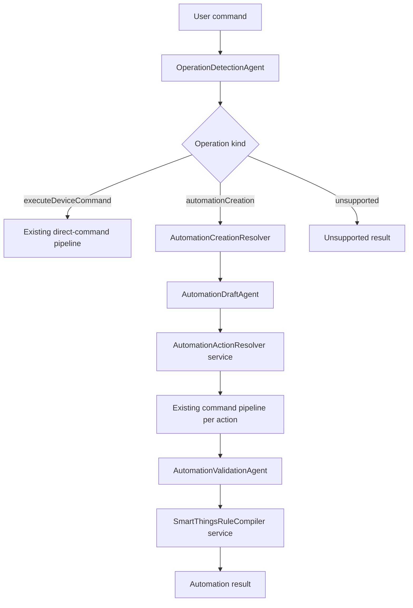

# Automation Creation Implementation Plan

## Purpose

This document turns the automation-routing discussion into a concrete, phase-by-phase implementation plan.

The current project resolves immediate Home Automation commands such as:

```text
Turn on the TV
Set the bedroom lamp to 40 percent
Make the bedroom AC cooler by 2 degrees
```

The new goal is to support a second operation type:

```text
Turn on AC everyday at 7 AM
```

Instead of treating this as an immediate command, the orchestrator should identify it as an automation creation request, extract the requested action, extract the trigger/condition structure, resolve the action through the existing device-command pipeline, and produce an internal automation rule draft plus an optional SmartThings Rules JSON representation.

Target interpretation:

```json
{
  "domain": "homeAutomation",
  "operation": "automationCreation",
  "intent": ["createAutomation"],
  "actions": [
    {
      "intent": ["power"],
      "device": "AC",
      "capability": "switch",
      "value": "on"
    }
  ],
  "condition": {
    "time": "7:00AM",
    "repeat": "everyDay"
  }
}
```

The implementation should also support multiple actions and multiple conditions composed with `and`, `or`, and `not`.

## Implementation Direction

Use the lean architecture from `automation_routing_analysis.md` as the v1 path:

- Add operation routing before the current direct-command pipeline.
- Preserve the existing `ExecuteDeviceCommand` flow as much as possible.
- Add a separate automation path for `AutomationCreation`.
- Add a small number of agents, not a large agent chain.
- Use services for deterministic orchestration, action reuse, validation helpers, and SmartThings JSON compilation.
- Keep automation context separate from the existing direct-command `ResolutionContext`.
- Add RAG only where it improves uncertain or complex automation parsing, not on every simple automation request.

## Relevant Current Project State

### Current Direct-Command Pipeline

The current entry point is:

```text
HomeAutomationCore/Sources/HomeAutomationOrchestrator/HomeCommandOrchestrator.swift
```

`HomeCommandOrchestrator.resolveStream` currently:

1. Builds a `CommandRequest`.
2. Creates a `ResolutionContextStore`.
3. Adds conversation-memory hints.
4. Builds a fixed `AgentExecutionPlan` through `AgentPlanner`.
5. Executes the plan with `AgentScheduler`.
6. Optionally runs mock execution for low-risk commands.
7. Assembles `HomeAutomationResolverResult`.
8. Stores metrics and conversation memory.

The existing `AgentPlanner` has one fixed model-backed pipeline:

```text
language, domain, intentFamily, deviceType, slotExtraction, riskClassification
capabilityKnowledge, bixbyKnowledge, commandExample, candidateRetrieval
retrievalJudge
candidateRanking
candidateHydration
instructionComposer
draftGeneration
safetyValidation
parameterValidation
confirmationPolicy
executionPlanning
```

This is good for direct commands, but not for automation creation because automation requires operation routing, trigger extraction, condition-tree modeling, and multiple resolved command actions.

### Current Model Limits

`HomeAutomationIntentFamily` does not include `createAutomation`.

`HomeCommandDraft` represents one command action:

```swift
public struct HomeCommandDraft {
    public let intent: HomeAutomationIntent
    public let targetDeviceID: String?
    public let targetGroupID: String?
    public let capability: String?
    public let command: String?
    public let parameters: [HomeResolvedParameter]
    public let needsClarification: Bool
    public let clarificationQuestion: String?
    public let requiresConfirmation: Bool
    public let confidence: Double
}
```

This type should remain the canonical direct-action representation. Automation creation should reuse it for each resolved automation action.

`ResolutionContext` is direct-command oriented and already contains many optional fields. Do not add a large automation subtree into it for v1.

### SmartThings Rules Constraints

The SmartThings Rules documentation describes Rules as JSON objects with a name and an `actions` array. A single Rule may contain multiple actions, and actions form a tree evaluated when the Rule is triggered.

Common action types include:

- `if`
- `sleep`
- `command`
- `every`

Common condition types include:

- `and`
- `or`
- `not`
- `equals`
- `greaterThan`
- `lessThan`
- `greaterThanOrEquals`
- `lessThanOrEquals`
- `between`
- `changes`

For v1, compile only the SmartThings rule shapes that are clearly supported by the public Rules model:

- Daily time schedule using `every.specific`.
- Device condition trigger or precondition using supported comparison operators.
- Composite `and`, `or`, and `not`.
- Multiple command actions.
- Optional `sleep`.

Do not promise weekday-only schedules such as `every Monday` or `weekdays` until the exact production backend support is verified. Keep them parsed as internal AST values, but mark SmartThings compilation as unsupported or requiring a future scheduler backend.

References:

- https://developer.smartthings.com/docs/automations/rules
- https://developer.smartthings.com/docs/api/public#tag/Rules
- https://developer.smartthings.com/docs/automations/getting-started-with-automations

## Target Architecture



### New Operation Model

Add a top-level operation enum:

```swift
@Generable
public enum HomeAutomationOperationKind: String, Sendable, Hashable, Codable {
    case executeDeviceCommand
    case automationCreation
    case automationUpdate
    case automationDeletion
    case automationQuery
    case unsupported
}
```

Add a detection result:

```swift
@Generable
public struct HomeOperationDetectionResult: Sendable, Hashable, Codable {
    public let domain: HomeAutomationCommandDomain
    public let operation: HomeAutomationOperationKind
    public let confidence: Double
    public let reason: String
}
```

Add `createAutomation` to `HomeAutomationIntentFamily`:

```swift
case createAutomation
```

This intent should be used only as the top-level automation intent. Each action inside the automation still uses the existing action intent families such as `power`, `temperature`, `brightness`, or `media`.

### New Agent Structure Field

Add operation awareness to the agent metadata so the orchestrator can choose agents by operation type:

```swift
public protocol AnyHomeAgent: Sendable {
    var id: AgentID { get }
    var capabilities: Set<AgentCapability> { get }
    var supportedOperations: Set<HomeAutomationOperationKind> { get }
    var timeoutNanoseconds: UInt64 { get }

    func run(context: ResolutionContext) async -> AgentRunResult
}
```

For existing direct-command agents, the default should be:

```swift
[.executeDeviceCommand]
```

For the operation detection agent:

```swift
[.executeDeviceCommand, .automationCreation, .automationUpdate, .automationDeletion, .automationQuery, .unsupported]
```

For new automation agents:

```swift
[.automationCreation]
```

This keeps the first implementation simple while preparing the registry and planner for future operation types.

### New Agent Capabilities

Add these capabilities:

```swift
case operationDetection
case automationDrafting
case automationValidation
```

Add these agent IDs:

```swift
static let operationDetection = AgentID("operationDetection")
static let automationDraft = AgentID("automationDraft")
static let automationValidation = AgentID("automationValidation")
```

Do not add separate v1 agents for trigger extraction, condition extraction, condition operand resolution, action resolution, and SmartThings compilation. Those should be models or services first.

### New Automation Context

Create a separate context for automation creation:

```swift
public struct AutomationResolutionContext: Sendable {
    public let request: CommandRequest
    public let operation: HomeOperationDetectionResult
    public var draft: HomeAutomationRuleDraft?
    public var resolvedActions: [HomeAutomationResolvedAction]
    public var validation: AutomationValidationResult?
    public var smartThingsRule: SmartThingsRuleDocument?
    public var resolution: AutomationCreationResolution?
    public var trace: [AgentTraceEntry]
    public var errors: [AgentFailure]
}
```

This avoids turning the existing direct-command `ResolutionContext` into a large mixed-operation state object.

### Automation Rule AST

Represent automations as a rule AST, not as a flat `action` plus `condition` object.

Suggested core types:

```swift
public struct HomeAutomationRuleDraft: Sendable, Hashable, Codable {
    public let name: String
    public let domain: HomeAutomationCommandDomain
    public let operation: HomeAutomationOperationKind
    public let intent: HomeAutomationIntentFamily
    public let trigger: HomeAutomationTrigger?
    public let condition: HomeAutomationCondition?
    public let actionDescriptions: [String]
    public let confidence: Double
}
```

```swift
public enum HomeAutomationTrigger: Sendable, Hashable, Codable {
    case schedule(HomeAutomationScheduleTrigger)
    case device(HomeAutomationDeviceTrigger)
}
```

```swift
public struct HomeAutomationScheduleTrigger: Sendable, Hashable, Codable {
    public let repeatRule: HomeAutomationRepeatRule
    public let timeOfDay: HomeAutomationTimeOfDay?
    public let timezoneIdentifier: String?
}
```

```swift
public enum HomeAutomationRepeatRule: Sendable, Hashable, Codable {
    case once
    case everyDay
    case interval(value: Int, unit: HomeAutomationTimeUnit)
    case daysOfWeek([HomeAutomationWeekday])
    case unsupported(rawValue: String)
}
```

```swift
public indirect enum HomeAutomationCondition: Sendable, Hashable, Codable {
    case and([HomeAutomationCondition])
    case or([HomeAutomationCondition])
    case not(HomeAutomationCondition)
    case comparison(HomeAutomationComparisonCondition)
}
```

```swift
public struct HomeAutomationComparisonCondition: Sendable, Hashable, Codable {
    public let left: HomeAutomationConditionOperand
    public let operatorName: HomeAutomationComparisonOperator
    public let right: HomeAutomationConditionOperand
    public let triggerPolicy: HomeAutomationConditionTriggerPolicy
}
```

```swift
public enum HomeAutomationConditionOperand: Sendable, Hashable, Codable {
    case deviceAttribute(description: String, deviceID: String?, capability: String?, attribute: String?)
    case literalString(String)
    case literalNumber(Double, unit: String?)
    case locationMode(String)
    case unsupported(rawValue: String)
}
```

Resolved actions should wrap the existing command draft:

```swift
public struct HomeAutomationResolvedAction: Sendable, Hashable, Codable {
    public let originalText: String
    public let draft: HomeCommandDraft
    public let device: HomeCandidateRecord?
    public let confidence: Double
}
```

## Phase 0: Baseline and Scope Lock

Goal: Freeze the v1 behavior boundary before editing the runtime.

### Tasks

1. Record the current direct-command behavior with tests.
2. Add golden test inputs for commands that must remain direct commands:
   - `Turn on the TV`
   - `Set the bedroom lamp to 40 percent`
   - `Unlock the front door`
   - `Run movie time`
3. Add golden automation examples that should route to automation creation:
   - `Turn on AC everyday at 7 AM`
   - `Turn off the bedroom lamp at 11 PM every day`
   - `At 6 AM turn on the kitchen light and start the coffee maker`
   - `When motion is detected and it is after 7 PM, turn on the hallway light`
4. Define v1 unsupported examples:
   - `Turn on AC every Monday at 7 AM`
   - `Run this only on weekdays`
   - `Create an automation unless I am away, except on holidays`
5. Decide the initial result surface:
   - Minimal v1: extend `HomeCommandResolution` with automation-specific cases.
   - Longer-term: introduce an operation-neutral result type.

### Recommended v1 Result Surface

For the smallest compatible change, add cases to `HomeCommandResolution`:

```swift
case automationDrafted(HomeAutomationCreationPlan)
case automationRequiresConfirmation(HomeAutomationCreationPlan)
```

Then update switches in:

- `HomeAutomationApp/HomeAutomationViewModel.swift`
- `HomeAutomationCore/Sources/HomeAutomationOrchestrator/HomeCommandOrchestrator.swift`
- Metrics/outcome formatting.

This lets `HomeCommandResolving` continue returning `HomeAutomationResolverResult` while still surfacing automation creation output.

### Acceptance Criteria

- Existing tests pass before feature work starts.
- A test file exists for operation-routing examples.
- The v1 supported and unsupported automation grammar is documented.

## Phase 1: Operation Routing Foundation

Goal: Make the orchestrator operation-aware before adding automation creation.

### Files to Add

- `HomeAutomationCore/Sources/HomeAutomationCore/HomeAutomation/HomeAutomationOperationModels.swift`
- `HomeAutomationCore/Sources/HomeAutomationAgents/Operation/OperationDetectionAgent.swift`
- `HomeAutomationCore/Sources/HomeAutomationAgents/Operation/OperationDetectionService.swift`

### Files to Update

- `HomeAutomationCore/Sources/HomeAutomationCore/HomeAutomation/HomeAutomationModels.swift`
- `HomeAutomationCore/Sources/HomeAutomationAgents/Protocols/AgentCapability.swift`
- `HomeAutomationCore/Sources/HomeAutomationAgents/Protocols/HomeAgent.swift`
- `HomeAutomationCore/Sources/HomeAutomationOrchestrator/AgentRegistry.swift`
- `HomeAutomationCore/Sources/HomeAutomationOrchestrator/AgentPlanner.swift`
- `HomeAutomationCore/Sources/HomeAutomationOrchestrator/HomeCommandOrchestrator.swift`
- `HomeAutomationCore/Sources/HomeAutomationOrchestrator/ContextualAgentAdapters.swift`

### Implementation Steps

1. Add `HomeAutomationOperationKind`.
2. Add `HomeOperationDetectionResult`.
3. Add `createAutomation` to `HomeAutomationIntentFamily`.
4. Add `supportedOperations` to `HomeAgent` and `AnyHomeAgent`.
5. Add default behavior for existing agents:
   - Existing agents support `.executeDeviceCommand`.
   - `OperationDetectionAgent` supports all operation types.
   - Future automation agents support `.automationCreation`.
6. Add `operation` to `AgentExecutionPlan`:

```swift
public struct AgentExecutionPlan: Sendable {
    public let operation: HomeAutomationOperationKind
    public let phases: [AgentPhase]
    public let isFallbackOnly: Bool
}
```

7. Add deterministic-first operation detection:

Direct command indicators:

- imperative command with no schedule phrase.
- direct device control verbs such as `turn on`, `turn off`, `set`, `increase`, `decrease`, `lock`, `unlock`, `open`, `close`, `run`.

Automation creation indicators:

- `every day`, `everyday`, `daily`, `at 7 AM`, `at 19:00`
- `when`, `whenever`, `if`, `after`, `before`
- `create automation`, `create rule`, `create routine`, `schedule`
- multiple action clauses with a scheduling or triggering phrase.

8. Add FM fallback only when deterministic detection is uncertain.
9. Emit an `operationDetection` pipeline event before branch execution.
10. Record `operation` in metrics.

### Orchestrator Branch

In `HomeCommandOrchestrator.resolveStream`, insert operation detection before planning:

```swift
let operation = await operationDetector.detect(trimmedText)

switch operation.operation {
case .executeDeviceCommand:
    return await resolveDirectCommand(...)
case .automationCreation:
    return await resolveAutomationCreation(...)
default:
    return unsupported(...)
}
```

Move the current body of `resolveStream` into a private direct-command helper before adding the automation helper. This keeps diffs readable.

### Tests

Add tests in:

- `HomeAutomationCore/Tests/HomeAutomationOrchestratorTests/OperationRoutingTests.swift`

Test cases:

- `Turn on the TV` -> `.executeDeviceCommand`
- `Turn on AC everyday at 7 AM` -> `.automationCreation`
- `At 7 AM turn on AC` -> `.automationCreation`
- `What devices are on?` -> existing direct/status behavior or unsupported based on current project behavior
- `Create a rule to turn off lights at 11 PM` -> `.automationCreation`

### Acceptance Criteria

- Direct commands still run through the existing planner and scheduler.
- Automation commands route away from direct execution.
- Model-unavailable mode can still detect simple automation creation through deterministic patterns.
- No SmartThings JSON is needed yet.

## Phase 2: Automation Core Models and Context

Goal: Introduce the automation rule AST and separate context without changing action resolution yet.

### Files to Add

- `HomeAutomationCore/Sources/HomeAutomationCore/HomeAutomation/HomeAutomationRuleModels.swift`
- `HomeAutomationCore/Sources/HomeAutomationCore/HomeAutomation/HomeAutomationCreationPlan.swift`
- `HomeAutomationCore/Sources/HomeAutomationOrchestrator/AutomationResolutionContext.swift`
- `HomeAutomationCore/Sources/HomeAutomationOrchestrator/AutomationResolutionContextStore.swift`

### Implementation Steps

1. Add `HomeAutomationRuleDraft`.
2. Add schedule trigger models.
3. Add device trigger models.
4. Add recursive `HomeAutomationCondition`.
5. Add condition operand models.
6. Add `HomeAutomationResolvedAction`.
7. Add `HomeAutomationCreationPlan`.
8. Add automation-specific final resolution:

```swift
public struct HomeAutomationCreationPlan: Sendable, Hashable, Codable {
    public let name: String
    public let ruleDraft: HomeAutomationRuleDraft
    public let resolvedActions: [HomeAutomationResolvedAction]
    public let smartThingsRuleJSON: String?
    public let requiresConfirmation: Bool
    public let unsupportedCompilationReason: String?
}
```

9. Add `AutomationResolutionContextStore` actor with typed setters.
10. Keep this context separate from `ResolutionContextStore`.

### Modeling Rules

Use this semantic split:

- `trigger`: what starts the automation.
- `condition`: what must be true when the automation runs.
- `actions`: what the automation does.

Examples:

```text
Turn on AC everyday at 7 AM
```

- Trigger: schedule, every day, 7:00 AM.
- Condition: none.
- Action: `Turn on AC`.

```text
Turn on AC everyday at 7 AM if the bedroom window is closed
```

- Trigger: schedule, every day, 7:00 AM.
- Condition: window contact equals closed.
- Action: `Turn on AC`.

```text
When motion is detected and it is after 7 PM, turn on the hallway light
```

- Trigger: motion detected.
- Condition: after 7 PM.
- Action: `Turn on hallway light`.

### Acceptance Criteria

- The project builds with new models.
- The direct-command pipeline remains unchanged.
- Unit tests can construct a rule draft with multiple actions and nested `and/or/not` conditions.

## Phase 3: Automation Draft Agent

Goal: Convert automation text into a structured automation draft in one model call, with deterministic fallback for simple schedules.

### Files to Add

- `HomeAutomationCore/Sources/HomeAutomationAgents/Automation/AutomationDraftAgent.swift`
- `HomeAutomationCore/Sources/HomeAutomationAgents/Automation/AutomationDraftWorkerSession.swift`
- `HomeAutomationCore/Sources/HomeAutomationAgents/Automation/AutomationDraftTypes.swift`
- `HomeAutomationCore/Sources/HomeAutomationAgents/Automation/AutomationPatternParser.swift`

### Agent Responsibility

`AutomationDraftAgent` should produce:

- rule name
- schedule or device trigger
- condition tree
- action descriptions
- confidence
- unsupported fragments

It should not resolve devices and capabilities. It should output action descriptions like:

```json
["Turn on AC", "Turn off the bedroom lamp"]
```

Those descriptions are resolved later by `AutomationActionResolver`.

### Structured Output

Use a Foundation Models `@Generable` output type:

```swift
@Generable
public struct AutomationDraftOutput: Sendable, Codable {
    public let name: String
    public let trigger: AutomationTriggerOutput?
    public let condition: AutomationConditionOutput?
    public let actionDescriptions: [String]
    public let unsupportedFragments: [String]
    public let confidence: Double
}
```

Use explicit guides:

- Extract actions as standalone commands.
- Preserve `and`, `or`, and `not` grouping.
- Do not invent devices.
- Use `unsupported` for uncertain recurrence such as holidays or weekdays if not confidently supported.
- Interpret "everyday" and "every day" as `everyDay`.

### Deterministic Fallback

`AutomationPatternParser` should handle simple high-confidence patterns without an FM:

- `Turn on AC everyday at 7 AM`
- `Turn off lights at 11 PM every day`
- `At 6 AM turn on kitchen light`
- `Schedule AC to turn on daily at 7 AM`

For these, parse:

- action text
- time
- repeat
- simple action separator words

If a command has complex `when/if/and/or` conditions, let the model-backed agent handle it.

### Tests

Add:

- `HomeAutomationCore/Tests/HomeAutomationAgentTests/AutomationDraftAgentTests.swift`

Test:

- Single daily schedule.
- Multiple actions.
- `and` condition.
- `or` condition.
- unsupported weekday schedule flagged but preserved.

### Acceptance Criteria

- `Turn on AC everyday at 7 AM` produces:
  - trigger schedule, repeat every day, time 07:00.
  - actionDescriptions contains `Turn on AC`.
  - condition is nil.
- Multiple actions are returned as separate action descriptions.
- Composite conditions preserve tree shape.
- Model-unavailable mode handles simple daily schedule through deterministic fallback.

## Phase 4: Automation Action Resolution

Goal: Resolve each automation action description using the existing command pipeline.

### Files to Add

- `HomeAutomationCore/Sources/HomeAutomationOrchestrator/AutomationActionResolver.swift`
- `HomeAutomationCore/Sources/HomeAutomationOrchestrator/AutomationCreationResolver.swift`

### Responsibility

`AutomationActionResolver` is a service, not an agent.

It receives action descriptions:

```swift
["Turn on AC", "Turn off the bedroom lamp"]
```

For each description, it runs the existing direct-command pipeline in a restricted mode:

- operation forced to `.executeDeviceCommand`
- mock execution disabled
- no final mock execution
- produce `HomeCommandDraft` and selected device
- stop after validation/planning is sufficient

### Important Guardrails

Do not execute automation actions while creating an automation.

For automation creation:

- direct command action resolution can produce an execution plan.
- the execution plan is used only as a validation artifact.
- no `MockExecutionAgent` should run.

### Design Option

Add a planner method:

```swift
public func actionResolutionPlan(for text: String, context: ResolutionContext) -> AgentExecutionPlan
```

This plan can reuse most direct-command phases but should end after `executionPlanning` and never run `mockExecution`.

The existing direct-command `resolveStream` helper can still run mock execution after pipeline completion when appropriate.

### Multiple Actions

For v1, resolve actions sequentially to avoid context confusion and hard-to-debug parallel traces.

Later optimization:

- Resolve independent action descriptions in parallel.
- Preserve original order in the compiled rule.

### Tests

Add:

- `HomeAutomationCore/Tests/HomeAutomationOrchestratorTests/AutomationActionResolverTests.swift`

Test:

- `Turn on AC` resolves to `switch.on`.
- `Turn off the bedroom lamp` resolves to `switch.off`.
- Ambiguous action returns clarification.
- High-risk action marks automation as requiring confirmation.

### Acceptance Criteria

- Creating an automation never changes mock device state.
- Existing direct command action resolution is reused.
- Multiple action descriptions become multiple `HomeAutomationResolvedAction` values.
- Ambiguous action resolution stops automation creation with a clarification.

## Phase 5: Automation Validation Agent

Goal: Validate the automation draft, resolved actions, condition support, risk, and confirmation needs.

### Files to Add

- `HomeAutomationCore/Sources/HomeAutomationAgents/Automation/AutomationValidationAgent.swift`
- `HomeAutomationCore/Sources/HomeAutomationAgents/Automation/AutomationValidationTypes.swift`
- `HomeAutomationCore/Sources/HomeAutomationCore/HomeAutomation/AutomationValidationPolicy.swift`

### Validation Rules

Validate:

1. There is at least one trigger or supported event condition.
2. There is at least one action.
3. Every action is resolved to a valid command/capability.
4. No action needs clarification.
5. High-risk actions require confirmation.
6. Door locks, security devices, critical appliances, and unattended destructive operations require confirmation or are blocked based on policy.
7. Schedule frequency is reasonable.
8. Unsupported repeat rules are preserved internally but not compiled to SmartThings JSON.
9. `and/or` condition grouping is explicit.
10. Device condition operands must resolve to readable attributes, not just writable commands.

### Device Condition Operand Resolution

Do not blindly reuse the full direct-command candidate pipeline for condition operands in v1.

Use a small deterministic resolver:

- Match device nickname and room from known devices.
- Match attribute-capability pairs from `HomeCapabilityRegistry`.
- Confirm the capability has the needed attribute.
- If multiple devices match, ask for clarification.

Example:

```text
if the bedroom window is closed
```

Should resolve to:

- device: bedroom window/contact sensor
- capability: `contactSensor`
- attribute: `contact`
- comparison: equals `closed`
- triggerPolicy: `Never` when used as a precondition under a schedule trigger.

### Tests

Add:

- `HomeAutomationCore/Tests/HomeAutomationAgentTests/AutomationValidationAgentTests.swift`

Test:

- Valid daily schedule plus switch action.
- Multiple valid actions.
- Unsupported weekday schedule returns unsupported compilation reason.
- Lock action requires confirmation.
- Ambiguous device condition asks clarification.

### Acceptance Criteria

- The validation result clearly separates:
  - valid automation
  - needs clarification
  - requires confirmation
  - unsupported compilation
- No unsafe automation is marked ready without confirmation.
- Condition operand resolution uses readable attributes.

## Phase 6: SmartThings Rule Compiler

Goal: Compile the validated internal AST to SmartThings Rules JSON for supported v1 cases.

### Files to Add

- `HomeAutomationCore/Sources/HomeAutomationCore/HomeAutomation/SmartThingsRuleModels.swift`
- `HomeAutomationCore/Sources/HomeAutomationCore/HomeAutomation/SmartThingsRuleCompiler.swift`
- `HomeAutomationCore/Tests/HomeAutomationCoreTests/SmartThingsRuleCompilerTests.swift`

### Compiler Responsibility

The compiler should be deterministic and protocol-based:

```swift
public protocol HomeAutomationRuleCompiling: Sendable {
    func compile(_ plan: HomeAutomationCreationPlan) throws -> SmartThingsRuleDocument
}
```

V1 implementation:

```swift
public struct SmartThingsRuleCompiler: HomeAutomationRuleCompiling {
    public func compile(_ plan: HomeAutomationCreationPlan) throws -> SmartThingsRuleDocument
}
```

### Compile Shape: Daily Schedule

For:

```text
Turn on AC everyday at 7 AM
```

Internal representation:

- trigger: schedule every day at 07:00
- condition: nil
- actions: AC switch on

SmartThings shape:

```json
{
  "name": "Turn on AC at 7:00 AM",
  "actions": [
    {
      "every": {
        "specific": {
          "reference": "Midnight",
          "offset": {
            "value": { "integer": 420 },
            "unit": "Minute"
          }
        },
        "actions": [
          {
            "command": {
              "devices": ["ac-device-id"],
              "commands": [
                {
                  "component": "main",
                  "capability": "switch",
                  "command": "on",
                  "arguments": []
                }
              ]
            }
          }
        ]
      }
    }
  ]
}
```

### Compile Shape: Schedule Plus Condition

For:

```text
Turn on AC everyday at 7 AM if the bedroom window is closed
```

Compile:

- top-level `every`
- nested `if`
- condition operand uses `trigger: "Never"` because schedule starts the rule and the window is a precondition
- `then` contains command actions

### Compile Shape: Device Trigger Plus Preconditions

For:

```text
When motion is detected and it is after 7 PM, turn on the hallway light
```

Compile:

- `if` with `and`
- motion condition has `trigger: "Always"`
- time condition is a precondition where supported
- `then` contains command actions

If time-window preconditions cannot be represented safely through Rules v1, keep the automation internally valid but mark SmartThings compilation unsupported.

### Compiler Errors

Use typed errors:

```swift
public enum SmartThingsRuleCompileError: Error, Sendable, Hashable {
    case unsupportedSchedule(HomeAutomationRepeatRule)
    case unresolvedAction(String)
    case unresolvedConditionOperand(String)
    case unsupportedCondition(String)
    case unsafeRule(String)
}
```

### Acceptance Criteria

- Daily schedule compiles to valid JSON shape.
- Multiple actions compile into the `actions` array in order.
- `and/or/not` conditions compile recursively.
- Unsupported repeat rules do not crash.
- Compiler output is deterministic and snapshot-tested.

## Phase 7: RAG Optimization for Automation

Goal: Improve automation extraction and validation without adding unnecessary latency to simple commands.

### Files to Update

- `HomeAutomationCore/Sources/HomeAutomationRAG/DocumentChunk.swift`
- `HomeAutomationCore/Sources/HomeAutomationRAG/DocumentChunker.swift`
- `HomeAutomationCore/Sources/HomeAutomationRAG/StructuredRetrievalQuery.swift`
- `HomeAutomationCore/Sources/HomeAutomationRAG/QueryReformulator.swift`
- `HomeAutomationCore/Sources/HomeAutomationRAG/HybridRetrievalStrategy.swift`
- `HomeAutomationCore/Sources/HomeAutomationAgents/RAG/AgentRAGSupport.swift`

### New Chunk Sources

Add automation-specific chunk sources:

```swift
case automationPattern
case automationRuleExample
case automationConditionOperator
case smartThingsRuleSchema
```

### Chunk Content

Add small curated documents for:

- schedule patterns:
  - `everyday at 7 AM`
  - `daily at 22:30`
  - `in 10 minutes`
  - unsupported weekdays
- trigger patterns:
  - `when motion is detected`
  - `when door opens`
  - `when temperature rises above 28`
- condition grammar:
  - `and`
  - `or`
  - `not`
  - `between`
  - `changes`
- SmartThings examples:
  - `every.specific`
  - `if.then.else`
  - `command`
  - trigger/precondition policy

### Retrieval Gating

Do not run automation RAG for every automation command.

Run it when:

- deterministic parser confidence is low.
- draft agent flags unsupported or ambiguous fragments.
- condition tree includes device attributes.
- SmartThings compilation needs schema help.

Skip it when:

- the command is a simple daily schedule with one or more simple command actions.

### Query Optimizations

Add operation-aware metadata filters:

```swift
operation = automationCreation
automationConcept = schedule | trigger | condition | compiler
```

Add structured query fields:

```swift
public struct StructuredRetrievalQuery {
    public var operation: HomeAutomationOperationKind?
    public var automationConcepts: [String]
    public var conditionOperators: [String]
    public var repeatHints: [String]
}
```

Use hybrid retrieval:

- BM25 for exact operator and schema tokens such as `every.specific`, `trigger: Always`, `between`.
- Vector retrieval for natural-language examples.
- Metadata filters to avoid mixing direct-command examples into automation drafting.

### Acceptance Criteria

- Simple daily schedule still resolves without RAG.
- Complex condition examples retrieve automation-specific docs.
- Retrieval reports show automation chunk sources.
- RAG does not add latency to the direct-command path.

## Phase 8: Orchestrator Integration and Result Assembly

Goal: Wire the automation path end to end.

### Files to Update

- `HomeAutomationCore/Sources/HomeAutomationOrchestrator/HomeCommandOrchestrator.swift`
- `HomeAutomationCore/Sources/HomeAutomationOrchestrator/AgentPlanner.swift`
- `HomeAutomationCore/Sources/HomeAutomationOrchestrator/OrchestratorPolicyEngine.swift`
- `HomeAutomationCore/Sources/HomeAutomationOrchestrator/OrchestratorMetricsCollector.swift`
- `HomeAutomationCore/Sources/HomeAutomationOrchestrator/ContextualAgentAdapters.swift`
- `HomeAutomationApp/HomeAutomationViewModel.swift`

### Implementation Steps

1. Split current `resolveStream` internals into:
   - `resolveDirectCommandStream`
   - `resolveAutomationCreationStream`
2. Keep event forwarding shared.
3. Add `AutomationCreationResolver` helper to coordinate:
   - draft extraction
   - action resolution
   - validation
   - compilation
   - final result assembly
4. Add operation-specific pipeline events:
   - `operationDetection`
   - `automationDraft`
   - `automationActionResolution`
   - `automationValidation`
   - `smartThingsCompilation`
5. Add metrics fields:
   - `operation`
   - `automationActionCount`
   - `automationConditionCount`
   - `automationCompilerTarget`
   - `automationCompilationSupported`
   - `automationRequiresConfirmation`
6. Update UI formatting to show:
   - operation
   - trigger
   - conditions
   - actions
   - SmartThings JSON when available
   - unsupported compilation reason when unavailable

### Acceptance Criteria

- Direct command UI output remains readable.
- Automation output shows a rule draft, not a direct execution result.
- Pipeline timeline makes it clear which branch ran.
- Metrics identify the operation branch.

## Phase 9: End-to-End Tests and Regression Hardening

Goal: Prove that automation creation works and direct command control is not regressed.

### Tests to Add

```text
HomeAutomationCore/Tests/HomeAutomationOrchestratorTests/AutomationCreationFlowTests.swift
HomeAutomationCore/Tests/HomeAutomationOrchestratorTests/OperationRoutingTests.swift
HomeAutomationCore/Tests/HomeAutomationAgentTests/AutomationDraftAgentTests.swift
HomeAutomationCore/Tests/HomeAutomationAgentTests/AutomationValidationAgentTests.swift
HomeAutomationCore/Tests/HomeAutomationCoreTests/SmartThingsRuleCompilerTests.swift
HomeAutomationCore/Tests/HomeAutomationRAGTests/AutomationRAGTests.swift
```

### End-to-End Cases

Supported:

```text
Turn on AC everyday at 7 AM
```

Expected:

- operation: `automationCreation`
- trigger: schedule every day 07:00
- one resolved action
- action capability: `switch`
- action command: `on`
- SmartThings JSON available
- no mock execution

Supported:

```text
Turn off the bedroom lamp and turn on the hallway light every day at 11 PM
```

Expected:

- operation: `automationCreation`
- two resolved actions
- SmartThings JSON has two command actions

Supported if condition operands resolve:

```text
Turn on AC everyday at 7 AM if the bedroom window is closed
```

Expected:

- schedule trigger
- condition comparison
- command action nested inside `if`

Needs clarification:

```text
Turn on the light everyday at 7 AM
```

Expected:

- automation route
- action resolution asks which light if multiple lights match

Requires confirmation:

```text
Unlock the front door every day at 7 AM
```

Expected:

- automation route
- resolved lock action
- requires confirmation or blocked by validation policy

Unsupported SmartThings compilation:

```text
Turn on AC every Monday at 7 AM
```

Expected:

- internal draft can preserve `daysOfWeek([monday])`
- SmartThings compiler returns unsupported schedule reason
- no crash

Direct command regression:

```text
Turn on the TV
```

Expected:

- operation: `executeDeviceCommand`
- existing pipeline
- direct result behavior unchanged

### Acceptance Criteria

- `swift test` passes.
- Direct command tests pass unchanged.
- Automation e2e tests pass for v1 supported cases.
- Unsupported cases fail gracefully with clear reasons.

## Phase 10: Future Compatibility Pass

Goal: Prepare the architecture for future automation operations without expanding v1 scope.

### Future Operation Types

Add enum cases now, but do not implement all flows:

- `automationUpdate`
- `automationDeletion`
- `automationQuery`
- `sceneCreation`
- `routineExecution`

### Future Planner Improvements

After v1 is stable, consider replacing fixed agent IDs with capability-driven planning:

```swift
registry.agents(
    for: .automationDrafting,
    operation: .automationCreation
)
```

The planner should eventually build plans from:

- operation
- required capabilities
- available agents
- policy gates
- context state

Do not do this before v1 automation creation works end to end. The current direct-command fixed plan is acceptable during v1.

### Future SmartThings Support

Future work may add:

- authenticated Rules API create/update/delete.
- SmartApp Schedules backend for weekday schedules if needed.
- automation update/delete/query operation flows.
- richer location mode conditions.
- routine import/list support.

## Recommended Sequence

1. Phase 0: Baseline and scope lock.
2. Phase 1: Operation routing foundation.
3. Phase 2: Automation AST and context.
4. Phase 3: Automation draft extraction.
5. Phase 4: Action resolution reuse.
6. Phase 5: Validation policy.
7. Phase 6: SmartThings compiler.
8. Phase 8: Orchestrator and UI integration.
9. Phase 9: End-to-end hardening.
10. Phase 7: RAG optimization.
11. Phase 10: Future compatibility pass.

RAG is intentionally placed after the core v1 flow. The simple automation command should work without RAG. RAG should improve hard cases, not become a prerequisite for the first working version.

## Minimum Viable V1

The smallest valuable implementation is:

1. Operation detection.
2. Daily schedule draft extraction.
3. Single or multiple action descriptions.
4. Reuse direct-command action resolution.
5. Validate no mock execution happens during automation creation.
6. Compile simple daily schedule to SmartThings JSON.
7. Return an automation result in the app.

Minimum v1 supported examples:

```text
Turn on AC everyday at 7 AM
Turn off the bedroom lamp every day at 11 PM
Turn on the kitchen light and start the coffee maker every day at 6 AM
```

Minimum v1 unsupported but graceful examples:

```text
Turn on AC every Monday at 7 AM
Turn on AC when I leave work
Turn on the heater unless the window is open except on holidays
```

## Key Risks and Mitigations

### Risk: Direct Command Regression

Mitigation:

- Put operation routing before the existing pipeline.
- Leave the direct-command plan unchanged in v1.
- Add regression tests before editing.

### Risk: Too Many Agents

Mitigation:

- Add only three agents:
  - `OperationDetectionAgent`
  - `AutomationDraftAgent`
  - `AutomationValidationAgent`
- Keep action resolution, compiler, deterministic parsing, and condition operand resolution as services.

### Risk: Context Bloat

Mitigation:

- Keep `ResolutionContext` for direct commands.
- Add `AutomationResolutionContext` for automation creation.

### Risk: SmartThings Scope Mismatch

Mitigation:

- Compile only verified v1 shapes.
- Preserve unsupported schedule/condition concepts internally.
- Return an unsupported compilation reason instead of generating invalid JSON.

### Risk: Latency Regression

Mitigation:

- Deterministic operation detection first.
- Deterministic parsing for simple daily schedules.
- One automation draft FM call for complex extraction.
- RAG only for uncertain or complex cases.

## Final Architecture Summary

The best v1 architecture is:

- Operation detection becomes the first orchestrator decision.
- Direct commands keep the current pipeline.
- Automation creation gets its own small pipeline.
- Automation AST is separate from `HomeCommandDraft`.
- Each automation action reuses `HomeCommandDraft`.
- Multiple conditions are represented as a recursive tree.
- Multiple actions are represented as an ordered list.
- SmartThings JSON is generated by a deterministic compiler.
- RAG is operation-aware and used selectively.

This gives the project a working automation creation path without turning the current command pipeline into a large, fragile general-purpose workflow engine.
