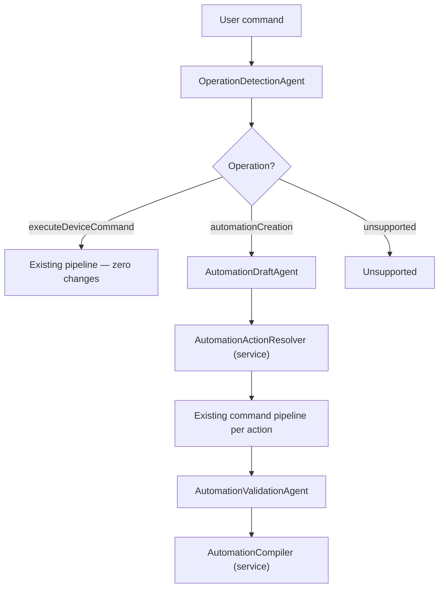

# Automation Operation Routing — Independent Analysis & Recommendation

## Executive Summary

The requirements document is **thorough and architecturally sound**, but the proposed 9-phase plan is **over-engineered for a first implementation** and carries real risks: agent proliferation, latency regression on the happy path, and a SmartThings compilation target that doesn't fully support the scheduling needs described. Below I critique the plan's key weaknesses and propose a leaner alternative.

---

## Part 1: Critique of the Existing Plan

### ✅ What the Plan Gets Right

| Strength | Why It Matters |
|---|---|
| **Pre-route in orchestrator (Option 1)** | Cleanest integration — avoids invasive scheduler changes |
| **Reuse `HomeCommandDraft` for actions** | Zero regression risk on existing pipeline |
| **Rule AST as internal IR** | Decouples from SmartThings; future-proof |
| **Deterministic fallback for simple templates** | Offline parity maintained |
| **Composite condition tree (not flat list)** | Correct semantics for `and`/`or`/`not` |

### ❌ Critical Weaknesses

#### 1. Agent Proliferation — 10 New Agents Is Too Many

The plan proposes **10 new agents** (AR-001 through AR-010). The current system has ~22 agents. Adding 10 more increases surface area by 45%.

**Problem:** Each agent means a new `AgentID`, `AgentCapability`, `ContextualHomeAgent` adapter, patch key handling in `ResolutionContextStore`, circuit breaker registration, and test surface. The marginal value of separating, e.g., `ConditionGraphExtractionAgent` from `ConditionOperandResolutionAgent` is low in v1.

> [!WARNING]
> The plan conflates "logical decomposition of concerns" with "agent boundaries." Not every concern needs to be an agent. Some should be **services** called by agents.

**My recommendation:** 4-5 agents max for v1 (see Part 2).

---

#### 2. SmartThings `every` API Cannot Express "Weekdays" or "Every Monday"

The requirements list (FR-006):
- `weekdays at 6:30 PM`
- `every Monday at 8 PM`

But the SmartThings Rules API `every.specific` only supports time-of-day relative to `Noon`/`Midnight`/`Sunrise`/`Sunset`. **Day-of-week filtering requires the Schedules API inside a SmartApp**, not the Rules API.

> [!CAUTION]
> The plan's SmartThings compilation target (Phase 7) promises capabilities the Rules API cannot deliver. Either scope v1 to daily/interval schedules only, or plan for a SmartApp Schedules backend too.

---

#### 3. The Decomposition Agent Is an FM Anti-Pattern

`AutomationDecompositionAgent` (AR-002) asks an FM to split text into spans:

```json
{
  "triggerText": "At 7 AM every day",
  "actionTexts": ["turn on AC", "turn off the bedroom lamp"],
  "conditionText": "if the window is closed"
}
```

Then `TriggerExtractionAgent` (AR-003) processes `triggerText`. Then `ConditionGraphExtractionAgent` (AR-004) processes `conditionText`. Then `AutomationActionResolutionAgent` (AR-006) processes each `actionText`.

**This is 4 serial FM calls where 1-2 would suffice.** The decomposition itself is trivial deterministic parsing for 80% of cases. Only the condition graph and action resolution genuinely benefit from FM reasoning.

**Latency impact:** At ~1-2s per FM call, 4 serial calls = 4-8s on the automation path, versus the current ~3-4s for direct commands.

---

#### 4. `ResolutionContext` Becomes a God Object

The plan adds 4 new fields to `ResolutionContext`:

```swift
public var operation: HomeOperationDetectionResult?
public var automationDraft: HomeAutomationRuleDraft?
public var automationPlan: HomeAutomationCreationPlan?
public var automationResolution: HomeAutomationResolution?
```

`ResolutionContext` already has 17 mutable fields. Adding 4 more (plus the AST sub-types they carry) turns it into a bag of optional state where most fields are irrelevant to any given operation path.

---

#### 5. Condition Operand Resolution Is a Reuse Pitfall

The plan says "reuse candidate retrieval and ranking logic for condition operands" (AR-005, FR-007). But the current pipeline is built for **command target** resolution — it resolves `HomeCommandDraft` with intent, capability, and command. A condition operand needs **read-only attribute** resolution (e.g., `temperatureMeasurement.temperature`), which is a different query shape.

Blindly reusing `CandidateRetrievalAgent` → `CandidateRankingAgent` → `CandidateHydrationAgent` for each condition operand means running 3+ agents per operand. A command with 2 conditions = 6 extra agent runs.

---

#### 6. Phase Ordering Creates a 9-Sprint Waterfall

Phases 1-9 form a strict dependency chain. No phase delivers user-visible value until Phase 6+ (assembly). This is waterfall disguised as phases.

---

## Part 2: My Recommended Architecture

### Design Principles

1. **Minimum viable agents** — Decomposition is a service, not an agent
2. **Two FM calls max** on the automation path (operation detection + rule drafting)
3. **Deterministic-first** — Handle 80% of automations without FM
4. **Separate context types** — Don't bloat `ResolutionContext`
5. **Ship value in 2 phases**, not 9

### Recommended Agent Topology



**Only 3 new agents:**

| Agent | Responsibility |
|---|---|
| **`OperationDetectionAgent`** | Classify operation. Deterministic-first with FM fallback. |
| **`AutomationDraftAgent`** | Single FM call that produces the full `HomeAutomationRuleDraft` — trigger, conditions, action descriptions. Replaces decomposition + trigger + condition agents. |
| **`AutomationValidationAgent`** | Safety, trigger frequency, ambiguity detection, confirmation. |

**Plus 2 services (not agents):**

| Service | Responsibility |
|---|---|
| **`AutomationActionResolver`** | Loops through action descriptions, invokes existing command pipeline per action. Pure orchestration code — no FM. |
| **`SmartThingsRuleCompiler`** | Deterministic AST-to-JSON compiler. Protocol-based for future backends. |

### Why `AutomationDraftAgent` Replaces 4 Agents

Modern FMs are excellent at structured extraction when given a clear schema. Instead of:

```
Decompose → Extract Trigger → Extract Conditions → Resolve Operands
```

One `@Generable` call with a well-designed output schema does all four:

```swift
@Generable
public struct AutomationDraftOutput: Sendable, Codable {
    @Guide(description: "Rule name inferred from user intent")
    public let name: String
    public let trigger: AutomationTriggerOutput
    public let conditions: [AutomationConditionOutput]?
    @Guide(description: "Each action as a natural language command to resolve independently")
    public let actionDescriptions: [String]
    public let confidence: Double
}
```

The FM sees the full sentence and produces structured output in one pass. No error accumulation across 4 serial calls. No span-alignment bugs.

### Separate Context: `AutomationResolutionContext`

Instead of adding fields to `ResolutionContext`, create a parallel context:

```swift
public struct AutomationResolutionContext: Sendable {
    public let request: CommandRequest
    public let operation: HomeOperationDetectionResult
    public var ruleDraft: HomeAutomationRuleDraft?
    public var resolvedActions: [HomeCommandDraft]
    public var validationResult: AutomationValidationResult?
    public var compiledRule: SmartThingsRuleJSON?
    public var resolution: AutomationResolution?
    public var trace: [AgentTraceEntry]
    public var errors: [AgentFailure]
}
```

This keeps `ResolutionContext` unchanged (zero regression risk) and gives automation a clean, purpose-built state container.

### Orchestrator Integration

Modify `HomeCommandOrchestrator.resolveStream` to run a two-phase approach:

```swift
// Phase 0: Operation Detection (deterministic-first)
let operationResult = detectOperation(trimmedText)

switch operationResult.operation {
case .executeDeviceCommand:
    // Existing pipeline — unchanged
    let plan = planner.plan(for: trimmedText, context: ...)
    let exit = await scheduler.execute(plan)
    // ... existing result assembly
    
case .automationCreation:
    // New automation pipeline
    let automationResult = await resolveAutomation(trimmedText, operationResult)
    // ... automation result assembly
    
case .unsupported:
    // ...
}
```

The `AgentPlanner` gains a new method:

```swift
public func automationPlan(for text: String) -> AgentExecutionPlan {
    AgentExecutionPlan(phases: [
        .sequential(AgentTask(.automationDraft)),
        .sequential(AgentTask(.automationActionResolution)),
        .sequential(AgentTask(.automationValidation)),
    ])
}
```

### Deterministic Operation Detection

Operation detection should be **deterministic-first**, with FM as fallback only for ambiguous cases:

```swift
public enum DeterministicOperationDetector {
    static let automationSignals = [
        "every day", "everyday", "daily", "weekly", "weekdays",
        "at \\d+\\s*(am|pm)", "when ", "whenever ", "if .* then",
        "create automation", "make a rule", "schedule",
        "automatically", "every \\d+ (minute|hour)",
        "after \\d+ (minute|hour)"
    ]
    
    static let immediateSignals = [
        "now", "right now", "immediately"
    ]
    
    static func detect(_ text: String) -> HomeOperationDetectionResult? {
        let normalized = text.lowercased()
        let hasAutomation = automationSignals.contains { 
            normalized.range(of: $0, options: .regularExpression) != nil 
        }
        let hasImmediate = immediateSignals.contains { normalized.contains($0) }
        
        if hasAutomation && !hasImmediate {
            return HomeOperationDetectionResult(
                operation: .automationCreation, confidence: 0.92, reason: "deterministic"
            )
        }
        if !hasAutomation {
            return HomeOperationDetectionResult(
                operation: .executeDeviceCommand, confidence: 0.95, reason: "deterministic"
            )
        }
        return nil // Ambiguous — needs FM
    }
}
```

This handles 90%+ of cases without an FM call, preserving NFR-001 (direct command latency).

### SmartThings Scope Reduction

For v1, limit SmartThings compilation to what the Rules API actually supports:

| Supported | Not Supported (Needs SmartApp) |
|---|---|
| Daily time via `every.specific` | Weekday filtering |
| Interval via `every.interval` | Day-of-week schedules |
| Device condition triggers | Location-based triggers |
| `if`/`then`/`else` actions | Complex cron expressions |
| `and`/`or`/`not` conditions | |
| `command` actions | |
| `sleep` actions | |

---

## Part 3: Recommended Implementation Phases

### Phase 1: Operation Routing + Simple Automation (delivers value)

**~3-4 days of work**

1. Add `HomeAutomationOperationType` enum and `HomeOperationDetectionResult` struct to `HomeAutomationCore`
2. Add `DeterministicOperationDetector` to `AgentTextParser` (or standalone)
3. Add `OperationDetectionAgent` with deterministic-first + FM fallback
4. Add `AgentID.operationDetection` and wire into registry
5. Add routing branch in `HomeCommandOrchestrator.resolveStream`
6. Add `HomeAutomationRuleDraft` AST types (rule draft, trigger, condition, action nodes, operands)
7. Add `AutomationDraftAgent` — single FM call producing the full draft
8. Add `AutomationActionResolver` service — loops actions through existing pipeline
9. Add `AutomationValidationAgent` — safety + confirmation
10. Add `SmartThingsRuleCompiler` — deterministic compiler for daily/interval + commands
11. Tests: operation detection (20+ cases), simple automation end-to-end, direct command regression

**Acceptance:** "Turn on AC everyday at 7 AM" produces SmartThings JSON. "Turn on TV" still works.

### Phase 2: Richness + RAG (extends capability)

**~3-4 days of work**

1. Multiple action support in `AutomationDraftAgent` output
2. Composite condition trees (`and`/`or`/`not`)
3. Condition operand resolution via lightweight device lookup (not full pipeline)
4. Ambiguity detection and clarification
5. High-risk automation blocking (FR-010)
6. Runaway automation detection (SR-003)
7. RAG: Add `automationPattern` knowledge source + example dataset
8. Deterministic fallback for simple templates (schedule + 1-2 commands)
9. Extended test suite (50+ cases)

---

## Part 4: Answers to Open Questions

| # | Question | Recommendation |
|---|---|---|
| 1 | Local draft or API call? | **Local draft only in v1.** Generate the JSON, display it, let the user confirm. API integration is a separate feature. |
| 2 | Update/delete in first release? | **No.** Reserve enum cases but don't implement. |
| 3 | API-style or user-facing names? | **API-style** (`automationCreation`). User-facing text belongs in display layers. |
| 4 | Timezone? | **Device-local timezone** from the SmartThings location. Default to UTC if unknown. |
| 5 | Ambiguous AC? | **Same as current pipeline** — candidate ranking + clarification. |
| 6 | Persist/display/send JSON? | **Display only in v1.** Add persistence + API sending later. |
| 7 | Scenes vs rules? | **Separate.** Scenes are stateless command groups. Rules have triggers/conditions. Different UX. |

---

## Part 5: Risk Assessment

| Risk | Likelihood | Mitigation |
|---|---|---|
| FM produces malformed AST | Medium | Strong `@Generable` schema + validation agent catches bad output |
| Direct command latency regression | Low | Deterministic operation detection runs first; FM skipped for 90%+ of direct commands |
| SmartThings API mismatch | High | Limit v1 to daily/interval; add SmartApp backend in v2 |
| Condition operand resolution accuracy | Medium | Lightweight device lookup; don't force full pipeline reuse |
| Agent count maintenance burden | Low (with recommendation) | 3 agents vs plan's 10 |

---

## Summary: Plan vs Recommendation

| Dimension | Existing Plan | My Recommendation |
|---|---|---|
| New agents | 10 | 3 |
| FM calls on automation path | 4-5 serial | 1-2 (detection is deterministic) |
| Phases to deliver value | 6+ | 1 |
| `ResolutionContext` changes | 4+ new fields | 0 (separate context) |
| SmartThings scope | Over-promised | Scoped to Rules API reality |
| Estimated implementation | 9 phases / 4-6 weeks | 2 phases / ~1.5 weeks |
| Regression risk | Medium (context changes) | Low (context untouched) |
