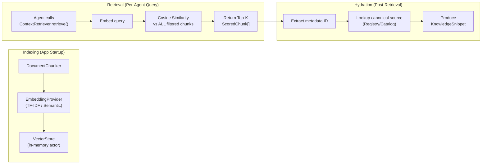
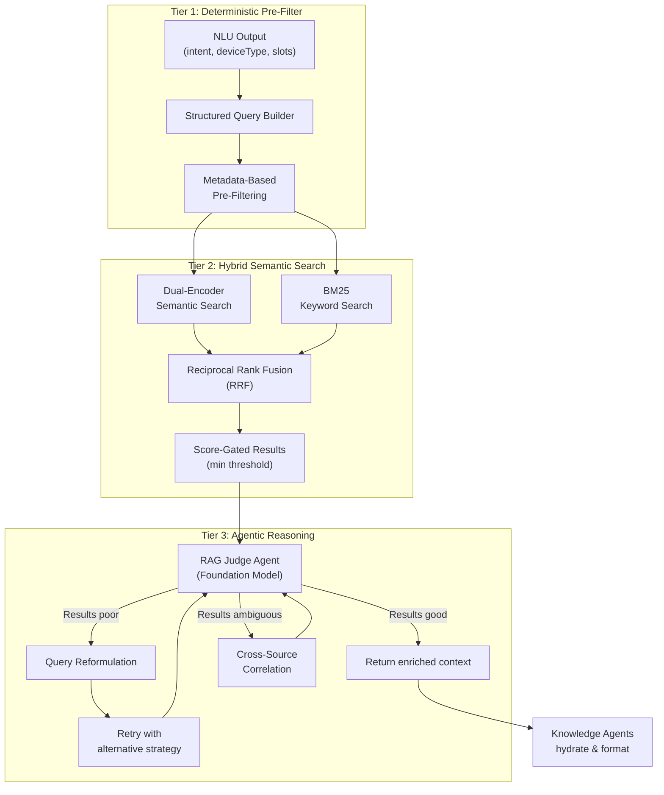

# Hybrid Agentic RAG Architecture — Implementation Plan

## Part 1: Deep Analysis & Architectural Vision

---

## 1. Current Architecture: Deep Forensic Analysis

### 1.1 The RAG Pipeline Today



**Current component inventory:**

| Component | File | Lines | Role |
|---|---|---|---|
| `ContextRetriever` | [ContextRetriever.swift](file:///Users/samin/Downloads/untitled%20folder/HomeAutomation/HomeAutomationCore/Sources/HomeAutomationRAG/ContextRetriever.swift) | 71 | Single-shot embed → query → return |
| `VectorStore` | [VectorStore.swift](file:///Users/samin/Downloads/untitled%20folder/HomeAutomation/HomeAutomationCore/Sources/HomeAutomationRAG/VectorStore.swift) | 58 | Actor-backed brute-force O(N) cosine scan |
| `DocumentChunker` | [DocumentChunker.swift](file:///Users/samin/Downloads/untitled%20folder/HomeAutomation/HomeAutomationCore/Sources/HomeAutomationRAG/DocumentChunker.swift) | 136 | Flattens canonical sources into chunks |
| `EmbeddingProvider` | [EmbeddingProvider.swift](file:///Users/samin/Downloads/untitled%20folder/HomeAutomation/HomeAutomationCore/Sources/HomeAutomationRAG/EmbeddingProvider.swift) | 288 | TF-IDF + Semantic + Fallback chain |
| `KnowledgeIndexer` | [KnowledgeIndexer.swift](file:///Users/samin/Downloads/untitled%20folder/HomeAutomation/HomeAutomationCore/Sources/HomeAutomationRAG/KnowledgeIndexer.swift) | 183 | Builds index with cache support |
| `VectorIndexCache` | [VectorIndexCache.swift](file:///Users/samin/Downloads/untitled%20folder/HomeAutomation/HomeAutomationCore/Sources/HomeAutomationRAG/VectorIndexCache.swift) | 179 | Disk persistence for cold-start optimization |
| `CapabilityKnowledgeAgent` | [CapabilityKnowledgeAgent.swift](file:///Users/samin/Downloads/untitled%20folder/HomeAutomation/HomeAutomationCore/Sources/HomeAutomationAgents/Knowledge/CapabilityKnowledgeAgent.swift) | 63 | RAG `.capability` → hydrate from registry |
| `BixbyKnowledgeAgent` | [BixbyKnowledgeAgent.swift](file:///Users/samin/Downloads/untitled%20folder/HomeAutomation/HomeAutomationCore/Sources/HomeAutomationAgents/Knowledge/BixbyKnowledgeAgent.swift) | 81 | RAG `.bixbyCommand` → hydrate from catalog |
| `CommandExampleAgent` | [CommandExampleAgent.swift](file:///Users/samin/Downloads/untitled%20folder/HomeAutomation/HomeAutomationCore/Sources/HomeAutomationAgents/Knowledge/CommandExampleAgent.swift) | 97 | RAG `.nlDataset` + static token-overlap scoring |
| `AgentRAGSupport` | [AgentRAGSupport.swift](file:///Users/samin/Downloads/untitled%20folder/HomeAutomation/HomeAutomationCore/Sources/HomeAutomationAgents/RAG/AgentRAGSupport.swift) | 46 | Few-shot enrichment helper for NLU agents |

### 1.2 How Knowledge Agents Interact with RAG Today

Each Knowledge Agent follows an identical pattern:

```swift
// Pattern used by ALL three Knowledge Agents:
if let contextRetriever {
    let chunks = await contextRetriever.retrieve(
        query: someQueryString,        // ← raw or lightly enriched text
        topK: 5,                        // ← hardcoded
        filter: MetadataFilter(source: .specificSource)  // ← source-level filter only
    )
    // ... hydrate from canonical source using metadata IDs
}
```

**Critical observation**: Every Knowledge Agent uses the **exact same retrieval mechanism** — a single-pass cosine similarity search with a source filter. The only variation is:
- Which `KnowledgeSource` filter is applied
- How the query string is composed
- How results are hydrated

### 1.3 How NLU Agents Use RAG

NLU agents (IntentFamily, DeviceType, SlotExtraction, etc.) use `AgentRAGSupport.nluInput()` to prepend few-shot examples:

```swift
// From AgentRAGSupport.nluInput():
let examples = await contextRetriever.retrieve(query: input, topK: 3, filter: .nlDataset)
return """
Relevant prior smart-home examples for \(task):
\(fewShot)

User command:
\(input)
"""
```

This is a **blind** few-shot injection — the system has no way to know if the retrieved examples are actually relevant or useful for the specific NLU task.

### 1.4 The Execution Plan (from AgentPlanner)

```
Phase 1 (Parallel):  Language, Domain, Intent, DeviceType, Slot, Risk  ← NLU
Phase 2 (Parallel):  CapabilityKnowledge, BixbyKnowledge, CommandExample, CandidateRetrieval  ← Knowledge + Candidates
Phase 3 (Sequential): CandidateRanking → Hydration → InstructionComposer → Draft → Safety → Execution
```

> [!IMPORTANT]
> **The fundamental problem**: Phase 2 (Knowledge retrieval) runs **in parallel with** and **independently of** Phase 1 (NLU understanding). Knowledge agents cannot use NLU output to refine their queries because they execute simultaneously. The retrieval is completely blind to what the system has already understood about the user's intent.

---

## 2. Identified Weaknesses (8 Critical Issues)

### W1: Metadata Dilution in Chunk Embeddings

The `DocumentChunker` creates chunks where the **actual semantic content** is buried inside boilerplate metadata labels:

```swift
// From DocumentChunker.nlDatasetChunks() — line 95-105:
let content = [
    "Natural language example \(example.text)",    // ← THE REAL CONTENT
    "Language \(example.language)",                  // ← noise
    "Device type \(example.deviceType)",             // ← noise for semantic matching
    "Room \(example.room)",                          // ← noise
    "Capability \(example.capability)",              // ← noise
    "Command \(example.command)",                    // ← noise
    "Intent \(example.intent)",                      // ← noise
    "Risk \(example.riskLevel)"                      // ← noise
].joined(separator: ". ")
```

When the user says *"Make it a bit brighter"*, the embedding of this query must compete against chunk embeddings dominated by labels like "Language en. Device type light. Capability switchLevel." The actual phrase *"Dim the lights"* occupies perhaps 15% of the chunk's embedding signal.

**Impact**: Cosine similarity is measuring boilerplate overlap, not semantic intent overlap.

### W2: Single-Shot Retrieval (No Iterative Refinement)

`ContextRetriever.retrieve()` makes **exactly one** query. If the top-K results are poor (low scores, wrong domain), there is no mechanism to:
- Re-query with reformulated terms
- Broaden or narrow the filter
- Try a different embedding strategy
- Ask the Foundation Model to judge relevance

```swift
// ContextRetriever.retrieve() — the ENTIRE retrieval logic:
public func retrieve(_ query: String, topK: Int = 5, filter: MetadataFilter? = nil) async -> [ScoredChunk] {
    let embedding = await embeddingProvider.embed(query)
    return await vectorStore.query(embedding, topK: topK, filter: filter)
}
```

**Impact**: For ambiguous commands, the system has one chance to find the right context. If it fails, every downstream agent works with degraded or irrelevant knowledge.

### W3: No Query Understanding / Decomposition

Complex natural language commands require decomposition before retrieval:

| User Says | Requires |
|---|---|
| *"Turn off everything except the bedroom lamp"* | Negation understanding, multi-device reasoning |
| *"Set the AC to the same temperature as yesterday"* | Temporal reference resolution, memory retrieval |
| *"Make the living room cozy"* | Abstract intent mapping (cozy → dim lights + warm temperature) |
| *"Do what you did last time"* | Full conversation memory retrieval |

The current system passes the **raw user text** directly as the embedding query. There is no step where the system interprets what the user actually means before searching.

### W4: No Cross-Source Reasoning

The three Knowledge Agents query independently with hard-coded source filters:
- `CapabilityKnowledgeAgent` → `filter: .capability`
- `BixbyKnowledgeAgent` → `filter: .bixbyCommand`
- `CommandExampleAgent` → `filter: .nlDataset`

There is no mechanism to reason: *"The user said 'dim the lights' → DeviceType is probably `light` → I should search capabilities filtered to light-related capabilities → The relevant Bixby command is `switchLevel.setLevel`"*.

**Impact**: Each source is queried in isolation. A capability match that would perfectly inform the Bixby search (or vice versa) is invisible across agents.

### W5: TF-IDF Fallback is Brittle for Natural Language

The `TFIDFEmbeddingProvider` has a hardcoded synonym dictionary of only **16 entries**:

```swift
private static let synonyms: [String: [String]] = [
    "lamp": ["light", "switch"],
    "bulb": ["light", "switch"],
    // ... only 16 entries total
]
```

When the user says *"I'm freezing, can you crank up the heat?"*:
- "freezing" has no synonym mapping → no signal
- "crank up" has no mapping → no signal  
- "heat" has no mapping → no signal
- Only "the" and common tokens provide any match

**Impact**: The deterministic fallback — the **only** option when semantic embeddings are unavailable — is nearly useless for expressive natural language.

### W6: Brute-Force O(N) Vector Search

`VectorStore.query()` calculates cosine similarity against **every** stored chunk:

```swift
entries
    .filter { /* metadata filter */ }
    .map { ScoredChunk(chunk: $0.chunk, score: cosineSimilarity(query, $0.embedding)) }
    .sorted { ... }
    .prefix(topK)
```

For the current dataset size this is acceptable, but it prevents scaling. More importantly, it means the system cannot support **multi-index strategies** like maintaining separate indices for different embedding types.

### W7: Hardcoded topK and No Confidence Gating

Every retrieval call uses a hardcoded `topK` (3 or 5) with **no score threshold**. The system returns K results even if all scores are near zero:

```swift
// No minimum score check anywhere in the pipeline:
.prefix(max(0, topK))  // Returns K results regardless of quality
```

**Impact**: Low-confidence garbage results are injected into prompts with the same authority as high-confidence matches. This actively degrades Foundation Model performance.

### W8: Knowledge Agents Run Before NLU Completes

Per the `AgentPlanner`, Phase 2 (Knowledge retrieval) runs **in parallel** with Phase 1 NLU but also starts simultaneously:

```swift
// Phase 1: NLU (parallel)
.parallel([.language, .domain, .intentFamily, .deviceType, .slotExtraction, .riskClassification])
// Phase 2: Knowledge + Candidates (parallel) — runs AFTER Phase 1
.parallel([.capabilityKnowledge, .bixbyKnowledge, .commandExample, .candidateRetrieval])
```

Phase 2 does execute after Phase 1, so NLU results ARE available. However, **none of the Knowledge Agents actually read the NLU output** from `ResolutionContext`. They all construct their queries from the raw input text alone. The NLU results are wasted during retrieval.

---

## 3. Architectural Vision: Hybrid Agentic RAG

### 3.1 Core Insight

> **The retrieval system should not be a passive pipe. It should be an intelligent agent that reasons about WHAT to retrieve, HOW to retrieve it, and WHETHER the results are good enough.**

This is the fundamental shift from **Passive RAG** to **Agentic RAG**.

### 3.2 Proposed Architecture (Three-Tier Hybrid)



### 3.3 Key Principles

1. **NLU-Informed Retrieval**: Use Phase 1 NLU outputs (device type, intent, slots, room) to construct precise structured queries — not just raw text embedding.

2. **Hybrid Search (Semantic + Keyword)**: Combine dense vector semantic search with BM25 sparse keyword search using Reciprocal Rank Fusion. This ensures both *"make it warmer"* (semantic) and *"thermostat setpoint"* (keyword) are found.

3. **Agentic Judging & Retry**: A lightweight Foundation Model pass evaluates whether retrieved results are relevant. If not, it reformulates the query and retries with different strategies.

4. **Score-Gated Injection**: Only inject results above a confidence threshold. Never pollute prompts with garbage-scored context.

5. **Cross-Source Correlation**: Let capability results inform device search, and device results inform capability search — a reasoning loop, not isolated silos.

---

*Continued in Part 2: Detailed Component Design & File-Level Changes...*
