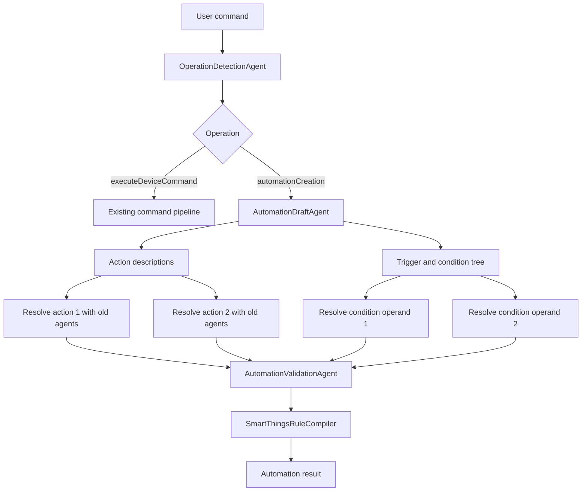
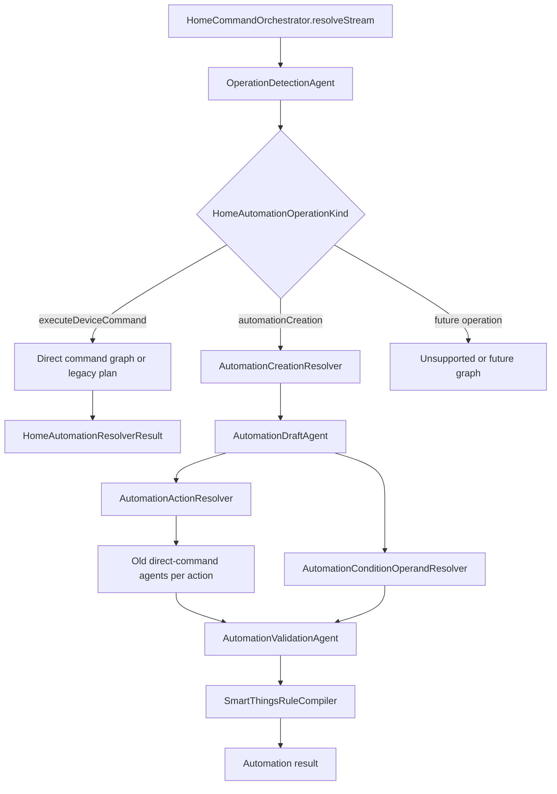

# Combined Implementation Plan: DAG Orchestrator + Automation Creation

## Goal

Deliver operation routing, DAG-ready orchestration, and automation creation in a phased way that keeps the existing direct-command pipeline stable while adding support for commands like:

```text
Turn on AC everyday at 7 AM
```

The target behavior is:

1. Detect the top-level operation as `automationCreation`.
2. Extract the automation trigger and conditions.
3. Split the user text into one or more action descriptions.
4. Reuse the existing direct-command agents to resolve each action.
5. Validate the full automation.
6. Compile supported cases to SmartThings Rules JSON.
7. Return an automation draft/result without executing the action immediately.

This file combines:

- `automation_phase_implementation_plan.md`
- the previous `implementation_plan7.md`

## Core Design Decisions

### 1. Operation Routing Comes First

The orchestrator should not assume every command is an immediate device command.

Add a top-level operation detection step:

```swift
public enum HomeAutomationOperationKind: String, Sendable, Hashable, Codable {
    case executeDeviceCommand
    case automationCreation
    case automationUpdate
    case automationDeletion
    case automationQuery
    case sceneCreation
    case routineExecution
    case unsupported
}
```

For v1, only two paths need real implementation:

- `executeDeviceCommand`
- `automationCreation`

Other cases can be detected and returned as unsupported or future work.

### 2. Old Agents Are Reused for Automation Actions

The existing agents should not parse the full automation command:

```text
Turn on AC everyday at 7 AM
```

They should parse only the extracted action text:

```text
Turn on AC
```

That lets the old pipeline detect:

- action intent family: `power`
- device type: `airConditioner`
- slots: none
- candidate device: actual AC device
- capability: `switch`
- command: `on`
- risk and confirmation policy

The new automation layer handles:

- operation detection
- schedule trigger extraction
- condition tree extraction
- multiple action splitting
- automation validation
- SmartThings compilation

### 3. Keep Automation Context Separate

Do not turn the current `ResolutionContext` into a large mixed-operation state bag.

Use:

- `ResolutionContext` for direct command resolution.
- `AutomationResolutionContext` for automation creation.

This is important because direct commands and automation creation have different lifecycle state.

### 4. Use Three New Agents for V1

Add only these agents in v1:

| Agent | Responsibility |
|---|---|
| `OperationDetectionAgent` | Classify `executeDeviceCommand` vs `automationCreation` and future operations. |
| `AutomationDraftAgent` | Extract rule name, trigger, condition tree, and action descriptions. |
| `AutomationValidationAgent` | Validate trigger/action/condition support, safety, ambiguity, and confirmation needs. |

Keep these as services, not agents:

| Service | Responsibility |
|---|---|
| `AutomationActionResolver` | Reuse the old direct-command pipeline for each action text. |
| `AutomationConditionOperandResolver` | Resolve condition operands to readable device attributes. |
| `SmartThingsRuleCompiler` | Deterministically compile the internal AST to SmartThings JSON. |
| `AutomationPatternParser` | Deterministic fallback parser for simple schedule patterns. |

### 5. DAG Runtime Helps, But Should Be Rolled Out Safely

Automation creation is naturally graph-shaped:



The DAG runtime is valuable because it supports:

- branching by operation
- fan-out for multiple actions
- fan-out for multiple conditions
- joining before validation
- reusable direct-command subgraphs
- graph-level metrics and debugging

However, v1 should not block automation creation on a perfect generic DAG engine. Roll out DAG in parallel with parity tests and keep a legacy fallback until graph runtime is proven.

### 6. SmartThings Scope Must Stay Conservative

SmartThings Rules are JSON action trees. Useful action types include:

- `every`
- `if`
- `command`
- `sleep`

Useful condition types include:

- `and`
- `or`
- `not`
- `equals`
- `greaterThan`
- `lessThan`
- `greaterThanOrEquals`
- `lessThanOrEquals`
- `between`
- `changes`

V1 should compile:

- daily time schedules using `every.specific`
- interval schedules when clearly supported
- command actions
- `if` with `then`/`else`
- composite `and`, `or`, `not`
- simple device comparison conditions
- optional `sleep`

Do not promise weekday-only schedules such as `every Monday` or `weekdays` until backend support is verified. Parse them internally, but return a clear unsupported compilation reason for SmartThings v1.

## Target Architecture



## Phase 0: Baseline and Scope Lock

**Estimated time:** 1 day  
**Value:** protect the existing system before changing orchestration.

### Tasks

1. Record current direct-command behavior with tests.
2. Add regression inputs that must remain direct commands:
   - `Turn on the TV`
   - `Set the bedroom lamp to 40 percent`
   - `Unlock the front door`
   - `Run movie time`
3. Add automation routing examples:
   - `Turn on AC everyday at 7 AM`
   - `Turn off the bedroom lamp at 11 PM every day`
   - `At 6 AM turn on the kitchen light and start the coffee maker`
   - `When motion is detected and it is after 7 PM, turn on the hallway light`
4. Define unsupported v1 examples:
   - `Turn on AC every Monday at 7 AM`
   - `Run this only on weekdays`
   - `Create an automation unless I am away, except on holidays`
5. Decide the v1 result surface.

### Recommended V1 Result Surface

Keep `HomeCommandResolving` returning `HomeAutomationResolverResult`, but add automation cases to `HomeCommandResolution`:

```swift
case automationDrafted(HomeAutomationCreationPlan)
case automationRequiresConfirmation(HomeAutomationCreationPlan)
```

Update all switches in:

- `HomeAutomationApp/HomeAutomationViewModel.swift`
- `HomeAutomationCore/Sources/HomeAutomationOrchestrator/HomeCommandOrchestrator.swift`
- `HomeAutomationCore/Sources/HomeAutomationOrchestrator/OrchestratorMetricsCollector.swift`

### Acceptance Criteria

- Existing direct-command tests pass before new feature work.
- Automation v1 scope is documented.
- Unsupported automation examples fail gracefully in test expectations.

## Phase 1: Operation Routing Foundation

**Estimated time:** 2 days  
**Value:** the orchestrator can decide which operation family the user is requesting.

### Files to Add

- `HomeAutomationCore/Sources/HomeAutomationCore/HomeAutomation/HomeAutomationOperationModels.swift`
- `HomeAutomationCore/Sources/HomeAutomationAgents/Operation/OperationDetectionAgent.swift`
- `HomeAutomationCore/Sources/HomeAutomationAgents/Operation/OperationDetectionService.swift`
- `HomeAutomationCore/Tests/HomeAutomationOrchestratorTests/OperationRoutingTests.swift`

### Files to Update

- `HomeAutomationCore/Sources/HomeAutomationCore/HomeAutomation/HomeAutomationModels.swift`
- `HomeAutomationCore/Sources/HomeAutomationAgents/Protocols/AgentCapability.swift`
- `HomeAutomationCore/Sources/HomeAutomationAgents/Protocols/HomeAgent.swift`
- `HomeAutomationCore/Sources/HomeAutomationOrchestrator/AgentRegistry.swift`
- `HomeAutomationCore/Sources/HomeAutomationOrchestrator/AgentPlanner.swift`
- `HomeAutomationCore/Sources/HomeAutomationOrchestrator/HomeCommandOrchestrator.swift`
- `HomeAutomationCore/Sources/HomeAutomationOrchestrator/ContextualAgentAdapters.swift`

### Core Models

```swift
@Generable
public struct HomeOperationDetectionResult: Sendable, Hashable, Codable {
    public let domain: HomeAutomationCommandDomain
    public let operation: HomeAutomationOperationKind
    public let confidence: Double
    public let reason: String
}
```

Add `createAutomation`:

```swift
public enum HomeAutomationIntentFamily {
    case createAutomation
    case power
    case temperature
    case brightness
    case media
    case applianceCycle
    case lockUnlock
    case openClose
    case routine
    case statusQuery
    case maintenanceQuery
    case unsupported
}
```

### Agent Metadata

Add operation awareness to agent structure:

```swift
public protocol AnyHomeAgent: Sendable {
    var id: AgentID { get }
    var capabilities: Set<AgentCapability> { get }
    var supportedOperations: Set<HomeAutomationOperationKind> { get }
    var timeoutNanoseconds: UInt64 { get }

    func run(context: ResolutionContext) async -> AgentRunResult
}
```

Default mappings:

| Agent category | `supportedOperations` |
|---|---|
| Existing direct-command agents | `[.executeDeviceCommand]` |
| `OperationDetectionAgent` | all operation kinds |
| `AutomationDraftAgent` | `[.automationCreation]` |
| `AutomationValidationAgent` | `[.automationCreation]` |

Add capabilities:

```swift
case operationDetection
case automationDrafting
case automationValidation
```

Add agent IDs:

```swift
static let operationDetection = AgentID("operationDetection")
static let automationDraft = AgentID("automationDraft")
static let automationValidation = AgentID("automationValidation")
```

### Detection Strategy

Use deterministic-first detection.

Automation creation indicators:

- `every day`, `everyday`, `daily`
- `at 7 AM`, `at 19:00`
- `when`, `whenever`, `if`, `after`, `before`
- `create automation`, `create rule`, `create routine`, `schedule`
- command contains action verbs plus scheduling/trigger phrases

Direct execution indicators:

- imperative device command with no schedule/trigger phrase
- `now`, `right now`
- plain control verbs: `turn on`, `turn off`, `set`, `increase`, `decrease`, `lock`, `unlock`, `open`, `close`, `run`

Use FM fallback only when deterministic signals conflict or confidence is low.

### Orchestrator Change

Insert operation detection before planning:

```swift
let operation = await operationDetector.detect(trimmedText)

switch operation.operation {
case .executeDeviceCommand:
    return await resolveDirectCommand(...)
case .automationCreation:
    return await resolveAutomationCreation(...)
default:
    return unsupported(...)
}
```

Move the current `resolveStream` direct-command body into a private helper before adding automation logic.

### Tests

- `Turn on TV` -> `.executeDeviceCommand`
- `Turn on AC everyday at 7 AM` -> `.automationCreation`
- `At 7 AM turn on AC` -> `.automationCreation`
- `When door opens turn on light` -> `.automationCreation`
- `Delete my morning rule` -> `.automationDeletion`, returned unsupported for now

### Acceptance Criteria

- Direct commands still run through the existing pipeline.
- Automation commands route away from direct execution.
- Model-unavailable mode can route simple automation creation through deterministic detection.
- No SmartThings JSON is required yet.

## Phase 2: Agent Manifests and DAG Graph Types

**Estimated time:** 2 days  
**Value:** agents can self-describe and graph plans can be validated without changing runtime behavior yet.

### Files to Add

- `HomeAutomationCore/Sources/HomeAutomationAgents/Protocols/AgentManifest.swift`
- `HomeAutomationCore/Sources/HomeAutomationOrchestrator/OrchestrationGraph.swift`
- `HomeAutomationCore/Sources/HomeAutomationOrchestrator/GraphValidator.swift`

### Files to Update

- `HomeAutomationCore/Sources/HomeAutomationAgents/Protocols/HomeAgent.swift`
- `HomeAutomationCore/Sources/HomeAutomationOrchestrator/AgentRegistry.swift`

### Agent Manifest

```swift
public struct AgentManifest: Sendable, Hashable {
    public let id: AgentID
    public let capabilities: Set<AgentCapability>
    public let supportedOperations: Set<HomeAutomationOperationKind>
    public let consumes: Set<String>
    public let produces: Set<String>
    public let safetyRole: AgentSafetyRole
    public let retryPolicy: AgentRetryPolicy
    public let priority: Int
}
```

```swift
public enum AgentSafetyRole: Sendable, Hashable {
    case none
    case requiredGate
    case executionGate
}
```

```swift
public struct AgentRetryPolicy: Sendable, Hashable {
    public let maxAttempts: Int
    public static let noRetry = AgentRetryPolicy(maxAttempts: 0)
    public static let singleRetry = AgentRetryPolicy(maxAttempts: 1)
}
```

Use `String` for `consumes` and `produces` initially. The existing typed patch application still enforces actual updates.

### Graph Types

```swift
public struct OrchestrationGraph: Sendable {
    public let id: String
    public let goal: OrchestrationGoal
    public let nodes: [GraphNode]
    public let edges: [GraphEdge]
}
```

```swift
public enum OrchestrationGoal: Sendable, Hashable {
    case executeDeviceCommand
    case automationCreation
    case unsupported
}
```

```swift
public struct GraphNode: Sendable, Hashable, Identifiable {
    public let id: String
    public let requirement: AgentRequirement
    public let executionPolicy: NodeExecutionPolicy
    public let guardCondition: GraphGuard?
}
```

```swift
public enum AgentRequirement: Sendable, Hashable {
    case byID(AgentID)
    case byCapability(AgentCapability)
}
```

```swift
public struct GraphEdge: Sendable, Hashable {
    public let from: String
    public let to: String
}
```

```swift
public enum NodeExecutionPolicy: Sendable, Hashable {
    case required
    case optional
    case safetyGate
}
```

```swift
public enum GraphGuard: Sendable, Hashable {
    case contextKeyPresent(String)
    case contextKeyAbsent(String)
    case operationType(HomeAutomationOperationKind)
}
```

### Graph Validation

`GraphValidator` should check:

- cycle detection
- missing node references
- duplicate node IDs
- unreachable nodes
- required nodes have a path from graph root
- safety gates are not optional

### Tests

- Manifest lookup by ID.
- Manifest lookup by capability and operation.
- Graph validation catches cycles.
- Graph validation catches missing references.
- Graph validation catches duplicates.
- Valid direct-command graph passes validation.

### Acceptance Criteria

- Registry can answer by ID, capability, and operation.
- Graphs can be built and validated without running them.
- No direct-command behavior changes yet.

## Phase 3: GraphScheduler Parity

**Estimated time:** 3 days  
**Value:** DAG runtime can run the existing direct-command pipeline identically.

### Files to Add

- `HomeAutomationCore/Sources/HomeAutomationOrchestrator/GraphScheduler.swift`
- `HomeAutomationCore/Sources/HomeAutomationOrchestrator/GraphPlanner.swift`
- `HomeAutomationCore/Sources/HomeAutomationOrchestrator/GraphRunMetrics.swift`

### Files to Update

- `HomeAutomationCore/Sources/HomeAutomationOrchestrator/HomeCommandOrchestrator.swift`
- `HomeAutomationCore/Sources/HomeAutomationOrchestrator/OrchestratorMetricsCollector.swift`

### GraphScheduler Responsibilities

1. Topological sort.
2. Find ready nodes whose dependencies are satisfied.
3. Run independent ready nodes concurrently using `TaskGroup`.
4. Resolve `AgentRequirement.byCapability` through `AgentRegistry`.
5. Check circuit breakers before execution.
6. Evaluate `GraphGuard`.
7. Apply patches on success.
8. Fail closed for safety gates.
9. Publish event bus updates.
10. Append traces with selected agent, start time, end time, and result.
11. Propagate terminal exits.

```swift
public struct GraphScheduler: Sendable {
    func execute(
        _ graph: OrchestrationGraph,
        registry: AgentRegistry,
        contextStore: ResolutionContextStore,
        eventBus: AgentEventBus,
        policy: OrchestratorPolicyEngine,
        circuitBreakers: CircuitBreakerRegistry,
        runID: UUID
    ) async -> AgentRunResult?
}
```

### Must Match Existing AgentScheduler Behavior

The graph scheduler must preserve:

- first terminal exit wins
- circuit breaker skip behavior
- mandatory gate fail-closed cascade
- event statuses: running, completed, failed, skipped
- trace timestamps
- error accumulation
- stop-after-resolution behavior
- no mock execution unless the direct-command path explicitly allows it

### GraphPlanner

Build the direct-command graph with the same dependency order as the current `AgentPlanner`.

Direct command graph:

```text
start
  -> language, domain, intentFamily, deviceType, slotExtraction, riskClassification
  -> capabilityKnowledge, bixbyKnowledge, commandExample, candidateRetrieval
  -> retrievalJudge
  -> candidateRanking
  -> candidateHydration
  -> instructionComposer
  -> draftGeneration
  -> safetyValidation
  -> parameterValidation
  -> confirmationPolicy
  -> executionPlanning
```

Fallback graph when models are unavailable:

```text
ruleFallback -> bixbyFallback -> unsupportedCommand
```

### Runtime Mode

Add:

```swift
public enum OrchestratorRuntimeMode: Sendable, Hashable {
    case legacy
    case graph
}
```

Default should remain `.legacy` until parity tests pass.

### Tests

Run the same cases in both runtime modes:

- `Turn on bedroom lamp`
- `Set bedroom lamp to 40 percent`
- `Make bedroom AC cooler by 2 degrees`
- high-risk lock requires confirmation
- memory reference resolves same device
- fallback-only result matches
- model-unavailable metrics populated
- circuit breaker open fails closed on mandatory gates

### Acceptance Criteria

- Graph runtime produces equivalent direct-command results.
- Legacy runtime remains available.
- Metrics capture graph ID, node statuses, skipped nodes, and selected agents.

## Phase 4: Automation Core Models and Separate Context

**Estimated time:** 2 days  
**Value:** automation creation has a stable internal representation before action resolution.

### Files to Add

- `HomeAutomationCore/Sources/HomeAutomationCore/HomeAutomation/HomeAutomationRuleModels.swift`
- `HomeAutomationCore/Sources/HomeAutomationCore/HomeAutomation/HomeAutomationCreationPlan.swift`
- `HomeAutomationCore/Sources/HomeAutomationOrchestrator/AutomationResolutionContext.swift`
- `HomeAutomationCore/Sources/HomeAutomationOrchestrator/AutomationResolutionContextStore.swift`

### Rule Draft

```swift
public struct HomeAutomationRuleDraft: Sendable, Hashable, Codable {
    public let name: String
    public let domain: HomeAutomationCommandDomain
    public let operation: HomeAutomationOperationKind
    public let intent: HomeAutomationIntentFamily
    public let trigger: HomeAutomationTrigger?
    public let condition: HomeAutomationCondition?
    public let actionDescriptions: [String]
    public let confidence: Double
}
```

### Trigger Models

```swift
public enum HomeAutomationTrigger: Sendable, Hashable, Codable {
    case schedule(HomeAutomationScheduleTrigger)
    case device(HomeAutomationDeviceTrigger)
}
```

```swift
public struct HomeAutomationScheduleTrigger: Sendable, Hashable, Codable {
    public let repeatRule: HomeAutomationRepeatRule
    public let timeOfDay: HomeAutomationTimeOfDay?
    public let timezoneIdentifier: String?
}
```

```swift
public enum HomeAutomationRepeatRule: Sendable, Hashable, Codable {
    case once
    case everyDay
    case interval(value: Int, unit: HomeAutomationTimeUnit)
    case daysOfWeek([HomeAutomationWeekday])
    case unsupported(rawValue: String)
}
```

### Condition Models

```swift
public indirect enum HomeAutomationCondition: Sendable, Hashable, Codable {
    case and([HomeAutomationCondition])
    case or([HomeAutomationCondition])
    case not(HomeAutomationCondition)
    case comparison(HomeAutomationComparisonCondition)
}
```

```swift
public struct HomeAutomationComparisonCondition: Sendable, Hashable, Codable {
    public let left: HomeAutomationConditionOperand
    public let operatorName: HomeAutomationComparisonOperator
    public let right: HomeAutomationConditionOperand
    public let triggerPolicy: HomeAutomationConditionTriggerPolicy
}
```

```swift
public enum HomeAutomationConditionOperand: Sendable, Hashable, Codable {
    case deviceAttribute(description: String, deviceID: String?, capability: String?, attribute: String?)
    case literalString(String)
    case literalNumber(Double, unit: String?)
    case locationMode(String)
    case unsupported(rawValue: String)
}
```

### Resolved Action

```swift
public struct HomeAutomationResolvedAction: Sendable, Hashable, Codable {
    public let originalText: String
    public let draft: HomeCommandDraft
    public let device: HomeCandidateRecord?
    public let confidence: Double
}
```

### Creation Plan

```swift
public struct HomeAutomationCreationPlan: Sendable, Hashable, Codable {
    public let name: String
    public let ruleDraft: HomeAutomationRuleDraft
    public let resolvedActions: [HomeAutomationResolvedAction]
    public let smartThingsRuleJSON: String?
    public let requiresConfirmation: Bool
    public let unsupportedCompilationReason: String?
}
```

### Automation Context

```swift
public struct AutomationResolutionContext: Sendable {
    public let request: CommandRequest
    public let operation: HomeOperationDetectionResult
    public var draft: HomeAutomationRuleDraft?
    public var resolvedActions: [HomeAutomationResolvedAction]
    public var validation: AutomationValidationResult?
    public var smartThingsRule: SmartThingsRuleDocument?
    public var resolution: AutomationCreationResolution?
    public var trace: [AgentTraceEntry]
    public var errors: [AgentFailure]
}
```

### Acceptance Criteria

- Core models compile.
- Unit tests can build nested `and/or/not` conditions.
- Unit tests can represent multiple actions.
- Existing `ResolutionContext` is not expanded with large automation-only fields.

## Phase 5: Automation Draft Agent and Deterministic Parser

**Estimated time:** 3 days  
**Value:** automation text becomes a structured rule draft.

### Files to Add

- `HomeAutomationCore/Sources/HomeAutomationAgents/Automation/AutomationDraftAgent.swift`
- `HomeAutomationCore/Sources/HomeAutomationAgents/Automation/AutomationDraftWorkerSession.swift`
- `HomeAutomationCore/Sources/HomeAutomationAgents/Automation/AutomationDraftTypes.swift`
- `HomeAutomationCore/Sources/HomeAutomationAgents/Automation/AutomationPatternParser.swift`
- `HomeAutomationCore/Tests/HomeAutomationAgentTests/AutomationDraftAgentTests.swift`

### Agent Responsibility

`AutomationDraftAgent` produces:

- rule name
- schedule trigger or device trigger
- condition tree
- action descriptions
- unsupported fragments
- confidence

It should not resolve devices or capabilities.

Example:

```text
Turn on AC everyday at 7 AM
```

Output:

```json
{
  "name": "Turn on AC at 7:00 AM",
  "trigger": {
    "type": "schedule",
    "repeat": "everyDay",
    "time": "07:00"
  },
  "condition": null,
  "actionDescriptions": ["Turn on AC"],
  "confidence": 0.93
}
```

### Structured Output

```swift
@Generable
public struct AutomationDraftOutput: Sendable, Codable {
    public let name: String
    public let trigger: AutomationTriggerOutput?
    public let condition: AutomationConditionOutput?
    public let actionDescriptions: [String]
    public let unsupportedFragments: [String]
    public let confidence: Double
}
```

Guidance:

- Extract actions as standalone command sentences.
- Preserve `and`, `or`, and `not` grouping.
- Do not invent devices.
- Interpret `everyday` and `every day` as `everyDay`.
- Preserve unsupported schedules such as weekdays or holidays as unsupported fragments.

### Deterministic Parser

`AutomationPatternParser` handles simple patterns without FM:

- `Turn on AC everyday at 7 AM`
- `Turn off lights at 11 PM every day`
- `At 6 AM turn on kitchen light`
- `Schedule AC to turn on daily at 7 AM`

It extracts:

- action text
- time
- repeat rule
- simple multiple-action separators

Complex conditions go to the FM-backed draft agent.

### Tests

- Single daily schedule.
- Multiple actions.
- Schedule plus `if` condition.
- `and` condition.
- `or` condition.
- unsupported weekday schedule is preserved but flagged.

### Acceptance Criteria

- `Turn on AC everyday at 7 AM` yields schedule trigger and `Turn on AC` action description.
- Multiple action descriptions are separated.
- Condition tree shape is preserved.
- Model-unavailable mode handles simple daily schedules.

## Phase 6: Automation Action Resolution Through Old Agents

**Estimated time:** 3 days  
**Value:** automation actions are resolved using the existing direct-command pipeline.

### Files to Add

- `HomeAutomationCore/Sources/HomeAutomationOrchestrator/AutomationActionResolver.swift`
- `HomeAutomationCore/Sources/HomeAutomationOrchestrator/AutomationCreationResolver.swift`
- `HomeAutomationCore/Tests/HomeAutomationOrchestratorTests/AutomationActionResolverTests.swift`

### What Gets Reused

| Existing agent | Reused for automation action? | Purpose |
|---|---:|---|
| `IntentFamilyAgent` | Yes | Detects `power`, `temperature`, `brightness`, etc. |
| `DeviceTypeAgent` | Yes | Detects target type like AC, lamp, TV. |
| `SlotExtractionAgent` | Yes | Extracts values, rooms, modes from action text. |
| `RiskClassificationAgent` | Yes | Flags risky actions. |
| `CandidateRetrievalAgent` | Yes | Finds candidate devices. |
| `CandidateRankingAgent` | Yes | Selects best matching candidate. |
| `CandidateHydrationAgent` | Yes | Loads full device records. |
| `InstructionComposerAgent` | Yes | Builds instruction package for draft generation. |
| `DraftGenerationAgent` | Yes | Produces `HomeCommandDraft`. |
| `SafetyValidationAgent` | Yes | Validates action safety. |
| `ParameterValidationAgent` | Yes | Validates capability command parameters. |
| `ConfirmationPolicyAgent` | Yes | Marks risky action confirmation. |
| `ExecutionPlanningAgent` | Yes | Produces command execution shape for validation only. |
| `MockExecutionAgent` | No | Must not run during automation creation. |

### Resolver Behavior

`AutomationActionResolver` receives:

```swift
["Turn on AC", "Turn off the bedroom lamp"]
```

For each action description:

1. Create a direct-command `CommandRequest` with `executeLowRiskCommands = false`.
2. Force operation as `.executeDeviceCommand`.
3. Run the old direct-command plan or direct-command graph.
4. Stop after `executionPlanning`.
5. Do not run `MockExecutionAgent`.
6. Convert the result to `HomeAutomationResolvedAction`.

### Subgraph Version

With DAG runtime, model the old agents as a reusable action subgraph:

```text
ResolveActionSubgraph(actionText)
  -> intentFamily, deviceType, slotExtraction, riskClassification
  -> candidateRetrieval
  -> candidateRanking
  -> candidateHydration
  -> instructionComposer
  -> draftGeneration
  -> safetyValidation
  -> parameterValidation
  -> confirmationPolicy
  -> executionPlanning
```

For v1, action descriptions can be resolved sequentially. Later, independent actions can fan out in parallel.

### Tests

- `Turn on AC` resolves to `switch.on`.
- `Turn off the bedroom lamp` resolves to `switch.off`.
- Ambiguous action returns clarification.
- High-risk action marks automation as requiring confirmation.
- Mock device state does not change during automation creation.

### Acceptance Criteria

- Existing direct-command logic is reused, not duplicated.
- Action type is detected by old agents from action-only text.
- Multiple action descriptions become ordered `HomeAutomationResolvedAction` values.
- Automation creation never executes the action immediately.

## Phase 7: Automation Validation and Condition Operand Resolution

**Estimated time:** 2 days  
**Value:** full automation semantics are checked before compilation.

### Files to Add

- `HomeAutomationCore/Sources/HomeAutomationAgents/Automation/AutomationValidationAgent.swift`
- `HomeAutomationCore/Sources/HomeAutomationAgents/Automation/AutomationValidationTypes.swift`
- `HomeAutomationCore/Sources/HomeAutomationCore/HomeAutomation/AutomationValidationPolicy.swift`
- `HomeAutomationCore/Sources/HomeAutomationOrchestrator/AutomationConditionOperandResolver.swift`
- `HomeAutomationCore/Tests/HomeAutomationAgentTests/AutomationValidationAgentTests.swift`

### Validation Rules

Validate:

1. At least one trigger or supported event condition exists.
2. At least one action exists.
3. Every action resolves to a valid command/capability.
4. No action needs clarification.
5. High-risk actions require confirmation.
6. Door locks, security devices, critical appliances, and unattended destructive operations require confirmation or blocking.
7. Schedule frequency is reasonable.
8. Unsupported repeat rules are preserved internally but not compiled to SmartThings JSON.
9. `and/or` grouping is explicit.
10. Device condition operands resolve to readable attributes, not writable commands.

### Condition Operand Resolver

Do not run the full command target pipeline for condition operands in v1.

Use a deterministic resolver:

- match device nickname and room from known devices
- match attribute-capability pairs from `HomeCapabilityRegistry`
- confirm the capability has the requested attribute
- if multiple devices match, ask for clarification

Example:

```text
if the bedroom window is closed
```

Expected resolution:

- device: bedroom window/contact sensor
- capability: `contactSensor`
- attribute: `contact`
- comparison: equals `closed`
- trigger policy: `Never` when used as a precondition under a schedule trigger

### Tests

- Valid daily schedule plus switch action.
- Multiple valid actions.
- Unsupported weekday schedule returns unsupported compilation reason.
- Lock action requires confirmation.
- Ambiguous device condition asks clarification.
- `and/or/not` condition tree remains intact.

### Acceptance Criteria

- Validation result separates valid, clarification, confirmation, and unsupported compilation states.
- Unsafe automations are not marked ready without confirmation.
- Device conditions use readable attributes.

## Phase 8: SmartThings Rule Compiler

**Estimated time:** 2 days  
**Value:** validated automations can be represented as SmartThings Rules JSON.

### Files to Add

- `HomeAutomationCore/Sources/HomeAutomationCore/HomeAutomation/SmartThingsRuleModels.swift`
- `HomeAutomationCore/Sources/HomeAutomationCore/HomeAutomation/SmartThingsRuleCompiler.swift`
- `HomeAutomationCore/Tests/HomeAutomationCoreTests/SmartThingsRuleCompilerTests.swift`

### Compiler Protocol

```swift
public protocol HomeAutomationRuleCompiling: Sendable {
    func compile(_ plan: HomeAutomationCreationPlan) throws -> SmartThingsRuleDocument
}
```

```swift
public struct SmartThingsRuleCompiler: HomeAutomationRuleCompiling {
    public func compile(_ plan: HomeAutomationCreationPlan) throws -> SmartThingsRuleDocument
}
```

### Daily Schedule Shape

For:

```text
Turn on AC everyday at 7 AM
```

Compile:

- top-level `every`
- `specific.reference = Midnight`
- offset `420` minutes
- nested command action

Example JSON shape:

```json
{
  "name": "Turn on AC at 7:00 AM",
  "actions": [
    {
      "every": {
        "specific": {
          "reference": "Midnight",
          "offset": {
            "value": { "integer": 420 },
            "unit": "Minute"
          }
        },
        "actions": [
          {
            "command": {
              "devices": ["ac-device-id"],
              "commands": [
                {
                  "component": "main",
                  "capability": "switch",
                  "command": "on",
                  "arguments": []
                }
              ]
            }
          }
        ]
      }
    }
  ]
}
```

### Schedule Plus Condition

For:

```text
Turn on AC everyday at 7 AM if the bedroom window is closed
```

Compile:

- top-level `every`
- nested `if`
- window condition as precondition
- command actions inside `then`

### Device Trigger

For:

```text
When motion is detected and it is after 7 PM, turn on the hallway light
```

Compile only if the Rules model can represent the full time precondition safely. Otherwise:

- preserve internal AST
- return unsupported SmartThings compilation reason
- do not crash

### Compiler Errors

```swift
public enum SmartThingsRuleCompileError: Error, Sendable, Hashable {
    case unsupportedSchedule(HomeAutomationRepeatRule)
    case unresolvedAction(String)
    case unresolvedConditionOperand(String)
    case unsupportedCondition(String)
    case unsafeRule(String)
}
```

### Tests

- Daily schedule compiles to snapshot JSON.
- Multiple command actions preserve order.
- `and/or/not` compiles recursively.
- Unsupported weekday schedule returns typed error.
- Unresolved condition operand returns typed error.

### Acceptance Criteria

- Compiler output is deterministic.
- Unsupported concepts return clear reasons.
- No invalid SmartThings JSON is produced knowingly.

## Phase 9: Automation Graph Integration, Result Assembly, and UI

**Estimated time:** 3 days  
**Value:** automation creation works end to end in the orchestrator and app.

### Files to Update

- `HomeAutomationCore/Sources/HomeAutomationOrchestrator/HomeCommandOrchestrator.swift`
- `HomeAutomationCore/Sources/HomeAutomationOrchestrator/GraphPlanner.swift`
- `HomeAutomationCore/Sources/HomeAutomationOrchestrator/GraphScheduler.swift`
- `HomeAutomationCore/Sources/HomeAutomationOrchestrator/OrchestratorPolicyEngine.swift`
- `HomeAutomationCore/Sources/HomeAutomationOrchestrator/OrchestratorMetricsCollector.swift`
- `HomeAutomationCore/Sources/HomeAutomationOrchestrator/ContextualAgentAdapters.swift`
- `HomeAutomationApp/HomeAutomationViewModel.swift`
- `HomeAutomationApp/HomeAutomationView.swift`

### Automation Graph

```text
operationDetection
  -> automationDraft
  -> actionResolution
  -> conditionOperandResolution
  -> automationValidation
  -> smartThingsCompilation
  -> automationResultAssembly
```

When the draft contains multiple action descriptions, `actionResolution` may internally run the direct-command subgraph once per action.

When the condition tree contains multiple operands, `conditionOperandResolution` should resolve each readable operand before validation.

### Result Assembly

Automation result should show:

- operation: `automationCreation`
- trigger
- condition tree
- resolved actions
- confirmation requirement
- SmartThings JSON if compiled
- unsupported compilation reason if not compiled

### Pipeline Events

Add operation-specific events:

- `operationDetection`
- `automationDraft`
- `automationActionResolution`
- `automationConditionOperandResolution`
- `automationValidation`
- `smartThingsCompilation`
- `automationResultAssembly`

### Metrics

Add:

- `operation`
- `runtimeMode`
- `graphID`
- `automationActionCount`
- `automationConditionCount`
- `automationCompilerTarget`
- `automationCompilationSupported`
- `automationRequiresConfirmation`
- `graphNodeStatuses`
- `selectedAgents`

### UI Formatting

Update result panel to show automation details separately from direct commands.

Do not show automation creation as:

```text
Ready to execute one low-risk step
```

Instead show:

```text
Automation drafted
Trigger: every day at 7:00 AM
Actions:
- AC -> switch.on
SmartThings: compiled
```

### Tests

- End-to-end: `Turn on AC everyday at 7 AM`.
- Multi-action: `Turn on AC and turn off lamp every day at 7 AM`.
- Schedule plus condition: `Turn on AC everyday at 7 AM if the bedroom window is closed`.
- High-risk: `Unlock front door every day at 7 AM` requires confirmation.
- Unsupported: `Turn on AC every Monday at 7 AM` returns unsupported compilation reason.
- Direct command regression remains green.

### Acceptance Criteria

- Automation creation produces a rule draft and optional SmartThings JSON.
- Direct commands still use direct-command result formatting.
- Pipeline timeline clearly shows the automation branch.
- Metrics identify operation and graph behavior.

## Phase 10: Automation RAG Optimization

**Estimated time:** 2 days  
**Value:** complex automation extraction improves without slowing down simple commands.

### Files to Update

- `HomeAutomationCore/Sources/HomeAutomationRAG/DocumentChunk.swift`
- `HomeAutomationCore/Sources/HomeAutomationRAG/DocumentChunker.swift`
- `HomeAutomationCore/Sources/HomeAutomationRAG/StructuredRetrievalQuery.swift`
- `HomeAutomationCore/Sources/HomeAutomationRAG/QueryReformulator.swift`
- `HomeAutomationCore/Sources/HomeAutomationRAG/HybridRetrievalStrategy.swift`
- `HomeAutomationCore/Sources/HomeAutomationAgents/RAG/AgentRAGSupport.swift`
- `HomeAutomationCore/Sources/HomeAutomationRAG/KnowledgeIndexer.swift`

### New Chunk Sources

```swift
case automationPattern
case automationRuleExample
case automationConditionOperator
case smartThingsRuleSchema
```

### New Knowledge

Add curated examples for:

- daily schedule patterns
- interval schedule patterns
- unsupported weekday patterns
- device trigger patterns
- device attribute condition patterns
- `and`, `or`, `not`
- `between`
- `changes`
- SmartThings `every.specific`
- SmartThings `if/then/else`
- SmartThings `command`
- trigger/precondition policy

### Retrieval Gating

Do not run automation RAG for every automation command.

Run automation RAG when:

- deterministic parser confidence is low
- `AutomationDraftAgent` flags unsupported or ambiguous fragments
- condition tree contains device attributes
- SmartThings compilation needs schema examples

Skip automation RAG when:

- the command is a simple daily schedule
- all actions are simple and resolved confidently
- no condition tree exists

### Structured Query Additions

```swift
public struct StructuredRetrievalQuery {
    public var operation: HomeAutomationOperationKind?
    public var automationConcepts: [String]
    public var conditionOperators: [String]
    public var repeatHints: [String]
}
```

Use:

- BM25 for exact schema/operator tokens.
- Vector search for natural-language examples.
- Metadata filters so direct-command examples do not pollute automation extraction.

### Tests

- Simple daily schedule does not call automation RAG.
- Complex condition retrieves automation-specific chunks.
- Retrieval reports include automation chunk sources.
- Direct-command RAG behavior is unchanged.

### Acceptance Criteria

- RAG helps hard automation examples.
- RAG is not a prerequisite for basic automation creation.
- Direct-command latency is not affected.

## Phase 11: Switch Default Runtime and Hardening

**Estimated time:** 2 days  
**Value:** graph runtime becomes the normal orchestrator path after parity confidence.

### Tasks

1. Make graph runtime default only after direct-command parity and automation E2E tests pass.
2. Keep legacy runtime behind `OrchestratorRuntimeMode.legacy`.
3. Add rollback configuration if graph behavior regresses.
4. Run all direct-command tests in both modes.
5. Run all automation tests in graph mode.
6. Update README and architecture docs.

### Default Change

```swift
public init(
    ...,
    runtimeMode: OrchestratorRuntimeMode = .graph
)
```

### Acceptance Criteria

- Graph runtime is default.
- Legacy runtime still works when explicitly selected.
- All direct-command tests pass in both modes.
- Automation tests pass in graph mode.
- Metrics show graph details.

## Final Test Matrix

### Direct Commands

| Input | Expected |
|---|---|
| `Turn on the TV` | `executeDeviceCommand`, existing behavior unchanged |
| `Set the bedroom lamp to 40 percent` | direct command with value parameter |
| `Make the bedroom AC cooler by 2 degrees` | direct command with delta parameter |
| `Unlock the front door` | confirmation required |
| `Run movie time` | routine behavior unchanged |

### Automation Creation

| Input | Expected |
|---|---|
| `Turn on AC everyday at 7 AM` | schedule trigger, one action, SmartThings JSON |
| `Turn off the bedroom lamp every day at 11 PM` | schedule trigger, one action |
| `Turn on AC and turn off lamp every day at 7 AM` | schedule trigger, two actions |
| `Turn on AC everyday at 7 AM if the bedroom window is closed` | schedule trigger plus condition |
| `When motion is detected, turn on hallway light` | device trigger plus action |
| `Unlock the front door every day at 7 AM` | requires confirmation or blocked |
| `Turn on AC every Monday at 7 AM` | internal draft preserved, SmartThings v1 unsupported |

### DAG Runtime

| Test | Expected |
|---|---|
| Direct-command graph parity | same result as legacy scheduler |
| Graph validation cycle | validation failure |
| Missing graph edge node | validation failure |
| Safety gate failure | fail closed |
| Multiple action fan-out | all actions join before validation |
| Circuit breaker open | skip or fail closed according to policy |

## File Impact Summary

### New Files

| File | Module |
|---|---|
| `HomeAutomationOperationModels.swift` | Core |
| `OperationDetectionAgent.swift` | Agents/Operation |
| `OperationDetectionService.swift` | Agents/Operation |
| `AgentManifest.swift` | Agents/Protocols |
| `OrchestrationGraph.swift` | Orchestrator |
| `GraphValidator.swift` | Orchestrator |
| `GraphScheduler.swift` | Orchestrator |
| `GraphPlanner.swift` | Orchestrator |
| `GraphRunMetrics.swift` | Orchestrator |
| `HomeAutomationRuleModels.swift` | Core |
| `HomeAutomationCreationPlan.swift` | Core |
| `AutomationResolutionContext.swift` | Orchestrator |
| `AutomationResolutionContextStore.swift` | Orchestrator |
| `AutomationDraftAgent.swift` | Agents/Automation |
| `AutomationDraftWorkerSession.swift` | Agents/Automation |
| `AutomationDraftTypes.swift` | Agents/Automation |
| `AutomationPatternParser.swift` | Agents/Automation |
| `AutomationActionResolver.swift` | Orchestrator |
| `AutomationCreationResolver.swift` | Orchestrator |
| `AutomationValidationAgent.swift` | Agents/Automation |
| `AutomationValidationTypes.swift` | Agents/Automation |
| `AutomationValidationPolicy.swift` | Core |
| `AutomationConditionOperandResolver.swift` | Orchestrator |
| `SmartThingsRuleModels.swift` | Core |
| `SmartThingsRuleCompiler.swift` | Core |

### Modified Files

| File | Change |
|---|---|
| `HomeAutomationModels.swift` | Add `createAutomation`, operation/result support |
| `AgentCapability.swift` | Add operation and automation capabilities/IDs |
| `HomeAgent.swift` | Add manifest and supported operations |
| `AgentRegistry.swift` | Lookup by ID, capability, operation |
| `AgentPlanner.swift` | Operation-aware and graph-aware planning |
| `AgentScheduler.swift` | Keep legacy path stable |
| `HomeCommandOrchestrator.swift` | Pre-route operation, select runtime, assemble automation result |
| `ContextualAgentAdapters.swift` | Register operation/automation agents, ideally split factory sections |
| `OrchestratorPolicyEngine.swift` | Automation safety gates and graph fail-closed behavior |
| `OrchestratorMetricsCollector.swift` | Operation, graph, automation metrics |
| `HomeAutomationViewModel.swift` | Format automation results |
| `HomeAutomationView.swift` | Display operation/automation details |
| `DocumentChunk.swift` | Add automation knowledge sources |
| `DocumentChunker.swift` | Chunk automation examples |
| `StructuredRetrievalQuery.swift` | Operation-aware query fields |
| `KnowledgeIndexer.swift` | Index automation chunks and cache version |

## Recommended Implementation Order

1. Phase 0: Baseline and scope lock.
2. Phase 1: Operation routing foundation.
3. Phase 2: Agent manifests and graph model.
4. Phase 3: GraphScheduler parity for direct commands.
5. Phase 4: Automation AST and separate context.
6. Phase 5: Automation draft extraction.
7. Phase 6: Old-agent action resolution.
8. Phase 7: Automation validation and condition operands.
9. Phase 8: SmartThings compiler.
10. Phase 9: Automation graph integration, UI, metrics.
11. Phase 10: RAG optimization.
12. Phase 11: Switch graph runtime default and harden.

## Minimum Viable V1

The smallest useful implementation is:

1. Operation detection.
2. Daily schedule draft extraction.
3. One or more action descriptions.
4. Reuse direct-command action resolution.
5. Ensure no mock execution happens during automation creation.
6. Validate safety and confirmation.
7. Compile simple daily schedule to SmartThings JSON.
8. Return automation result in the app.

Supported minimum examples:

```text
Turn on AC everyday at 7 AM
Turn off the bedroom lamp every day at 11 PM
Turn on the kitchen light and start the coffee maker every day at 6 AM
```

Gracefully unsupported minimum examples:

```text
Turn on AC every Monday at 7 AM
Turn on AC when I leave work
Turn on the heater unless the window is open except on holidays
```

## Key Risks and Mitigations

### Direct Command Regression

Mitigation:

- Keep the existing pipeline stable.
- Add operation routing before direct-command planning.
- Run direct-command tests in legacy and graph modes.

### DAG Runtime Complexity

Mitigation:

- Build graph model and validator first.
- Prove direct-command parity before making graph default.
- Keep legacy runtime available.

### Too Many Agents

Mitigation:

- Add only three agents for v1.
- Keep action resolution, compiler, pattern parser, and condition operand resolver as services.

### Context Bloat

Mitigation:

- Use `ResolutionContext` for direct commands.
- Use `AutomationResolutionContext` for automation creation.

### SmartThings Scope Mismatch

Mitigation:

- Compile only verified v1 Rules shapes.
- Preserve unsupported concepts internally.
- Return a clear unsupported compilation reason instead of producing invalid JSON.

### Latency Regression

Mitigation:

- Deterministic operation detection first.
- Deterministic schedule parser for simple commands.
- One automation draft FM call for complex extraction.
- RAG only for uncertain or complex cases.
- Later parallelize action subgraphs with DAG fan-out.

## Final Architecture Summary

The merged architecture is:

- Operation detection is the first orchestrator decision.
- Direct commands continue using the existing agents.
- Automation creation uses a separate automation context.
- Automation draft extraction creates action descriptions, trigger, and condition tree.
- Old direct-command agents resolve each action description.
- Condition operands are resolved by a read-attribute-focused service.
- Validation checks safety, ambiguity, unsupported schedules, and confirmation.
- SmartThings JSON is produced by a deterministic compiler.
- DAG runtime provides future-compatible branching, fan-out, joins, and metrics.
- RAG is operation-aware and selectively used after the core v1 flow is stable.

This gives the project a practical automation creation path while making the orchestrator strong enough for future operations such as automation update, automation deletion, automation query, scene creation, and routine execution.
