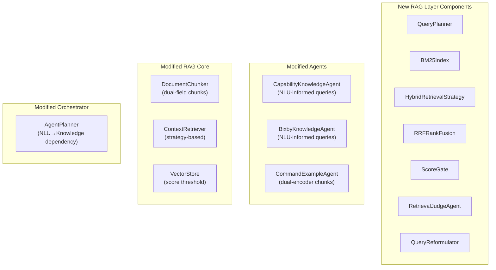

# Hybrid Agentic RAG — Part 2: Component Design

## 4. New Components to Build

### 4.1 Component Overview



---

### 4.2 Tier 1: NLU-Informed Structured Query Builder

#### [NEW] `StructuredRetrievalQuery.swift` (in HomeAutomationRAG)

```swift
/// A retrieval query enriched with NLU signals for precision filtering.
public struct StructuredRetrievalQuery: Sendable {
    public let rawText: String
    public let semanticText: String          // reformulated for embedding
    public let keywordTerms: [String]        // extracted entities for BM25
    public let metadataFilter: MetadataFilter
    public let nluHints: NLURetrievalHints?
    public let strategy: RetrievalStrategy
    public let minScore: Float
    public let topK: Int
}

public struct NLURetrievalHints: Sendable {
    public let deviceTypes: [String]      // from DeviceTypeAgent
    public let intentFamilies: [String]   // from IntentFamilyAgent  
    public let rooms: [String]            // from SlotExtractionAgent
    public let capabilities: [String]     // inferred from intent→capability mapping
}

public enum RetrievalStrategy: Sendable {
    case semanticOnly          // current behavior
    case keywordOnly           // BM25 for exact matches
    case hybrid(alpha: Float)  // weighted fusion, alpha=semantic weight
    case agentic              // FM-judged multi-step
}
```

**Why**: Instead of passing raw text to `ContextRetriever`, agents build a structured query that carries NLU context. The retriever uses this to apply metadata pre-filters (e.g., `deviceType: "light"`) BEFORE vector search, cutting the search space dramatically.

#### [NEW] `IntentCapabilityMap.swift` (in HomeAutomationCore)

```swift
/// Maps intent families to likely capability IDs for retrieval narrowing.
public enum IntentCapabilityMap {
    public static func capabilities(for intent: HomeIntentFamily) -> [String] {
        switch intent {
        case .power:       return ["switch", "switchBinary"]
        case .brightness:  return ["switchLevel", "colorControl", "colorTemperature"]
        case .temperature: return ["thermostatCoolingSetpoint", "thermostatHeatingSetpoint", "thermostatMode"]
        case .lockUnlock:  return ["lock"]
        case .openClose:   return ["doorControl", "windowShade", "valve"]
        case .media:       return ["mediaPlayback", "audioVolume", "tvChannel"]
        case .statusQuery: return []  // all capabilities relevant
        default:           return []
        }
    }
}
```

**Why**: When IntentFamilyAgent says the intent is `.temperature`, the CapabilityKnowledgeAgent can pre-filter to only thermostat-related capabilities instead of searching the entire capability catalog.

---

### 4.3 Tier 2: Hybrid Search (Semantic + BM25)

#### [NEW] `BM25Index.swift` (in HomeAutomationRAG)

```swift
/// Sparse keyword index using BM25 scoring for exact term matching.
public actor BM25Index {
    private var invertedIndex: [String: [(chunkIndex: Int, termFrequency: Int)]] = [:]
    private var documentLengths: [Int] = []
    private var averageDocLength: Double = 0
    private var chunks: [DocumentChunk] = []
    
    // BM25 parameters
    private let k1: Double = 1.2
    private let b: Double = 0.75
    
    public func index(_ chunks: [DocumentChunk]) { /* build inverted index */ }
    
    public func search(
        terms: [String], 
        topK: Int, 
        filter: MetadataFilter?
    ) -> [ScoredChunk] { /* BM25 scoring */ }
}
```

**Why BM25 is critical for this system**: When a user says *"switch setLevel"* or *"thermostat"*, these are **exact keyword matches** against capability IDs and commands. Semantic embeddings might rank a semantically-similar-but-wrong capability higher. BM25 finds exact matches reliably.

#### [NEW] `HybridRetrievalStrategy.swift` (in HomeAutomationRAG)

```swift
/// Combines semantic vector search with BM25 keyword search using RRF.
public struct HybridRetrievalStrategy: Sendable {
    private let vectorStore: VectorStore
    private let bm25Index: BM25Index
    private let embeddingProvider: any EmbeddingProviding
    
    /// Reciprocal Rank Fusion constant (standard: 60)
    private let rrfK: Double = 60.0
    
    public func retrieve(_ query: StructuredRetrievalQuery) async -> [ScoredChunk] {
        async let semanticResults = semanticSearch(query)
        async let keywordResults = keywordSearch(query)
        
        let semantic = await semanticResults
        let keyword = await keywordResults
        
        return reciprocalRankFusion(
            semantic: semantic, 
            keyword: keyword,
            alpha: query.strategy.alpha
        )
    }
    
    /// RRF: score = α * 1/(k+rank_semantic) + (1-α) * 1/(k+rank_keyword)
    private func reciprocalRankFusion(
        semantic: [ScoredChunk],
        keyword: [ScoredChunk],
        alpha: Float
    ) -> [ScoredChunk] { /* merge and re-rank */ }
}
```

**Why RRF over simple score averaging**: Semantic and BM25 scores are on completely different scales. RRF normalizes by rank position, making fusion score-agnostic. This is the industry standard used by Elasticsearch, Pinecone, and Weaviate.

---

### 4.4 Tier 2.5: Score Gating

#### [MODIFY] `VectorStore.swift` — Add score threshold

```diff
 public func query(_ queryEmbedding: [Float], topK: Int = 5, 
-                   filter: MetadataFilter? = nil) -> [ScoredChunk] {
+                   filter: MetadataFilter? = nil,
+                   minScore: Float = 0.0) -> [ScoredChunk] {
     entries
         .filter { filter.map { $0.matches($0.chunk) } ?? true }
         .map { ScoredChunk(chunk: $0.chunk, score: cosineSimilarity(queryEmbedding, $0.embedding)) }
+        .filter { $0.score >= minScore }
         .sorted { ... }
         .prefix(max(0, topK))
```

**Why**: Prevents garbage results from polluting prompts. A `minScore` of 0.15-0.25 for TF-IDF or 0.3-0.5 for semantic eliminates irrelevant noise.

---

### 4.5 Tier 3: Agentic RAG Judge

#### [NEW] `RetrievalJudgeAgent.swift` (in HomeAutomationAgents/Knowledge)

```swift
/// Foundation Model agent that evaluates retrieval quality and triggers retry.
public struct RetrievalJudgeAgent: HomeAgent {
    public typealias Input = RetrievalJudgeInput
    public typealias Output = RetrievalJudgeOutput

    public let id = AgentID.retrievalJudge
    public let capabilities: Set<AgentCapability> = [.knowledgeRetrieval]
    public let timeoutNanoseconds: UInt64 = 5_000_000_000
    
    public func run(_ input: RetrievalJudgeInput, context: ResolutionContext) async throws -> RetrievalJudgeOutput {
        // 1. Check if retrieval scores meet quality threshold
        let avgScore = input.results.map(\.score).reduce(0, +) / Float(max(input.results.count, 1))
        
        // 2. Fast path: high-quality results, no FM needed
        if avgScore > 0.6 && input.results.count >= 3 {
            return .accept(input.results)
        }
        
        // 3. Slow path: ask FM to judge relevance and suggest reformulation
        let judgment = try await evaluateWithFM(query: input.originalQuery, results: input.results)
        
        switch judgment {
        case .relevant:
            return .accept(input.results)
        case .reformulate(let newQuery):
            return .retry(reformulatedQuery: newQuery)
        case .expandSources(let sources):
            return .retryWithSources(sources)
        }
    }
}

public enum RetrievalJudgeOutput: Sendable {
    case accept([ScoredChunk])
    case retry(reformulatedQuery: String)
    case retryWithSources([KnowledgeSource])
}
```

**Why this is the "Agentic" in Agentic RAG**: The FM doesn't just retrieve — it **reasons** about retrieval quality. For a command like *"I'm freezing"*, if the initial retrieval returns low scores, the judge recognizes the intent and reformulates to *"increase temperature thermostat heating"* for retry.

> [!IMPORTANT]
> The judge has a **fast path**: if scores are high (>0.6) and results are plentiful (≥3), it skips the FM call entirely. The FM is only invoked for ambiguous/poor retrievals, keeping latency low for the common case.

---

### 4.6 Dual-Encoder Chunking (Fixes Metadata Dilution — W1)

#### [MODIFY] `DocumentChunk.swift` — Add semantic content field

```diff
 public struct DocumentChunk: Identifiable, Sendable, Hashable, Codable {
     public let id: String
     public let content: String           // full content (for display/hydration)
+    public let semanticContent: String   // clean text for embedding (no boilerplate)
     public let source: KnowledgeSource
     public let metadata: [String: String]
```

#### [MODIFY] `DocumentChunker.swift` — Separate semantic vs. full content

```diff
 // nlDatasetChunks() — BEFORE:
-let content = ["Natural language example \(example.text)", "Language \(example.language)", ...]
 
 // AFTER:
+let semanticContent = example.text  // ONLY the natural language phrase
+let content = ["Natural language example \(example.text)", "Language \(example.language)", ...]
```

#### [MODIFY] `KnowledgeIndexer.swift` — Embed semantic field

```diff
-let embeddings = await embeddingProvider.embedBatch(chunks.map(\.content))
+let embeddings = await embeddingProvider.embedBatch(chunks.map(\.semanticContent))
```

**Why**: The embedding now captures ONLY *"Dim the lights"* instead of *"Natural language example Dim the lights. Language en. Device type light..."*. Cosine similarity now measures pure semantic intent. The full `content` is preserved for display and hydration — zero information loss.

---

## 5. Modified Execution Plan (AgentPlanner)

### Current Plan

```
Phase 1: [NLU agents in parallel]
Phase 2: [Knowledge agents + CandidateRetrieval in parallel]
Phase 3: [Sequential pipeline]
```

### New Plan

```
Phase 1: [NLU agents in parallel]                         ← unchanged
Phase 2: [Knowledge agents use NLU output for queries]     ← NLU-INFORMED
Phase 2b: [RetrievalJudge evaluates quality]               ← NEW (conditional)
Phase 3: [Sequential pipeline]                             ← unchanged
```

```swift
// New AgentPlanner.plan() — key change:
// Phase 2 now constructs StructuredRetrievalQuery using NLU results from context
.parallel([
    AgentTask(.capabilityKnowledge),   // reads context.intent → pre-filters capabilities
    AgentTask(.bixbyKnowledge),        // reads context.deviceType → narrows Bixby search  
    AgentTask(.commandExample),        // reads context.slots → targeted example retrieval
    AgentTask(.candidateRetrieval)     // already reads NLU output
]),
// Phase 2b: Conditional — only if retrieval scores are low
.sequential(AgentTask(.retrievalJudge))
```

---

## 6. Modified Knowledge Agents (NLU-Informed)

### CapabilityKnowledgeAgent — Before vs. After

```swift
// BEFORE (current): blind query
let query = input.isEmpty ? context.request.text : input.joined(separator: " ")
let chunks = await contextRetriever.retrieve(query: query, topK: 5, filter: MetadataFilter(source: .capability))

// AFTER: NLU-informed structured query
let intentFamilies = context.resolutionState?.intent.topFamilies ?? []
let likelyCapabilities = intentFamilies.flatMap { IntentCapabilityMap.capabilities(for: $0) }
let deviceTypes = context.resolutionState?.deviceType.deviceTypes ?? []

let query = StructuredRetrievalQuery(
    rawText: context.request.text,
    semanticText: context.request.text,
    keywordTerms: likelyCapabilities + deviceTypes,  // BM25 boost
    metadataFilter: MetadataFilter(
        source: .capability,
        requiredTags: deviceTypes.isEmpty ? [:] : ["relatedDeviceTypes": deviceTypes.first!]
    ),
    nluHints: NLURetrievalHints(deviceTypes: deviceTypes, intentFamilies: intentFamilies.map(String.init(describing:)), rooms: [], capabilities: likelyCapabilities),
    strategy: .hybrid(alpha: 0.6),
    minScore: 0.2,
    topK: 5
)
```

### CommandExampleAgent — Before vs. After

```swift
// BEFORE: raw text query against all NL examples
let chunks = await contextRetriever.retrieve(query: input.text, topK: input.limit, filter: MetadataFilter(source: .nlDataset))

// AFTER: device-type pre-filtered + semantic-only embedding
let deviceTypes = context.resolutionState?.deviceType.deviceTypes ?? []
let filter = MetadataFilter(
    source: .nlDataset,
    requiredTags: deviceTypes.isEmpty ? [:] : ["deviceType": deviceTypes.first!]
)
let query = StructuredRetrievalQuery(
    rawText: input.text,
    semanticText: input.text,     // matches against semanticContent field
    keywordTerms: [],
    metadataFilter: filter,       // pre-filter to device type
    strategy: .semanticOnly,      // pure semantic for NL matching
    minScore: 0.15,
    topK: input.limit
)
```

---

## 7. TF-IDF Synonym Expansion (Quick Win — Fixes W5)

```swift
// BEFORE: 16 hardcoded synonym entries

// AFTER: Auto-generated from knowledge base at index time
public func buildSynonymsFromKnowledgeBase() -> [String: [String]] {
    var synonyms: [String: [String]] = Self.baseSynonyms  // keep existing 16
    
    // Add device type aliases
    for deviceType in HomeAutomationKnowledgeBase.shared.deviceTypes {
        for alias in deviceType.aliases {
            let normalized = alias.lowercased()
            synonyms[normalized, default: []].append(deviceType.id)
        }
    }
    
    // Add capability command synonyms
    for (id, def) in HomeCapabilityRegistry.definitions {
        for command in def.commands {
            synonyms[command, default: []].append(id)
        }
    }
    
    return synonyms
}
```

**Impact**: Synonym dictionary grows from 16 entries to potentially hundreds, all derived from canonical sources. "Crank up the heat" → "heat" maps to "temperature, thermostat" automatically.

---

*Continued in Part 3: Phased Implementation Roadmap & Verification Plan...*
