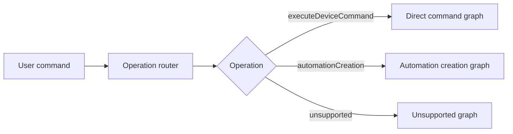

# Orchestrator Extensibility Architecture Plan

## Summary

The orchestrator has already moved from a single fixed phase pipeline toward a graph-capable runtime. Direct commands now default to the graph scheduler, while the legacy phase scheduler remains available as a rollback path.

The next architectural challenge is narrower: keep automation creation graph-native and harden the pieces that are still implemented as scoped subflows or compatibility layers.

Current state in one sentence:

```text
Direct command orchestration is graph-default; automation creation is graph-native in graph runtime mode with a legacy service fallback for rollback and parity.
```

The intended direction is to keep the graph scheduler as the shared runtime and support two runtime paths only:

- immediate device command execution
- automation creation

Automation update, deletion, query, scene creation, and routine execution are intentionally out of scope for this plan.

## Current Implementation Snapshot

- `OperationDetectionAgent` is registered and runs as the entry node of the automation creation graph.
- `OperationGraphCatalog` provides direct command, automation creation, and unsupported graph plans behind the `GraphPlanner` facade.
- `ResolutionContext` and `ResolutionContextStore` support scoped root, action, condition, and backend values.
- Automation creation graph nodes are registered for draft extraction, action resolution, condition operand resolution, validation, SmartThings compilation, SmartThings rule creation, and result assembly.
- `GraphScheduler` executes the automation creation graph in graph runtime mode; `AutomationCreationResolver` remains the legacy fallback path.
- Multiple automation actions resolve concurrently inside `AutomationActionResolver` and write action-scoped outputs in stable order.
- SmartThings Rule creation is implemented as a create-only backend behind dry-run, validation, location, and confirmation gates.
- Automation RAG is source- and subproblem-scoped, with a small evaluation corpus and per-source retrieval metrics.

Remaining hardening areas:

- Top-level operation routing still happens before graph scheduling; the graph operation node records context but does not choose the graph by itself.
- Dynamic action/condition fan-out is implemented inside agents, not by expanding the graph into one node per child.
- Condition operand resolution is deterministic and should later reuse candidate retrieval/ranking with clarification.
- Scheduler terminal decisions still use `HomeCommandResolution` rather than an operation-neutral internal outcome.
- Unsupported non-creation operations return at the orchestrator boundary instead of running the unsupported graph.

## Current Implementation Baseline

### Runtime Selection

`OrchestratorRuntimeMode` currently supports:

```swift
public enum OrchestratorRuntimeMode: String, Sendable, Hashable, Codable {
    case legacy
    case graph
}
```

The default runtime is graph:

```swift
public struct OrchestratorRuntimeConfiguration {
    public static let environmentVariableName = "HOME_AUTOMATION_ORCHESTRATOR_RUNTIME"
    public static let graphDefault = OrchestratorRuntimeConfiguration(runtimeMode: .graph)
    public static let legacyRollback = OrchestratorRuntimeConfiguration(runtimeMode: .legacy)
}
```

The app resolves the runtime configuration and passes it into both RAG and non-RAG orchestrators.

Review:

- This satisfies the Phase 11 runtime-default requirement.
- Rollback exists and is useful for direct command parity debugging.
- Runtime selection is still coarse, but graph mode now executes automation creation through `GraphScheduler`; legacy mode still uses `AutomationCreationResolver`.

### Operation Detection

The core operation model exists:

```swift
public enum HomeAutomationOperationKind: String, Sendable, Hashable, Codable {
    case executeDeviceCommand
    case automationCreation
    case automationUpdate
    case automationDeletion
    case automationQuery
    case sceneCreation
    case routineExecution
    case unsupported
}
```

`HomeCommandOrchestrator.resolveStream` runs `HomeOperationDetectionService` before selecting a pipeline.

Current behavior:

- `.executeDeviceCommand` -> direct-command graph or legacy scheduler.
- `.automationCreation` -> automation creation graph in graph runtime mode; `AutomationCreationResolver` in legacy mode or defensive fallback.
- other operation kinds -> unsupported response and no graph execution.

Review:

- Operation routing exists and works.
- The detector is deterministic and offline-safe.
- The detector is a registered graph node for automation creation, while top-level graph selection remains deterministic and outside the scheduler.
- There is no ambiguity escalation path that combines deterministic detection, RAG examples, and a model-backed router.

### Agent Manifests and Registry

`AgentManifest` now includes:

- `id`
- `capabilities`
- `supportedOperations`
- `consumes`
- `produces`
- `safetyRole`
- `retryPolicy`
- `priority`

`AgentRegistry` indexes agents by:

- concrete `AgentID`
- `AgentCapability`
- `HomeAutomationOperationKind`

Review:

- This is a strong foundation for extensibility.
- Capability and operation lookups are implemented.
- Direct command production graphs still mostly use `.byID`, so capability-driven planning is available but not fully exploited.
- `consumes` and `produces` are string descriptors, not strongly typed context descriptors.
- The registry has priority ordering, but no plugin-style operation graph registration yet.

### Graph Runtime

The graph runtime includes:

- `OrchestrationGraph`
- `GraphNode`
- `GraphEdge`
- `AgentRequirement`
- `GraphGuard`
- `NodeExecutionPolicy`
- `OrchestrationGoal`
- `GraphPlanner`
- `GraphScheduler`
- `GraphValidator`
- `GraphRunMetrics`

Current scheduler behavior:

- validates graph structure before execution
- finds nodes whose dependencies have completed
- runs independent ready nodes concurrently with task groups
- resolves nodes by ID or capability
- filters selected agents by operation support
- checks circuit breakers
- applies success patches to `ResolutionContextStore`
- records traces, events, node statuses, selected agents, skipped nodes, and durations
- fails closed for mandatory safety gates
- stops on terminal outcomes

Review:

- The graph scheduler is real, not just a plan.
- Direct-command graph and fallback graph are production paths.
- The scheduler still assumes `ResolutionContext` and `AgentRunResult`.
- Stop behavior is still tied to `HomeCommandResolution` cases.
- Graph metrics are useful but still missing graph version and critical failure classification.

### Direct Command Graph

`GraphPlanner.directCommandGraph()` models the current direct-command flow:

```text
language/domain/intent/deviceType/slots/risk
  -> capabilityKnowledge/bixbyKnowledge/commandExample/candidateRetrieval
  -> retrievalJudge
  -> candidateRanking
  -> candidateHydration
  -> instructionComposer
  -> draftGeneration
  -> safetyValidation
  -> parameterValidation
  -> confirmationPolicy
  -> executionPlanning
```

`GraphPlanner.fallbackGraph()` models the model-unavailable path:

```text
ruleFallback -> bixbyFallback -> unsupportedCommand
```

Review:

- Direct commands are graph-default.
- Graph/legacy parity tests exist for fallback commands, high-risk confirmation, a command matrix, metrics, and conversation memory.
- The graph plan is still manually constructed and mostly ID-driven.

### Automation Creation Flow

Automation creation is functional through `GraphScheduler` in graph runtime mode and through `AutomationCreationResolver` in legacy mode.

Current flow:

```text
operationDetection
  -> AutomationDraftExtractionAgent
  -> AutomationConditionOperandResolutionAgent
  -> AutomationActionResolutionAgent
       -> direct-command graph per action in isolated subflows
  -> AutomationValidationAgent
  -> SmartThingsCompilationAgent
  -> SmartThingsRuleCreationAgent
  -> AutomationResultAssemblyAgent
```

`GraphPlanner.automationCreationGraph()` defines this intended graph shape:

```text
operationDetection
  -> automationDraft
  -> automationConditionOperandResolution
  -> automationActionResolution
  -> automationValidation
  -> smartThingsCompilation
  -> automationResultAssembly
```

Review:

- The graph shape exists and is executed by `GraphScheduler`.
- Automation components are registered contextual agents while keeping service implementations reusable internally.
- Action resolution is concurrent inside the action-resolution agent and writes action-scoped outputs.
- Condition values write scoped records.
- Full dynamic graph expansion is not implemented yet; per-action/per-condition graph statuses are enriched from scoped subflow results.

### Context Store

`ResolutionContextStore` still applies root-level patch keys for the direct command flow and now also merges scoped values for automation root, action, condition, and backend outputs.

There is also an `AutomationResolutionContext` and `AutomationResolutionContextStore`.

Review:

- The patch-based mutation model is still a good design.
- Scoped values solve the main overwrite risk for multi-action automation work.
- Some automation aggregates intentionally remain scoped rather than being promoted to dedicated root fields.
- `AutomationResolutionContextStore` remains for compatibility and focused automation tests, but graph runtime uses `ResolutionContextStore`.

### Policy

`OrchestratorPolicyEngine` remains the main policy surface.

Current strengths:

- model availability gates
- mandatory safety gate checks
- fail-closed behavior
- terminal result detection

Review:

- Policy now benefits from manifest `safetyRole`, but it is still partly ID-centric.
- Retry policy is present in manifests, but graph scheduler does not yet use manifest retry policies for node retry.
- Automation creation needs operation-specific policy hooks for persistent unattended execution.

### Metrics

Current metrics capture:

- foundation model usage
- fallback use
- graph run metrics for direct commands
- circuit breaker states
- automation operation metrics
- automation action count
- automation condition count
- validation issue count
- SmartThings compilation support

Review:

- The telemetry baseline is strong.
- Automation graph metrics are actual `GraphScheduler` node statuses in graph runtime mode.
- Per-action and per-condition statuses are currently derived from scoped subflow outputs; true dynamic graph nodes remain a future hardening path.

## Architecture Review

### What Is Strong

- Direct command behavior has not been sacrificed for the graph migration.
- The graph runtime is already capable of parallel dependency batches.
- Agent manifests give the registry enough metadata to support operation-specific planning.
- Operation detection now exists outside the old intent-family model.
- Automation creation reuses direct-command action resolution, which prevents duplicate command logic.
- Automation validation and SmartThings compilation are isolated from draft extraction.
- RAG is gated for automation complexity instead of blindly retrieving for every simple command.

### What Needs Strengthening

- Operation detection should become part of the graph/runtime contract.
- The planner should evolve from static graph factories to operation graph registration.
- Automation creation graph execution should keep replacing service orchestration as the default path while preserving legacy rollback.
- Multi-action automations have scoped context and concurrent subflows; full dynamic graph node fan-out remains future hardening.
- Conditions need scoped operand resolution and ambiguity handling.
- Policy should read manifests and node metadata first, with ID-based compatibility as a fallback.
- Outcomes should be operation-neutral internally.
- Graph metrics should remain the source of truth for both supported runtime paths: direct commands and automation creation.

## Target Architecture

### Operation-First Runtime

The orchestrator should follow this high-level shape:



The operation router is deterministic today and can later add model/RAG support for ambiguous automation-creation routing. The graph scheduler should not need changes while automation creation continues to harden as a graph-native path.

### Automation-Focused Graph Catalog

Add a small graph catalog that maps only the supported runtime paths to graph builders.

Target shape:

```swift
public protocol OperationGraphProvider: Sendable {
    var operation: HomeAutomationOperationKind { get }
    func makeGraph(context: ResolutionContext) -> OrchestrationGraph
}

public struct OperationGraphCatalog: Sendable {
    public func graph(
        for operation: HomeAutomationOperationKind,
        context: ResolutionContext
    ) -> OrchestrationGraph
}
```

Benefits:

- Direct command, fallback, unsupported, and automation creation graphs live behind one selection API.
- Tests can register fake automation creation graphs.
- The catalog becomes the seam between routing and execution.
- Broader operation catalogs can be added later if the product scope changes, but they are not part of this plan.

### Manifest-Driven Planning

The planner should prefer capability and manifest requirements over hardcoded IDs.

Current:

```swift
GraphNode(id: "language", requirement: .byID(.language))
```

Target where safe:

```swift
GraphNode(id: "language", requirement: .byCapability(.languageDetection))
```

Rules:

- Use `.byID` only when one exact agent is semantically required.
- Use `.byCapability` when any provider can satisfy the node.
- Validate that required safety gates cannot be optional.
- Filter by `supportedOperations`.
- Use `priority` only after safety and compatibility checks.

### Typed and Scoped Context

Add typed context descriptors and scopes.

Target shape:

```swift
public struct ContextKey<Value: Sendable>: Sendable, Hashable {
    public let rawValue: String
    public let scope: ContextScope
}

public enum ContextScope: Sendable, Hashable {
    case root
    case operation(String)
    case action(String)
    case condition(String)
    case backend(String)
}
```

Required use cases:

- Root scope stores operation detection and direct-command state.
- Action scope stores per-action candidates, drafts, and resolutions.
- Condition scope stores per-condition operand resolution.
- Backend scope stores compiler output and API response metadata.

This prevents multi-action automation work from overwriting a single root `draft`, `aggregation`, or `resolution`.

### Nested Graphs and Fan-Out

Automation creation needs dynamic fan-out:

```text
automationDraft
  -> action[a1].directCommandSubgraph
  -> action[a2].directCommandSubgraph
  -> condition[c1].operandResolution
  -> condition[c2].operandResolution
  -> automationJoin
  -> automationValidation
  -> smartThingsCompilation
  -> resultAssembly
```

The current implementation keeps a legacy service fallback, while the intended graph runtime should continue moving toward:

- dynamic node creation from `actionDescriptions`
- action-scoped direct-command subgraphs
- condition-scoped operand resolution subgraphs
- deterministic join ordering
- early clarification only when a required child fails

### Operation-Neutral Outcomes

The scheduler should stop based on operation-neutral outcomes, not only `HomeCommandResolution`.

Target internal type:

```swift
public enum OrchestrationOutcome: Sendable, Hashable {
    case command(HomeCommandResolution)
    case automation(HomeAutomationCreationPlan)
    case clarification(String)
    case unsupported(String)
    case failure(AgentFailure)
}
```

The public API can keep returning `HomeAutomationResolverResult`.

### Graph-Aware Policy

Policy should read:

- graph goal
- node execution policy
- agent manifest
- operation kind
- context scope

Target policy responsibilities:

- model availability by operation
- retry policy by manifest
- fail-closed behavior by safety role
- terminal outcome behavior by operation
- high-risk persistent automation confirmation
- backend write confirmation

Keep `OrchestratorPolicyEngine` as a compatibility wrapper until all graph paths use the new policy shape.

## Updated Implementation Plan

### Phase 12: Operation Router as Runtime Contract

1. Add a contextual `OperationDetectionAgent` wrapper around `HomeOperationDetectionService`.
2. Register it in `DefaultAgentRegistryFactory`.
3. Add root operation storage to `ResolutionContextStore`.
4. Add tests for graph-executed operation detection.
5. Keep deterministic routing as the default, with no model dependency.

### Phase 13: Operation Graph Catalog

1. Introduce `OperationGraphProvider`.
2. Introduce `OperationGraphCatalog`.
3. Move direct command, fallback, unsupported, and automation creation graph construction behind providers.
4. Keep `GraphPlanner` as a compatibility facade.
5. Add tests proving a fake automation creation graph can be registered without modifying scheduler internals.

### Phase 14: Scoped Context Compatibility Layer

1. Add typed context keys and scopes.
2. Preserve existing root fields and patch keys.
3. Add a scoped value dictionary for action, condition, and backend scopes.
4. Add typed read/write helpers.
5. Add tests proving scoped action drafts do not overwrite root draft or each other.

### Phase 15: Automation Agents as Graph Nodes

1. Add contextual wrappers for:
   - operation detection
   - automation draft
   - condition operand resolution
   - automation action resolution
   - automation validation
   - SmartThings compilation
   - automation result assembly
2. Register these agents with `.automationCreation`.
3. Make their manifests declare consumes/produces descriptors.
4. Run automation creation through `GraphScheduler` behind a feature flag.
5. Compare graph output against `AutomationCreationResolver` output.

### Phase 16: Dynamic Action and Condition Fan-Out

1. Add graph expansion from automation draft output.
2. Run each action through a scoped direct-command subgraph.
3. Run each condition operand through a scoped resolver node.
4. Add deterministic join nodes for action and condition results.
5. Preserve legacy fallback during migration.

### Phase 17: Policy and Outcome Generalization

1. Add internal `OrchestrationOutcome`.
2. Teach `GraphScheduler` to return operation-neutral outcomes.
3. Move terminal stop decisions out of command-only cases.
4. Apply manifest retry policies.
5. Move mandatory gate detection toward manifest/node metadata.

### Phase 18: SmartThings Rule Creation Backend

1. Keep compilation isolated behind `HomeAutomationRuleCompiling`.
2. Add a Rules API client protocol for creating a SmartThings rule only.
3. Add dry-run and confirmation-required modes.
4. Add API execution only behind automation validation and user confirmation.
5. Keep update, deletion, query, scene, and routine operations unsupported.

### Phase 19: RAG Optimization and Evaluation

1. Build an automation command corpus.
2. Add retrieval quality metrics by source and subproblem.
3. Split retrieval into operation routing, automation drafting, condition grammar, and backend schema.
4. Tune hybrid retrieval weights per subproblem.
5. Add tests for RAG gating so simple daily schedules remain fast.

### Phase 20: Cleanup and Migration

1. Make automation creation graph-native by default.
2. Retain service resolver temporarily for parity tests and rollback.
3. Remove duplicated service orchestration once graph parity is stable.
4. Update app diagnostics to show operation graph status.
5. Revisit legacy phase scheduler removal only after direct command and automation graph paths are stable.

## Testing Requirements

### Existing Behavior Regression

- direct command fallback graph matches legacy output
- high-risk direct command confirmation still works
- conversation memory still works
- graph metrics are recorded for direct commands
- model-unavailable behavior remains deterministic

### Operation Routing Tests

- direct command routes to direct graph
- daily schedule routes to automation creation
- device trigger routes to automation creation
- update/delete/query/scene/routine requests return explicit unsupported
- operation detection can run as a graph node

### Automation Graph Tests

- automation graph validates successfully with default registry
- automation graph service-path and graph-path outputs match
- multiple actions resolve with scoped action context
- unresolved action asks clarification
- unresolved condition operand asks clarification
- high-risk automation requires confirmation
- unsupported SmartThings compilation preserves parsed draft

### Graph Infrastructure Tests

- dependency order
- independent node parallelism
- guard skip
- missing required safety gate fail-closed
- manifest priority selection
- operation support filtering
- scoped context isolation
- operation-neutral terminal outcome

## Acceptance Criteria

The orchestrator architecture is ready for automation creation when:

1. The scheduler does not need special-case code to run automation creation.
2. Operation detection is represented in runtime context and graph traces.
3. Direct command behavior remains stable under graph default.
4. Automation creation executes through graph nodes, not only a side service.
5. Multiple automation actions use scoped context.
6. Condition operands use scoped context and ambiguity-safe resolution.
7. Policy is driven by graph goal, node policy, and agent manifests.
8. Metrics report actual node statuses for direct command and automation creation graphs.
9. SmartThings Rule creation is behind a backend protocol and confirmation policy.
10. RAG assists extraction and schema grounding but never owns validation or safety decisions.

## Non-Goals

- Do not remove the legacy scheduler until rollback is no longer useful.
- Do not implement automation update, automation deletion, automation query, scene creation, or routine execution.
- Do not merge SmartThings API calls into parsers, agents, or validation policy.
- Do not force all public APIs to expose operation-specific result types immediately.
- Do not use RAG or model output as the final authority for devices, capabilities, commands, or safety.
- Do not make automation creation execute device commands immediately.
