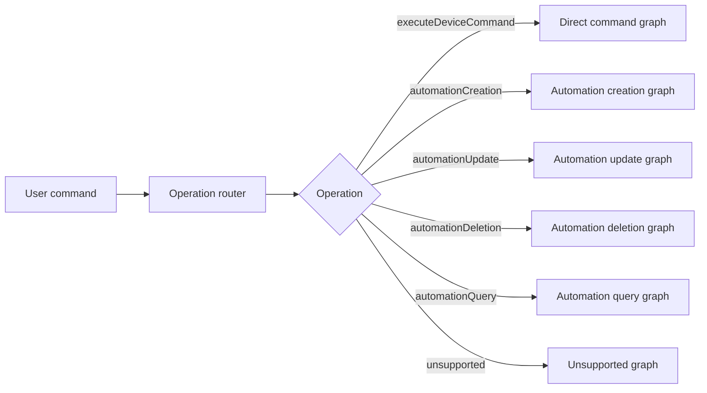

# Orchestrator Extensibility Architecture Plan

## Summary

The orchestrator has already moved from a single fixed phase pipeline toward a graph-capable runtime. Direct commands now default to the graph scheduler, while the legacy phase scheduler remains available as a rollback path.

The next architectural challenge is different: make the orchestrator easy to extend for operation-specific workflows such as automation creation, automation update, automation deletion, automation query, scene creation, and routine execution.

Current state in one sentence:

```text
Direct command orchestration is graph-default; automation creation is functional but still service-driven rather than fully graph-native.
```

The intended direction is to keep the graph scheduler as the shared runtime and move each operation into its own operation graph, selected by an operation router.

## Current Implementation Baseline

### Runtime Selection

`OrchestratorRuntimeMode` currently supports:

```swift
public enum OrchestratorRuntimeMode: String, Sendable, Hashable, Codable {
    case legacy
    case graph
}
```

The default runtime is graph:

```swift
public struct OrchestratorRuntimeConfiguration {
    public static let environmentVariableName = "HOME_AUTOMATION_ORCHESTRATOR_RUNTIME"
    public static let graphDefault = OrchestratorRuntimeConfiguration(runtimeMode: .graph)
    public static let legacyRollback = OrchestratorRuntimeConfiguration(runtimeMode: .legacy)
}
```

The app resolves the runtime configuration and passes it into both RAG and non-RAG orchestrators.

Review:

- This satisfies the Phase 11 runtime-default requirement.
- Rollback exists and is useful for direct command parity debugging.
- Runtime selection is still coarse. It chooses legacy vs graph for direct-command action resolution, but automation creation itself is not yet executed by `GraphScheduler`.

### Operation Detection

The core operation model exists:

```swift
public enum HomeAutomationOperationKind: String, Sendable, Hashable, Codable {
    case executeDeviceCommand
    case automationCreation
    case automationUpdate
    case automationDeletion
    case automationQuery
    case sceneCreation
    case routineExecution
    case unsupported
}
```

`HomeCommandOrchestrator.resolveStream` runs `HomeOperationDetectionService` before selecting a pipeline.

Current behavior:

- `.executeDeviceCommand` -> direct-command graph or legacy scheduler.
- `.automationCreation` -> `AutomationCreationResolver`.
- other operation kinds -> unsupported response.

Review:

- Operation routing exists and works.
- The detector is deterministic and offline-safe.
- The detector is not yet a default graph node, even though `AgentID.operationDetection`, `AgentCapability.operationDetection`, and manifest support exist.
- There is no ambiguity escalation path that combines deterministic detection, RAG examples, and a model-backed router.

### Agent Manifests and Registry

`AgentManifest` now includes:

- `id`
- `capabilities`
- `supportedOperations`
- `consumes`
- `produces`
- `safetyRole`
- `retryPolicy`
- `priority`

`AgentRegistry` indexes agents by:

- concrete `AgentID`
- `AgentCapability`
- `HomeAutomationOperationKind`

Review:

- This is a strong foundation for extensibility.
- Capability and operation lookups are implemented.
- Direct command production graphs still mostly use `.byID`, so capability-driven planning is available but not fully exploited.
- `consumes` and `produces` are string descriptors, not strongly typed context descriptors.
- The registry has priority ordering, but no plugin-style operation graph registration yet.

### Graph Runtime

The graph runtime includes:

- `OrchestrationGraph`
- `GraphNode`
- `GraphEdge`
- `AgentRequirement`
- `GraphGuard`
- `NodeExecutionPolicy`
- `OrchestrationGoal`
- `GraphPlanner`
- `GraphScheduler`
- `GraphValidator`
- `GraphRunMetrics`

Current scheduler behavior:

- validates graph structure before execution
- finds nodes whose dependencies have completed
- runs independent ready nodes concurrently with task groups
- resolves nodes by ID or capability
- filters selected agents by operation support
- checks circuit breakers
- applies success patches to `ResolutionContextStore`
- records traces, events, node statuses, selected agents, skipped nodes, and durations
- fails closed for mandatory safety gates
- stops on terminal outcomes

Review:

- The graph scheduler is real, not just a plan.
- Direct-command graph and fallback graph are production paths.
- The scheduler still assumes `ResolutionContext` and `AgentRunResult`.
- Stop behavior is still tied to `HomeCommandResolution` cases.
- Graph metrics are useful but still missing graph version and critical failure classification.

### Direct Command Graph

`GraphPlanner.directCommandGraph()` models the current direct-command flow:

```text
language/domain/intent/deviceType/slots/risk
  -> capabilityKnowledge/bixbyKnowledge/commandExample/candidateRetrieval
  -> retrievalJudge
  -> candidateRanking
  -> candidateHydration
  -> instructionComposer
  -> draftGeneration
  -> safetyValidation
  -> parameterValidation
  -> confirmationPolicy
  -> executionPlanning
```

`GraphPlanner.fallbackGraph()` models the model-unavailable path:

```text
ruleFallback -> bixbyFallback -> unsupportedCommand
```

Review:

- Direct commands are graph-default.
- Graph/legacy parity tests exist for fallback commands, high-risk confirmation, a command matrix, metrics, and conversation memory.
- The graph plan is still manually constructed and mostly ID-driven.

### Automation Creation Flow

Automation creation is functional through `AutomationCreationResolver`.

Current flow:

```text
operationDetection
  -> AutomationDraftAgent
  -> AutomationConditionOperandResolver
  -> AutomationActionResolver
       -> direct-command graph or legacy scheduler per action
  -> AutomationValidationAgent
  -> SmartThingsRuleCompiler
  -> HomeAutomationCreationPlan
```

`GraphPlanner.automationCreationGraph()` defines this intended graph shape:

```text
operationDetection
  -> automationDraft
  -> automationConditionOperandResolution
  -> automationActionResolution
  -> automationValidation
  -> smartThingsCompilation
  -> automationResultAssembly
```

Review:

- The graph shape exists.
- The orchestrator uses that graph shape for metrics.
- The graph scheduler does not execute the automation creation graph yet.
- Several automation components are services rather than registered contextual agents.
- Action resolution is sequential.
- Action and condition values do not have scoped graph context.

### Context Store

`ResolutionContextStore` still applies root-level patch keys for the direct command flow.

There is also an `AutomationResolutionContext` and `AutomationResolutionContextStore`.

Review:

- The patch-based mutation model is still a good design.
- The current context model is too root-oriented for multi-action automation graphs.
- Automation patch keys exist, but the main `ResolutionContextStore.apply` does not fully materialize automation fields.
- A separate automation context store is useful but fragments the runtime model.

### Policy

`OrchestratorPolicyEngine` remains the main policy surface.

Current strengths:

- model availability gates
- mandatory safety gate checks
- fail-closed behavior
- terminal result detection

Review:

- Policy now benefits from manifest `safetyRole`, but it is still partly ID-centric.
- Retry policy is present in manifests, but graph scheduler does not yet use manifest retry policies for node retry.
- Future operations need operation-specific policy hooks.

### Metrics

Current metrics capture:

- foundation model usage
- fallback use
- graph run metrics for direct commands
- circuit breaker states
- automation operation metrics
- automation action count
- automation condition count
- validation issue count
- SmartThings compilation support

Review:

- The telemetry baseline is strong.
- Automation graph metrics are currently a planned graph shape plus service-path result data, not actual graph execution data.
- Node-level automation metrics should become actual `GraphScheduler` node statuses after graph migration.

## Architecture Review

### What Is Strong

- Direct command behavior has not been sacrificed for the graph migration.
- The graph runtime is already capable of parallel dependency batches.
- Agent manifests give the registry enough metadata to support operation-specific planning.
- Operation detection now exists outside the old intent-family model.
- Automation creation reuses direct-command action resolution, which prevents duplicate command logic.
- Automation validation and SmartThings compilation are isolated from draft extraction.
- RAG is gated for automation complexity instead of blindly retrieving for every simple command.

### What Needs Strengthening

- Operation detection should become part of the graph/runtime contract.
- The planner should evolve from static graph factories to operation graph registration.
- Automation creation should move from `AutomationCreationResolver` service orchestration to graph execution.
- Multi-action automations need scoped context and dynamic fan-out.
- Conditions need scoped operand resolution and ambiguity handling.
- Policy should read manifests and node metadata first, with ID-based compatibility as a fallback.
- Outcomes should be operation-neutral internally.
- Graph metrics should be the source of truth for every operation.

## Target Architecture

### Operation-First Runtime

The orchestrator should follow this high-level shape:



The operation router can start deterministic and later add model/RAG support for ambiguous routing. The graph scheduler should not need changes when a new operation graph is added.

### Operation Graph Registry

Add an operation graph registry that maps operation kinds to graph builders.

Target shape:

```swift
public protocol OperationGraphProvider: Sendable {
    var operation: HomeAutomationOperationKind { get }
    func makeGraph(context: ResolutionContext) -> OrchestrationGraph
}

public struct OperationGraphCatalog: Sendable {
    public func graph(
        for operation: HomeAutomationOperationKind,
        context: ResolutionContext
    ) -> OrchestrationGraph
}
```

Benefits:

- Adding `automationQuery` does not require editing `GraphScheduler`.
- Operation-specific graphs live beside their agents.
- Tests can register fake operation graphs.
- The catalog becomes the seam between routing and execution.

### Manifest-Driven Planning

The planner should prefer capability and manifest requirements over hardcoded IDs.

Current:

```swift
GraphNode(id: "language", requirement: .byID(.language))
```

Target where safe:

```swift
GraphNode(id: "language", requirement: .byCapability(.languageDetection))
```

Rules:

- Use `.byID` only when one exact agent is semantically required.
- Use `.byCapability` when any provider can satisfy the node.
- Validate that required safety gates cannot be optional.
- Filter by `supportedOperations`.
- Use `priority` only after safety and compatibility checks.

### Typed and Scoped Context

Add typed context descriptors and scopes.

Target shape:

```swift
public struct ContextKey<Value: Sendable>: Sendable, Hashable {
    public let rawValue: String
    public let scope: ContextScope
}

public enum ContextScope: Sendable, Hashable {
    case root
    case operation(String)
    case action(String)
    case condition(String)
    case backend(String)
}
```

Required use cases:

- Root scope stores operation detection and direct-command state.
- Action scope stores per-action candidates, drafts, and resolutions.
- Condition scope stores per-condition operand resolution.
- Backend scope stores compiler output and API response metadata.

This prevents multi-action automation work from overwriting a single root `draft`, `aggregation`, or `resolution`.

### Nested Graphs and Fan-Out

Automation creation needs dynamic fan-out:

```text
automationDraft
  -> action[a1].directCommandSubgraph
  -> action[a2].directCommandSubgraph
  -> condition[c1].operandResolution
  -> condition[c2].operandResolution
  -> automationJoin
  -> automationValidation
  -> smartThingsCompilation
  -> resultAssembly
```

The first implementation can keep a sequential service fallback, but the intended graph runtime should support:

- dynamic node creation from `actionDescriptions`
- action-scoped direct-command subgraphs
- condition-scoped operand resolution subgraphs
- deterministic join ordering
- early clarification only when a required child fails

### Operation-Neutral Outcomes

The scheduler should stop based on operation-neutral outcomes, not only `HomeCommandResolution`.

Target internal type:

```swift
public enum OrchestrationOutcome: Sendable, Hashable {
    case command(HomeCommandResolution)
    case automation(HomeAutomationCreationPlan)
    case clarification(String)
    case unsupported(String)
    case failure(AgentFailure)
}
```

The public API can keep returning `HomeAutomationResolverResult`.

### Graph-Aware Policy

Policy should read:

- graph goal
- node execution policy
- agent manifest
- operation kind
- context scope

Target policy responsibilities:

- model availability by operation
- retry policy by manifest
- fail-closed behavior by safety role
- terminal outcome behavior by operation
- high-risk persistent automation confirmation
- backend write confirmation

Keep `OrchestratorPolicyEngine` as a compatibility wrapper until all graph paths use the new policy shape.

## Updated Implementation Plan

### Phase 12: Operation Router as Runtime Contract

1. Add a contextual `OperationDetectionAgent` wrapper around `HomeOperationDetectionService`.
2. Register it in `DefaultAgentRegistryFactory`.
3. Add root operation storage to `ResolutionContextStore`.
4. Add tests for graph-executed operation detection.
5. Keep deterministic routing as the default, with no model dependency.

### Phase 13: Operation Graph Catalog

1. Introduce `OperationGraphProvider`.
2. Introduce `OperationGraphCatalog`.
3. Move direct command, fallback, unsupported, and automation creation graph construction behind providers.
4. Keep `GraphPlanner` as a compatibility facade.
5. Add tests proving a fake operation graph can be registered without modifying scheduler internals.

### Phase 14: Scoped Context Compatibility Layer

1. Add typed context keys and scopes.
2. Preserve existing root fields and patch keys.
3. Add a scoped value dictionary for action, condition, and backend scopes.
4. Add typed read/write helpers.
5. Add tests proving scoped action drafts do not overwrite root draft or each other.

### Phase 15: Automation Agents as Graph Nodes

1. Add contextual wrappers for:
   - operation detection
   - automation draft
   - condition operand resolution
   - automation action resolution
   - automation validation
   - SmartThings compilation
   - automation result assembly
2. Register these agents with `.automationCreation`.
3. Make their manifests declare consumes/produces descriptors.
4. Run automation creation through `GraphScheduler` behind a feature flag.
5. Compare graph output against `AutomationCreationResolver` output.

### Phase 16: Dynamic Action and Condition Fan-Out

1. Add graph expansion from automation draft output.
2. Run each action through a scoped direct-command subgraph.
3. Run each condition operand through a scoped resolver node.
4. Add deterministic join nodes for action and condition results.
5. Preserve sequential fallback during migration.

### Phase 17: Policy and Outcome Generalization

1. Add internal `OrchestrationOutcome`.
2. Teach `GraphScheduler` to return operation-neutral outcomes.
3. Move terminal stop decisions out of command-only cases.
4. Apply manifest retry policies.
5. Move mandatory gate detection toward manifest/node metadata.

### Phase 18: SmartThings Operation Backends

1. Keep compilation isolated behind `HomeAutomationRuleCompiling`.
2. Add a Rules API client protocol for create/update/delete/query.
3. Add dry-run and confirmation-required modes.
4. Add operation graphs for update, deletion, and query.
5. Never let backend API writes occur before deterministic validation and user confirmation.

### Phase 19: RAG Optimization and Evaluation

1. Build an automation command corpus.
2. Add retrieval quality metrics by source and subproblem.
3. Split retrieval into operation routing, automation drafting, condition grammar, and backend schema.
4. Tune hybrid retrieval weights per subproblem.
5. Add tests for RAG gating so simple daily schedules remain fast.

### Phase 20: Cleanup and Migration

1. Make automation creation graph-native by default.
2. Retain service resolver temporarily for parity tests and rollback.
3. Remove duplicated service orchestration once graph parity is stable.
4. Update app diagnostics to show operation graph status.
5. Revisit legacy phase scheduler removal only after direct command and automation graph paths are stable.

## Testing Requirements

### Existing Behavior Regression

- direct command fallback graph matches legacy output
- high-risk direct command confirmation still works
- conversation memory still works
- graph metrics are recorded for direct commands
- model-unavailable behavior remains deterministic

### Operation Routing Tests

- direct command routes to direct graph
- daily schedule routes to automation creation
- device trigger routes to automation creation
- update/delete/query operations return explicit unsupported until implemented
- operation detection can run as a graph node

### Automation Graph Tests

- automation graph validates successfully with default registry
- automation graph service-path and graph-path outputs match
- multiple actions resolve with scoped action context
- unresolved action asks clarification
- unresolved condition operand asks clarification
- high-risk automation requires confirmation
- unsupported SmartThings compilation preserves parsed draft

### Graph Infrastructure Tests

- dependency order
- independent node parallelism
- guard skip
- missing required safety gate fail-closed
- manifest priority selection
- operation support filtering
- scoped context isolation
- operation-neutral terminal outcome

## Acceptance Criteria

The orchestrator architecture is future-compatible when:

1. The scheduler does not need code changes to add a new operation graph.
2. Operation detection is represented in runtime context and graph traces.
3. Direct command behavior remains stable under graph default.
4. Automation creation executes through graph nodes, not only a side service.
5. Multiple automation actions use scoped context.
6. Condition operands use scoped context and ambiguity-safe resolution.
7. Policy is driven by graph goal, node policy, and agent manifests.
8. Metrics report actual node statuses for every operation graph.
9. SmartThings API persistence is behind a backend protocol and confirmation policy.
10. RAG assists extraction and schema grounding but never owns validation or safety decisions.

## Non-Goals

- Do not remove the legacy scheduler until rollback is no longer useful.
- Do not merge SmartThings API calls into parsers, agents, or validation policy.
- Do not force all public APIs to expose operation-specific result types immediately.
- Do not use RAG or model output as the final authority for devices, capabilities, commands, or safety.
- Do not make automation creation execute device commands immediately.
