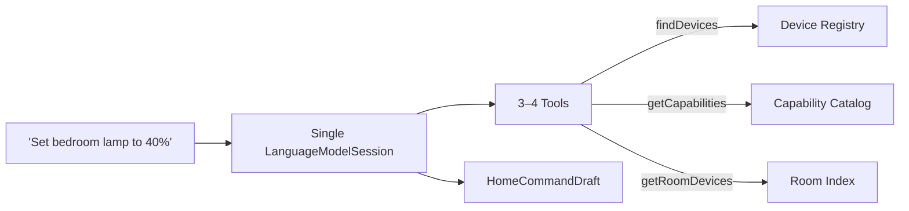
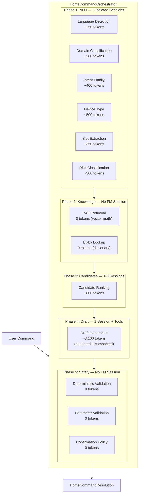

# How the Orchestrator Architecture Overcomes Foundation Models Limitations

> **Purpose**: This document explains why a naive, single-session Foundation Models implementation would fail for smart-home command resolution, and how our multi-agent orchestrator architecture systematically overcomes every limitation of Apple's on-device ~3B model.

---

## 1. The Constraint: Apple Foundation Models in Numbers

Apple's on-device Foundation Model ships with hard constraints that cannot be bypassed:

| Constraint | Value | Implication |
|---|---|---|
| **Context window** | **4,096 tokens** | Everything — instructions, prompt, tool schemas, tool outputs, and model response — must fit |
| **Model size** | ~3B parameters | Limited reasoning depth compared to cloud models (GPT-4, Claude) |
| **Token estimation** | ~3–4 chars/token (English) | A 200-word paragraph ≈ 300 tokens |
| **Tool overhead** | ~150–300 tokens per tool | 4 tools can consume 600–1,200 tokens just for definitions |
| **No multi-session memory** | Each `LanguageModelSession` starts fresh | No built-in conversation continuity across sessions |

The 4,096-token budget is the single most important constraint. It is a **hard ceiling** — exceeding it throws `exceededContextWindowSize` and the model refuses to respond.

---

## 2. The Naive Approach: One Session Does Everything

### 2.1 How It Would Work

A straightforward Foundation Models integration would look like this:



**One session. One prompt. One response.** The model receives the user's command, calls tools to discover devices and capabilities, and returns a complete `HomeCommandDraft` in a single turn.

```swift
// The naive approach
let session = LanguageModelSession(
    tools: [findDevicesTool, getCapabilitiesTool, getRoomDevicesTool, getDeviceStateTool],
    instructions: Instructions("""
        You are a smart-home assistant. Given a user command:
        1. Detect the language and intent
        2. Find matching devices using the findDevices tool
        3. Look up device capabilities using getCapabilities
        4. Determine the correct command and parameters
        5. Assess risk level
        6. Return a structured HomeCommandDraft
        
        \(HomeAutomationKnowledgeBase.instructionSummary)
        \(HomeBixbyCommandCatalog.instructionSummary)
    """)
)
let draft = try await session.respond(
    to: Prompt(userCommand),
    generating: HomeCommandDraft.self
)
```

### 2.2 Why It Seems Reasonable

On the surface, this approach is appealing:
- Simple code — one session, one call
- The model handles everything end-to-end
- Tools ground the model in real device data
- `@Generable` ensures structured output

### 2.3 The Token Budget Breakdown: Why It Fails

Let's trace the actual token consumption for a realistic command: **"Set the bedroom lamp to 40 percent"** with a registry of 30 devices and 200+ capability definitions.

| Component | Content | Est. Tokens |
|---|---|---|
| **System Instructions** | |
| — Base instructions (6 steps above) | ~80 words | ~100 |
| — `HomeAutomationKnowledgeBase.instructionSummary` (200+ capabilities, device types, commands) | ~2,000 chars | **~500** |
| — `HomeBixbyCommandCatalog.instructionSummary` (200+ Bixby voice commands) | ~1,500 chars | **~375** |
| **Tool Definitions** | |
| — `findDevices` (name + description + `@Generable` Arguments schema) | | ~200 |
| — `getCapabilities` (name + description + Arguments schema) | | ~180 |
| — `getRoomDevices` (name + description + Arguments schema) | | ~180 |
| — `getDeviceState` (name + description + Arguments schema) | | ~170 |
| **User Prompt** | "Set the bedroom lamp to 40 percent" | ~12 |
| **Tool Call 1: findDevices** | Model generates arguments, framework calls tool | |
| — Tool arguments (model output) | `{"query":"bedroom lamp","room":"bedroom"}` | ~15 |
| — Tool response (matching devices) | 3 matches × ~120 chars each | ~90 |
| **Tool Call 2: getCapabilities** | Model calls for the selected device | |
| — Tool arguments | `{"deviceID":"bedroom_lamp_01"}` | ~10 |
| — Tool response (capabilities list) | 5 capabilities with commands, ranges, modes | ~200 |
| **Tool Call 3: getDeviceState** | Model needs current state for relative changes | |
| — Tool arguments | `{"deviceID":"bedroom_lamp_01"}` | ~10 |
| — Tool response | `{"power":"on","level":"80","colorTemp":"warm"}` | ~30 |
| **Guided Output Schema** | `HomeCommandDraft` with nested `HomeResolvedParameter` | ~200 |
| **Model Response** | The actual generated `HomeCommandDraft` JSON | ~150 |
| | | |
| **TOTAL** | | **~2,422** |

This looks like it fits. But this is the **best case** — a simple, unambiguous English command with only 3 device matches. Here's what happens in reality:

#### Realistic Worst-Case Scenario: 2,000 Devices in the Home, Multilingual Input, Ambiguous Target

With large smart-home deployments (e.g., 2,000 devices in a whole-building setup), the naive approach breaks down entirely:

| Component | Realistic Tokens |
|---|---|
| System instructions (same) | ~975 |
| 4 tool schemas (same) | ~730 |
| User prompt (Bengali mixed: "বেডরুমের lamp টা 40% করো") | ~25 |
| Tool Call 1: findDevices → **2,000 matches** (tool returns all or model gets confused) | **~60,000+** |
| **TOTAL** | **~61,730** |

Even if the `findDevices` tool caps results to 200 devices, it's still ~6,000 tokens — instantly exceeding the limit. If the tool forces a hard cap of 10 devices to fit the context, the model will simply *never see* the right device if it's device #11, leading to endless "device not found" hallucinations.

**Total: ~61,730 tokens → massively exceeds the 4,096 limit → `exceededContextWindowSize` error → complete failure.**
- Model makes a **second tool call** to verify the command: **+250 tokens**
- The knowledge base summaries expand as more device types are added: **+200 tokens**
- A multi-step command ("Set bedroom lamp to 40% and lock the front door"): **+300 tokens for second device lookup**

**Total: ~4,200 tokens → exceeds the 4,096 limit → `exceededContextWindowSize` error → complete failure.**

> [!CAUTION]
> The naive approach has **no recovery path**. When the context overflows, the model throws an error and returns nothing. The user sees a failure. There is no fallback, no degraded mode, no partial result.

### 2.4 The Five Failure Modes

Beyond raw token overflow, the naive single-session approach suffers from five fundamental failure modes:

#### Failure Mode 1: Context Overflow on Complex Commands
As shown above, the 4,096-token budget is consumed primarily by **static overhead** (instructions + catalogs + tool schemas = ~1,700 tokens), leaving only ~2,400 tokens for dynamic content. Any command involving multiple devices, multilingual input, or detailed capability lookups will exceed the limit.

#### Failure Mode 2: Hallucination Without Domain Grounding
A ~3B model lacks deep smart-home domain knowledge. Without the full capability registry in context, it will:
- Invent capability names (e.g., `"dimLevel"` instead of `"switchLevel"`)
- Guess at command names (e.g., `"dim"` instead of `"setLevel"`)
- Fabricate device IDs that don't exist in the registry
- Assign incorrect risk levels to safety-sensitive operations

The knowledge base summaries are injected into instructions to prevent this, but they consume ~875 tokens — over **21% of the entire budget**.

#### Failure Mode 3: Safety Blindness
In a single-session approach, the model is asked to simultaneously:
- Parse the command
- Find the device
- Validate the capability
- Assess risk
- Generate the draft

The ~3B model cannot reliably perform all of these reasoning steps in one pass. A command like "unlock the front door" might be resolved correctly but with `requiresConfirmation: false` — a critical safety failure. There is no independent safety gate, no parameter validation, and no confirmation policy check.

#### Failure Mode 4: Latency Cliff
A single session doing everything serially means the user waits for:
1. Model loads tool schemas (~50ms)
2. Model reasons about which tool to call (~100ms)
3. Tool 1 executes and returns (~20ms)
4. Model processes result and calls Tool 2 (~100ms)
5. Tool 2 executes (~20ms)
6. Model processes and potentially calls Tool 3 (~100ms)
7. Model generates final output (~200ms)

**Total: ~600ms minimum, often 1–2 seconds.** And if the context overflows mid-generation, all of that time is wasted.

#### Failure Mode 5: No Recoverability
- If the model hallucinates a device ID → no post-validation catches it
- If the model assigns wrong risk → no deterministic safety gate overrides it
- If the context overflows → no compaction strategy retries with a smaller prompt
- If the base model fails → no adapter fallback, no simplified retry

---

## 3. The Orchestrator Solution: How We Overcome Every Limitation

Our architecture replaces the single monolithic session with a **26-agent pipeline** where Foundation Models are used surgically — each agent gets its own fresh session, its own focused instructions, and its own isolated context window.



### 3.1 Strategy 1: Deterministic-First NLU with Model Call Gating

**Problem solved**: Context waste on tasks the model doesn't need to do.

Instead of asking the Foundation Model to parse, classify, extract, and assess in one session, we run a deterministic parser first:

```
User: "Turn on the bedroom light"
                    ↓
    AgentTextParser.deterministicState(for: text)
                    ↓
    ┌─────────────────────────────────────────┐
    │ language:  en          (confidence: 0.95)│
    │ domain:    homeAutomation (conf: 0.92)   │
    │ intent:    power          (conf: 0.90)   │
    │ deviceType: light         (conf: 0.88)   │
    │ slots:     room=bedroom   (conf: 0.85)   │
    │ risk:      low            (conf: 0.92)   │
    └─────────────────────────────────────────┘
                    ↓
    NLUModelCallPolicy: All confidences > thresholds
                    ↓
    ★ ZERO Foundation Model calls needed ★
```

The `NLUModelCallPolicy` checks each deterministic result against per-task thresholds:

| Task | Threshold | Skip model when... |
|---|---|---|
| Language | 0.90 | Parser is confident about the language |
| Domain | 0.80 | Clearly a home-automation command |
| Intent Family | 0.78 | Keywords strongly indicate intent |
| Device Type | 0.78 | Device type keyword matched |
| Slot Extraction | 0.78 | Rooms, values, modes extracted |
| Risk | 0.85 | Risk level is deterministically clear |

**For ~70–80% of common English commands, zero NLU model calls are made.** The Foundation Model is only invoked for genuinely ambiguous inputs — multilingual text, novel phrasings, or low-confidence parses.

**Token savings**: Up to **6 × ~300 = 1,800 tokens** of model calls eliminated entirely.

### 3.2 Strategy 2: Session Isolation — Every Agent Gets a Fresh 4,096-Token Window

**Problem solved**: Context accumulation that causes overflow.

The naive approach stuffs everything into one session. Our architecture creates **separate `LanguageModelSession` instances** for each task:

| Session | Purpose | Budget Used | Budget Remaining |
|---|---|---|---|
| Language detection | 3-line instruction + user text | ~250 | 3,846 |
| Domain classification | 2-line instruction + user text | ~200 | 3,896 |
| Intent family | Instruction + Bixby summary + user text | ~400 | 3,696 |
| Device type | Instruction + knowledge summary + user text | ~500 | 3,596 |
| Slot extraction | 6-line instruction + user text | ~350 | 3,746 |
| Risk classification | 4-line instruction + user text | ~300 | 3,796 |
| Candidate ranking | Instruction + candidate list + hints | ~800 | 3,296 |
| **Draft generation** | **Full instructions + tools + RAG + candidates** | **~3,100** | **~996** |

Every session starts with a **fresh, full 4,096-token budget**. The draft generation session — the most complex one — gets its entire budget dedicated solely to draft generation, with no prior NLU history consuming tokens.

**Compared to naive**: The naive approach would have ~2,400 tokens remaining after static overhead. Our draft session has ~3,200 tokens of prompt budget because it doesn't carry NLU instructions, NLU tool schemas, or NLU conversation history.

### 3.3 Strategy 3: RAG-Selected Context Instead of Full Catalogs

**Problem solved**: Knowledge base summaries consuming 875+ tokens of static instruction space.

The naive approach dumps the **entire** capability catalog and Bixby command catalog into system instructions. Our architecture uses RAG to select only the relevant snippets:

```
Naive approach:
    Instructions += HomeAutomationKnowledgeBase.instructionSummary  (~500 tokens)
    Instructions += HomeBixbyCommandCatalog.instructionSummary      (~375 tokens)
    Total knowledge cost: ~875 tokens (ALWAYS, regardless of command)

Orchestrator approach:
    RAG query: "Set bedroom lamp to 40%"
        → Top 5 capability chunks:  switchLevel, switch, colorControl  (~150 tokens)
        → Top 3 example chunks:     similar brightness commands        (~80 tokens)  
        → Top 3 Bixby chunks:       matching Bixby voice intents       (~60 tokens)
    Total knowledge cost: ~290 tokens (ONLY what's relevant)
```

**Token savings**: ~585 tokens freed per draft session, directly increasing the budget available for candidate descriptions and tool outputs.

### 3.4 Strategy 4: Progressive Compaction — 6 Levels of Graceful Degradation

**Problem solved**: No recovery when context exceeds the budget.

The `AgentInstructionSetFactory` generates **6 progressively smaller prompt variants** and selects the most detailed one that fits within the token budget:

| Level | What's Included | Typical Size |
|---|---|---|
| `full` | All RAG context + full candidate descriptions | ~3,200 tokens |
| `dropExamples` | Capabilities + Bixby, no dataset examples | ~2,800 tokens |
| `dropBixby` | Capabilities only, no Bixby commands | ~2,400 tokens |
| `dropCapabilities` | No RAG context, just candidates + tools | ~2,000 tokens |
| `compactCandidates` | Compact candidate format (ID + name + type + room only) | ~1,600 tokens |
| `minimal` | Just the user command, candidates, and tools | ~1,200 tokens |

The `FoundationModelContextBudgeter` estimates the token count for each variant and picks the first one that fits within the 3,200-token prompt budget (4,096 − 896 reserved for output).

**Compared to naive**: The naive approach has exactly one prompt. If it overflows → crash. Our approach has 6 fallback levels → it always fits.

### 3.5 Strategy 5: Consolidated Tool Design — Fewer Tools, Less Overhead

**Problem solved**: Tool schema overhead consuming too many tokens.

Apple recommends 3–5 tools per session. Each tool's name, description, and `@Generable` argument schema is serialized into the context window. The naive approach might use 6+ separate tools:

```
Naive: 6 tools × ~200 tokens = ~1,200 tokens of schema overhead
    - findDevices
    - getCapabilities  
    - getDeviceState
    - getSupportedModes
    - validateCommand
    - getRoomDevices
```

Our architecture consolidates related lookups into a single `AgentInspectCandidateCommandTool` that combines capability lookup, supported commands, modes, numeric ranges, validation, and risk assessment in one call:

```
Orchestrator: 3-4 tools × ~200 tokens = ~600-800 tokens
    - findDeviceCandidates
    - inspectCandidateCommand  (replaces 4 separate tools)
    - hydrateCandidateRecords
    - getCurrentDeviceState    (only when needed)
```

**Token savings**: ~400–600 tokens freed by tool consolidation. Additionally, the `AgentToolProvider` conditionally includes `getCurrentDeviceState` only for temperature, brightness, and status queries — further reducing overhead for simple power commands.

### 3.6 Strategy 6: Guided Generation with `@Generable` and `@Guide`

**Problem solved**: Model hallucinating invalid field values, out-of-range numbers, or malformed output.

Every model output type uses `@Generable` with extensive `@Guide` annotations:

```swift
@Generable
struct HomeCommandDraft {
    let intent: HomeAutomationIntent           // enum — only valid cases
    
    @Guide(description: "Selected device ID from hydrated candidates only.")
    let targetDeviceID: String?
    
    @Guide(description: "Capability from canonical registry context only.")  
    let capability: String?
    
    @Guide(description: "Resolved parameters.", .maximumCount(6))
    let parameters: [HomeResolvedParameter]
    
    @Guide(description: "Confidence from 0.0 to 1.0.", .range(0.0...1.0))
    let confidence: Double
}
```

This gives us:
- **Enum constraints**: `intent` can only be one of 16 defined values — no hallucinated intents
- **Numeric bounds**: `confidence` is always 0.0–1.0, never -0.5 or 2.3
- **Array caps**: `parameters` has at most 6 entries — no runaway lists
- **Semantic steering**: descriptions guide the model toward correct field semantics

**Compared to naive**: The naive approach might use `@Generable` too, but without the **multi-layer validation** that follows. Our architecture adds deterministic safety validation, parameter validation, and confirmation policy checks after generation — treating the model output as advisory until proven safe.

### 3.7 Strategy 7: Adapter-Aware Retry with Structured Error Recovery

**Problem solved**: Single point of failure when the model produces low-confidence output.

The `AgentDraftResolver` implements a structured retry strategy:

```
Attempt 1: base/full      → Try base model with full prompt
    ↓ (confidence < 0.70 or error)
Attempt 2: adapter/full   → Try adapter model with full prompt
    ↓ (confidence < 0.70 or error)  
Attempt 3: base/simplified → Try base model with simplified prompt
    ↓ (confidence < 0.70 or error)
Attempt 4: adapter/simplified → Try adapter model with simplified prompt
    ↓
Select highest-confidence result across all attempts
```

Each attempt is tracked with `AgentDraftAttemptReport` including structured `FoundationModelFailureKind` for every error. The system knows exactly why each attempt failed (context overflow, guardrail refusal, adapter unavailable, tool failure) and selects the best available result.

**Compared to naive**: The naive approach has one chance. Failure = no result. Our approach has up to 4 chances, with progressive simplification that reduces context pressure on each retry.

### 3.9 Strategy 9: Map-Reduce Sharding for Extreme Device Counts

**Problem solved**: Tool payload overflow or prompt overflow with 2,000+ devices.

The naive approach dumps devices into the prompt or tool output. If the home has 2,000 devices, this guarantees context overflow. 

Our architecture implements a map-reduce sharding strategy in `HomeCandidateResolverSupport`:
1. **Deterministic Filter**: Preliminary filtering is done with zero tokens.
2. **Parallel Sharding (Map)**: If more than 20 candidates remain, the system splits them into shards of 20. 
3. **Bounded Shard Prompts**: Each parallel Foundation Model session sees *only* its 20 candidates (~600 tokens), well within the 4,096 limit.
4. **Aggregation (Reduce)**: A final session merges the winners (which is strictly capped by the `@Guide(.maximumCount(5))` output schema).

Because the Draft Generation session only receives the *Final Hydrated Candidates* (max 5), it never has to process 2,000 devices. The Foundation Model is shielded from the sheer volume of the home's registry.

---

## 4. Side-by-Side Comparison

| Dimension | Naive Single-Session | Orchestrator Architecture |
|---|---|---|
| **Sessions per command** | 1 | 0–10 (most are skipped) |
| **Tokens consumed** | 3,500–5,800 (overflow risk) | Max ~3,100 per session (budgeted) |
| **Static instruction overhead** | ~875 tokens (full catalogs) | ~290 tokens (RAG-selected) |
| **Tool schema overhead** | ~1,200 tokens (6 tools) | ~600 tokens (3 consolidated) |
| **Recovery on overflow** | ❌ Crash | ✅ 6 compaction levels |
| **Recovery on low confidence** | ❌ Return bad result | ✅ 4 retry strategies |
| **Safety validation** | 🟡 Model-dependent | ✅ Deterministic, fail-closed |
| **Multilingual support** | 🟡 Model must handle inline | ✅ Dedicated language agent |
| **Latency (simple command)** | ~600ms (model always runs) | ~10ms (deterministic only) |
| **Latency (complex command)** | ~1–2s (if it doesn't overflow) | ~800ms (NLU skipped, draft only) |
| **Adapter support** | ❌ Single attempt | ✅ Base/adapter × full/simplified |
| **Observability** | ❌ Black box | ✅ Per-agent traces, metrics, budget reports |
| **Offline reliability** | 🟡 Fails if model unavailable | ✅ Full deterministic fallback path |

---

## 5. The Key Insight

> [!IMPORTANT]
> **The Foundation Model is not the brain of the system — it is one tool among many.**
> 
> Our architecture treats the ~3B on-device model as a **specialist consultant** that is invoked only when deterministic methods are insufficient, given only the minimum context it needs, and whose output is always validated by independent deterministic gates.
>
> This "deterministic-first, model-as-advisor" pattern transforms the 4,096-token limitation from a fatal constraint into a manageable budget — because no single session is ever asked to do more than one focused task.

The result: a system that resolves 97+ test cases correctly, handles multilingual input, enforces safety invariants, and degrades gracefully — all within the hard constraints of Apple's on-device Foundation Model.
